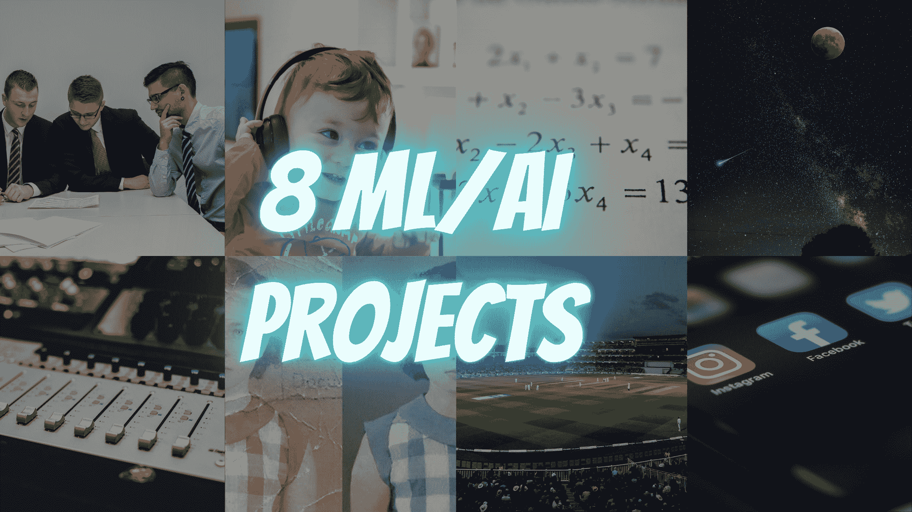
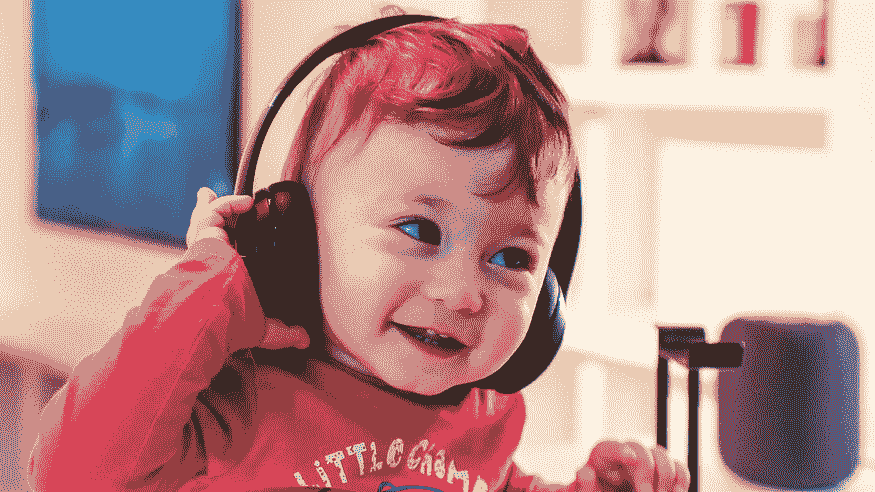
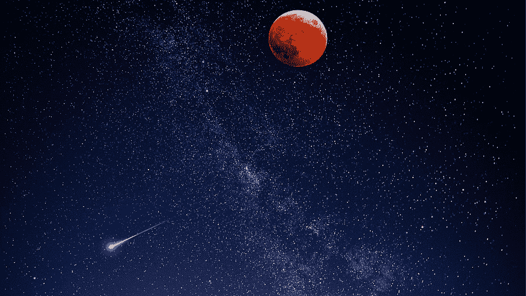
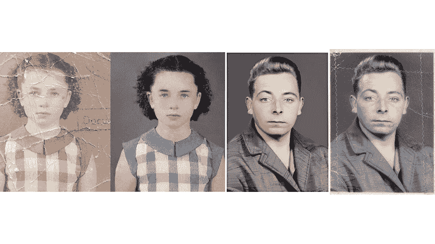
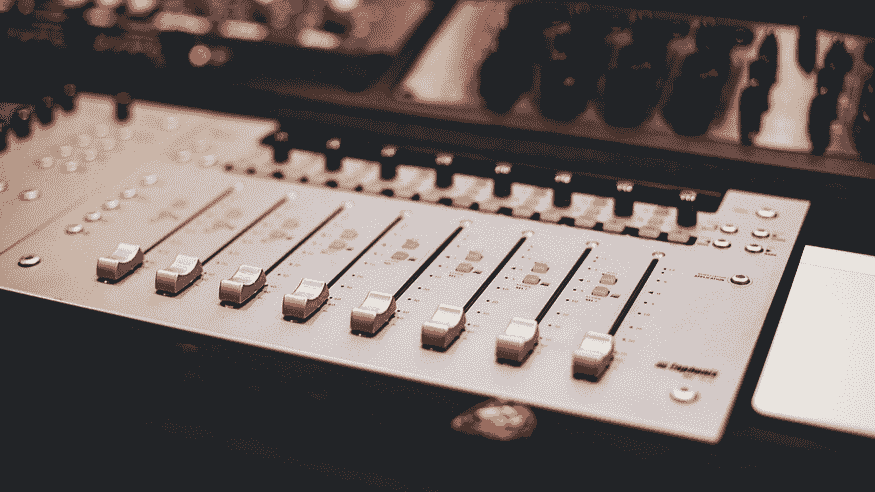

# 8 个让你的作品集脱颖而出的 AI/机器学习项目

> 原文：[`www.kdnuggets.com/2020/09/8-ml-ai-projects-stand-out.html`](https://www.kdnuggets.com/2020/09/8-ml-ai-projects-stand-out.html)

评论

**作者 [Kajal Yadav](https://www.linkedin.com/in/techykajal/)，数据科学、创业公司和企业家的自由撰稿人**。

*来源 [Unsplash](https://unsplash.com/?utm_source=unsplash&utm_medium=referral&utm_content=creditCopyText)，由作者编辑。*

你是否对进入数据科学领域感到兴奋？恭喜你！这仍然是正确的选择，因为在疫情期间，数据科学和人工智能的工作需求大幅提升。

尽管如此，由于危机，市场目前变得更加困难，无法像之前那样通过更多的人力来重新建立。因此，你可能需要在心理上为漫长的求职过程以及沿途的许多拒绝做好准备。

在撰写本文时，我假设你已经了解数据科学作品集的重要性及如何构建它。

你可能会花费大部分时间进行数据处理和清洗，而不是应用复杂的模型。

数据科学爱好者常常问我，他们应该在作品集中包含什么类型的项目，以打造一个极具价值和独特性的作品集。

以下是我为你的数据科学作品集提供的 8 个独特创意，并附上了参考文章，你可以从中获取如何开始特定创意的见解。你还可以在 [这里找到更多机器学习项目](https://www.kdnuggets.com/2020/03/20-machine-learning-datasets-project-ideas.html)。

### 1. 基于社交媒体帖子进行抑郁情绪分析

*照片由 [dole777](https://unsplash.com/@dole777?utm_source=unsplash&utm_medium=referral&utm_content=creditCopyText) 在 [Unsplash](https://unsplash.com/?utm_source=unsplash&utm_medium=referral&utm_content=creditCopyText) 上拍摄。*

这个话题在当今非常敏感，并急需采取行动。全球有超过 2.64 亿人正在遭受抑郁症困扰。**抑郁症** 是全球残疾的主要原因，也是全球疾病负担的重要因素，每年几乎有 80 万人因自杀而死亡。自杀是 15 至 29 岁人群中的第二大死亡原因。抑郁症的治疗往往被延迟、不准确或完全遗漏。

互联网时代为早期抑郁症干预服务提供了主要的机会，尤其是对年轻成年人。每分钟大约有 6,000 条推文发布在 Twitter 上，这相当于每分钟超过 350,000 条推文，每天 5 亿条推文，每年大约 2000 亿条推文。

根据皮尤研究中心的数据，72%的公众使用某种形式的网络生活。从社交网络发布的数据对许多领域，如人类学和心理学，都很重要。但从专业角度来看，这些支持远远不够，具体方法也急需改进。

***通过分析社交媒体帖子的语言标记，可以创建一个深度学习模型，该模型能够比传统方法更早地为个人提供有关其心理健康的洞察。***

> +   [你就是你发的推文](https://towardsdatascience.com/you-are-what-you-tweet-7e23fb84f4ed) - 通过 Twitter 使用检测社交媒体中的抑郁症
> +   
> +   [抑郁症的早期检测：社交网络分析与随机森林技术](https://www.jmir.org/2019/6/e12554/) - 原始论文，A Coruna 大学。
> +   
> +   [使用机器学习技术从社交网络数据中检测抑郁症](https://www.ncbi.nlm.nih.gov/pmc/articles/PMC6111060/)

### 2. 使用神经网络进行体育比赛视频到文本的摘要

*照片由 [Aksh yadav](https://unsplash.com/@aksh1802?utm_source=unsplash&utm_medium=referral&utm_content=creditCopyText) 提供，来源于 [Unsplash](https://unsplash.com/?utm_source=unsplash&utm_medium=referral&utm_content=creditCopyText)。*

所以这个项目的想法基本上是基于从体育比赛视频中提取精确的摘要。有一些体育网站会介绍比赛的精彩瞬间。虽然已经提出了各种模型来进行提取式文本摘要，但神经网络的效果最好。一般来说，摘要指的是以简洁的形式呈现信息，集中在传达事实和信息的部分，同时保持其重要性。

自动创建游戏视频的概要带来了区分游戏中精彩时刻或亮点的挑战。

因此，可以使用一些深度学习技术，如 3D-CNN（三维卷积网络）、RNN（递归神经网络）、[LSTM（长短期记忆网络）](https://towardsdatascience.com/illustrated-guide-to-lstms-and-gru-s-a-step-by-step-explanation-44e9eb85bf21)，以及通过将视频划分为不同部分并应用 SVM（支持向量机）、NN（神经网络）和 k-means 算法来实现。

为了更好地理解，请详细参考附带的文章。

> +   [使用迁移学习进行体育视频场景分类](https://www.mdpi.com/1424-8220/20/6/1702/htm) - 本文提出了一种新颖的体育视频场景分类方法。

### 3. 使用 CNN 解决手写方程

*照片由[Antoine Dautry](https://unsplash.com/@antoine1003?utm_source=unsplash&utm_medium=referral&utm_content=creditCopyText)在[Unsplash](https://unsplash.com/?utm_source=unsplash&utm_medium=referral&utm_content=creditCopyText)拍摄。*

在所有问题中，手写数学表达式识别是计算机视觉研究领域中最令人困惑的问题之一。你可以通过手写数字和数学符号训练手写方程求解器，使用[卷积神经网络（CNN）](https://towardsdatascience.com/a-comprehensive-guide-to-convolutional-neural-networks-the-eli5-way-3bd2b1164a53)和一些图像处理技术来实现。开发这样的系统需要用数据训练我们的机器，使其在学习和进行所需预测方面熟练。

请参考以下附带的文章以便更好地理解。

> +   [使用卷积神经网络的手写方程求解器](https://medium.com/@vipul.gupta73921/handwritten-equation-solver-using-convolutional-neural-network-a44acc0bd9f8)
> +   
> +   [vipul79321/手写方程求解器](https://github.com/vipul79321/Handwritten-Equation-Solver) - 使用 CNN 的手写方程求解器。方程可以包含 0-9 的任何数字和符号。
> +   
> +   [计算机视觉—自动评分手写数学答卷](https://towardsdatascience.com/computer-vision-auto-grading-handwritten-mathematical-answersheets-8974744f72dd) - 将手写在纸上的数学方程求解步骤数字化。
> +   
> +   [手写方程到 LaTeX](https://opensourc.es/blog/he2latex/)

### 4. 使用 NLP 生成商务会议摘要

*照片由[Sebastian Herrmann](https://unsplash.com/@officestock?utm_source=unsplash&utm_medium=referral&utm_content=creditCopyText)在[Unsplash](https://unsplash.com/s/photos/business-meeting?utm_source=unsplash&utm_medium=referral&utm_content=creditCopyText)拍摄。*

是否曾经遇到过大家都想要摘要而不是完整报告的情况？我在学校和大学期间遇到过这种情况，我们花了很多时间准备完整的报告，但老师只有时间阅读摘要。

摘要已经成为应对数据过载问题的一种越来越有用的方式。从对话中提取信息可以具有非常好的商业和教育价值。这可以通过捕捉对话结构中的统计、语言和情感方面的特征来实现。

手动将报告转换为总结形式太费时间了，不是吗？但可以依靠[Natural Language Processing (NLP)](https://towardsdatascience.com/july-edition-natural-language-processing-272f28835af7)技术来实现这一点。

使用深度学习的文本摘要可以理解整个文本的上下文。对于需要快速总结文档的我们来说，这不就是梦想成真吗！

请参考下面附上的文章以便更好地理解。

> +   [使用 Python 深度学习进行文本摘要的综合指南](https://www.analyticsvidhya.com/blog/2019/06/comprehensive-guide-text-summarization-using-deep-learning-python/) - “我不需要完整报告，只需给我结果摘要。”
> +   
> +   [理解文本摘要并在 Python 中创建自己的摘要生成器](https://towardsdatascience.com/understand-text-summarization-and-create-your-own-summarizer-in-python-b26a9f09fc70) - 摘要可以定义为生成简洁流畅的总结，同时保留关键信息的任务。

### 5\. 面部识别以检测情绪并相应地推荐歌曲

*照片来源：[Alireza Attari](https://unsplash.com/@alireza_attari?utm_source=unsplash&utm_medium=referral&utm_content=creditCopyText) 在 [Unsplash](https://unsplash.com/@alireza_attari?utm_source=unsplash&utm_medium=referral&utm_content=creditCopyText) 上。*

人脸是个体身体的重要部分，特别在了解一个人的心理状态中发挥着重要作用。这消除了手动隔离或将歌曲分组到不同记录中的乏味任务，有助于根据个体的情感特征生成适当的播放列表。

人们往往根据自己的情绪和兴趣来听音乐。可以创建一个应用，通过捕捉面部表情为用户推荐歌曲。

计算机视觉是一个跨学科领域，帮助将数字图像或视频的高层次理解传达给计算机。计算机视觉组件可以用来通过面部表情判断用户的情感。

我发现了一些有趣且有用的 API。然而，我没有使用这些 API，但附在此处，希望它们对你有所帮助。

> +   [20+ 欣赏和担忧的情感识别 API | Nordic APIs](https://nordicapis.com/20-emotion-recognition-apis-that-will-leave-you-impressed-and-concerned/) - 如果企业能够随时使用技术感知情感，他们可以利用这一点进行销售。

### 6\. 从太空探测器如开普勒拍摄的图像中寻找适宜居住的外行星

*照片来源：[Nick Owuor (astro.nic.visuals)](https://unsplash.com/@astro_nic25?utm_source=unsplash&utm_medium=referral&utm_content=creditCopyText) 在 [Unsplash](https://unsplash.com/@astro_nic25?utm_source=unsplash&utm_medium=referral&utm_content=creditCopyText) 上。*

在最近十年里，监测了超过一百万颗恒星以识别过境行星。手动解读潜在的系外行星候选者费时费力，并且容易出错，这些错误的后果很难评估。卷积神经网络适合在噪声较多的时间序列数据中以更高的精度识别类似地球的系外行星，比最小二乘法策略更为精准。

> +   [使用机器学习寻找系外行星](https://towardsdatascience.com/exoplanet-hunting-using-machine-learning-d615958e1787) - 寻找我们太阳系之外的世界。
> +   
> +   [人工智能和 NASA 数据用于发现系外行星](https://www.nasa.gov/press-release/artificial-intelligence-nasa-data-used-to-discover-eighth-planet-circling-distant-star) - 我们的太阳系现在与其他星体环绕的行星数量并列最多。

### 7\. 老旧损坏胶卷照片的图像重生

*来源 [Pikist](https://www.pikist.com/free-photo-xttnz)。*

我知道将旧损坏的照片恢复到原始状态是多么耗时且痛苦。因此，可以通过深度学习来完成这项工作，找出所有图像缺陷（裂缝、磨损、孔洞），并使用修补算法，根据周围的像素值发现缺陷，从而恢复和上色旧照片。

> +   [使用深度学习为旧图像上色和修复](https://blog.floydhub.com/colorizing-and-restoring-old-images-with-deep-learning/) - 用深度学习为黑白图像上色已成为现实应用的令人印象深刻的展示。
> +   
> +   [图像修补指南：使用机器学习编辑和修复照片中的缺陷](https://heartbeat.fritz.ai/guide-to-image-inpainting-using-machine-learning-to-edit-and-correct-defects-in-photos-3c1b0e13bbd0)
> +   
> +   [如何完全不使用数据集进行图像恢复](https://towardsdatascience.com/how-to-perform-image-restoration-absolutely-dataset-free-d08da1a1e96d)

### 8\. 使用深度学习生成音乐

*照片由 [Abigail Keenan](https://unsplash.com/@akeenster?utm_source=unsplash&utm_medium=referral&utm_content=creditCopyText) 提供，刊登于 [Unsplash](https://unsplash.com/@akeenster?utm_source=unsplash&utm_medium=referral&utm_content=creditCopyText)。*

音乐是各种频率的音调的组合。因此，自动音乐生成是用最少的人工干预编写一段短音乐的过程。最近，深度学习工程已成为程序化音乐生成的前沿技术。

> +   [使用深度学习生成音乐](https://medium.com/analytics-vidhya/music-generation-using-deep-learning-a2b2848ab177)
> +   
> +   [如何使用 Keras 中的 LSTM 神经网络生成音乐](https://towardsdatascience.com/how-to-generate-music-using-a-lstm-neural-network-in-keras-68786834d4c5) - 创建音乐的 LSTM 神经网络介绍

### 终极词

我知道建立一个出色的数据科学作品集确实很困难。但通过我上面提供的这些资源，你可以在这一领域取得超出平均水平的进展。这个集合是新的，这也为研究提供了机会。因此，数据科学的研究人员也可以选择这些想法进行工作，从而为数据科学家启动项目提供极大的帮助。此外，探索以前没人做过的方面也是很有趣的。虽然，这个集合实际上涵盖了从初级到高级的各种想法。

因此，我不仅会推荐给数据科学领域的新手，也会推荐给资深数据科学家。这将为你的职业生涯开辟许多新道路，不仅是通过项目，还包括通过新获得的网络。

这些想法展示了广泛的可能性，并激发你跳出思维定势。

对我和我的朋友们来说，学习因素、为社会增值以及未被探索的知识都很重要，某种程度上的乐趣也是必不可少的。因此，基本上，我喜欢做那些让我们获得大量知识并探索未知领域的项目。这也是我们在投入时间到这些项目时的主要关注点。

[原文](https://towardsdatascience.com/8-ml-ai-projects-to-make-your-portfolio-stand-out-bfc5be94e063)。经授权转载。

**个人简介：** [Kajal Yadav](https://linkedin.com/in/techykajal) 是一位自由撰稿人，专注于数据科学、初创公司和创业。她为多家出版物撰稿，同时与初创公司合作，制定内容营销策略。

**相关：**

+   [在隔离期间开始你的机器学习职业生涯](https://www.kdnuggets.com/2020/05/machine-learning-career-quarantine.html)

+   [数据科学作品集中要包含的项目](https://www.kdnuggets.com/2019/04/projects-include-data-science-portfolio.html)

+   [如何建立一个数据科学作品集](https://www.kdnuggets.com/2018/07/build-data-science-portfolio.html)

* * *

## 我们的三大课程推荐

 1\. [谷歌网络安全证书](https://www.kdnuggets.com/google-cybersecurity) - 快速开启网络安全职业生涯。

 2\. [谷歌数据分析专业证书](https://www.kdnuggets.com/google-data-analytics) - 提升你的数据分析技能

 3\. [谷歌 IT 支持专业证书](https://www.kdnuggets.com/google-itsupport) - 支持你的组织 IT 工作

* * *

### 更多相关信息

+   [让你脱颖而出的那些“不那么性感”的 SQL 概念](https://www.kdnuggets.com/2022/02/not-so-sexy-sql-concepts-stand-out.html)

+   [停止学习数据科学以寻找目标，并通过目标找到...](https://www.kdnuggets.com/2021/12/stop-learning-data-science-find-purpose.html)

+   [学习数据科学统计的顶级资源](https://www.kdnuggets.com/2021/12/springboard-top-resources-learn-data-science-statistics.html)

+   [一个 90 亿美元的 AI 失败，探讨](https://www.kdnuggets.com/2021/12/9b-ai-failure-examined.html)

+   [成功数据科学家的 5 个特征](https://www.kdnuggets.com/2021/12/5-characteristics-successful-data-scientist.html)

+   [是什么让 Python 成为初创企业理想的编程语言](https://www.kdnuggets.com/2021/12/makes-python-ideal-programming-language-startups.html)
