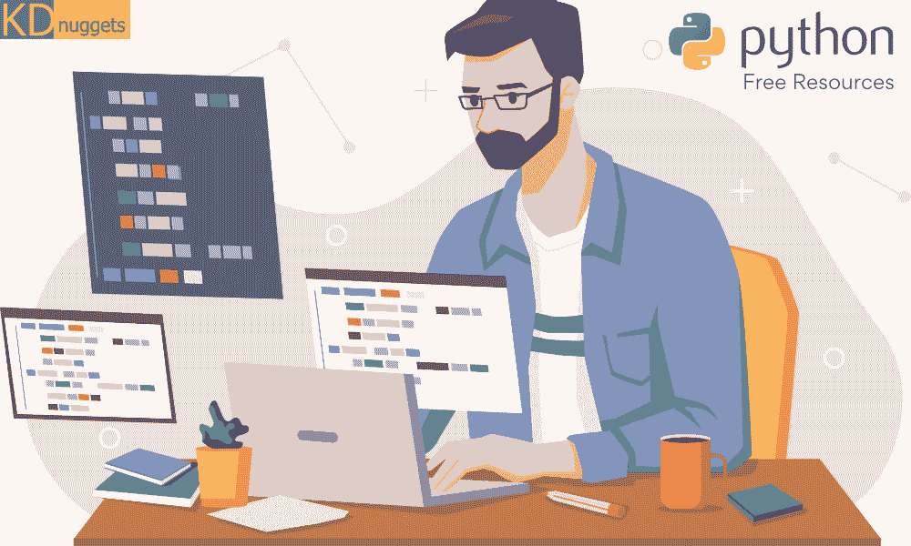

# 9 种免费资源来掌握 Python

> 原文：[`www.kdnuggets.com/2022/11/9-free-resources-master-python.html`](https://www.kdnuggets.com/2022/11/9-free-resources-master-python.html)

编辑提供的图片

Python 被认为是最容易学习的高级通用 编程语言，可以帮助你构建可移植的跨平台应用程序。这，加上它的动态垃圾回收和简洁的代码，使它在人工智能相关应用中极具优势。

* * *

## 我们的前三大课程推荐

 1\. [谷歌网络安全证书](https://www.kdnuggets.com/google-cybersecurity) - 快速进入网络安全职业的快车道。

 2\. [谷歌数据分析专业证书](https://www.kdnuggets.com/google-data-analytics) - 提升你的数据分析能力

 3\. [谷歌 IT 支持专业证书](https://www.kdnuggets.com/google-itsupport) - 支持你组织的 IT

* * *

但是，你如何从编写一个简单的“Hello World”应用程序过渡到使用 Python 进行更复杂的项目呢？以下指南将介绍九个资源，帮助你掌握 Python。

# 1\. Invent with Python 的编程练习

InventWithPython.com 是一个由专业软件开发者 Al Sweigart 创建和维护的网站，他将大量时间投入到教人们编程上。Invent With Python 提供了一系列资源（主要以电子书形式）来帮助你开始用 Python 编程。然而，你应该对网站的 [温和讲解的 Python 编程练习](https://inventwithpython.com/pythongently/) 最感兴趣。

掌握编程语言的最佳方式不是通过刻苦学习，而是通过实践；你必须使用编程语言才能真正学会它。Invent With Python 的《温和讲解的 Python 编程练习》适合初学者和中级程序员。它为每个练习中的问题提供简洁明了的解释，以帮助你提升到下一个 Python 熟练度层次。

# 2\. Microsoft Visual Studio 2022（IDE）

正如任何工匠所言，你的水平与所使用的工具息息相关。虽然你可以使用 Python 默认的 IDE（IDLE）或类似 VS code 的文本编辑器，但功能齐全的 IDE 如 Visual Studio 2022 更适合构建高级 Python 应用程序。微软的 Visual Studio 被认为是最好的（如果不是最伟大的） IDE 之一。你可以轻松使用其内置的 pip 和 Pypl 支持来管理你的依赖项和库。

根据统计数据，部署一个简单的机器学习协议大约需要[30 天](https://youngandtheinvested.com/machine-learning-statistics/)。凭借 Visual Studio 的代码编辑工具，这个时间可以大大缩短。Visual Studio 具有工具提示、模板、自动完成和代码片段，使得处理和管理数据源变得更容易。

你无需外部工具来运行密集的单元测试——Visual Studio 2022 配备了广泛的测试工具。你可以调试、部署和维护远程测试环境，设置机器架构，并通过测试资源管理器跟踪所有内容。

Visual Studio 适合使用不同编程语言的多语言程序员。你只需下载每种语言所需的工作负载。Visual Studio 的[社区版](https://visualstudio.microsoft.com/vs/community/)是免费的，应该足以满足大多数程序员的需求。不过，如果你想访问更多功能，可以下载专业版或企业版。

# 3\. KDnuggets

虽然不想过于自夸，但 KDNuggets 是帮助你进一步提升 Python 开发技能的最佳资源之一。不论是让你与帮助你获得认证的课程联系，还是提供便于学习的备忘单，KDNuggets 可能成为你工具箱中最有用的武器之一。

我们还没有讨论博客。博客内容包括机器学习、编码、数据科学，以及由经验丰富的行业专业人士撰写和编辑的 Python 内容。

KDNuggets 适合各个级别的程序员和数据科学家。无论你是想要加速你的 Python 代码、掌握 Python 机器学习，还是为面试做准备，KDNuggets 都提供了适合这些场景的内容。

# 4\. PyVideo

YouTube 无疑是学习编程的最佳场所之一。像 Pretty Printed、The Underdog 和 sentDex（额外的免费资源）这样的频道不仅教你编程，还教你如何作为开发者应对挑战。

YouTube 并不是唯一一个托管免费 Python 相关媒体的视频分享网站。编程相关的视频内容也可以在 Dailymotion、Vimeo、Facebook 等网站上找到。一些网站和服务更喜欢自行托管媒体，因此跟踪最佳内容可能会很困难。

这时，[像 PyVideo 这样的工具](https://pyvideo.org/)派上用场了。它在互联网上找到并索引了所有最新的与 Python 事件相关的视频。你可以根据特定事件、语言、标签、讲者等查看内容。

PyVideo 让你可以了解 Python 的最新进展，来自一些业内最受尊敬的贡献者和程序员。这可能最终会激励你参加一些 Python 会议和活动，亲身体验一切。

# 5\. Awesome Python

Awesome Python 是一个经过精心策划的 GitHub 上一些最佳 Python 框架、库和其他资源的列表。从音频处理库到加密学，它几乎包含了帮助你完成下一个 Python 项目的所有包。

# 6\. TheAlgorithms

算法和数据结构推动数据科学的发展。即使作为一名自学的开发者，你也必须了解基本的算法（以及一些数学知识）。与 Awesome Python 类似，TheAlgorithms 是一个 GitHub 开源库，包含你可以插入到项目中的算法。

你应该注意到 TheAlgorithms 不仅包含 Python 算法库，还有 Java、JavaScript、Julia、R 等语言的算法。

# 7\. Google’s Python Class

如果你是一个初学者，寻找一个能够适应你学习风格的沉浸式 Python 学习体验，不妨看看 Google 的 Python 课程。在过去十年中，Google 在计算机科学教育方面投入了大量时间和精力。Google 的 Python 课程包含讲座和教程视频、书面材料，以及许多练习和测试。该课程面向那些几乎没有编码经验的人，因此极其易于访问。

# 8\. Programiz

Programiz 非常适合那些寻找 Google Python 课程替代方案的人。它提供了丰富的 Python（和其他编程语言）的学习工具。和 Google 类似，该网站采用多方面的方法来教你如何编码。

每个课程都像一本互动教材。每章都配有视频、各种书面说明、示例，以及一些你可以使用 Programiz 在线编译器自行运行的代码。然而，如果你对课程的结构不满意，[Programiz 提供了一组标签](https://www.programiz.com/python-programming)，让你可以自己查看示例、参考资料和编译器。许多人发现编译器最有用，因为你可以快速运行和测试代码。

虽然 Programiz 是免费的，但它确实提供了一个 pro 版本，具有更多功能，包括课程结束时的专业证书。

# 9\. Python Podcasts

音频媒体的最佳之处在于你可以在做其他事情时进行听取（即，锻炼、驾驶、做家务等）。有很多出色的编程和数据科学相关的播客对 Python 初学者非常有帮助。一些值得注意的包括：

+   **The Real Python Podcast**：这是一个每周播出的播客，由主持人 Christopher Bialy 于 2012 年创办。它涵盖了各种 Python 话题，包括职业和编程技巧。此外，播客还包括轻松的对话和采访，邀请了行业专家、有经验的程序员等。Real Python Podcast 网站的一个最佳功能是它提供了额外的资源，帮助你学习或提升你的 Python 开发技能。

+   **Talk Python to Me**：这是一个由 Michael Kennedy 主持的稍微休闲一点的每周播客。虽然节目多年来已经涵盖了许多 Python 话题，但它最初是一个采访行业专业人士关于 Python 编程现状的平台。收听 Talk Python to Me 是跟上 Python 所有最新发展的绝佳方式。该网站还包括有用的资源，如商品、课程和证书。

+   [**Python Bytes**](https://pythonbytes.fm)：如果你正在寻找一种更简洁的收听体验，你应该考虑这个播客。它由 Michael Kennedy（也是《Talk Python To Me》的主持人）和 Brian Okken 主持。这个播客的目的是在每集不到一个小时的时间内，更新你关于 Python 的最新头条和新闻。

# 结论

十年前，我们希望 Java 能带我们进入下一个层次。现在，Python 已经超越了许多编程语言，成为全球最受欢迎的语言。

Python 不是一种新语言；它自 90 年代初就存在，通过不断改进和获得开发者的支持而发展起来。但如果没有 Python 开发者和爱好者的在线社区，Python 不会有今天的成就。多亏了他们，我们拥有了学习和掌握 Python 的资源。一旦你也掌握了 Python，不要忘记回馈社区。

**[Nahla Davies](http://nahlawrites.com/)** 是一位软件开发人员和技术作家。在全职从事技术写作之前，她曾担任过许多令人兴奋的职位，其中包括在一家 Inc. 5000 的体验品牌机构担任首席程序员，该机构的客户包括三星、时代华纳、Netflix 和索尼。

### 更多相关话题

+   [掌握数据科学求职的 5 个免费资源](https://www.kdnuggets.com/5-free-resources-to-master-your-data-science-job-search)

+   [掌握大型语言模型的全面资源列表](https://www.kdnuggets.com/a-comprehensive-list-of-resources-to-master-large-language-models)

+   [帮助你成为专业人士的免费 Python 资源](https://www.kdnuggets.com/free-python-resources-that-can-help-you-become-a-pro)

+   [学习机器学习线性代数的 3 个免费资源](https://www.kdnuggets.com/2022/03/top-3-free-resources-learn-linear-algebra-machine-learning.html)

+   [免费大学数据科学资源](https://www.kdnuggets.com/2022/05/free-university-data-science-resources.html)

+   [如何开始使用 SQL - 免费学习资源列表](https://www.kdnuggets.com/2022/10/get-running-sql-list-free-learning-resources.html)
