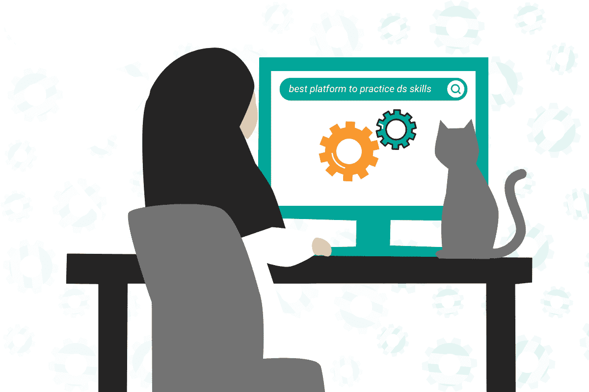

# 9 个顶尖平台，练习关键的数据科学技能

> 原文：[`www.kdnuggets.com/2023/03/9-top-platforms-practice-key-data-science-skills.html`](https://www.kdnuggets.com/2023/03/9-top-platforms-practice-key-data-science-skills.html)

现在在线学习的好处在于，学习不再受限。你可以在自己家中舒适地阅读、练习、测验和编程，而无需支付学位费用。

* * *

## 我们的前三名课程推荐

 1\. [Google 网络安全证书](https://www.kdnuggets.com/google-cybersecurity) - 快速进入网络安全职业生涯。

 2\. [Google 数据分析专业证书](https://www.kdnuggets.com/google-data-analytics) - 提升你的数据分析能力

 3\. [Google IT 支持专业证书](https://www.kdnuggets.com/google-itsupport) - 支持你的组织在 IT 方面

* * *

由于数据科学被视为一种难以学习的技能，许多雇主并不关心你是在哪里学习 Python 或其他数据科学技能的，只要你能够胜任。

在本文中，我将详细介绍九个数据科学学习平台，这些平台提供互动学习体验。它们配备了各种资源，包括视频教程、互动编码练习和测验，帮助你建立和巩固编程和数据库管理技能。

让我们深入探讨。在每一部分，我会解释平台的特点、你可以学习的内容、费用以及它与其他八个平台的不同之处。

这里是每个平台的概览，供快速参考。

# 1\. Codecademy

[Codecademy](https://www.codecademy.com/)是一个专为学习编程而设计的平台。

## 这是什么？

Codecademy 是一个在线学习平台，提供编程、数据科学和网页开发的课程和教程。它是初学者和希望提高编码技能的人的超级热门选择。

## 你可以学到什么？

在 Codecademy，你可以学习多种编程语言，如 Python、JavaScript、Ruby、HTML、CSS 等。不论你喜欢什么，你都能找到相关的课程。Codecademy 还提供数据科学主题的课程，如 SQL 和数据可视化，以及网页开发工具，如 React 和 Git。

我个人喜欢 Codecademy，因为它非常互动。这个平台提供课程和编码练习，帮助你构建真实项目并理解编程的基本概念。

## 费用多少？

在他们的网站上，他们的标语是“免费学习编码”。确实有一个免费层级，你可以免费获得像“[学习 SQL](https://www.codecademy.com/learn/learn-sql)”和“[学习 Java: 入门](https://www.codecademy.com/learn/java-introduction)”这样的课程。

然而，如果你想进一步提升知识并访问更高级的课程，你需要支付$34.99/月，或者如果你按年支付，则为$17.49/月。

## 主要优点？

Codecademy 之所以突出，是因为其易用性。它对初学者非常友好。许多编码平台自称对初学者友好，因为这是他们的目标受众，但 Codecademy 对那些从未输入过一行代码的人来说是完美的。

有很多免费的课程可以尝试，以了解这些语言和它们的教学风格是否适合你。

# 2\. Coursera

图片来自 [canva](https://canva.com/)

[Coursera](https://www.coursera.org/)是一个大学和公司上传视频课程的平台。在其他主题之外，他们有许多受欢迎的数据科学讲师。

## 这是什么？

Coursera 是由大学运营的在线学习平台。他们提供在线课程、可以挂在你虚拟 LinkedIn 墙上的证书，甚至还有完整的学位项目。他们与密歇根大学、耶鲁大学、莱斯大学、伦敦帝国学院等大学合作，还与[更多](https://about.coursera.org/)大学合作。

课程通常持续一到九个月。

## 你可以学到什么？

在 Coursera 上，你可以学习几乎任何技能，包括课程如“[幸福科学](https://www.coursera.org/learn/the-science-of-well-being)”、“[心理学导论](https://www.coursera.org/learn/introduction-psychology)”和“[金融市场](https://www.coursera.org/learn/financial-markets-global)”。

他们还提供：

+   指导项目。这些是更实际的、较短的课程，你将获得特定的技能。

+   专业化课程，通常是进一步学习某一技能，如西北大学的“销售艺术”。

+   证书。这些提供了你在所选技能领域的“认证”这一 tangible outcome。

+   学位。这些是完整的学位课程。

## 费用多少？

一些课程是免费的，例如我上面列出的前三门课程。一些指导项目，例如“[绝对初学者的 Docker](https://www.coursera.org/projects/docker-for-absolute-beginners?action=enroll)”，起价为$9.99/月。如果你报名参加更有用的课程，如专业化或职业证书，这些课程的费用为$39.99/月。学位课程自然更贵——学位课程的起价为$9,000。

## 主要优点？

Coursera 提供了种类繁多的课程，价格相当合理，由耶鲁大学和 IBM 等顶级机构提供。你可以获得实用技能，对广泛主题有一个基础了解，或通过专业化深入学习。

# 3\. StrataScratch

[StrataScratch](https://www.stratascratch.com?utm_source=blog&utm_medium=click&utm_campaign=kdn+9+data+science+platforms) 是一个面试问题平台。

## 这是什么？

StrataScratch 提供了 1000 多个来自 [顶级数据科学公司](https://www.stratascratch.com/blog/11-best-companies-to-work-for-as-a-data-scientist?utm_source=blog&utm_medium=click&utm_campaign=kdn+9+data+science+platforms) 的真实面试问题，涵盖编码和非编码问题。它针对的是准备申请数据科学职位的人员。

## 你可以学到什么？

这是一个更具实践性、结果导向的平台。与其从零开始教你新技能，这个平台更适合那些已有一定知识并想测试自己或准备即将到来的面试的人。

在编码方面，你可以练习 PostgreSQL、Python、MySQL、R 和 MS SQL Server 问题。在非编码问题方面，你可以练习系统设计、概率、商业案例、统计、建模、技术和产品问题。

你还可以按难度和公司进行筛选。

StrataScratch 还提供数据项目，如 [都柏林市场分析](https://platform.stratascratch.com/data-projects/market-analysis-dublin?utm_source=blog&utm_medium=click&utm_campaign=kdn+9+data+science+platforms)，以及指南，例如 [SQL 时间和日期操作](https://www.stratascratch.com/guides/sql-time-and-date-skills/?utm_source=blog&utm_medium=click&utm_campaign=kdn+9+data+science+platforms)。如果你想将这些添加到你的投资组合中，这些更实操的项目会很有用。

## 费用是多少？

有一个免费层级，包括一些但不是所有的问题，有的有解答，有的没有。

对于 $32/月的层级，你可以访问所有面试问题和解决方案。

最后，有一个年付选项，费用为 $139/年（或终身 $289），此外还包括访问数据项目和深入解决各种针对数据科学家的编码问题的指南。

## 关键好处？

因为这些是从真实数据科学面试中提取的真实问题，你将获得与公司所寻找的内容完全一致的实践经验。

# 4\. Boot.dev

[Boot.dev](https://boot.dev/) 提供帮助你成为后台开发者的课程。

## 这是什么？

Boot.dev 是一个有趣的平台，旨在弥补大学学位和电子学习平台之间的差距。大学学位既慢又昂贵。像 Coursera 这样的地方专注于前端。如果你想练习 Python、SQL 和其他编码技能以获得后台开发职位，你会遇到困难。

他们将平台组织为“轨道”，包括语言、指导项目和投资组合项目。

## 你可以学到什么？

你可以学习 Python、JavaScript 和 Go 作为主要的后台编码语言。但你也将学习更多计算机科学相关的技能和概念，如算法、面向对象编程和密码学。

## 费用是多少？

Boot.dev 的费用为每月 $39、每年 $249 或终身 $999。所有这些层级都提供相同的福利：访问所有内容、一个可用于求职的编程项目组合、完成证书和访问 Discord 服务器。

## 主要好处是什么？

很少有地方提供帮助你成为 [后端开发者与前端开发者](https://blog.boot.dev/backend/frontend-vs-backend-meaning/) 的学习内容。也许因为前端开发被认为更容易接触，大多数在线学习平台集中在 HTML 和 CSS 等技能上。

这是我见过的为后端学习者提供支持的少数平台之一。

# 5\. Udemy

[Udemy](https://www.udemy.com/) 是一个在线学习平台，任何人都可以上传课程。

## 这是什么？

Udemy 类似于 Coursera，但有一个关键区别：任何人都可以上传视频课程，而不仅仅是大学或组织。像 Coursera 一样，Udemy 也可以让你访问大量各种技能的课程，但在数据科学技能方面有很好的选择。

这意味着 Udemy 提供了从初级到高级的广泛课程，由专家、专业人士和个人讲授。

Udemy 的课程旨在提供可访问性和灵活性，配有视频课程、测验和项目，帮助学生建立实用技能。该平台还提供课程内容的终身访问权限，以便学生可以按自己的节奏学习，并在需要时重新学习材料。Udemy 的课程没有认证，但许多课程附带完成证书，可以用于向潜在雇主展示技能和知识。

## 你可以学习什么？

更好的问题是，你不能学习什么？不过这里有一些最佳课程的快速总结：

+   编程与开发：包括网络开发、移动应用开发、游戏开发等。

+   数据科学与分析：包括机器学习、数据分析、大数据等。

+   商业：包括创业、市场营销、销售等。

+   设计：包括图形设计、网页设计、室内设计等。

+   个人发展：包括个人财务、生产力、领导力等。

+   IT 与软件：包括网络安全、信息安全、云计算等。

+   市场营销与销售：包括数字营销、电子邮件营销、社交媒体营销等。

+   音乐、艺术与摄影：包括音乐制作、音乐理论、摄影等。

## 费用是多少？

你有两个选择：

+   你可以购买单独的课程，如“学习 Python 进行数据分析和可视化”，这些课程的价格在 $15 到 $30 之间，获得课程的终身访问权限。

+   你可以订阅每月 $16.58 起的个人计划，这样你可以访问超过 8,000 门课程，以及 4,000+ 个练习，由 3,000+ 名顶级讲师授课。

## 主要好处是什么？

Udemy 的巨大广度是它的优势。你可以找到不仅仅是任何语言的课程，还可以找到任何目的的课程，如“[面向对象编程的 Python](https://www.udemy.com/course/python-beyond-the-basics-object-oriented-programming/)”或“[React 完全指南](https://www.udemy.com/course/react-the-complete-guide-incl-redux/)”。

由于任何人都可以上传课程，你肯定能找到一个与你契合的讲师。

# 6\. edX

图片来源于[canva](https://canva.com/)

[edX](https://www.edx.org/)类似于 Coursera 的终极版。edX 与多个著名大学合作，包括哈佛大学、麻省理工学院和加州大学伯克利分校。

## 这是什么？

与 Coursera 类似，edX 提供来自顶级大学和机构的在线课程。然而，edX 在合作伙伴和提供的技能方面稍有不同。例如，edX 提供验证证书、专业证书和微硕士课程，而 Coursera 仅提供专业化、专业证书和学位。

Coursera 也更具自我节奏，而 edX 则有考试和作业的截止日期。

## 你能学到什么？

在 3,000 多个课程中，你将能够找到一个好的数据科学技能来学习。该平台提供了“[分析建模入门](https://www.edx.org/course/introduction-to-analytics-modeling)”、“[使用 Python 进行机器学习](https://www.edx.org/course/machine-learning-with-python-a-practical-introduct)”和“[数据素养基础](https://www.edx.org/course/essentials-of-data-literacy)”等课程。

## 费用是多少？

这因课程而异，但一般来说，edX 比 Coursera 稍贵。你几乎可以免费访问任何课程进行审计，但这有一些限制——你只能访问一个月的材料，你不会获得证书，而且你的作业不会被评分。

如果你需要验证课程，价格从每门课程大约 49 美元到 149 美元不等。

他们还提供价格高达数千美元的训练营。例如，[加州大学伯克利分校](https://www.edx.org/course/berkeley-coding-boot-camp?source=edx&category=boot-camps&medium=referral&campaign=Coding+Boot+Camp&c=&lsrc=edx&placement_url=https%3A%2F%2Fwww.edx.org%2F&version=edx&eaid=1ffe2e46-ee0c-4072-aaa5-68c930174a79)的 24 周编码训练营费用为 13,000 美元。

## 关键好处是什么？

这个平台与 Coursera 相当。主要的好处是它比 Coursera 更具指导性，你可能还能通过他们的证书获得更多品牌认可。

# 7\. Kaggle

让我们暂时离开学习平台。 [Kaggle](https://www.kaggle.com/)是一个竞赛平台。

## 这是什么？

Kaggle 是一个非常受欢迎且运作良好的数据科学竞赛平台，特别倾向于机器学习。它由 Google 拥有，拥有成千上万的数据集供你练习。

你将获得：

+   竞赛中，参与者竞相使用提供的数据集开发最佳解决方案。竞赛由寻求解决特定问题的组织赞助，并向获胜者提供奖金。

+   公共数据集：Kaggle 提供了大量公共数据集，供实践、研究或比赛提交使用。

+   笔记本：Kaggle 提供了一个基于云的 Jupyter 笔记本环境，适用于数据科学和机器学习，允许用户轻松编写、运行和与他人共享代码。

+   讨论：Kaggle 拥有一个庞大而活跃的数据科学家和机器学习从业者社区，参与讨论、提问和回答问题，并合作进行项目。

## 你能学到什么？

在 Kaggle 上，你可以学习数据分析、机器学习、Python 和 R 编程以及数据准备等技能。

查看一些提供的竞赛，看看你想要提升哪些技能。例如，你可以参加 [高级回归技术](https://www.kaggle.com/competitions/house-prices-advanced-regression-techniques) 挑战、[微型企业密度预测](https://www.kaggle.com/competitions/godaddy-microbusiness-density-forecasting) 或 [计算机视觉](https://www.kaggle.com/competitions/digit-recognizer) 竞赛。

## 费用是多少？

完全免费！参加竞赛、下载数据集、参加短期课程，全都免费。这是 Kaggle 由 Google 拥有的一大好处。它资金充足，因此可以免费提供给参与者/竞争者/学习者。

## 关键好处？

访问真实、复杂的数据和问题非常有帮助。一旦你完成了电子学习，并想进一步挑战自己，这种基于挑战的平台对于进一步提升技能非常好。

此外，访问和指导如此多的数据集意味着你将能够设计并添加一些有趣的 [数据科学项目](https://www.stratascratch.com/blog/19-data-science-project-ideas-for-beginners/?utm_source=blog&utm_medium=click&utm_campaign=kdn+9+data+science+platforms) 到你的作品集中。

最后，竞争性角度对某些学习者有效！

# 8. HackerRank

图片来自 [canva](https://canva.com/)

我们来看一下 [HackerRank](https://www.hackerrank.com/)，另一个编码挑战网站。

## 这是什么？

HackerRank 是一个为软件开发人员提供编码挑战和竞赛的网站，以提升他们的编码技能。

许多公司将其作为筛选软件开发职位候选人的有趣方式。该平台提供了广泛的类别选择，包括算法、数据结构、数学、数据库等。

作为一个可能想学习 Python、SQL 和其他编码技能的随机互联网用户，这是一个创建个人作品集的绝佳平台。

## 你能学到什么？

HackerRank 的工作方式像是组合了一个作品集和 Kaggle。你可以参与排名比赛，也可以获得 Go、C#和 Java 等语言的认证。

他们有三个学习领域：

+   [准备](https://www.hackerrank.com/dashboard)。这包括面试准备工具包、一些基础认证，以及学习算法、数据结构和数学等各种主题。

+   [认证](https://www.hackerrank.com/skills-verification)。这个区域包含了你需要的所有认证，从 R 到 SQL 到 JavaScript。

+   [竞争](https://www.hackerrank.com/contests)。这是更类似于 Kaggle 的一部分，提供了比赛和竞赛来展示你的知识并赢得奖品或声誉。

基本上，它是一个适合积极求职者以及任何想学习的人在具有挑战性和竞争力的环境中练习和测试编码技能的好地方。

HackerRank 还为你提供了资源、教程、文章和示例代码。

## 这要多少钱？

有趣的是：它主要是为公司招聘人才而设计的。这意味着作为候选人，你实际上可以免费使用这个产品（因为从某种意义上说，你*就是*这个产品）。

## 主要好处？

HackerRank 的独特之处在于它是为公司设计的，而不是个人。这使得个人可以非常有用地看到公司招聘所需的技能。你可以从面试的角度了解自己，从而知道应该集中精力提升哪些技能。

它非常适合那些希望从事数据科学工作的人。

# 9. StackOverflow

让我们来看看这个问答平台。

## 这是什么？

包括 StackOverflow 作为学习平台有点厚脸皮，因为这并不是它设计的目的。但它是我用来自然学习 Python 和 R 的最佳平台之一。而且最棒的是，它是免费的。

StackOverflow 是一个程序员、开发者和软件工程师提问并获得众包答案的地方。答案可以根据其帮助性和准确性被投票提升或降低。

这是一个包含多年编程问题和答案的大型资料库。

## 你可以学到什么？

+   [Python 编程](https://stackoverflow.com/search?q=python+programming)：许多与其语法、库和最佳实践相关的问题和答案。

+   [SQL](https://stackoverflow.com/questions/tagged/sql)：包括查询、数据库设计和优化技术。

+   [算法和数据结构](https://stackoverflow.com/search?q=algorithms+data+structures)：排序、搜索和图算法。

+   [Web 开发](https://stackoverflow.com/search?q=web+dev)：HTML、CSS、JavaScript 以及如 Django 和 Ruby on Rails 等网页框架。

+   [调试](https://stackoverflow.com/search?q=debugging)：关于调试技术和最佳实践的问题和答案非常多。

+   [软件设计](https://stackoverflow.com/search?q=software+design&s=0d45f9d6-4558-402f-a66c-141d36210592)：了解软件设计模式、架构和最佳实践。

在 StackOverflow 上学习的最佳方式是提问和回答问题。从基础开始 - 寻找尚未有人回答的 Python 或 SQL 的基础问题。你很快就会获得大量关于答案质量的同行反馈，从而能够进一步改进。

这很令人望而生畏，但它是一个极好的方式来提升你不仅是实际编码技能，还有沟通能力。

## 这需要多少钱？

这是免费的！完全免费注册账号并提问或回答无限问题。

## 主要好处？

StackOverflow 最棒的地方在于它*并非*作为学习平台设计。这些问题和答案并非经过精心设计，而是现实中的复杂、人类世界的问题，数据也很杂乱。而且你将获得来自真正数据科学家的真实反馈。

这是一个真正的挑战，但它是学习的绝佳方式。

# 最后的思考

总结一下，数字时代的美在于教育现在触手可及。数据科学是一个热门话题，许多雇主并不在乎你从哪里学到的，只要你能做到。

本文介绍了九个惊人且有些不传统的平台，使学习这种需求量大的技能变得轻松。通过视频教程、互动编码练习、测验和真实数据，你将能够提升你的技能，并向世界展示你的能力。

不要再等待了。选择一个平台（或者九个 - 这些平台并不排他！）并立即开始学习数据科学吧。

**[内特·罗西迪](https://www.stratascratch.com)** 是一位数据科学家，专注于产品战略。他也是一名兼职教授，教授分析学，同时是 [StrataScratch](https://www.stratascratch.com/)、一个帮助数据科学家准备面试的平台的创始人。通过 [Twitter: StrataScratch](https://twitter.com/StrataScratch) 或 [LinkedIn](https://www.linkedin.com/in/nathanrosidi/) 与他联系。

### 更多相关内容

+   [练习 SQL 的 7 个最佳平台](https://www.kdnuggets.com/2023/01/7-best-platforms-practice-sql.html)

+   [练习 Python 的 7 个最佳平台](https://www.kdnuggets.com/7-best-platforms-to-practice-python)

+   [成为优秀数据科学家所需的 5 项关键技能](https://www.kdnuggets.com/2021/12/5-key-skills-needed-become-great-data-scientist.html)

+   [排名前五的数据管理平台](https://www.kdnuggets.com/2022/06/top-5-data-management-platforms.html)

+   [排名前五的云机器学习平台与工具](https://www.kdnuggets.com/the-top-5-cloud-machine-learning-platforms-tools)

+   [从理论到实践：构建一个 k-最近邻分类器](https://www.kdnuggets.com/2023/06/theory-practice-building-knearest-neighbors-classifier.html)
