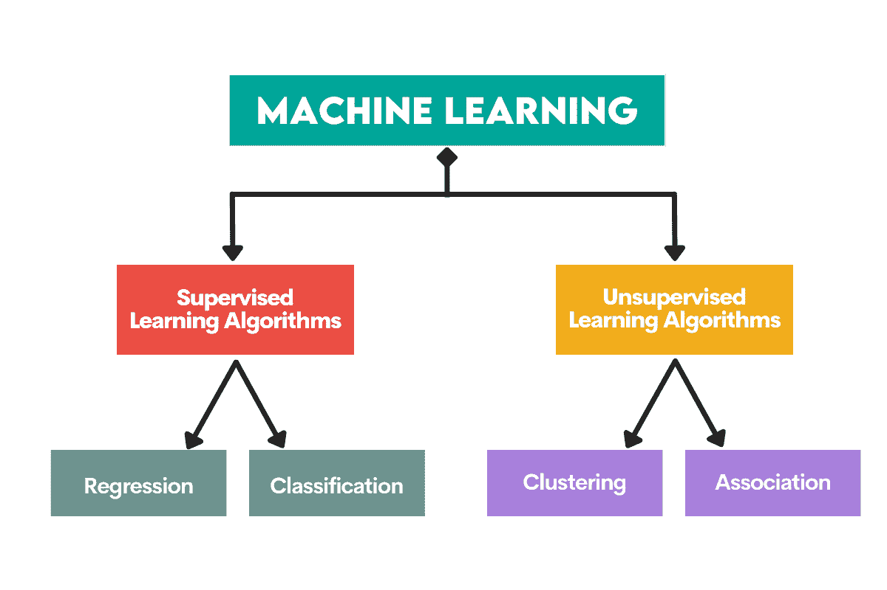
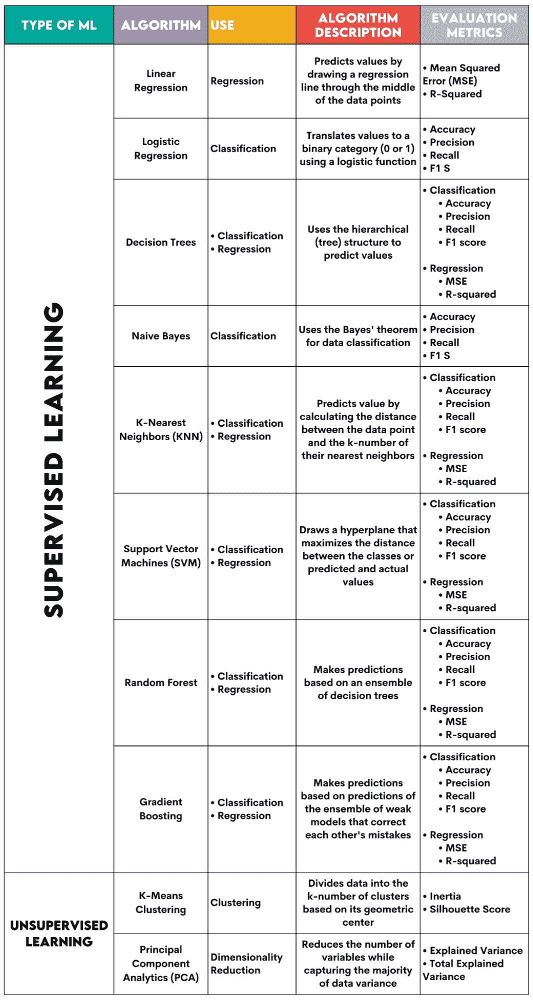

# 初学者指南：十大机器学习算法

> 原文：[`www.kdnuggets.com/a-beginner-guide-to-the-top-10-machine-learning-algorithms`](https://www.kdnuggets.com/a-beginner-guide-to-the-top-10-machine-learning-algorithms)

作者图片

数据科学的一个基础领域是机器学习。因此，如果你想进入数据科学，理解机器学习是你需要迈出的第一步。

* * *

## 我们的前三大课程推荐

 1\. [谷歌网络安全证书](https://www.kdnuggets.com/google-cybersecurity) - 快速进入网络安全职业

 2\. [谷歌数据分析专业证书](https://www.kdnuggets.com/google-data-analytics) - 提升你的数据分析技能

 3\. [谷歌 IT 支持专业证书](https://www.kdnuggets.com/google-itsupport) - 支持你的组织的 IT

* * *

那么你从哪里开始呢？你需要了解两种主要机器学习算法的区别。只有在那之后，我们才能谈论作为初学者你应该优先学习的个别算法。

# 有监督学习与无监督学习

算法的主要区别在于它们的学习方式。

作者图片

**有监督学习算法**是在**标记数据集**上训练的。这个数据集作为学习的监督（因此得名），因为其中的一些数据已经标记为正确答案。基于这些输入，算法可以学习并将这些学习应用到其余数据中。

另一方面，**无监督学习算法**在**未标记数据集**上进行学习，这意味着它们在寻找数据中的模式时没有人为的指导。

你可以更详细地阅读关于[机器学习算法](https://www.stratascratch.com/blog/machine-learning-algorithms-you-should-know-for-data-science/?utm_source=blog&utm_medium=click&utm_campaign=kdn+ml+algorithms+for+beginners)和学习类型的内容。

还有一些其他类型的机器学习，但不适合初学者。

# 机器学习任务

算法被用于解决每种机器学习类型中的两个主要不同问题。

再次强调，还有一些任务，但它们不适合初学者。

作者图片

## 有监督学习任务

**回归**是预测**数值**的任务，称为**连续结果变量或因变量**。预测是基于预测变量或自变量进行的。

想想预测油价或空气温度。

**分类** 用于预测输入数据的 **类别（类）**。这里的 **结果变量** 是 **分类的或离散的**。

想想预测邮件是否为垃圾邮件，或患者是否会得某种疾病。

## 无监督学习任务

**聚类** 意味着 **将数据划分为子集或簇**。目标是尽可能自然地对数据进行分组。这意味着同一簇中的数据点比其他簇中的数据点更相似。

**降维** 指的是减少数据集中输入变量的数量。这基本上意味着 **将数据集减少到很少的变量，同时仍捕捉其本质**。

# 10 大机器学习算法概述

以下是我将涵盖的算法概述。

作者提供的图片

## 监督学习算法

在选择适合你问题的算法时，了解该算法的用途非常重要。

作为数据科学家，你可能会使用 [scikit-learn 库](https://scikit-learn.org/stable/install.html) 在 Python 中应用这些算法。虽然它几乎为你做了所有的事情，但建议你至少了解每个算法内部工作的基本原理。

最后，在算法训练完成后，你应该评估它的表现。为此，每个算法都有一些标准指标。

### 1\. 线性回归

**用于：** 回归

**描述：** [线性回归绘制了一条直线](https://upload.wikimedia.org/wikipedia/commons/thumb/b/b0/Linear_least_squares_example2.svg/1920px-Linear_least_squares_example2.svg.png)，称为回归线，连接变量之间的关系。这条线大致穿过数据点的中间，从而最小化估计误差。它显示了基于自变量值的因变量的预测值。

**评估指标：**

+   [均方误差 (MSE)](https://statisticsbyjim.com/regression/mean-squared-error-mse/)：表示平方误差的平均值，误差是实际值和预测值之间的差异。值越低，算法性能越好。

+   [R 平方](https://statisticsbyjim.com/regression/interpret-r-squared-regression/)：表示自变量可以预测的因变量的方差百分比。对于这个度量，你应该尽量接近 1。

### 2\. 逻辑回归

**用于：** 分类

**描述：** 它使用 [逻辑函数](https://upload.wikimedia.org/wikipedia/commons/thumb/8/88/Logistic-curve.svg/2880px-Logistic-curve.svg.png) 将数据值转换为二元类别，即 0 或 1。通常使用 0.5 的阈值。二元结果使得该算法非常适合预测二元结果，如 YES/NO、TRUE/FALSE 或 0/1。

**评估指标：**

+   准确度：正确预测与总预测的比率。越接近 1 越好。

+   精确度：模型在正预测中的准确性度量；表示为正确正预测与总期望正结果之间的比率。越接近 1 越好。

+   召回率：它同样衡量模型在正预测中的准确性。表示为正确正预测与在类别中所做总观察之间的比率。有关这些指标的更多信息，请参见 这里。

+   [F1 分数](https://www.v7labs.com/blog/f1-score-guide)：模型召回率和精确度的调和平均数。越接近 1 越好。

### 3\. 决策树

**用途：** 回归与分类

**描述：** 决策树 是利用层次或树状结构来预测值或类别的算法。根节点代表整个数据集，然后根据变量值分支成决策节点、分支和叶子。

**评估指标：**

+   准确度、精确度、召回率和 F1 分数 -> 用于分类

+   MSE, R 平方 -> 用于回归

### 4\. 朴素贝叶斯

**用途：** 分类

**描述：** 这是使用 [贝叶斯定理](https://www.cuemath.com/data/bayes-theorem/) 的分类算法族，即它们假设类别内特征之间是独立的。

**评估指标：**

+   准确度

+   精确度

+   召回率

+   F1 分数

### 5\. K-最近邻（KNN）

**用途：** 回归与分类

**描述：** 它计算测试数据与训练数据中 [k 个最近数据点](https://www.javatpoint.com/k-nearest-neighbor-algorithm-for-machine-learning) 之间的距离。测试数据属于‘邻居’数量较多的类别。关于回归，预测值是 k 个选定训练点的平均值。

**评估指标：**

+   准确度、精确度、召回率和 F1 分数 -> 用于分类

+   MSE, R 平方 -> 用于回归

### 6\. 支持向量机（SVM）

**用途：** 回归与分类

**描述：** 该算法绘制一个[超平面](https://www.spiceworks.com/tech/big-data/articles/what-is-support-vector-machine/)来分离不同类别的数据。它的位置距离每个类别的最近点最远。数据点离超平面的距离越远，它越属于该类别。对于回归，原理类似：超平面最大化预测值与实际值之间的距离。

**评估指标：**

+   准确率、精确率、召回率和 F1 分数 -> 用于分类

+   均方误差（MSE）、决定系数（R-squared） -> 用于回归

### 7\. 随机森林

**用途：** 回归与分类

**描述：** [随机森林算法](https://www.stratascratch.com/blog/decision-tree-and-random-forest-algorithm-explained/?utm_source=blog&utm_medium=click&utm_campaign=kdn+ml+algorithms+for+beginners)使用一组决策树，这些决策树组成一个决策森林。算法的预测基于许多决策树的预测。数据会被分配到获得最多票数的类别中。对于回归，预测值是所有树的预测值的平均值。

**评估指标：**

+   准确率、精确率、召回率和 F1 分数 -> 用于分类

+   均方误差（MSE）、决定系数（R-squared） -> 用于回归

### 8\. 梯度提升

**用途：** 回归与分类

**描述：** [这些算法](https://www.javatpoint.com/gbm-in-machine-learning)使用一组弱模型，每个后续模型识别并纠正前一个模型的错误。这个过程会重复进行，直到错误（损失函数）最小化。

**评估指标：**

+   准确率、精确率、召回率和 F1 分数 -> 用于分类

+   均方误差（MSE）、决定系数（R-squared） -> 用于回归

## 无监督学习算法

### 9\. K 均值聚类

**用途：** 聚类

**描述：** [该算法](https://realpython.com/k-means-clustering-python/)将数据集划分为 k 个簇，每个簇由其[质心或几何中心](https://en.wikipedia.org/wiki/Centroid)表示。通过将数据划分为 k 个簇的迭代过程，目标是最小化数据点与其簇的质心之间的距离。另一方面，它还试图最大化这些数据点与其他簇的质心之间的距离。简而言之，属于同一簇的数据应该尽可能相似，而与其他簇的数据尽可能不同。

**评估指标：**

+   惯性：每个数据点距离最近簇质心的距离的平方和。惯性值越低，簇越紧凑。

+   轮廓分数：它衡量簇的凝聚力（数据在自身簇中的相似性）和分离度（数据与其他簇的差异）。该分数的值范围从-1 到+1。值越高，数据越适合其簇，越不适合其他簇。

### 10\. 主成分分析（PCA）

**用途：** 降维

**描述：** [该算法](https://www.turing.com/kb/guide-to-principal-component-analysis) 通过构建新的变量（主成分）来减少所使用的变量数量，同时仍尝试最大化数据的捕获方差。换句话说，它将数据限制为其最常见的成分，同时不丢失数据的本质。

**评估指标：**

+   解释方差：每个主成分覆盖的方差百分比。

+   总解释方差：所有主成分覆盖的方差百分比。

# 结论

机器学习是数据科学的重要组成部分。通过这十种算法，你将涵盖机器学习中最常见的任务。当然，这个概述仅仅是对每种算法工作原理的一个大致了解。所以，这只是一个开始。

现在，你需要学习如何在 Python 中实现这些算法并解决实际问题。在这方面，我推荐使用 scikit-learn。不仅因为它是一个相对易用的机器学习库，还因为它有 [丰富的资料](https://scikit-learn.org/stable/index.html) 关于机器学习算法。

****[内特·罗斯迪](https://twitter.com/StrataScratch)**** 是一位数据科学家和产品策略专家。他还是一名兼职教授，教授分析课程，并且是 StrataScratch 的创始人，该平台帮助数据科学家通过来自顶级公司的真实面试问题来准备面试。内特撰写有关职业市场的最新趋势，提供面试建议，分享数据科学项目，并覆盖所有 SQL 相关内容。

### 相关主题

+   [必要的机器学习算法：初学者指南](https://www.kdnuggets.com/2021/05/essential-machine-learning-algorithms-beginners.html)

+   [初学者终端到终端机器学习指南](https://www.kdnuggets.com/2021/12/beginner-guide-end-end-machine-learning.html)

+   [初学者机器学习 Python 指南](https://www.kdnuggets.com/beginners-guide-to-machine-learning-with-python)

+   [初学者机器学习测试指南（使用 DeepChecks）](https://www.kdnuggets.com/beginners-guide-to-machine-learning-testing-with-deepchecks)

+   [初学者 AI 和机器学习职业指南](https://www.kdnuggets.com/beginners-guide-to-careers-in-ai-and-machine-learning)

+   [KDnuggets 新闻，6 月 22 日：主要监督学习算法……](https://www.kdnuggets.com/2022/n25.html)
