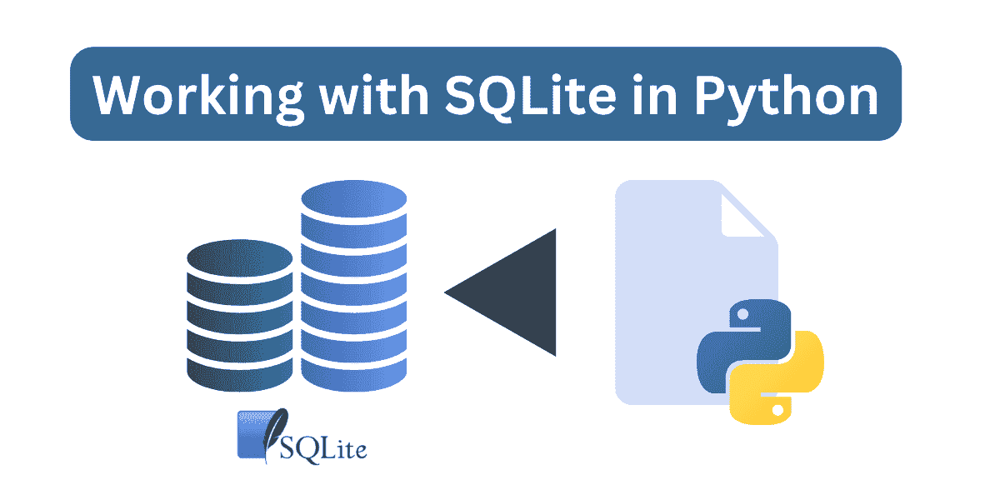
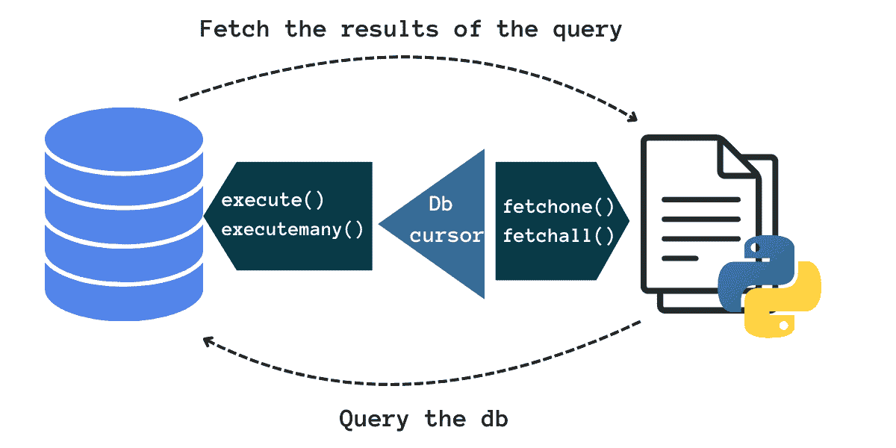

# 使用 SQLite 数据库的指南

> 原文：[`www.kdnuggets.com/a-guide-to-working-with-sqlite-databases-in-python`](https://www.kdnuggets.com/a-guide-to-working-with-sqlite-databases-in-python)



作者图片

SQLite 是一种轻量级、无服务器的关系数据库管理系统（RDBMS），由于其简单性和易于嵌入应用程序而被广泛使用。

* * *

## 我们的前三个课程推荐

 1\. [谷歌网络安全证书](https://www.kdnuggets.com/google-cybersecurity) - 快速进入网络安全职业生涯。

 2\. [谷歌数据分析专业证书](https://www.kdnuggets.com/google-data-analytics) - 提升您的数据分析技能

 3\. [谷歌 IT 支持专业证书](https://www.kdnuggets.com/google-itsupport) - 支持您的组织的 IT

* * *

无论您是在构建小型应用程序、在本地管理数据还是在原型设计项目，SQLite 都提供了一种方便的解决方案，用于存储和查询结构化数据。在本教程中，您将学习如何使用内置的 [sqlite3 模块](https://docs.python.org/3/library/sqlite3.html) 从 Python 操作 SQLite 数据库。

特别地，您将学习如何从 Python 连接到 SQLite 数据库并执行基本的 CRUD 操作。让我们开始吧。

## 环境设置

首先，为您的项目创建一个专用的虚拟环境（在项目目录中）并激活它。您可以使用内置的 venv 模块来完成：

```py
$ python3 -m venv v1
$ source v1/bin/activate 
```

在本教程中，我们将使用 [Faker](https://pypi.org/project/Faker/) 生成合成记录。请使用 pip 安装：

```py
$ pip3 install Faker 
```

sqlite3 模块是 Python 标准库的一部分，因此您无需单独安装它。如果您已经安装了 Faker 并使用的是最新版本的 Python，那就可以开始了！

## 连接到 SQLite 数据库

在项目目录中创建一个 Python 脚本并开始。作为与数据库交互的第一步，我们应该建立与数据库的连接。

要连接到示例数据库 example.db，您可以使用 sqlite3 模块中的 `connect()` 函数，如下所示：

```py
conn = sqlite3.connect(‘example.db’)
```

如果数据库已经存在，则连接到它。否则，它将在工作目录中创建数据库。

连接到数据库后，我们将创建一个数据库游标，以帮助我们运行查询。游标对象具有执行查询和获取查询结果的方法。它的工作方式与文件处理器非常相似。



数据库游标 | 作者图片

使用 `with` 语句将连接作为上下文管理器是很有帮助的，如下所示：

```py
import sqlite3

# Connect to the db
with sqlite3.connect('example.db') as conn:
    # create db cursor
    # run queries
    # commit changes 
```

这样你就不必担心关闭连接对象。当执行退出 with 块时，连接会自动关闭。不过，我们在本教程中会显式关闭游标对象。

## 创建数据库表

现在让我们在数据库中创建一个包含所需字段的`customers`表。为此，我们首先创建一个游标对象。然后我们运行一个 CREATE TABLE 语句，并将查询字符串传递给游标对象上调用的`execute()`方法：

```py
import sqlite3

# Connect to the db
with sqlite3.connect('example.db') as conn:
	cursor = conn.cursor()

	# Create customers table
	cursor.execute('''
    	CREATE TABLE IF NOT EXISTS customers (
        	id INTEGER PRIMARY KEY,
        	first_name TEXT NOT NULL,
        	last_name TEXT NOT NULL,
        	email TEXT UNIQUE NOT NULL,
        	phone TEXT,
        	num_orders INTEGER
    	);
	''')
	conn.commit()
	print("Customers table created successfully.")
	cursor.close() 
```

当你运行脚本时，你应该会看到以下输出：

```py
Output >>>
Customers table created successfully. 
```

## 执行 CRUD 操作

让我们对数据库表进行一些基本的 CRUD 操作。如果愿意，你可以为每个操作创建单独的脚本。

### 插入记录

现在我们将一些记录插入到`customers`表中。我们将使用 Faker 生成合成记录。为了保持输出的可读性，我只插入了 10 条记录。但你可以插入任意数量的记录。

```py
import sqlite3
import random
from faker import Faker

# Initialize Faker object
fake = Faker()
Faker.seed(24)

# Connect to the db
with sqlite3.connect('example.db') as conn:
	cursor = conn.cursor()

	# Insert customer records
	num_records = 10
	for _ in range(num_records):
    	    first_name = fake.first_name()
    	    last_name = fake.last_name()
    	    email = fake.email()
    	    phone = fake.phone_number()
    	    num_orders = random.randint(0,100)

    	cursor.execute('''
        	INSERT INTO customers (first_name, last_name, email, phone, num_orders)
        	VALUES (?, ?, ?, ?, ?)
    	''', (first_name, last_name, email, phone, num_orders))
	print(f"{num_records} customer records inserted successfully.")
	conn.commit()
	cursor.close() 
```

注意我们如何使用参数化查询：我们不是将值硬编码到 INSERT 语句中，而是使用?占位符并传入一个值的元组。

运行脚本应该会得到：

```py
Output >>>
10 customer records inserted successfully. 
```

### 读取和更新记录

现在我们已经将记录插入到表中，让我们运行一个查询以读取所有记录。注意我们如何使用`execute()`方法运行查询，以及如何在游标上使用`fetchall()`方法来检索查询结果。

由于我们已经将之前查询的结果存储在`all_customers`中，让我们运行一个 UPDATE 查询来更新 id 为 1 的`num_orders`。以下是代码片段：

```py
import sqlite3

# Connect to the db
with sqlite3.connect('example.db') as conn:
	cursor = conn.cursor()

	# Fetch and display all customers
	cursor.execute('SELECT id, first_name, last_name, email, num_orders FROM customers')
	all_customers = cursor.fetchall()
	print("All Customers:")
	for customer in all_customers:
    	    print(customer)

	# Update num_orders for a specific customer
	if all_customers:
    	    customer_id = all_customers[0][0]  # Take the ID of the first customer
    	    new_num_orders = all_customers[0][4] + 1  # Increment num_orders by 1
    	cursor.execute('''
        	UPDATE customers
        	SET num_orders = ?
        	WHERE id = ?
    	''', (new_num_orders, customer_id))
    	print(f"Orders updated for customer ID {customer_id}: now has {new_num_orders} orders.")

	conn.commit()
	cursor.close() 
```

这将输出记录和更新查询后的消息：

```py
Output >>>

All Customers:
(1, 'Jennifer', 'Franco', 'jefferyjackson@example.org', 54)
(2, 'Grace', 'King', 'erinhorne@example.org', 43)
(3, 'Lori', 'Braun', 'joseph43@example.org', 99)
(4, 'Wendy', 'Hubbard', 'christophertaylor@example.com', 11)
(5, 'Morgan', 'Wright', 'arthur75@example.com', 4)
(6, 'Juan', 'Watson', 'matthewmeadows@example.net', 51)
(7, 'Randy', 'Smith', 'kmcguire@example.org', 32)
(8, 'Jimmy', 'Johnson', 'vwilliams@example.com', 64)
(9, 'Gina', 'Ellison', 'awong@example.net', 85)
(10, 'Cory', 'Joyce', 'samanthamurray@example.org', 41)
Orders updated for customer ID 1: now has 55 orders. 
```

### 删除记录

要删除特定客户 ID 的客户，让我们运行如下的 DELETE 语句：

```py
import sqlite3

# Specify the customer ID of the customer to delete
cid_to_delete = 3  

with sqlite3.connect('example.db') as conn:
	cursor = conn.cursor()

	# Execute DELETE statement to remove the customer with the specified ID
	cursor.execute('''
    	DELETE FROM customers
    	WHERE id = ?
	''', (cid_to_delete,))

	conn.commit()
        f"Customer with ID {cid_to_delete} deleted successfully.")
	cursor.close() 
```

这将输出：

```py
Customer with ID 3 deleted successfully. 
```

## 使用 WHERE 子句过滤记录


图片由作者提供

假设我们想要获取下单少于 10 次的客户记录，比如为了进行针对性的活动等。为此，我们运行一个 SELECT 查询，并使用 WHERE 子句指定过滤条件（在这种情况下是订单数量）。下面是如何实现：

```py
import sqlite3

# Define the threshold for the number of orders
order_threshold = 10

with sqlite3.connect('example.db') as conn:
	cursor = conn.cursor()

	# Fetch customers with less than 10 orders
	cursor.execute('''
    	SELECT id, first_name, last_name, email, num_orders
    	FROM customers
    	WHERE num_orders < ?
	''', (order_threshold,))

	# Fetch all matching customers
	filtered_customers = cursor.fetchall()

	# Display filtered customers
	if filtered_customers:
    	    print("Customers with less than 10 orders:")
    	    for customer in filtered_customers:
        	        print(customer)
	else:
    	    print("No customers found with less than 10 orders.") 
```

这里是输出结果：

```py
Output >>>
Customers with less than 10 orders:
(5, 'Morgan', 'Wright', 'arthur75@example.com', 4) 
```

## 总结

这就是全部！这是一个关于如何使用 Python 开始 SQLite 的指南。希望你觉得这有帮助。你可以在[GitHub](https://github.com/balapriyac/python-basics/tree/main/sqlite-tut)上找到所有代码。在下一部分，我们将探讨运行联接和子查询、管理 SQLite 中的事务等内容。直到那时，祝编码愉快！

如果你对学习数据库索引如何工作感兴趣，请阅读[如何使用索引加速 SQL 查询 [Python 版]](https://www.kdnuggets.com/2023/08/speed-sql-queries-indexes-python-edition.html)。

**[](https://twitter.com/balawc27)**[Bala Priya C](https://www.kdnuggets.com/wp-content/uploads/bala-priya-author-image-update-230821.jpg)** 是来自印度的开发者和技术作家。她喜欢在数学、编程、数据科学和内容创作的交叉点上工作。她的兴趣和专业领域包括 DevOps、数据科学和自然语言处理。她喜欢阅读、写作、编码和咖啡！目前，她正在通过编写教程、操作指南、观点文章等方式，与开发者社区分享她的知识。Bala 还创建了引人入胜的资源概述和编码教程。**

### 更多相关主题

+   [全面指南：Pinecone 向量数据库](https://www.kdnuggets.com/a-comprehensive-guide-to-pinecone-vector-databases)

+   [在机器学习模型中处理稀疏特征](https://www.kdnuggets.com/2021/01/sparse-features-machine-learning-models.html)

+   [处理大数据：工具与技术](https://www.kdnuggets.com/working-with-big-data-tools-and-techniques)

+   [让深度学习在实际应用中发挥作用：数据中心课程](https://www.kdnuggets.com/2022/04/corise-deep-learning-wild-data-centric-course.html)

+   [远程工作的数据科学家需要掌握的 6 项软技能](https://www.kdnuggets.com/2022/05/6-soft-skills-data-scientists-working-remotely.html)

+   [让深度学习在实际应用中发挥作用：数据中心课程](https://www.kdnuggets.com/2022/11/corise-deep-learning-wild-data-centric-course.html)
