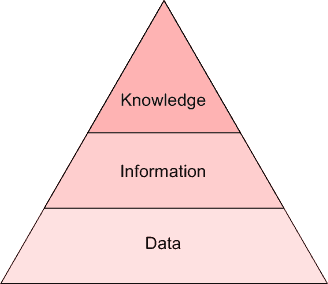
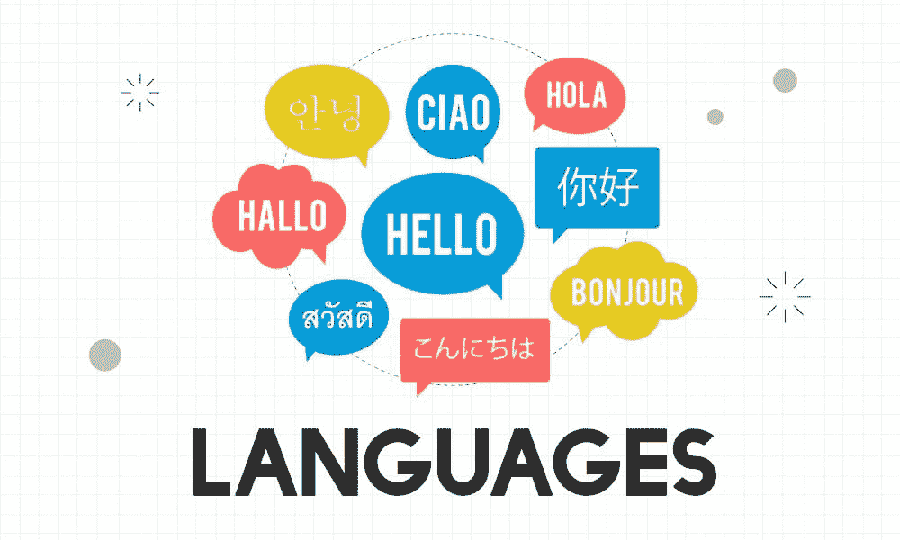
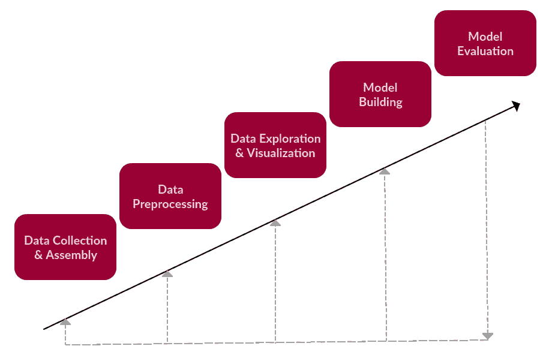
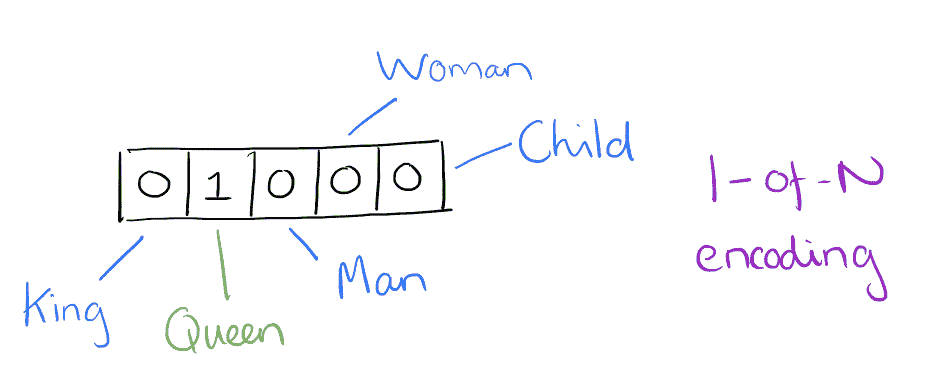

# NLP 的 ABC，从 A 到 Z

> 原文：[`www.kdnuggets.com/2022/10/abcs-nlp-a-to-z.html`](https://www.kdnuggets.com/2022/10/abcs-nlp-a-to-z.html)


图片由 [Towfiqu barbhuiya](https://unsplash.com/@towfiqu999999?utm_source=unsplash&utm_medium=referral&utm_content=creditCopyText) 提供，来源于 [Unsplash](https://unsplash.com/?utm_source=unsplash&utm_medium=referral&utm_content=creditCopyText)

现在有大量的文本数据可供使用。每天都会生成大量的文本，这些数据从完全结构化到半结构化再到完全非结构化。

* * *

## 我们的前三大课程推荐

 1\. [谷歌网络安全证书](https://www.kdnuggets.com/google-cybersecurity) - 快速进入网络安全职业生涯。

 2\. [谷歌数据分析专业证书](https://www.kdnuggets.com/google-data-analytics) - 提升你的数据分析技能

 3\. [谷歌 IT 支持专业证书](https://www.kdnuggets.com/google-itsupport) - 支持你的组织进行 IT 管理

* * *

我们能用这些文本做些什么呢？实际上，可以做很多事情；根据你的具体目标，有两个错综复杂但有所区别的任务领域可以利用这些数据。

# 自然语言处理与文本挖掘

让我们从一些定义开始。

**自然语言处理 (NLP)** 关注自然语言与计算设备之间的互动。NLP 是计算语言学的一个主要方面，也属于计算机科学和人工智能的领域。**文本挖掘** 与 NLP 在某种程度上相似，因为它也关注于识别文本数据中有趣的、非平凡的模式。

正如你从上述内容中可能能看出的，这两个概念的确切界限并不明确且达成共识，并且根据讨论这些问题的从业者和研究人员的不同程度有所重叠。我发现通过洞察的程度来区分最为容易。如果原始文本是数据，那么文本挖掘可以提取**信息**，而 NLP 提取的是*知识*（见下图的理解金字塔）。可以说是语法与语义的区别。



理解金字塔：数据，信息，知识

对于文本挖掘与 NLP 之间的精确关系，还有各种其他解释，你可以找到更适合你的解释。我们并不特别关心**确切**的定义——无论是绝对的还是相对的——而更关注的是直观地认识到这些概念是相关的，有一定重叠，但仍然有所区别。

我们将继续讨论的要点是：尽管 NLP 和文本挖掘不是同一回事，但它们密切相关，处理相同的原始数据类型，并且在使用上有一些交集。在接下来的讨论中，我们将方便地将这两个概念统称为 NLP。重要的是，这两个领域的任务在数据预处理方面有很多相似之处。

无论你要执行的 NLP 任务是什么，保持文本意义并避免歧义都是至关重要的。因此，避免歧义的尝试是文本预处理过程的重要组成部分。我们希望在消除噪声的同时保留意图表达。为此，需要做以下几点：

+   语言知识

+   世界知识

+   结合知识来源的方法

如果这很简单，我们可能就不会讨论它了。处理文本的困难有哪些原因呢？

# 为什么处理文本很困难？


来源：CS124 斯坦福大学 (https://web.stanford.edu/class/cs124/)

你可能注意到上面提到的一个有趣的点：“非标准英语。”虽然这显然不是图表的意图——我们在这里完全脱离了上下文——但出于各种原因，很多 NLP 研究历史上都发生在英语语言的范围内。因此，我们可以在“为什么处理文本很困难？”的问题上增加额外的困难层面，这些困难是非英语语言，特别是说话人数较少的语言，甚至是[濒危语言](https://en.wikipedia.org/wiki/Endangered_language)在处理和提取洞见时必须经历的。



[由 rawpixel.com 提供的图片](https://www.freepik.com/free-vector/illustration-language-concept_2825850.htm#query=language&position=0&from_view=search&track=sph) 在 Freepik 上

在思考和讨论自然语言处理（NLP）时，意识到 NLP ≠ 英语是减少这种偏见的一种小方法。

# 文本数据科学任务框架

我们能否为处理文本数据科学任务制定一个足够通用的框架？事实证明，处理文本与其他非文本处理任务非常相似，因此我们可以借鉴[KDD 过程](https://www.kdnuggets.com/2016/03/data-science-process-rediscovered.html/2)的灵感。

我们可以说这些是通用文本任务的主要步骤，这些任务属于文本挖掘或 NLP。

## **1\. 数据收集或组装**

+   获取或构建语料库，这可以是从电子邮件到整个英语维基百科文章集，到公司的财务报告，到莎士比亚的完整作品，或者完全不同的东西

## **2\. 数据预处理**

+   在原始文本语料库上执行准备任务，以便进行文本挖掘或 NLP 任务

+   数据预处理包含多个步骤，其中的任何一个步骤可能适用于或不适用于特定任务，但通常属于分词、规范化和替换这几个广泛类别

## **3\. 数据探索与可视化**

+   无论我们的数据是什么——是文本还是其他——探索和可视化数据是获取洞察的一个重要步骤

+   常见任务可能包括可视化词频和分布，生成词云，以及执行距离度量

## **4\. 模型构建**

+   这是我们主要进行文本挖掘或自然语言处理任务的地方（包括训练和测试）

+   在适用时还包括特征选择与工程

+   语言模型：有限状态机，马尔可夫模型，词义的向量空间建模

+   机器学习分类器：朴素贝叶斯，逻辑回归，决策树，支持向量机，神经网络

+   序列模型：隐马尔可夫模型，递归神经网络（RNNs），长短期记忆神经网络（LSTMs）

## **5\. 模型评估**

+   模型表现是否如预期？

+   指标会根据文本挖掘或自然语言处理任务的类型有所不同

+   即使是思考聊天机器人（一个自然语言处理任务）或生成模型：也需要某种形式的评估



一个简单的文本数据任务框架

显然，任何关注文本数据预处理的框架都必须与步骤 2\. 同义。具体来说，我们对这个步骤可能涉及的内容有以下说明：

+   对原始文本语料库执行准备任务，以便进行文本挖掘或自然语言处理任务

+   数据预处理包含多个步骤，其中的任何一个步骤可能适用于或不适用于特定任务，但通常属于分词、规范化和替换这几个广泛类别

+   更一般来说，我们感兴趣的是对某些预定的文本进行基本的分析和转换，以便得到更加有用的成果，这些成果将有助于进行后续更有意义的分析任务。这个后续任务就是我们的核心文本挖掘或自然语言处理工作。

所以，如上所述，文本预处理似乎有 3 个主要组件：

+   分词

+   规范化

+   替换

在制定预处理框架时，我们应当牢记这些高层次的概念。

# 文本预处理框架

我们将从概念上介绍这个框架，独立于工具。接下来我们将跟进这些步骤的实际实施，以查看它们在 Python 生态系统中的执行方式。

这些任务的顺序不一定是固定的，也可能会有一些迭代。

## 1\. 噪声去除

噪声去除执行了框架中的一些替代任务。噪声去除是框架中一个更具任务特定的部分，而不是后续步骤。

再次记住，我们处理的过程不是线性的，步骤并非必须按特定顺序应用。因此，噪声去除可以在之前提到的部分之前、之后或之间的某个点进行。

**语料库**（拉丁语字面意思为“主体”）指的是文本的集合。这些集合可以是单一语言的文本，也可以跨越多种语言；多语言语料库（语料库的复数形式）有许多用途。语料库也可以包括主题文本（历史的、圣经的等）。语料库通常仅用于统计语言分析和假设检验。

怎么样更具体一点？假设我们从万维网获得了一个语料库，并且它是以原始网页格式存放的。那么我们可以假设我们的文本很有可能被 HTML 或 XML 标签包裹。虽然这种处理元数据的工作可以作为文本收集或组装过程的一部分（我们文本数据任务框架的第 1 步），但这取决于数据的获取和组装方式。有时我们可以控制这些数据的收集和组装过程，因此我们的语料库可能在收集过程中已经去噪了。

但情况并非总是如此。如果你所使用的语料库是嘈杂的，你必须处理这些问题。请记住，分析任务通常被认为有 80%是数据准备！

好消息是，模式匹配可以在这里成为你的朋友，现有的软件工具也可以处理这种模式匹配任务。

+   删除文本文件的头部和尾部

+   删除 HTML、XML 等标记和元数据

+   从其他格式（如 JSON）或数据库中提取有价值的数据

+   如果你对正则表达式感到恐惧，这可能会是你最担心的文本预处理部分。

**正则表达式**，通常缩写为*regexp*或*regexp*，是一种简洁描述文本模式的可靠方法。正则表达式本身作为一个特殊的文本字符串，用于在文本选择上开发搜索模式。正则表达式可以被看作是超越**?**和*****通配符的扩展规则集。尽管学习起来常被认为令人沮丧，但正则表达式是非常强大的文本搜索工具。

正如你所想，噪声去除和数据收集与组装之间的界限是模糊的，因此某些噪声去除必须在其他预处理步骤之前进行。例如，任何从 JSON 结构中提取的文本显然需要在分词之前去除。

## 2\. 标准化

在进一步处理之前，文本需要标准化。

**规范化** 通常指一系列相关任务，旨在将所有文本置于同一水平：将所有文本转换为相同的大小写（大写或小写）、删除标点符号、扩展缩写、将数字转换为其单词等价物，等等。规范化使所有单词处于同等地位，并允许处理统一进行。

规范化文本可能意味着执行多个任务，但对于我们的框架，我们将以三个不同的步骤来处理规范化：（1）词干提取，（2）词形还原，（3）其他所有操作。

**词干提取** 是去除单词的词缀（后缀、前缀、插入词缀、环缀）以获得单词词干的过程。

`running → run` **词形还原** 与词干提取相关，但不同的是词形还原能够捕捉基于单词词形的规范形式。

例如，词干提取单词 "better" 不能返回其引文形式（词形的另一种说法）；然而，词形还原将产生以下结果：

`better → good`

应该很容易理解为什么实现一个词干提取器会比另一个任务简单。

### 其他所有操作

一个巧妙的通用方法，对吧？词干提取和词形还原是文本预处理工作的重要部分，因此需要给予应有的尊重。这不仅仅是简单的文本操作；它们依赖于对语法规则和规范的详细和细致的理解。

然而，还有许多其他步骤可以帮助将所有文本置于同等地位，其中许多涉及相对简单的替换或删除概念。然而，这些步骤对于整体过程同样重要。包括：

+   将所有字符设置为小写

+   删除数字（或将数字转换为文本表示）

+   删除标点符号（通常是标记化的一部分，但在这个阶段仍然值得记住，即使是为了确认）

+   去除空白（也通常是标记化的一部分）

+   删除默认停用词（一般英语停用词）

停用词是指在进一步处理文本之前被过滤掉的那些词，因为这些词对整体意义贡献较少，因为它们通常是语言中最常见的词。例如，“the”、“and”和“a”，虽然在特定段落中都是必需的词，但通常不会对内容理解有很大贡献。作为一个简单的例子，以下的全句在去掉停用词后依然可以读懂：

`~~The~~ quick brown fox jumps over ~~the~~ lazy dog.`

+   删除给定的（特定任务的）停用词

+   删除稀疏词（虽然不总是必要或有帮助！）

此时，应清楚文本预处理严重依赖于预构建的词典、数据库和规则。你会感到宽慰的是，当我们在下一篇文章中进行实际的 Python 文本预处理任务时，这些预构建的支持工具随时可用；不需要重新发明轮子。

## 3. 分词

**分词**通常是 NLP 过程中的早期步骤，这一步将较长的文本字符串分割成更小的片段或标记。较大的文本块可以被分词为句子，句子可以被分词为单词，等等。通常在文本经过适当分词后，会进行进一步处理。

分词也称为文本分割或词汇分析。有时**分割**用于指将较大的文本块分解成比单词更大的片段（例如段落或句子），而分词专指分解过程仅产生单词的情况。

这听起来可能是一个简单的过程，但实际上并非如此。如何在较大的文本中识别句子？你可能会马上说“句子结束的标点符号”，甚至可能会认为这样的说法毫无歧义。

当然，这个句子可以通过一些基本的分割规则轻松识别：

`The quick brown fox jumps over the lazy dog.`

那这个呢：

`Dr. Ford did not ask Col. Mustard the name of Mr. Smith's dog.`

或者这个：

`"What is all the fuss about?" asked Mr. Peters.`

这只是句子。那么单词呢？很简单，对吧？对吗？

`This full-time student isn't living in on-campus housing, and she's not wanting to visit Hawai'i.`

应当直观地理解，不仅有多种策略用于识别分隔边界，还有在达到边界时的处理方法。例如，我们可能采用一种分割策略（正确地）将单词标记之间的特定边界识别为单词*she's*中的撇号（单纯依赖空格分词的策略无法识别这一点）。但我们随后可能会在保留标点与单词一部分或完全丢弃标点之间做出选择。这些方法中的一种似乎是正确的，也没有明显问题。但请考虑英语语言中的所有其他特殊情况。

**考虑**：当我们将文本块分割成句子时，我们是否应该保留句子结束的分隔符？我们是否有兴趣记住句子的结束位置？

# 存在什么 NLP 任务？

我们已经涵盖了一些对 NLP 任务有用的文本（预）处理步骤，但任务本身呢？

这些任务类型之间没有明确的界限；然而，目前许多任务相对较为明确。一个宏观的 NLP 任务可能包括多种子任务。

我们首先概述了主要的方法，因为这些技术通常是初学者关注的重点，但了解 NLP 任务的具体类型是很有帮助的。以下是 NLP 任务的主要类别。

## 1. 文本分类任务

+   表示：词袋模型、n-gram、一热编码（稀疏矩阵）——这些方法不保留单词顺序

+   目标：预测标签、类别、情感

+   应用：过滤垃圾邮件，根据主要内容分类文档

**词袋** 是一种特定的表示模型，用于简化文本选择的内容。词袋模型省略了语法和词序，但关注于文本中词的出现次数。文本选择的最终表示是词袋 (**bag** 指的是 [多重集](https://en.wikipedia.org/wiki/Multiset) 的集合论概念，与简单集合不同)。

词袋表示的实际存储机制可能有所不同，但以下是一个使用词典的简单示例。示例文本：

`"Well, well, well," said John.`

“那里，那里，”詹姆斯说。“那里，那里。”

结果的词袋表示作为词典：

```py
 {
      'well': 3,
      'said': 2,
      'john': 1,
      'there': 4,
      'james': 1
   }
``` **n-grams** 是一种简化文本选择内容的表示模型。与无序的词袋表示不同，n-grams 建模关注于保留文本选择中连续的 *N* 项序列。

上述示例第二句的三元组 (3-gram) 模型示例如下所示：

```py
 [
      "there there said",
      "there said james",
      "said james there",
      "james there there",
   ] 
``` 在神经网络在 NLP 中广泛使用之前——我们称之为“传统”NLP——文本的向量化通常通过 **one-hot 编码** 进行（请注意，这仍然是一种有用的编码实践，尽管神经网络的使用并没有使其过时）。对于 one-hot 编码，文本中的每个词或标记对应一个向量元素。

来源：[Adrian Colyer](https://blog.acolyer.org/2016/04/21/the-amazing-power-of-word-vectors/)

例如，我们可以将上面的图像视为表示句子“The queen entered the room.”的向量的小摘录。注意只有“queen”的元素被激活，而“king”、“man”等元素没有。你可以想象，如果句子“The king was once a man, but is now a child”的 one-hot 向量在上面的同一向量元素部分中会显得多么不同。

## 2\. 词序列任务

+   表示：序列（保留词序）

+   目标：语言建模 - 预测下一个/前一个词，文本生成

+   应用：翻译、聊天机器人、序列标注（预测序列中每个词的词性标签）、命名实体识别

**语言建模** 是建立统计语言模型的过程，旨在提供自然语言的估计。对于一系列输入词，模型将为整个序列分配一个概率，这有助于估计各种可能序列的可能性。这对于生成或预测文本的 NLP 应用尤其有用。

## 3\. 文本意义任务

+   表示：单词向量，将单词映射到向量（*n*维数字向量），也称为嵌入

+   目标：我们如何表示意义？

+   应用：查找相似单词（相似向量）、句子嵌入（与单词嵌入相对）、主题建模、搜索、问答

**密集嵌入向量**也称为单词嵌入，将核心特征嵌入到大小为*d*维度的嵌入空间中。如果需要，我们可以将表示 20,000 个唯一单词所用的维度数压缩到可能的 50 或 100 维。在这种方法中，每个特征不再具有自己的维度，而是映射到一个向量中。

来源：[Adrian Colyer](https://blog.acolyer.org/2016/04/21/the-amazing-power-of-word-vectors/)

那么，这些特征究竟是什么呢？我们将其交给神经网络来确定单词之间关系的重要方面。尽管人类对这些特征的解释不可能非常精确，但上面的图像提供了对底层过程的洞察，涉及到著名的`King - Man + Woman = Queen` [例子](https://www.technologyreview.com/s/541356/king-man-woman-queen-the-marvelous-mathematics-of-computational-linguistics/)。

**命名实体识别**是尝试识别文本数据中的[命名实体](https://en.wikipedia.org/wiki/Named_entity)，并对其进行适当分类。命名实体类别包括但不限于人名、地点、组织、货币值、日期和时间、数量等，并可以根据应用（医疗、科学、商业等）包括自定义类别。你可以将命名实体视为**专有名词++**。

使用 spaCy 进行命名实体识别（文本摘自[这里](https://www.nomadicmatt.com/travel-blogs/three-days-in-new-york-city/)）

**词性标注**包括将类别标签分配给句子的分词部分。最常见的词性标注是识别单词作为名词、动词、形容词等。

词性标注

## 4\. 序列到序列任务

+   许多 NLP 任务可以被框定为这样的任务

+   示例包括机器翻译、摘要生成、简化、问答系统

+   这些系统的特点是编码器和解码器，它们互补地工作以找到文本的隐藏表示，并使用该隐藏表示

## 5\. 对话系统

+   对话系统的 2 大主要类别，根据其使用范围进行分类

+   目标导向对话系统专注于在特定、受限领域中的有用性；更精确，适用性较差

+   对话对话系统关注于在更广泛的上下文中提供帮助或娱乐；精确度较低，更具普遍性

无论是在对话系统中还是在解决 NLP 任务的基于规则和更复杂方法之间的实际差异中，注意精度与泛化能力之间的权衡；通常你会在一个领域上做出牺牲，以增加另一个领域的能力。

# NLP 任务的方法

虽然不是一成不变，但解决 NLP 任务的方法主要分为 3 个组。


使用 spaCy 的依存解析树

## 1. 基于规则的方法

基于规则的方法是最古老的 NLP 方法。你可能会问，为什么它们仍然被使用？因为它们经过验证，效果良好。应用于文本的规则可以提供很多洞见：想想通过找到哪些词是名词，哪些动词以 -ing 结尾，或者是否可以识别出一个可识别为 Python 代码的模式，你可以学到什么。[正则表达式](https://en.wikipedia.org/wiki/Regular_expression)和[上下文无关文法](https://en.wikipedia.org/wiki/Context-free_grammar)是基于规则的 NLP 方法的经典例子。

基于规则的方法：

+   倾向于关注模式匹配或解析。

+   经常可以被认为是"填空"方法。

+   精度低、召回率高，意味着它们在特定用例中表现良好，但在泛化时往往会性能下降。

## 2. "传统"机器学习

"传统"机器学习方法包括概率建模、似然最大化和线性分类器。值得注意的是，这些不是神经网络模型（见下文）。

传统机器学习方法的特点是：

+   训练数据——在这种情况下，是带有标记的语料库。

+   特征工程——词性、周围词、大小写、复数等。

+   在参数上训练模型，然后在测试数据上拟合（这在机器学习系统中是典型的）。

+   推断（将模型应用于测试数据）特点是找到最可能的词、下一个词、最佳类别等。

+   "语义槽填充"

## 3. 神经网络

这类似于"传统"机器学习，但有一些区别：

+   特征工程通常被跳过，因为网络会"学习"重要的特征（这通常是使用神经网络进行 NLP 的一个主要好处之一）。

+   相反，将原始参数（"词"——实际上是词的向量表示）流入神经网络，而不进行工程特征处理。

+   非常大的训练语料库

在 NLP 中，"历史上" 使用的特定神经网络包括递归神经网络（RNNs）和卷积神经网络（CNNs）。今天，统治一切的架构是变换器（transformer）。

## 为什么在 NLP 中使用"传统"机器学习（或基于规则）的方法？

+   对于序列标注（使用概率建模）仍然有效。

+   神经网络中的一些想法与早期方法非常相似（word2vec 在概念上类似于分布式语义方法）。

+   使用传统方法中的方法来改进神经网络方法（例如，词对齐和注意机制是相似的）

## 为什么深度学习优于“传统”机器学习？

+   在许多应用中处于 SOTA（例如，机器翻译）

+   现在这里有很多关于 NLP 的研究（大多数？）

**重要的是**，神经网络和非神经网络方法在现代 NLP 中各有用处；它们也可以一起使用或研究，以获得最大的潜在收益

## 参考文献

1.  [从语言到信息](https://web.stanford.edu/class/cs124/)，斯坦福大学

1.  [自然语言处理](https://www.coursera.org/learn/language-processing)，国家研究大学高等经济学院（Coursera）

1.  [自然语言处理的神经网络方法](https://www.morganclaypool.com/doi/abs/10.2200/S00762ED1V01Y201703HLT037)，Yoav Goldberg

1.  [自然语言处理](https://github.com/yandexdataschool/nlp_course/)，Yandex 数据学校

1.  [词向量的惊人力量](https://blog.acolyer.org/2016/04/21/the-amazing-power-of-word-vectors/)，Adrian Colyer

**[Matthew Mayo](https://www.linkedin.com/in/mattmayo13/)**（[**@mattmayo13**](https://twitter.com/mattmayo13)）是数据科学家及 KDnuggets 的主编，该网站是开创性的在线数据科学和机器学习资源。他的兴趣包括自然语言处理、算法设计与优化、无监督学习、神经网络以及机器学习的自动化方法。Matthew 拥有计算机科学硕士学位和数据挖掘研究生文凭。他可以通过 editor1 at kdnuggets[dot]com 与他联系。

### 更多相关主题

+   [用 LIME 解释 NLP 模型](https://www.kdnuggets.com/2022/01/explain-nlp-models-lime.html)

+   [过去 12 个月必读的 NLP 论文](https://www.kdnuggets.com/2023/03/must-read-nlp-papers-last-12-months.html)

+   [NLP 中不同词嵌入技术的终极指南](https://www.kdnuggets.com/2021/11/guide-word-embedding-techniques-nlp.html)

+   [现实世界中 NLP 应用的范围：一个不同的…](https://www.kdnuggets.com/2022/03/different-solution-problem-range-nlp-applications-real-world.html)

+   [机器学习的甜蜜点：NLP 和文档分析中的纯粹方法](https://www.kdnuggets.com/2022/05/machine-learning-sweet-spot-pure-approaches-nlp-document-analysis.html)

+   [oBERT: 复合稀疏化提供更快的准确模型用于 NLP](https://www.kdnuggets.com/2022/05/obert-compound-sparsification-delivers-faster-accurate-models-nlp.html)
