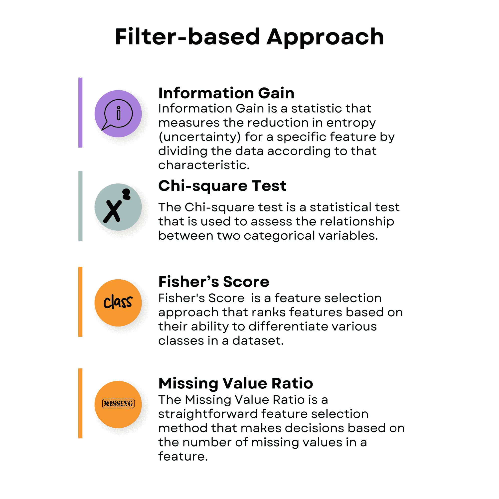
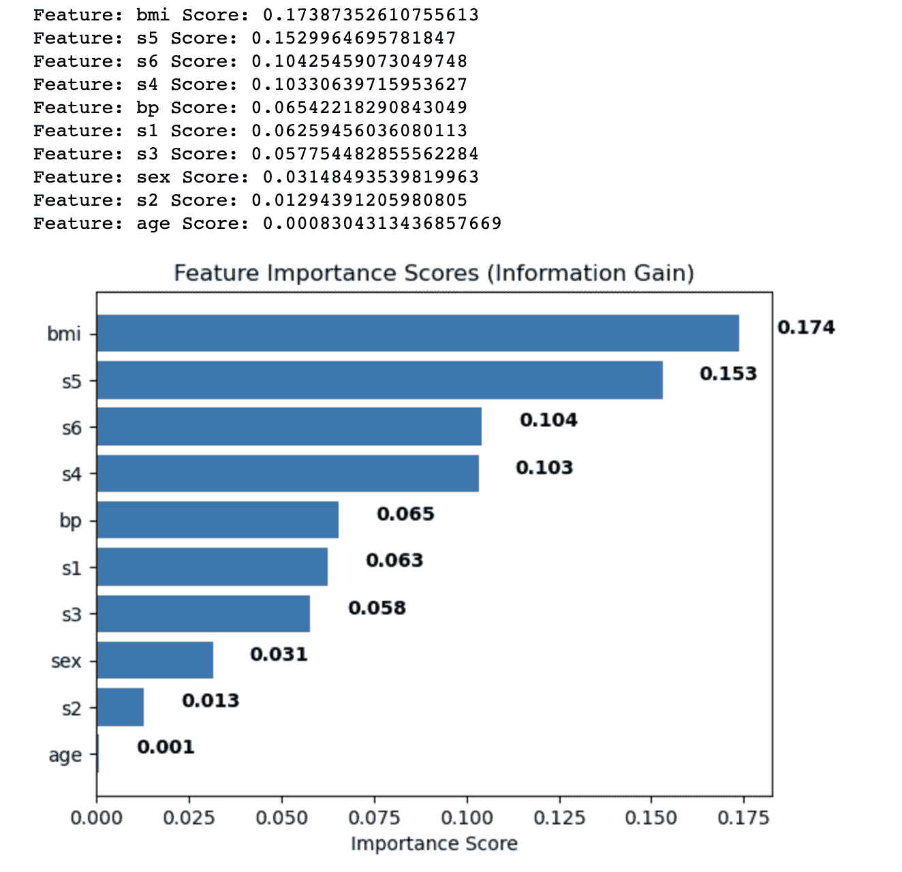
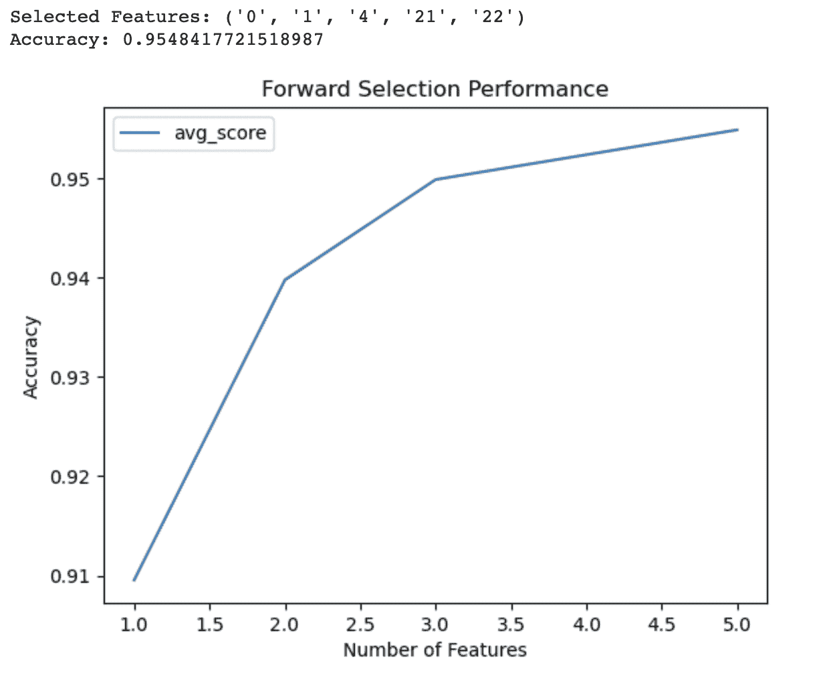
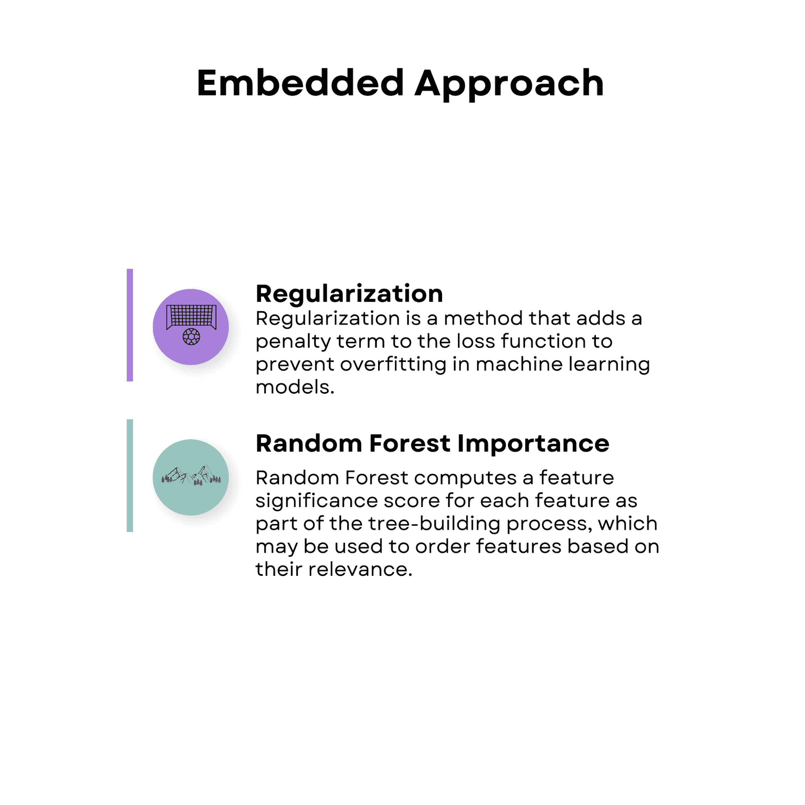
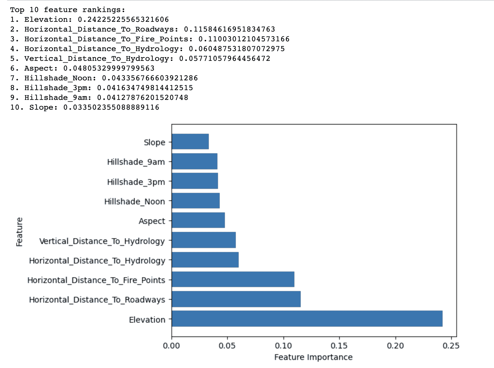
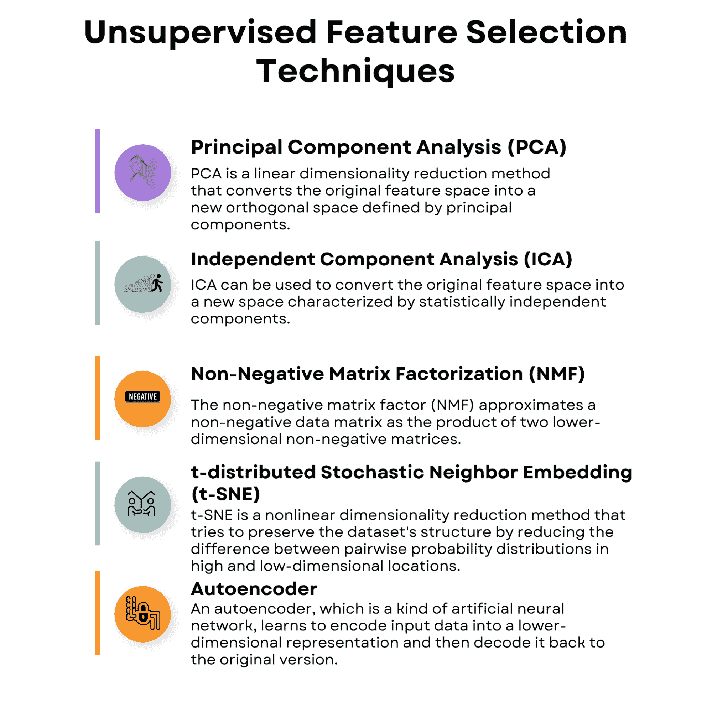
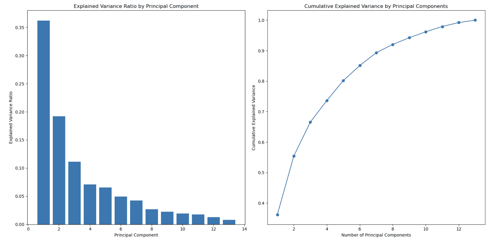

# 机器学习模型的高级特征选择技术

> 原文：[`www.kdnuggets.com/2023/06/advanced-feature-selection-techniques-machine-learning-models.html`](https://www.kdnuggets.com/2023/06/advanced-feature-selection-techniques-machine-learning-models.html)


图片来源：作者

机器学习无疑是新时代的明星。它构成了各种主要技术的基础，这些技术已经成为我们日常生活的不可或缺的一部分，如面部识别（由卷积神经网络或 CNN 支持）、语音识别（利用 CNN 和递归神经网络或 RNN）以及日益流行的聊天机器人，如 ChatGPT（由人类反馈强化学习，RLHF 驱动）。

* * *

## 我们的前三个课程推荐

 1\. [谷歌网络安全证书](https://www.kdnuggets.com/google-cybersecurity) - 快速进入网络安全职业生涯。

 2\. [谷歌数据分析专业证书](https://www.kdnuggets.com/google-data-analytics) - 提升你的数据分析能力

 3\. [谷歌 IT 支持专业证书](https://www.kdnuggets.com/google-itsupport) - 支持你的组织在 IT 方面

* * *

目前有许多方法可以提升机器学习模型的性能。这些方法能通过提供卓越的表现为你的项目带来竞争优势。

在这次讨论中，我们将深入探讨特征选择技术。但在继续之前，让我们澄清一下：什么是特征选择？

# 什么是特征选择？

特征选择是选择对你的模型最有利的特征的过程。这一过程可能因技术而异，但主要目标是找出对你的模型影响最大的特征。

# 我们为什么要进行特征选择？

因为有时候，特征过多可能会对你的机器学习模型产生负面影响。怎么回事呢？

可能有很多不同的原因。例如，这些特征可能相互关联，导致多重共线性，从而破坏模型的性能。

另一个潜在问题与计算能力有关。特征过多需要更多的计算能力来同时执行任务，这可能需要更多资源，因此增加成本。

当然，也可能还有其他原因。但这些例子应该能给你一个大致的了解。不过，在我们进一步探讨这个话题之前，还有一个重要的方面需要理解。

# 哪种特征选择方法对我的模型更好？

是的，这是个很好的问题，应该在开始项目之前得到回答。但很难给出一个通用的答案。

特征选择模型的选择依赖于你拥有的数据类型和项目的目标。

例如，像卡方检验或互信息增益这样的过滤方法通常用于分类数据的特征选择。像前向选择或后向选择这样的包裹方法适用于数值数据。

不过，值得了解的是，许多特征选择方法可以处理分类数据和数值数据。

例如，lasso 回归、决策树和随机森林都可以很好地处理这两种数据类型。

就监督特征选择和无监督特征选择而言，监督方法如递归特征消除或决策树适用于有标签的数据。无监督方法如主成分分析（PCA）或独立成分分析（ICA）用于无标签的数据。

最终，特征选择方法的选择应基于数据的具体特征和项目的目标。

查看一下我们将在文章中讨论的主题概述。熟悉它，然后让我们开始讨论监督特征选择技术。


图片由作者提供

# 1. 监督特征选择技术

监督学习中的特征选择策略旨在通过利用输入特征与目标变量之间的关系来发现最相关的特征。这些策略可能有助于提高模型性能，减少过拟合，并降低模型训练的计算成本。

这是我们将讨论的监督特征选择技术的概述。


图片由作者提供

## 1.1 基于过滤的方法

基于过滤的方法依赖于数据的固有属性，如特征相关性或统计数据。这些方法评估每个特征单独或成对的价值，而不考虑特定学习算法的表现。

基于过滤的方法计算效率高，可以与多种学习算法配合使用。然而，由于它们没有考虑特征与学习方法之间的交互，它们可能无法总是捕捉到特定算法的理想特征子集。

查看基于过滤的方法的概述，然后我们将逐一讨论每种方法。



图片由作者提供

### 信息增益

信息增益是一种统计量，通过根据特定特征对数据进行划分来测量熵（不确定性）的减少。它常用于决策树算法，并且具有有用的特征。特征的信息增益越高，它在决策中越有用。

现在，让我们通过使用预构建的糖尿病数据集来应用信息增益。

糖尿病数据集包含与预测糖尿病进展相关的生理特征。

+   age: 年龄（岁）

+   sex: 性别（1 = 男性，0 = 女性）

+   BMI: 体质指数，计算方法为体重（千克）除以身高（米）的平方

+   bp: 平均血压（mm Hg）

+   s1、s2、s3、s4、s5、s6: 六种不同血液化学物质（包括葡萄糖）的血清测量

以下代码演示了如何应用信息增益方法。此代码使用来自 sklearn 库的糖尿病数据集作为示例。

```py
import numpy as np
import matplotlib.pyplot as plt
from sklearn.datasets import load_diabetes
from sklearn.feature_selection import mutual_info_regression

# Load the diabetes dataset
data = load_diabetes()

# Split the dataset into features and target
X = data.data
y = data.target
```

这段代码的主要目标是基于信息增益计算特征重要性分数，这有助于确定对预测模型最相关的特征。通过确定这些分数，你可以对分析中应包含或排除哪些特征做出明智的决策，从而提高模型性能，减少过拟合，并加快训练时间。

为此，这段代码计算了数据集中每个特征的信息增益分数，并将其存储在字典中。

```py
import numpy as np
import matplotlib.pyplot as plt
from sklearn.datasets import load_diabetes
from sklearn.feature_selection import mutual_info_regression

# Load the diabetes dataset
data = load_diabetes()

# Split the dataset into features and target
X = data.data
y = data.target

# Apply Information Gain
ig = mutual_info_regression(X, y)

# Create a dictionary of feature importance scores
feature_scores = {}
for i in range(len(data.feature_names)):
    feature_scores[data.feature_names[i]] = ig[i] 
```

然后根据它们的分数将特征按降序排序。

```py
# Sort the features by importance score in descending order
sorted_features = sorted(feature_scores.items(), key=lambda x: x[1], reverse=True)

# Print the feature importance scores and the sorted features
for feature, score in sorted_features:
    print('Feature:', feature, 'Score:', score) 
```

我们将把排序后的特征重要性分数可视化为水平条形图，以便你能够轻松比较不同特征在给定任务中的相关性。

这种可视化在决定在构建机器学习模型时保留或丢弃哪些特征时特别有用。

```py
# Plot a horizontal bar chart of the feature importance scores
fig, ax = plt.subplots()
y_pos = np.arange(len(sorted_features))
ax.barh(y_pos, [score for feature, score in sorted_features], align="center")
ax.set_yticks(y_pos)
ax.set_yticklabels([feature for feature, score in sorted_features])
ax.invert_yaxis()  # Labels read top-to-bottom
ax.set_xlabel("Importance Score")
ax.set_title("Feature Importance Scores (Information Gain)")

# Add importance scores as labels on the horizontal bar chart
for i, v in enumerate([score for feature, score in sorted_features]):
    ax.text(v + 0.01, i, str(round(v, 3)), color="black", fontweight="bold")
plt.show() 
```

让我们看看完整的代码。

```py
import numpy as np
import matplotlib.pyplot as plt
from sklearn.datasets import load_diabetes
from sklearn.feature_selection import mutual_info_regression

# Load the diabetes dataset
data = load_diabetes()

# Split the dataset into features and target
X = data.data
y = data.target

# Apply Information Gain
ig = mutual_info_regression(X, y)

# Create a dictionary of feature importance scores
feature_scores = {}
for i in range(len(data.feature_names)):
    feature_scores[data.feature_names[i]] = ig[i]
# Sort the features by importance score in descending order
sorted_features = sorted(feature_scores.items(), key=lambda x: x[1], reverse=True)

# Print the feature importance scores and the sorted features
for feature, score in sorted_features:
    print("Feature:", feature, "Score:", score)
# Plot a horizontal bar chart of the feature importance scores
fig, ax = plt.subplots()
y_pos = np.arange(len(sorted_features))
ax.barh(y_pos, [score for feature, score in sorted_features], align="center")
ax.set_yticks(y_pos)
ax.set_yticklabels([feature for feature, score in sorted_features])
ax.invert_yaxis()  # Labels read top-to-bottom
ax.set_xlabel("Importance Score")
ax.set_title("Feature Importance Scores (Information Gain)")

# Add importance scores as labels on the horizontal bar chart
for i, v in enumerate([score for feature, score in sorted_features]):
    ax.text(v + 0.01, i, str(round(v, 3)), color="black", fontweight="bold")
plt.show() 
```

这是输出结果。



输出结果显示了使用信息增益方法计算的每个特征的重要性分数。特征按照分数的降序排列，这些分数表示它们在预测目标变量中的相对重要性。

结果如下：

+   体质指数（bmi）具有最高的重要性分数（0.174），表明它对糖尿病数据集中目标变量的影响最大。

+   血清测量 5（s5）以 0.153 的分数紧随其后，是第二重要的特征。

+   血清测量 6（s6）、血清测量 4（s4）和血压（bp）具有中等的重要性分数，范围从 0.104 到 0.065。

+   其余特征，如血清测量 1、2 和 3（s1、s2、s3）、性别和年龄的重要性分数相对较低，表明它们对模型的预测能力贡献较小。

通过分析这些特征重要性得分，你可以决定哪些特征应该包含在分析中，哪些特征应排除，以提高机器学习模型的性能。在这种情况下，你可能考虑保留重要性得分较高的特征，如 bmi 和 s5，同时可能去除或进一步调查得分较低的特征，如 age 和 s2。

### 卡方检验

卡方检验是一种统计检验，用于评估两个分类变量之间的关系。它在特征选择中用于分析分类特征与目标变量之间的关系。较大的卡方得分表明特征与目标之间的关联更强，显示该特征在分类任务中更为重要。

尽管卡方检验是一种常用的特征选择方法，但它通常用于分类数据，其中特征和目标变量是离散的。

### 费舍尔得分

费舍尔判别比率，通常称为费舍尔得分，是一种特征选择方法，根据特征区分数据集中不同类别的能力来对特征进行排名。它可以用于分类问题中的连续特征。

费舍尔得分的计算为类别间方差与类别内方差的比率。较高的费舍尔得分意味着特征更具区分性，对分类更有价值。

要使用费舍尔得分进行特征选择，计算每个连续特征的得分并根据得分对其进行排名。模型认为费舍尔得分较高的特征更重要。

### 缺失值比率

缺失值比率是一种简单的特征选择方法，它根据特征中缺失值的数量做出决策。

缺失值比例较高的特征可能无信息量，并可能影响模型的性能。通过设置接受的缺失值比率阈值，可以过滤掉缺失值过多的特征。

要使用缺失值比率进行特征选择，请按照以下步骤操作：

1.  通过将缺失值的数量除以数据集中实例的总数来计算每个特征的缺失值比率。

1.  设置一个可接受的缺失值比率阈值（例如，0.8，意味着一个特征最多允许 80%的值缺失才被考虑）。

1.  过滤掉缺失值比率高于阈值的特征。

## 1.2 基于包装的方法

基于包装的特征选择方法包括使用特定的机器学习算法评估特征的重要性。它们通过尝试各种特征组合并使用所选方法评估其性能来寻找最佳特征子集。

由于可用特征子集的数量庞大，基于包装的特征选择方法可能计算成本高，尤其是在处理高维数据集时。

然而，它们通常比基于过滤的方法表现更好，因为它们考虑了特征与学习算法之间的关系。


作者提供的图片

### 前向选择

在前向选择中，你从一个空的特征集开始，并逐步添加特征。在每一步中，你评估当前特征集和新增特征的模型性能。那些带来最佳性能提升的特征将被添加到特征集中。

该过程持续进行，直到观察到性能没有显著提升，或达到预定义的特征数量为止。

以下代码演示了前向选择的应用，这是一种基于包装的监督特征选择技术。

示例使用了来自 sklearn 库的乳腺癌数据集。乳腺癌数据集，也被称为威斯康星诊断乳腺癌（WDBC）数据集，是一个常用的预构建分类数据集。在这里，主要目标是构建用于诊断乳腺癌为恶性（癌性）或良性（非癌性）的预测模型。

为了我们模型的需要，我们将选择不同数量的特征以观察性能的变化，但首先，让我们加载库、数据集和变量。

```py
import numpy as np
import pandas as pd
from sklearn.datasets import load_breast_cancer
from sklearn.linear_model import LogisticRegression
from sklearn.model_selection import train_test_split
from mlxtend.feature_selection import SequentialFeatureSelector as SFS

# Load the breast cancer dataset
data = load_breast_cancer()

# Split the dataset into features and target
X = data.data
y = data.target
```

代码的目标是通过前向选择识别出适用于逻辑回归模型的最佳特征子集。这种技术从一个空的特征集开始，迭代地添加那些基于指定评估指标提高模型性能的特征。在这种情况下，使用的评估指标是准确性。

代码的下一部分使用 mlxtend 库中的 SequentialFeatureSelector 来执行前向选择。它配置了一个逻辑回归模型、所需的特征数量和 5 折交叉验证。前向选择对象被拟合到训练数据中，所选特征将被打印出来。

```py
import numpy as np
import pandas as pd
from sklearn.datasets import load_breast_cancer
from sklearn.linear_model import LogisticRegression
from sklearn.model_selection import train_test_split
from mlxtend.feature_selection import SequentialFeatureSelector as SFS

# Load the breast cancer dataset
data = load_breast_cancer()

# Split the dataset into features and target
X = data.data
y = data.target

# Split the dataset into training and testing sets
X_train, X_test, y_train, y_test = train_test_split(X, y, test_size=0.3, random_state=0)

# Define the logistic regression model
model = LogisticRegression()

# Define the forward selection object
sfs = SFS(model,
          k_features=5,
          forward=True,
          floating=False,
          scoring='accuracy',
          cv=5)

# Perform forward selection on the training set
sfs.fit(X_train, y_train)
```

此外，我们还需要评估所选特征在测试集上的表现，并通过折线图可视化模型在不同特征子集下的表现。

图表将展示交叉验证的准确性作为特征数量的函数，提供有关模型复杂性与预测性能之间权衡的见解。

通过分析输出和图表，你可以确定在模型中包含的最佳特征数量，从而最终提高其性能并减少过拟合。

```py
# Print the selected features
print('Selected Features:', sfs.k_feature_names_)

# Evaluate the performance of the selected features on the testing set
accuracy = sfs.k_score_
print('Accuracy:', accuracy)

# Plot the performance of the model with different feature subsets
sfs_df = pd.DataFrame.from_dict(sfs.get_metric_dict()).T
sfs_df['avg_score'] = sfs_df['avg_score'].astype(float)
fig, ax = plt.subplots()
sfs_df.plot(kind='line', y='avg_score', ax=ax)
ax.set_xlabel('Number of Features')
ax.set_ylabel('Accuracy')
ax.set_title('Forward Selection Performance')
plt.show()
```

这是完整的代码。

```py
import numpy as np
import pandas as pd
from sklearn.datasets import load_breast_cancer
from sklearn.linear_model import LogisticRegression
from sklearn.model_selection import train_test_split
from mlxtend.feature_selection import SequentialFeatureSelector as SFS

# Load the breast cancer dataset
data = load_breast_cancer()

# Split the dataset into features and target
X = data.data
y = data.target

# Split the dataset into training and testing sets
X_train, X_test, y_train, y_test = train_test_split(X, y, test_size=0.3, random_state=0)

# Define the logistic regression model
model = LogisticRegression()

# Define the forward selection object
sfs = SFS(model, k_features=5, forward=True, floating=False, scoring="accuracy", cv=5)

# Perform forward selection on the training set
sfs.fit(X_train, y_train)

# Print the selected features
print("Selected Features:", sfs.k_feature_names_)

# Evaluate the performance of the selected features on the testing set
accuracy = sfs.k_score_
print("Accuracy:", accuracy)

# Plot the performance of the model with different feature subsets
sfs_df = pd.DataFrame.from_dict(sfs.get_metric_dict()).T
sfs_df["avg_score"] = sfs_df["avg_score"].astype(float)
fig, ax = plt.subplots()
sfs_df.plot(kind="line", y="avg_score", ax=ax)
ax.set_xlabel("Number of Features")
ax.set_ylabel("Accuracy")
ax.set_title("Forward Selection Performance")
plt.show() 
```



前向选择代码的输出结果显示，该算法识别了 5 个特征的子集，这些特征在乳腺癌数据集上的逻辑回归模型中产生了最佳准确率（0.9548）。这些选定的特征通过其索引进行标识：0、1、4、21 和 22。

线形图提供了有关不同特征数量下模型性能的额外见解。它显示：

+   使用 1 个特征，模型的准确率约为 91%。

+   添加第二个特征将准确率提高至 94%。

+   使用 3 个特征，准确率进一步提高至 95%。

+   包含 4 个特征使准确率稍微超过 95%。

超过 4 个特征后，准确率的提高变得不那么显著。这些信息可以帮助你做出关于模型复杂性和预测性能之间权衡的明智决定。基于这些结果，你可能决定在模型中仅使用 3 或 4 个特征，以平衡准确性和简洁性。

### 后向选择

前向选择的对立方法是后向选择。你从整个特征集开始，并逐渐消除其中的特征。

在每个阶段，你需要测量当前特征集减去要删除的特征后的模型性能。

造成性能下降最小的特征被从特征集中删除。

该过程重复进行，直到性能没有实质性提升或达到预设的特征数量。

后向选择和前向选择被归类为顺序特征选择；你可以在[这里](https://scikit-learn.org/stable/modules/feature_selection.html#recursive-feature-elimination)了解更多信息。

### 穷尽特征选择

穷尽特征选择比较所有可能的特征子集的性能，并选择表现最好的子集。这种方法计算量大，特别是对于大数据集，但确保了最佳的特征子集。

### 递归特征消除

递归特征消除从整个特征集开始，并根据学习算法判断的相关性反复消除特征。在每一步，最不重要的特征被移除，模型被重新训练。该方法重复进行，直到达到预定数量的特征。

## 1.3 嵌入式方法

嵌入式特征选择方法将特征选择过程作为学习算法的一部分。

这意味着在训练阶段，学习算法不仅优化模型参数，还选择最重要的特征。嵌入式方法比包装方法更有效，因为它们不需要外部特征选择过程。



作者提供的图像

### 正则化

正则化是一种向损失函数添加惩罚项的方法，以防止机器学习模型中的过拟合。

正则化方法，如 lasso（L1 正则化）和 ridge（L2 正则化），可以与特征选择结合使用，以减少不重要特征的系数接近零，从而选择出最相关特征的子集。

### 随机森林重要性

随机森林是一种集成学习方法，它结合了多个决策树的预测。随机森林在构建树的过程中计算每个特征的重要性评分，这些评分可以用来根据特征的相关性进行排序。模型将具有更高重要性评分的特征视为更重要。

如果你想了解更多关于随机森林的信息，下面的文章“[决策树和随机森林算法](https://www.stratascratch.com/blog/decision-tree-and-random-forest-algorithm-explained/?utm_source=blog&utm_medium=click&utm_campaign=kdn+ml+feature+selection)”也解释了决策树算法。

以下示例使用了 Covertype 数据集，该数据集包含有关不同类型森林覆盖的信息。

Covertype 数据集的目标是预测**罗斯福国家森林**中森林覆盖类型（主导树种）。

下面代码的主要目标是使用随机森林分类器来确定特征的重要性。通过评估每个特征对整体分类性能的贡献，这种方法有助于识别构建预测模型的最相关特征。

```py
import pandas as pd
import numpy as np
from sklearn.ensemble import RandomForestClassifier
from sklearn.model_selection import train_test_split
import matplotlib.pyplot as plt

# Load the Covertype dataset
data = pd.read_csv("https://archive.ics.uci.edu/ml/machine-learning-databases/covtype/covtype.data.gz", header=None)

# Assign column names
cols = ["Elevation", "Aspect", "Slope", "Horizontal_Distance_To_Hydrology",
        "Vertical_Distance_To_Hydrology", "Horizontal_Distance_To_Roadways",
        "Hillshade_9am", "Hillshade_Noon", "Hillshade_3pm",
        "Horizontal_Distance_To_Fire_Points"] + ["Wilderness_Area_"+str(i) for i in range(1,5)] + ["Soil_Type_"+str(i) for i in range(1,41)] + ["Cover_Type"]

data.columns = cols
```

然后，我们创建一个`RandomForestClassifier`对象，并将其拟合到训练数据上。接着，它从训练好的模型中提取特征重要性，并按降序排序。前 10 个特征根据其重要性评分被选择并显示在排名中。

```py
# Split the dataset into train and test sets
X_train, X_test, y_train, y_test = train_test_split(X, y, test_size=0.3, random_state=42)

# Create a random forest classifier object
rfc = RandomForestClassifier(n_estimators=100, random_state=42)

# Fit the model to the training data
rfc.fit(X_train, y_train)

# Get feature importances from the trained model
importances = rfc.feature_importances_

# Sort the feature importances in descending order
indices = np.argsort(importances)[::-1]

# Select the top 10 features
num_features = 10
top_indices = indices[:num_features]
top_importances = importances[top_indices]

# Print the top 10 feature rankings
print("Top 10 feature rankings:")
for f in range(num_features):  # Use num_features instead of 10
    print(f"{f+1}. {X_train.columns[indices[f]]}: {importances[indices[f]]}")
```

此外，代码通过水平条形图可视化了前 10 个特征的重要性。

```py
# Plot the top 10 feature importances in a horizontal bar chart
plt.barh(range(num_features), top_importances, align='center')
plt.yticks(range(num_features), X_train.columns[top_indices])
plt.xlabel("Feature Importance")
plt.ylabel("Feature")
plt.show()
```

该可视化允许轻松比较重要性评分，并有助于在决定包含或排除哪些特征时做出明智的选择。

通过检查输出和图表，你可以选择最相关的特征用于你的预测模型，这有助于提高模型性能，减少过拟合，并加快训练时间。

这是完整代码。

```py
import pandas as pd
import numpy as np
from sklearn.ensemble import RandomForestClassifier
from sklearn.model_selection import train_test_split
import matplotlib.pyplot as plt

# Load the Covertype dataset
data = pd.read_csv(
    "https://archive.ics.uci.edu/ml/machine-learning-databases/covtype/covtype.data.gz",
    header=None,
)

# Assign column names
cols = (
    [
        "Elevation",
        "Aspect",
        "Slope",
        "Horizontal_Distance_To_Hydrology",
        "Vertical_Distance_To_Hydrology",
        "Horizontal_Distance_To_Roadways",
        "Hillshade_9am",
        "Hillshade_Noon",
        "Hillshade_3pm",
        "Horizontal_Distance_To_Fire_Points",
    ]
    + ["Wilderness_Area_" + str(i) for i in range(1, 5)]
    + ["Soil_Type_" + str(i) for i in range(1, 41)]
    + ["Cover_Type"]
)

data.columns = cols

# Split the dataset into features and target
X = data.iloc[:, :-1]
y = data.iloc[:, -1]

# Split the dataset into train and test sets
X_train, X_test, y_train, y_test = train_test_split(
    X, y, test_size=0.3, random_state=42
)

# Create a random forest classifier object
rfc = RandomForestClassifier(n_estimators=100, random_state=42)

# Fit the model to the training data
rfc.fit(X_train, y_train)

# Get feature importances from the trained model
importances = rfc.feature_importances_

# Sort the feature importances in descending order
indices = np.argsort(importances)[::-1]

# Select the top 10 features
num_features = 10
top_indices = indices[:num_features]
top_importances = importances[top_indices]

# Print the top 10 feature rankings
print("Top 10 feature rankings:")
for f in range(num_features):  # Use num_features instead of 10
    print(f"{f+1}. {X_train.columns[indices[f]]}: {importances[indices[f]]}")
# Plot the top 10 feature importances in a horizontal bar chart
plt.barh(range(num_features), top_importances, align="center")
plt.yticks(range(num_features), X_train.columns[top_indices])
plt.xlabel("Feature Importance")
plt.ylabel("Feature")
plt.show() 
```

这是输出结果。



随机森林重要性方法的输出显示了根据其在预测森林覆盖类型中的重要性排名的前 10 个特征。

它揭示了**海拔**在所有特征中具有最高的重要性评分（0.2423），在预测森林覆盖类型中作用最大。这表明海拔在确定**罗斯福国家森林**中的主导树种方面起着关键作用。

其他具有较高重要性分数的特征包括 Horizontal_Distance_To_Roadways（0.1158）和 Horizontal_Distance_To_Fire_Points（0.1100）。这些特征表明，靠近道路和火点也显著影响森林覆盖类型。

排名前 10 的特征中，其余特征的重要性分数相对较低，但它们仍然对模型的整体预测性能有所贡献。这些特征主要与水文因素、坡度、方位和山阴影指数相关。

总结来说，结果突出了影响罗斯福国家森林区森林覆盖类型分布的最重要因素，这些因素可以用于构建更有效、更高效的森林覆盖类型分类预测模型。

# 2\. 无监督特征选择技术

当没有目标变量可用时，可以使用无监督特征选择方法来降低数据集的维度，同时保持其基本结构。这些方法通常包括将初始特征空间转换为一个新的低维空间，其中变化后的特征捕捉数据中的大部分变异。



图片由作者提供

## 2.1 主成分分析（PCA）

PCA 是一种线性降维方法，将原始特征空间转换为由主成分定义的新正交空间。这些组件是原始特征的线性组合，旨在捕捉数据中的最高方差。

PCA 可用于选择代表大部分变异的前 k 个主成分，从而降低数据集的维度。

为了向您展示这如何在实践中运作，我们将使用葡萄酒数据集。这是一个广泛用于分类和特征选择任务的机器学习数据集，包含 178 个样本，每个样本代表来自意大利同一地区三种不同品种的不同葡萄酒。

使用葡萄酒数据集的目标通常是构建一个预测模型，该模型可以根据化学属性将葡萄酒样本准确地分类为三种品种之一。

以下代码演示了无监督特征选择技术主成分分析（PCA）在葡萄酒数据集上的应用。

这些组件（主成分）捕捉数据中最多的方差，同时最小化信息损失。

代码首先加载葡萄酒数据集，该数据集包含描述不同葡萄酒样本化学性质的 13 个特征。

```py
import numpy as np
import pandas as pd
import matplotlib.pyplot as plt
from sklearn.datasets import load_wine
from sklearn.decomposition import PCA
from sklearn.preprocessing import StandardScaler

# Load the Wine dataset
wine = load_wine()
X = wine.data
y = wine.target
feature_names = wine.feature_names
```

然后使用 StandardScaler 对这些特征进行标准化，以确保 PCA 不会受到输入特征尺度变化的影响。

```py
# Standardize the features
scaler = StandardScaler()
X_scaled = scaler.fit_transform(X)
```

接下来，使用 sklearn.decomposition 模块中的 PCA 类对标准化数据进行 PCA。

```py
# Perform PCA
pca = PCA()
X_pca = pca.fit_transform(X_scaled)
```

每个主成分的解释方差比例都被计算出来，表示每个主成分解释的数据总方差的比例。

```py
# Calculate the explained variance ratio
explained_variance_ratio = pca.explained_variance_ratio_
```

最后，生成两个图来可视化主成分的解释方差比例和累计解释方差。

第一个图展示了每个单独主成分的解释方差比例，而第二个图则说明了随着更多主成分的加入，累计解释方差是如何增加的。

这些图帮助确定模型中使用的主成分的最佳数量，在维度减少和信息保留之间取得平衡。

```py
# Create a 2x1 grid of subplots
fig, (ax1, ax2) = plt.subplots(nrows=1, ncols=2, figsize=(16, 8))

# Plot the explained variance ratio in the first subplot
ax1.bar(range(1, len(explained_variance_ratio) + 1), explained_variance_ratio)
ax1.set_xlabel('Principal Component')
ax1.set_ylabel('Explained Variance Ratio')
ax1.set_title('Explained Variance Ratio by Principal Component')

# Calculate the cumulative explained variance
cumulative_explained_variance = np.cumsum(explained_variance_ratio)

# Plot the cumulative explained variance in the second subplot
ax2.plot(range(1, len(cumulative_explained_variance) + 1), cumulative_explained_variance, marker='o')
ax2.set_xlabel('Number of Principal Components')
ax2.set_ylabel('Cumulative Explained Variance')
ax2.set_title('Cumulative Explained Variance by Principal Components')

# Display the figure
plt.tight_layout()
plt.show() 
```

让我们看看完整的代码。

```py
import numpy as np
import pandas as pd
import matplotlib.pyplot as plt
from sklearn.datasets import load_wine
from sklearn.decomposition import PCA
from sklearn.preprocessing import StandardScaler

# Load the Wine dataset
wine = load_wine()
X = wine.data
y = wine.target
feature_names = wine.feature_names

# Standardize the features
scaler = StandardScaler()
X_scaled = scaler.fit_transform(X)

# Perform PCA
pca = PCA()
X_pca = pca.fit_transform(X_scaled)

# Calculate the explained variance ratio
explained_variance_ratio = pca.explained_variance_ratio_

# Create a 2x1 grid of subplots
fig, (ax1, ax2) = plt.subplots(nrows=1, ncols=2, figsize=(16, 8))

# Plot the explained variance ratio in the first subplot
ax1.bar(range(1, len(explained_variance_ratio) + 1), explained_variance_ratio)
ax1.set_xlabel("Principal Component")
ax1.set_ylabel("Explained Variance Ratio")
ax1.set_title("Explained Variance Ratio by Principal Component")

# Calculate the cumulative explained variance
cumulative_explained_variance = np.cumsum(explained_variance_ratio)

# Plot the cumulative explained variance in the second subplot
ax2.plot(
    range(1, len(cumulative_explained_variance) + 1),
    cumulative_explained_variance,
    marker="o",
)
ax2.set_xlabel("Number of Principal Components")
ax2.set_ylabel("Cumulative Explained Variance")
ax2.set_title("Cumulative Explained Variance by Principal Components")

# Display the figure
plt.tight_layout()
plt.show() 
```

这是输出结果。



左侧图表显示解释方差比例随着主成分数量的增加而减少。这是 PCA 中观察到的典型行为，因为主成分是按解释方差的多少排序的。

第一个主成分（特征）捕捉到最高的方差，第二个主成分捕捉到第二高的方差，依此类推。因此，解释方差比例随着每个后续主成分的增加而减少。

这是 PCA 用于维度减少的主要原因之一。

右侧的第二张图展示了累计解释方差，并帮助你确定选择多少主成分（特征）来表示数据的百分比。x 轴表示主成分的数量，y 轴显示累计解释方差。当你沿 x 轴移动时，可以看到在包含这么多主成分时保留了多少总方差。

在这个例子中，你可以看到选择大约 3 或 4 个主成分已经捕捉了超过 80%的总方差，而大约 8 个主成分捕捉了超过 90%的总方差。

你可以根据希望在维度减少和保留方差之间的权衡选择主成分的数量。

在这个例子中，我们确实使用了 Sci-kit 来学习应用 PCA，官方文档可以在这里找到。

## 2.2 独立成分分析（ICA）

ICA 是一种将多维信号分解为其成分的方法。

在特征选择的背景下，ICA 可以用来将原始特征空间转换为一个由统计独立成分组成的新空间。通过选择前 k 个独立成分，你可以在保持底层结构的同时减少数据集的维度。

## 2.3 非负矩阵分解（NMF）

非负矩阵分解（NMF）是一种维度减少方法，通过将一个非负数据矩阵近似为两个低维非负矩阵的乘积来实现。

NMF 可用于特征选择的背景下，提取一组新的基本特征，以捕捉原始数据的重要结构。通过选择前 k 个基础特征，你可以在保持非负性限制的同时最小化数据集的维度。

## 2.4 t-分布随机邻域嵌入（t-SNE）

t-SNE 是一种非线性降维方法，它试图通过减少高维和低维位置之间的配对概率分布差异来保持数据集的结构。

t-SNE 可以应用于特征选择，将原始特征空间投影到一个低维空间中，从而保持数据的结构，允许更好的可视化和评估。

你可以在这里找到更多关于无监督算法和 t-SNE 的信息 “[无监督学习算法](https://www.stratascratch.com/blog/overview-of-machine-learning-algorithms-unsupervised-learning/?utm_source=blog&utm_medium=click&utm_campaign=kdn+ml+feature+selection)”。

## 2.5 自编码器

自编码器是一种人工神经网络，它学习将输入数据编码成低维表示，然后再将其解码回原始版本。自编码器的低维表示可以用来生成另一组特征，以捕捉原始数据的潜在结构。

# 结束语

总结来说，特征选择在机器学习中至关重要。它有助于减少数据的维度，最小化过拟合的风险，并提高模型的整体性能。选择合适的特征选择方法取决于具体的问题、数据集和建模要求。

本文涵盖了广泛的特征选择技术，包括监督和无监督方法。

监督技术，如基于滤波器、基于包装和嵌入的方法，利用特征与目标变量之间的关系来识别最重要的特征。

无监督技术，如 PCA、ICA、NMF、t-SNE 和自编码器，专注于数据的内在结构，以在不考虑目标变量的情况下降低维度。

在为你的模型选择合适的特征选择方法时，考虑数据的特征、每种技术的基本假设和涉及的计算复杂性是至关重要的。

通过仔细选择和应用正确的特征选择技术，你可以显著提升性能，从而获得更好的洞察力和决策能力。

**[内特·罗西迪](https://www.stratascratch.com)** 是一名数据科学家，专注于产品策略。他还是一位副教授，教授分析学，并且是 [StrataScratch](https://www.stratascratch.com/) 的创始人，这个平台帮助数据科学家准备面试，提供来自顶级公司的真实面试问题。可以在 [Twitter: StrataScratch](https://twitter.com/StrataScratch) 或 [LinkedIn](https://www.linkedin.com/in/nathanrosidi/) 上联系他。

### 了解更多主题

+   [机器学习中的替代特征选择方法](https://www.kdnuggets.com/2021/12/alternative-feature-selection-methods-machine-learning.html)

+   [特征选择：科学与艺术的结合](https://www.kdnuggets.com/2021/12/feature-selection-science-meets-art.html)

+   [特征商店峰会 2022：关于特征工程的免费会议](https://www.kdnuggets.com/2022/10/hopsworks-feature-store-summit-2022-free-conference-feature-engineering.html)

+   [学习高级 SQL 技巧的 5 个免费资源](https://www.kdnuggets.com/top-5-free-resources-for-learning-advanced-sql-techniques)

+   [10 种高级 Git 技巧](https://www.kdnuggets.com/10-advanced-git-techniques)

+   [3 种研究驱动的高级提示技术以提高 LLM 效率…](https://www.kdnuggets.com/3-research-driven-advanced-prompting-techniques-for-llm-efficiency-and-speed-optimization)
