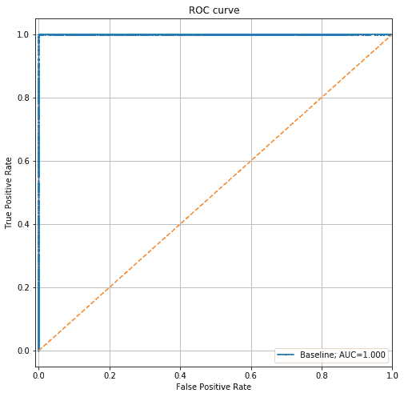
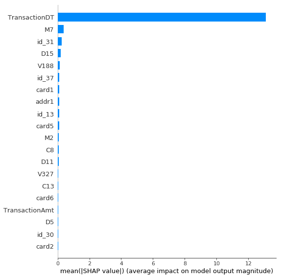
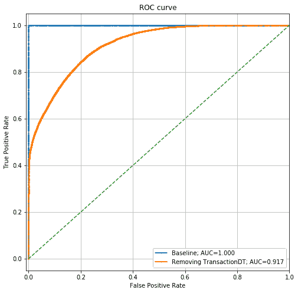
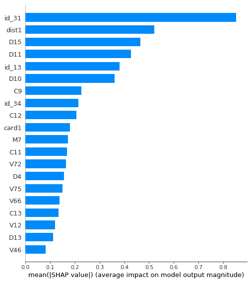
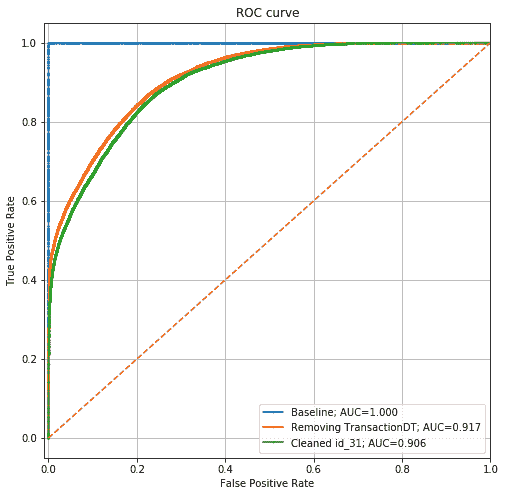

# 对抗性验证概述

> 原文：[`www.kdnuggets.com/2020/02/adversarial-validation-overview.html`](https://www.kdnuggets.com/2020/02/adversarial-validation-overview.html)

评论

如果你研究一些 Kaggle 上的竞赛获胜解决方案，你可能会注意到对“对抗性验证”的引用（[例如这个](https://www.kaggle.com/c/ieee-fraud-detection/discussion/111284)）。这是什么？

简而言之，我们构建一个分类器来尝试预测哪些数据行来自训练集，哪些来自测试集。如果这两个数据集来自相同的分布，那么这应该是不可能的。但是，如果训练集和测试集的特征值存在系统性的差异，那么分类器将能够成功地学会区分它们。你越能训练出一个更好的模型来区分它们，你面临的问题就越大。

不过好消息是*你可以分析学习到的模型来帮助你诊断问题*。一旦你理解了问题，你就可以开始解决它。

本文旨在配合我制作的[YouTube 视频](https://youtu.be/7cUCDRaIZ7I)来解释对抗性验证的直觉。这个博客帖子逐步讲解了这个视频中展示的示例的代码实现，但足够完整，可以自成一体。你可以在[GitHub](https://github.com/zjost/blog_code/tree/master/adversarial_validation)上找到这篇文章的完整代码。

### 学习对抗性验证模型

首先，一些基本的导入语句以避免混淆：

```py
import pandas as pd
from catboost import Pool, CatBoostClassifier

```

### 数据准备

对于本教程，我们将使用来自 Kaggle 的[IEEE-CIS 信用卡欺诈检测数据集](https://www.kaggle.com/c/ieee-fraud-detection/data)。首先，我假设你已经将训练数据和测试数据加载到 pandas DataFrames 中，并分别命名为*df_train*和*df_test*。然后，我们将通过替换缺失值来进行一些基本的清理。

```py
# Replace missing categoricals with ""
df_train.loc[:,cat_cols] = df_train[cat_cols].fillna('')
df_test.loc[:,cat_cols] = df_test[cat_cols].fillna('')

# Replace missing numeric with -999
df_train = df_train.fillna(-999)
df_test = df_test.fillna(-999)

```

对于对抗性验证，我们希望学习一个模型，预测哪些行在训练数据集中，哪些行在测试集中。因此，我们创建一个新的目标列，其中测试样本标记为 1，训练样本标记为 0，如下所示：

```py
df_train['dataset_label'] = 0
df_test['dataset_label'] = 1
target = 'dataset_label'

```

这是我们将训练一个模型来预测的目标。现在，训练集和测试集是分开的，每个数据集只有一个目标值的标签。如果我们在*这个*训练集上训练一个模型，它只会学到一切都是 0。我们希望将训练集和测试集进行洗牌，然后创建新的数据集来拟合和评估对抗性验证模型。我定义了一个用于合并、洗牌和重新拆分的函数：

```py
def create_adversarial_data(df_train, df_test, cols, N_val=50000):
    df_master = pd.concat([df_train[cols], df_test[cols]], axis=0)
    adversarial_val = df_master.sample(N_val, replace=False)
    adversarial_train = df_master[~df_master.index.isin(adversarial_val.index)]
    return adversarial_train, adversarial_val

features = cat_cols + numeric_cols + ['TransactionDT']
all_cols = features + [target]
adversarial_train, adversarial_test = create_adversarial_data(df_train, df_test, all_cols)

```

新的数据集，*adversarial_train* 和 *adversarial_test*，包括了原始训练集和测试集的混合，并且目标指示了原始数据集。*注意：我将* TransactionDT *添加到了特征列表中。这一点的原因将在之后变得明显。*

对于建模，我将使用 Catboost。我通过将 DataFrames 放入 Catboost Pool 对象中来完成数据准备。

```py
train_data = Pool(
    data=adversarial_train[features],
    label=adversarial_train[target],
    cat_features=cat_cols
)
holdout_data = Pool(
    data=adversarial_test[features],
    label=adversarial_test[target],
    cat_features=cat_cols
)

```

### 建模

这一部分很简单：我们只需实例化一个 Catboost 分类器，并在我们的数据上进行训练：

```py
params = {
    'iterations': 100,
    'eval_metric': 'AUC',
    'od_type': 'Iter',
    'od_wait': 50,
}

model = CatBoostClassifier(**params)
_ = model.fit(train_data, eval_set=holdout_data)

```

让我们继续绘制持出数据集的 ROC 曲线：



这是一个完美的模型，这意味着可以明确区分任何给定记录是否在训练集或测试集中。这违反了我们训练集和测试集是同分布的假设。

### 诊断问题并进行迭代

要了解模型是如何做到这一点的，我们来看看最重要的特征：



TransactionDT 仍然是最重要的特征。这完全可以理解，因为原始训练集和测试集来自不同的时间段（测试集发生在训练集的未来）。模型刚刚学会了如果 TransactionDT 大于最后一个训练样本，它就属于测试集。

我包括了 TransactionDT 只是为了说明这一点——通常不建议将原始日期作为模型特征。然而，这一技术以如此戏剧性的方式发现了这一点，这确实是好消息。这项分析显然将帮助你识别这样的错误。

让我们去掉 TransactionDT，再次运行此分析。

```py
params2 = dict(params)
params2.update({"ignored_features": ['TransactionDT']})
model2 = CatBoostClassifier(**params2)
_ = model2.fit(train_data, eval_set=holdout_data)

```

现在 ROC 曲线如下所示：



这仍然是一个相当强的模型，AUC > 0.91，但比之前要弱得多。让我们看看这个模型的特征重要性：



现在，*id_31*是最重要的特征。让我们查看一些值来了解它是什么。

```py
[
    '', 'samsung browser 6.2', 'mobile safari 11.0',
    'chrome 62.0', 'chrome 62.0 for android', 'edge 15.0',
    'mobile safari generic', 'chrome 49.0', 'chrome 61.0', 'edge 16.0'
]

```

本栏目包含软件版本号。显然，这在概念上类似于包含原始日期，因为特定软件版本的第一次出现将对应其发布日期。

让我们通过从列中删除任何非字母字符来绕过这个问题：

```py
def remove_numbers(df_train, df_test, feature):
    df_train.loc[:, feature] = df_train[feature].str.replace(r'[^A-Za-z]', '', regex=True)
    df_test.loc[:, feature] = df_test[feature].str.replace(r'[^A-Za-z]', '', regex=True)

remove_numbers(df_train, df_test, 'id_31')

```

现在我们栏目的值如下所示：

```py
[
    'UNK', 'samsungbrowser', 'mobilesafari',
    'chrome', 'chromeforandroid', 'edge',
    'mobilesafarigeneric', 'safarigeneric',
]

```

让我们使用这个清理过的列训练一个新的对抗验证模型：

```py
adversarial_train_scrub, adversarial_test_scrub = create_adversarial_data(
    df_train,
    df_test,
    all_cols,
)

train_data_scrub = Pool(
    data=adversarial_train_scrub[features],
    label=adversarial_train_scrub[target],
    cat_features=cat_colsc
)

holdout_data_scrub = Pool(
    data=adversarial_test_scrub[features],
    label=adversarial_test_scrub[target],
    cat_features=cat_colsc
)

model_scrub = CatBoostClassifier(**params2)
_ = model_scrub.fit(train_data_scrub, eval_set=holdout_data_scrub)

```

现在 ROC 图如下所示：



性能从 0.917 的 AUC 下降到 0.906。这意味着我们让模型区分训练集和测试集的难度稍微增加了一点，但它仍然相当有能力。

### 结论

当我们天真地将交易日期投入特征集时，对抗验证过程帮助我们清楚地诊断了问题。额外的迭代给了我们更多线索，表明包含软件版本信息的列在训练集和测试集之间存在明显差异。

但这个过程无法告诉我们*如何修复它*。我们仍然需要发挥创造力。在这个例子中，我们简单地从软件版本信息中移除了所有数字，但这丢弃了潜在有用的信息，并可能*最终损害我们的欺诈建模任务*，这才是我们的真正目标。其想法是*你需要移除对预测欺诈不重要但对分离训练和测试集重要的信息*。

一个更好的方法可能是找到一个数据集，提供每个软件版本的发布日期，然后创建一个“自发布以来的天数”列，替代原始版本号。这可能更适合训练和测试分布，同时保持软件版本信息所包含的预测能力。

**相关：**

+   [对抗性验证解释](https://www.kdnuggets.com/2016/10/adversarial-validation-explained.html)

+   [可重复性、复制性与数据科学](https://www.kdnuggets.com/2019/11/reproducibility-replicability-data-science.html)

+   [小心！过度查看模型结果可能导致信息泄漏](https://www.kdnuggets.com/2019/05/careful-looking-model-results-cause-information-leakage.html)

* * *

## 我们的三大课程推荐

 1\. [Google 网络安全证书](https://www.kdnuggets.com/google-cybersecurity) - 快速进入网络安全职业生涯。

 2\. [Google 数据分析专业证书](https://www.kdnuggets.com/google-data-analytics) - 提升你的数据分析能力

 3\. [Google IT 支持专业证书](https://www.kdnuggets.com/google-itsupport) - 支持你的组织 IT

* * *

### 更多相关话题

+   [什么是对抗性机器学习？](https://www.kdnuggets.com/2022/03/adversarial-machine-learning.html)

+   [为何使用 k 折交叉验证？](https://www.kdnuggets.com/2022/07/kfold-cross-validation.html)

+   [使用 Pandera 对 PySpark 应用程序进行数据验证](https://www.kdnuggets.com/2023/08/data-validation-pyspark-applications-pandera.html)

+   [Pydantic 教程：简化 Python 数据验证](https://www.kdnuggets.com/pydantic-tutorial-data-validation-in-python-made-simple)

+   [MarshMallow：最甜蜜的 Python 数据序列化和验证库](https://www.kdnuggets.com/marshmallow-the-sweetest-python-library-for-data-serialization-and-validation)

+   [文本摘要方法概述](https://www.kdnuggets.com/2019/01/approaches-text-summarization-overview.html)
