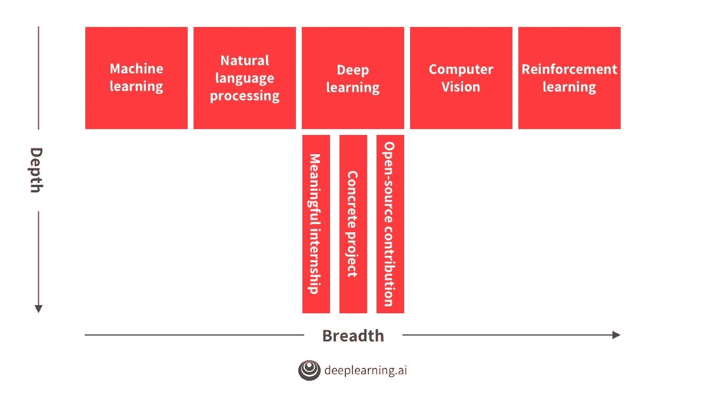

# Prof. Andrew Ng 关于构建机器学习职业和阅读研究论文的建议

> 原文：[`www.kdnuggets.com/2019/09/advice-building-machine-learning-career-research-papers-andrew-ng.html`](https://www.kdnuggets.com/2019/09/advice-building-machine-learning-career-research-papers-andrew-ng.html)

评论

**作者：[穆罕默德·阿里·哈比布](https://www.linkedin.com/in/mohamed-ali-habib/)，计算机科学毕业生**

### 介绍：

* * *

## 我们的前三大课程推荐

 1\. [谷歌网络安全证书](https://www.kdnuggets.com/google-cybersecurity) - 快速进入网络安全职业轨道。

 2\. [谷歌数据分析专业证书](https://www.kdnuggets.com/google-data-analytics) - 提升你的数据分析技能

 3\. [谷歌 IT 支持专业证书](https://www.kdnuggets.com/google-itsupport) - 支持你所在组织的 IT 工作

* * *

由于你正在阅读这篇博客，你可能已经知道 *Andrew Ng* 是该领域的先驱之一，也许你对他如何在机器学习领域建立职业的建议感兴趣。

本博客总结了斯坦福大学在 YouTube 上发布的 CS230 深度学习课程中的 [职业建议/阅读研究论文](https://www.youtube.com/watch?v=733m6qBH-jI&list=PLoROMvodv4rOABXSygHTsbvUz4G_YQhOb&index=9&t=0s) 讲座。

我建议观看讲座以获取更多细节，它非常有信息量。然而，无论你是否观看，我认为这些建议对你都会有所帮助。因此，我尝试在这里概述这些推荐。

**简而言之：** 跳到关键要点部分。

*Andrew* 提出了两个主要建议，具体如下：

1.  **阅读研究论文：** 他用来掌握深度学习新主题的高效技巧。

1.  **在机器学习领域发展职业的建议。**

### **阅读研究论文：**

如何通过阅读研究论文高效且相对快速地学习。因此，无论你是希望学习如何构建一个感兴趣的机器学习系统/项目，还是仅仅希望跟上最新动态，获取更多知识，并在深度学习领域不断进步，你应该如何做。

以下是清单：

1.  **编制文献清单：** 尝试创建一份研究论文、[medium](https://medium.com/)文章及其他任何文本或学习资源的清单。

1.  **跳跃式阅读列表**：基本上，你应该以并行的方式阅读研究论文；也就是说，尽量同时处理多篇论文。具体来说，尝试快速浏览和理解这些论文中的每一篇，不必全部阅读，也许你可以阅读每篇论文的 10–20%，这可能足以让你对论文有一个高层次的理解。之后，你可以决定淘汰一些论文，或者只挑选一两篇论文进行深入阅读。

他还提到，如果你阅读：

**5–20 篇论文**（在一个选择的领域，比如语音识别）=> 这可能足够让你实现一个语音识别系统，但可能不足以进行研究或保持在前沿。

**50–100 篇论文** => 你可能对领域应用（语音识别）有很好的理解。

### **你如何阅读一篇论文？**

不要从第一字读到最后字。相反，**对论文进行多次阅读**，以下是如何操作：

1.  **阅读标题、摘要和图表：** 通过阅读标题、摘要、关键网络架构图表和可能的实验部分，你将能够对论文中的概念有一个大致的了解。在深度学习中，许多研究论文通过一两个图表总结了整篇论文的内容，而无需深入阅读文本。

1.  **阅读引言 + 结论 + 图表 + 略读其余部分：** 引言、结论和摘要是作者尝试仔细总结他们工作的地方，以向审稿人阐明为什么他们的论文应该被接受发表。

    同时，略读相关工作部分（如果可能），这个部分旨在突出其他作者做的工作，这些工作与作者的研究有所关联。因此，这部分可能有用，但如果你对文献不熟悉，有时很难理解。

1.  **阅读论文但跳过数学部分。**

1.  **阅读整篇论文，但跳过没有意义的部分：** 伟大的研究意味着我们在知识和理解的边界上发布内容。

    他还解释说，当你阅读论文时（即使是最有影响力的论文），你可能会发现有些部分用得很少或没有意义。因此，如果你阅读一篇论文时有些内容没有意义（这并不罕见），最初可以略读。如果你想精通它，就需要花更多时间。

当你阅读论文时，尝试回答以下问题：

1.  **作者尝试完成什么？**

1.  **该方法的关键要素是什么？**

1.  **你自己可以使用什么？**

1.  **你想跟随哪些其他参考文献？**

如果你能回答这些问题，希望这能反映出你对论文有很好的理解。

结果是，随着你阅读的论文越来越多，练习后你会变得更快。因为很多作者在写论文时使用了常见的格式。

例如，这是作者用来描述网络架构的常见格式，特别是在计算机视觉领域：

***参考资料：***[* 密集连接卷积网络。*](https://arxiv.org/abs/1608.06993)

### **理解一篇论文需要多长时间？**

对于相对较新的机器学习人员来说，理解一篇相对简单的论文可能需要一个小时。然而，有时你可能会遇到需要 3 小时甚至更长时间才能真正理解的论文。

### **论文来源：**

网上有很多优秀的资源。例如，列出语音识别中最重要论文的博客文章，如果你是这个领域的新手，将会非常有用。

很多人试图跟上深度学习的最新进展，因为它发展迅速。因此，你应该访问以下资源：

1.  [**推特：**](https://twitter.com/) 令人惊讶的是，推特正成为研究人员发现新事物的重要平台。

1.  [**ML subreddit**](https://www.reddit.com/r/MachineLearning/)。

1.  重要的机器学习会议： [NeurIPS](https://nips.cc/)/[ICML](https://icml.cc/)/[ICLR](https://iclr.cc/)。

1.  朋友：找到一个对该领域感兴趣的社区或朋友小组，分享有趣的研究论文。

### **更深入理解论文中的数学内容：**

尝试从头重新推导它。虽然这需要一些时间，但这是非常好的练习。

### **练习编程：**

1.  下载开源代码（如果可以找到的话）并运行它。

1.  从头开始重新实现：如果你能做到这一点，那是你真正理解了手头算法的强有力信号。

### **持续进步：**

保持学习和进步最重要的是要持续学习，而不是进行集中式的活动。与其在短时间内突击学习所有内容，不如在接下来的一年里每周阅读两篇论文。

### **在机器学习领域职业发展的建议：**

无论你的目标是找到一份工作（大公司、初创公司或教职）还是进行更高级的研究生学习（也许加入博士项目）

专注于做重要的工作，并将你的工作视为一种策略和机会来做有用的事情。

### **招聘人员寻找什么？**

1.  **机器学习技能。**

1.  **有意义的工作：** 展示你能胜任工作的项目。

一个成功的机器学习工程师的非常常见模式是，***优秀的求职者***，是发展***T 型知识基础***。即对 AI 中的许多不同主题有广泛理解，并在至少一个领域有非常深刻的理解。

***参考资料：***[*deeplearning.ai*](https://twitter.com/deeplearningai_/status/1153740295651020800)*.*

### **构建横向部分：**

在这些领域建立基础技能的一个非常有效的方法是通过课程和阅读研究论文。

### **构建纵向部分：**

你可以通过做相关项目、开源贡献、研究和实习来建立它。

### **选择工作：**

如果你想不断学习新东西，这里是影响你成功的因素：

1.  **你是否与优秀的人/项目合作：**被勤奋的人包围会对你产生影响。

1.  **除了经理之外，还要关注并评估你将合作的团队（你将与他们互动最多的 10-30 人）。**

1.  **不要专注于“品牌”：**公司的品牌与你的个人经验关系不大。

如果你收到工作邀请，询问你将与哪个团队合作，并且不要接受那些说“加入我们，我们稍后会分配团队”的邀请，因为你可能会被分配到一个你不感兴趣的团队，这对高效成长没有帮助。

另一方面，如果你能找到一个好的团队（即使是在一个不知名的公司）并加入他们，你实际上可以学到很多。

### **一般建议：**

1.  **学到最多的东西：**尽量选择那些能让你学到最多的工作。

1.  **做重要的工作：**从事那些值得的项目，推动世界前进。

1.  **尝试将机器学习引入传统行业：**我们在科技行业进行了许多转型，但我认为最令人兴奋的工作可能是在传统行业（科技行业之外），因为在那里你可以创造更多的价值。

### **关键要点：**

我试图将 Andrew 建议的关键要点总结在以下列表中：

1.  **培养阅读研究论文的习惯：**可以从每周阅读 2 篇论文开始。

1.  **高效阅读：**编制论文清单，同时阅读多篇论文，并对每篇论文进行多次阅读。

1.  **阅读论文时：**从标题/摘要/图（尤其是）/引言/结论开始。

1.  **尝试理解算法时：**试图重新推导数学，并通过重新实现来练习编码。

1.  **尽量保持领先：**通过检查机器学习会议论文和其他在线资源来保持领先。

1.  **建立一个 T 型的人工智能知识基础。**

1.  **尽量加入一个好的团队**（无论是在大公司还是初创公司），这样可以帮助你高效成长。

1.  **做有用的项目**，这可以帮助你学到最多的东西并推动世界前进。

1.  **尝试将机器学习引入其他行业：**医疗、天文学、气候变化等。

### **结论：**

希望你觉得这个博客有益，并祝你在机器学习职业中好运。

如果你喜欢这个博客，请为它鼓掌 ;)

如果你有任何问题，请在评论中告诉我。

干杯！

**简历：[Mohamed Ali Habib](https://www.linkedin.com/in/mohamed-ali-habib/)** 是一名计算机科学毕业生。他对机器学习、深度学习和数据科学感兴趣。

[原文](https://blog.usejournal.com/advice-on-building-a-machine-learning-career-and-reading-research-papers-by-prof-andrew-ng-f90ac99a0182)。经许可转载。

**相关内容：**

+   安德鲁·吴《机器学习的渴望》中的 7 个有用建议

+   安德鲁·吴《机器学习的渴望》中的 6 个关键概念

+   如果你是转行数据科学的开发者，这里是你的最佳资源

### 更多相关话题

+   [成为优秀数据科学家需要的 5 项关键技能](https://www.kdnuggets.com/2021/12/5-key-skills-needed-become-great-data-scientist.html)

+   [每位初学者数据科学家应掌握的 6 种预测模型](https://www.kdnuggets.com/2021/12/6-predictive-models-every-beginner-data-scientist-master.html)

+   [2021 年最佳 ETL 工具](https://www.kdnuggets.com/2021/12/mozart-best-etl-tools-2021.html)

+   [建立一个稳固的数据团队](https://www.kdnuggets.com/2021/12/build-solid-data-team.html)

+   [停止学习数据科学以寻找目标，并以寻找目标来……](https://www.kdnuggets.com/2021/12/stop-learning-data-science-find-purpose.html)

+   [学习数据科学统计的顶级资源](https://www.kdnuggets.com/2021/12/springboard-top-resources-learn-data-science-statistics.html)
