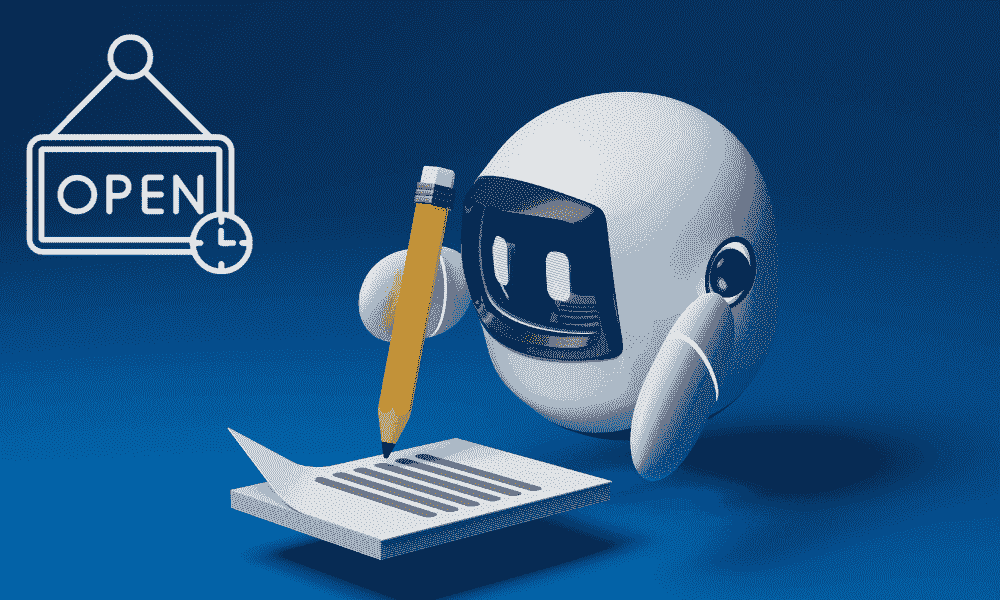

# AI 与开源软件：天生一对？

> 原文：[`www.kdnuggets.com/ai-and-open-source-software-separated-at-birth`](https://www.kdnuggets.com/ai-and-open-source-software-separated-at-birth)

图片来源：编辑

自去年年底以来，我一直在阅读、撰写和演讲关于开源软件和机器学习交集的内容，试图理解未来可能带来什么。

当我开始时，我预计我会主要讨论开源软件如何被机器学习社区使用。但我探索得越多，就越发现这两个领域之间有很多相似之处。在这篇文章中，我将讨论一些这些相似之处——以及机器学习可以从开源软件中学到什么和不能学到什么。

# 从一开始就建立

一个简单而明显的相似之处是，现代机器学习和现代软件几乎完全是由开源软件构建的。对于软件而言，那是编译器和代码编辑器；对于机器学习而言，那是像 PyTorch 和 TensorFlow 这样的训练和推理框架。这些领域由开源软件主导，目前没有任何迹象表明这种情况会改变。

有一个显著的明显例外：所有这些框架都依赖于非常专有的 Nvidia 硬件和软件栈。这实际上比起初看起来更具相似性。很长一段时间，开源软件主要运行在专有的 Unix 操作系统上，这些操作系统由专有的硬件供应商出售。只有在 Linux 出现之后，我们才开始认为一个开放的“底层”栈是可能的，现在许多开源开发是在 MacOS 和 Windows 上进行的。目前还不清楚这在机器学习中将如何发展。亚马逊（针对 AWS）、谷歌（针对云和 Android）和苹果都在投资竞争的芯片和栈，可能这些公司中的一个或多个会跟随[Linus（和 Intel）解放*整个*栈](https://davelevy.info/commoditisation-killed-sun-microsystems/)的路径。

# 培训数据：新的意外供应链？

开源软件构建方式和机器学习构建方式之间一个更关键的相似之处是它们所依赖的数据的复杂性和公共可用性。

正如我共同撰写的[这篇预印本](https://genlaw.github.io/CameraReady/20.pdf)论文《数据来源项目》中详细描述的那样，现代机器学习是建立在字面上成千上万的数据源上的，就像现代开源软件是建立在数十万个库上的一样。而且，就像每个开源库都带来了法律、安全和维护挑战，每个公共数据集也带来了完全相同的一组困难。

在我的组织中，我们谈论过开源软件版本的这一挑战，称之为“[意外供应链](https://blog.tidelift.com/luis-villa-jordan-harband-open-source-supply-chain-upstream)”。软件行业开始构建东西是因为开源库的惊人构建块意味着我们可以这样做。这意味着行业开始将开源软件视为供应链——这让许多“供应商”感到惊讶。

为了缓解这些挑战，开源软件已经开发了许多复杂的（尽管不完美的）技术，比如用于识别使用情况的扫描器，以及用于部署后跟踪的元数据。我们也开始投资于人力资源，以尝试解决工业需求与志愿者动机之间的差距。

不幸的是，机器学习社区似乎准备跳入完全相同的“意外”供应链错误——做很多事情因为能够做到，而没有考虑一旦整个经济基于这些数据集后的长期影响。

# 开源扩展到许多细分领域

另一个重要的相似之处是，我强烈怀疑机器学习会扩展到许多细分领域，就像开源软件一样。目前（实至名归）的炒作是关于大型生成模型的，但也有许多小型模型以及对大型模型的调整。实际上，托管网站 HuggingFace，机器学习的主要托管平台，报告称其网站上的模型数量正在呈指数增长。

这些模型很可能会丰富且可用于改进，就像小块开源软件一样。这将使它们极具灵活性和强大。例如，我正在使用一个基于机器学习的小工具在我家街道上进行便宜且注重隐私的交通测量，这是几年前只有昂贵设备才能做到的用例。

但这种扩散意味着它们需要被跟踪——模型可能会变得不像主机机那样，而更像开源软件或 SaaS，因为成本低且易于部署，这些模型到处涌现。

# 元数据不是万能的，但它是第一步

那么，如果存在这些重要的相似之处（尤其是复杂供应链和扩散的分发），机器学习可以从开源软件中学到什么？

我们可以得出的第一个相似教训是，要理解其许多挑战，机器学习需要元数据和工具。开源软件通过版权和许可合规不经意地涉足了元数据工作，但随着软件供应链的成熟，元数据在各种方面证明了其巨大价值。

在机器学习中，元数据跟踪仍在进行中。以下是一些例子：

+   一篇[2019 年关键论文](https://arxiv.org/abs/1810.03993)，在业内广泛引用，敦促模型开发者用“模型卡”记录他们的工作。不幸的是，最近的研究表明它们在实际应用中的[实施仍然较弱](https://arxiv.org/abs/2204.06425)。

+   SPDX 和 CycloneDX 软件材料清单（SBOM）规格正在研究人工智能材料清单（AI BOMs），以比模型卡更有结构化的方式跟踪机器学习数据和模型（这符合预期的复杂性，如果这确实与开源软件类似的话）。

+   HuggingFace 创建了[各种规格和工具](https://huggingface.co/docs/hub/model-cards)，以允许模型和数据集作者记录他们的来源。

+   上述 MIT 数据溯源论文尝试理解数据许可的“真实情况”，以帮助用现实世界的数据充实规格。

+   据说，许多从事机器学习训练的公司与数据追踪的关系显得有些随意，使用“更多更好”的借口，将数据塞入系统中，而不一定做好追踪。

如果我们从开源中学到了什么，那就是获取正确的元数据（首先是规格，然后是实际数据）将是一个长期的项目，并可能需要[政府干预](https://blog.tidelift.com/tidelift-advisory-omb-memo-m-23-16-clarifies-u.s.-government-secure-software-development-attestation-requirements-and-deadlines-including-for-open-source)。机器学习应该尽早涉足这一元数据领域。

# 安全性将成为一个真正的问题

安全性也是开源软件对元数据需求的另一个主要推动力——如果你不知道自己在运行什么，就无法知道自己是否容易受到似乎无休无止的攻击。

机器学习并不受到大多数传统软件攻击的影响，但这并不意味着它们是无懈可击的。（我最喜欢的例子是，可能存在[毒害图像训练集](https://spectrum.ieee.org/ai-cybersecurity-data-poisoning)，因为它们通常来自过时的领域。）这个领域的研究已经热到超越了“概念验证”，进入了“有足够的攻击可以[列举](https://llmsecurity.net/)和[分类](https://atlas.mitre.org/)”的阶段。

不幸的是，开源软件无法为机器学习提供任何安全方面的“灵丹妙药”——如果有的话，我们早就使用它们了。但开源软件传播到如此多的领域的历史表明，机器学习必须认真对待这一挑战，首先从追踪使用情况和部署元数据开始，正因为它很可能会以当前部署方式之外的许多方式被应用。

# 监管和责任将会扩展

推动开源元数据（最初是许可，然后是安全）的动机指向下一个重要的相似点：随着一个领域的重要性增加，必须测量和跟踪的范围也会扩大，因为监管和责任也会扩大。

在开源软件中，多年来主要的政府“监管”是版权法，因此元数据的发展也是为了支持这一点。但开源软件现在面临各种安全和产品责任规则——我们必须使我们的供应链成熟，以满足这些新要求。

随着人工智能变得越来越重要，它将以越来越多的方式受到监管。监管的来源将非常多样，包括内容（输入和输出）、歧视以及产品责任。这将需要有时被称为“[可追溯性](https://www.mdpi.com/2504-2289/5/2/20)”的东西——理解模型是如何构建的，以及这些选择（包括数据来源）如何影响模型的结果。

这一核心要求——我们拥有什么？它是如何到达这里的？——现在对企业开源软件开发者来说非常熟悉。然而，这对机器学习开发者来说可能是一个根本性的变化，需要被接受。

# “长期”比人们想象的更长

机器学习可以从开源软件（实际上也是许多早期的软件浪潮，包括主机）中汲取的另一个相似教训是，它的有用生命周期将非常非常长。一旦一项技术“足够好”，它将被部署，因此必须维护非常非常长的时间。这意味着我们必须尽早考虑这个软件的维护问题，并思考这个软件可能存在几十年的意义。“几十年”并不是夸张；我遇到的许多客户正在使用足够老到可以投票的软件。许多开源软件公司以及一些项目现在有所谓的“长期支持”版本，旨在应对这些使用案例。

相比之下，OpenAI 将他们的 Codex 工具提供的时间不到两年——[这导致了很多愤怒，尤其是在学术界](https://www.aisnakeoil.com/p/openais-policies-hinder-reproducible)。鉴于机器学习变化的快速步伐，以及大多数采用者可能对最新技术感兴趣，这可能并不不合理——但这样的“长期”计划的日子将会到来，可能比行业想象的更早，包括它如何与责任和安全互动。

# 财务激励不一定总是对齐的

最终，显然——像开源软件一样——会有大量资金流入机器学习，但大部分资金将集中在一位作者所称的[“处理器丰富”公司](https://www.semianalysis.com/p/google-gemini-eats-the-world-gemini)周围。如果与开源软件的类比成立，这些公司将比模型的中等创作者（或用户）有非常不同的关注点和支出优先级。

我们公司 Tidelift 已经考虑了开源软件激励机制的问题一段时间，像美国政府这样的世界最大软件采购者也在[关注这个问题](https://blog.tidelift.com/new-rfi-shows-the-us-gov-effort-to-invest-in-open-source-is-picking-up-steam)。

机器学习公司，尤其是那些希望创建创作者社区的公司，应该认真考虑这一挑战。如果它们依赖于成千上万的数据集，它们将如何确保这些数据集在几十年内得到维护、法律合规和安全保障？如果大型公司最终在公司内部部署了几十个或几百个模型，它们将如何确保那些拥有最佳专业知识的人员——那些创建了模型的人——仍然在场，以便在发现新问题时继续工作？

像安全问题一样，这个挑战没有简单的答案。但机器学习越早认真对待这个问题——不是作为慈善行为，而是作为长期增长的关键组成部分——整个行业和整个世界的情况就会越好。

# 结论

机器学习在学术界实验文化和硅谷快速迭代文化中的深厚根基，使其获得了显著的创新爆发，这种爆发在不到十年前可能还[显得像是魔法](https://xkcd.com/1425/)。开源软件在过去十年的发展也许不那么光鲜亮丽，但在这段时间里，它已成为所有企业软件的基础——并在过程中学到了很多经验。希望机器学习不会重新发明这些轮子。

**[Luis Villa](https://www.linkedin.com/in/luisv/)** 是 Tidelift 的联合创始人兼总法律顾问。之前，他是一位顶级开源律师，为从财富 50 强公司到领先的初创公司等客户提供产品开发和开源许可方面的咨询。

****[Luis Villa](https://www.linkedin.com/in/luisv/)**** 是 Tidelift 的联合创始人兼总法律顾问。之前，他是一位顶级开源律师，为从财富 50 强公司到领先的初创公司等客户提供产品开发和开源许可方面的咨询。

### 了解更多相关信息

+   [Baby AGI：完全自主 AI 的诞生](https://www.kdnuggets.com/2023/04/baby-agi-birth-fully-autonomous-ai.html)

+   [封闭源代码与开源图像注释](https://www.kdnuggets.com/closed-source-vs-open-source-image-annotation)

+   [8 个开源替代 ChatGPT 和 Bard 的工具](https://www.kdnuggets.com/2023/04/8-opensource-alternative-chatgpt-bard.html)

+   [软件开发人员与软件工程师](https://www.kdnuggets.com/2022/05/software-developer-software-engineer.html)

+   [宣布 PyCaret 3.0：开源、低代码 Python 机器学习](https://www.kdnuggets.com/2023/03/announcing-pycaret-30-opensource-lowcode-machine-learning-python.html)

+   [使用开源工具生成合成时间序列数据](https://www.kdnuggets.com/2022/06/generate-synthetic-timeseries-data-opensource-tools.html)
