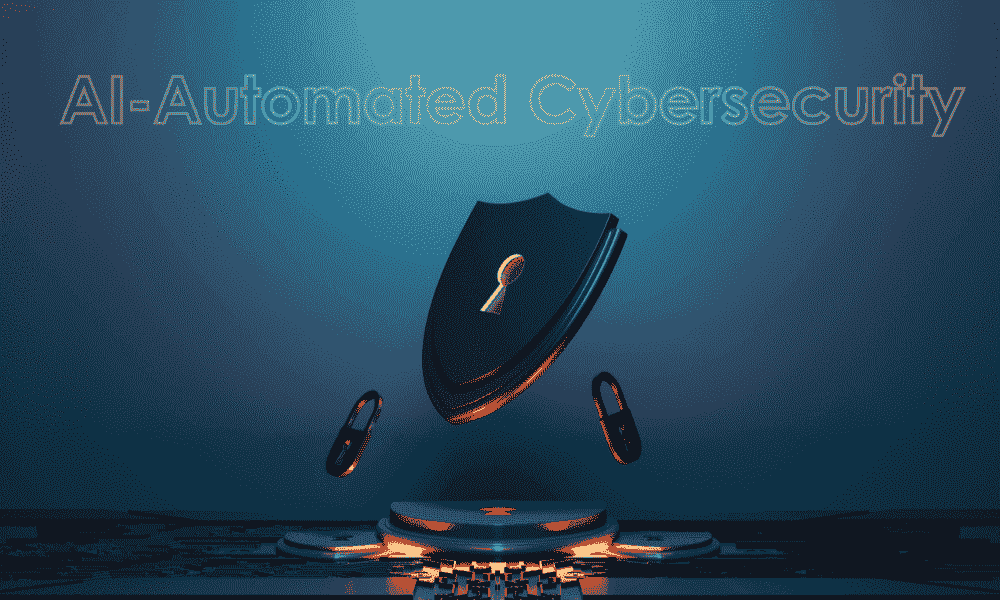

# AI-自动化网络安全：什么需要自动化？

> 原文：[`www.kdnuggets.com/ai-automated-cybersecurity-what-to-automate`](https://www.kdnuggets.com/ai-automated-cybersecurity-what-to-automate)

图片由编辑提供

让我们面对现实吧：尽管一些 IT 专业人士可能因为当前的炒作而对人工智能产生反感，但人工智能融入许多日常业务流程，包括网络安全控制，只是时间问题。但现在，正当这项技术还很年轻时，理解人工智能自动化的真正影响和挑战可能会很困难。

* * *

## 我们的三大课程推荐

 1\. [谷歌网络安全证书](https://www.kdnuggets.com/google-cybersecurity) - 快速通道进入网络安全职业。

 2\. [谷歌数据分析专业证书](https://www.kdnuggets.com/google-data-analytics) - 提升你的数据分析能力

 3\. [谷歌 IT 支持专业证书](https://www.kdnuggets.com/google-itsupport) - 支持你的组织 IT 需求

* * *

这篇文章揭穿了几个关于人工智能如何提升网络安全的常见神话，并向 IT 和网络安全领导者提供了有关如何做出明智自动化决策的建议。

# 自动化的神话与现实

不要相信人工智能将取代所有员工的神话。即使这真的有可能，我们作为一个社会也还没有准备好迎接这样的飞跃。想象一下，你登上一架飞机，却发现起飞前从未有过任何人类飞行员进入驾驶舱。毫无疑问，机上会发生叛乱，乘客们会要求有飞行员在航班上。尽管自动驾驶仪的功能很有效，但它也有局限性，所以人们仍然希望有一个人类来负责。

确实，当工业革命兴起时，我们并没有看到人类员工被淘汰。虽然机器取代了一些体力劳动的元素，但它并没有取代人类。相反，机器为制造过程带来了更高的效率、可预测性和一致性。事实上，新工作和甚至需要新技能及更大多样性的新行业也随之诞生。类似地，人工智能将为业务流程带来新的效率、可扩展性和准确性，同时创造新的机会并转变劳动市场。换句话说，你仍然需要网络安全人员，但他们将通过人工智能的协助获得技能提升。

另一个重要的误解是，AI 自动化将不可避免地降低成本。这听起来可能很熟悉；不久前对云计算也曾有类似的说法。迁移数据中心到云计算的组织发现，虽然云计算的运营支出结构比传统的资本支出有优势，但在大型环境中，最终的成本相似，部分原因是更复杂的系统需要更熟练（且昂贵！）的人才。同样，自动化将改变成本分配，但不会改变总体成本。

最后，一个完全自动化的基于 AI 的安全解决方案有时被视为一个理想目标。实际上，这是一个不切实际的梦想，提出了信任和可审计性的问题。如果这种自动化出现故障或被破坏怎么办？你如何验证结果仍然与业务目标一致？事实是我们正处于这个新的 AI 自动化范式的早期阶段，没人真正理解从安全角度来看 AI 自动化未来如何被利用。AI 和自动化不是灵丹妙药（没有什么是）。

# 如何知道什么需要自动化

某些过程比其他过程更适合自动化。这里有一个好的三点评估方法，可以帮助你决定一个安全过程是否适合自动化：

+   这个过程在手动执行时是重复且耗时的。

+   这个过程已经足够明确，可以被转化为算法。

+   过程的结果是可验证的，因此人类可以确定何时出现问题。

你不希望你的昂贵安全人才去处理诸如查阅安全日志、修正配置错误或解读指定的指标警报等事务。通过为他们配备基于 AI 的安全工具，你可以提高他们的可见性，增强他们对不同威胁的理解，并加快他们对攻击的响应速度。

更广泛地说，考虑一下职业体育队如何投资于技术以提高运动员的表现。同样，你需要为你的安全团队提供他们所需的自动化工具，以提升他们的水平。例如，内部威胁是一个重大风险，但几乎不可能监控公司中的每一个用户，而不良员工通常只有在已经造成一定损害后才会显现出来。基于 AI 的解决方案在降低这种风险方面可能更加高效：用户和实体行为异常（UEBA）检测解决方案可以发现用户数据访问模式的微妙变化以及与同事行为的差异，这些都可能是需要及时审查的潜在风险信号。

AI 可以将你团队的能力提升到一个全新的水平的另一个领域是威胁狩猎。自动化解决方案可以更准确地识别可能已被保护机制阻止的攻击痕迹，并将其与威胁情报进行比较。这些可能是更大规模攻击的迹象，你可以为此做好更好的准备。

# 结论

ChatGPT、Bard 以及其他数千款令人惊叹的新应用程序为高管们提供了体验 AI 实际应用的机会。与他们的安全团队合作，他们可以探索该技术的潜在应用。但在盲目推进之前，至关重要的是要彻底评估哪些过程值得自动化。这种尽职调查将帮助 IT 领导者确保所提议的新技术的风险不会超过其收益。

****[伊利亚·索特尼科夫](https://www.linkedin.com/in/iliasotnikov/?originalSubdomain=il)**** 是 Netwrix 的安全策略师和用户体验副总裁。他负责技术支持、用户体验设计以及产品愿景和战略。

### 更多相关内容

+   [准备好通过获得网络安全硕士学位来应对威胁…](https://www.kdnuggets.com/2022/07/baypath-prepared-manage-threat-ms-cybersecurity.html)

+   [准备好通过获得网络安全硕士学位来应对威胁…](https://www.kdnuggets.com/2022/12/baypath-prepared-manage-threat-ms-cybersecurity.html)

+   [使用 Python 自动化的 5 项任务](https://www.kdnuggets.com/2021/06/5-tasks-automate-python.html)

+   [使用 Python 自动化 Microsoft Excel 和 Word](https://www.kdnuggets.com/2021/08/automate-microsoft-excel-word-python.html)

+   [使用 GPT-4 和 Python 自动化无聊的工作](https://www.kdnuggets.com/2023/03/automate-boring-stuff-chatgpt-python.html)

+   [使用 Promptr 和 GPT 自动化你的代码库](https://www.kdnuggets.com/2023/04/automate-codebase-promptr-gpt.html)
