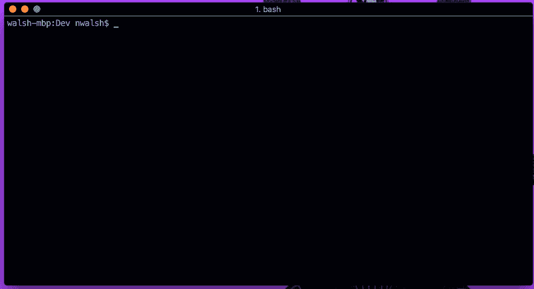

# 5 分钟内设置你的 AI 开发环境

> 原文：[`www.kdnuggets.com/2018/08/ai-dev-environment.html`](https://www.kdnuggets.com/2018/08/ai-dev-environment.html)

 评论

**由 [Nick Walsh](https://twitter.com/thenickwalsh) 撰写**

无论你是第一次设置 TensorFlow 的新手数据科学爱好者，还是处理数 TB 数据的资深 AI 工程师，安装库、包和框架总是一项挑战。

尽管像 [Docker](https://docker.com) 这样的容器化工具确实彻底革新了软件的可重复性，但在数据科学和 AI 社区中尚未得到广泛采用，这也是有原因的！随着机器学习框架和算法的不断演变，找到时间来学习另一个开发工具，尤其是那些与模型构建过程无直接关联的工具，可能会很困难。

在这篇博客文章中，我将展示如何使用一个简单的 Python 包通过几个简单步骤来设置你环境，以适配任何流行的数据科学和 AI 框架。Datmo 在底层利用 Docker，简化了过程，帮助你快速、轻松地启动，无需陡峭的学习曲线。



### 0\. 前提条件

+   安装并启动 [Docker](https://docs.docker.com/install/#supported-platforms)

+   （如果使用 GPU）[安装 CUDA 9.0](https://developer.nvidia.com/cuda-90-download-archive)

+   （如果使用 GPU）[安装 nvidia-docker（步骤 3）](https://github.com/datmo/datmo/wiki/Datmo-GPU-support-and-setup)

### 1\. 安装 datmo

就像任何 Python 包一样，我们可以通过终端使用以下命令来安装 datmo：

```py
$ pip install datmo
```

### 2\. 初始化 datmo 项目

在终端中，进入你想开始构建模型的文件夹。然后，输入以下命令：

```py
$ datmo init
```

然后系统会要求你为项目提供名称和描述——你可以随意命名！

### 3\. 开始环境设置

在输入名称和描述后，datmo 会询问你是否希望设置环境——输入 `y` 并按回车键。

### 4\. 选择系统驱动程序（CPU 或 GPU）

CLI 将会询问你希望为你的环境选择哪些系统驱动程序。如果你不打算使用 GPU，选择 `cpu`。

### 5\. 选择一个环境

接下来，你需要从许多预打包环境中进行选择。只需在提示中输入你想使用的环境的编号或 ID。

### 6\. 选择语言版本（如果适用）

以上许多环境根据你计划使用的语言和版本有不同的版本。

例如，在选择 `keras-tensorflow` 环境后，我会看到如下提示，询问我是否希望使用 Python 2.7 或 Python 3.5。

### 7\. 启动你的工作空间

你已经正确选择了你的环境，现在是时候启动你的工作区了。选择你想使用的工作区，并在终端中输入相应的命令。

Jupyter Notebook -- `$ datmo notebook`

JupyterLab -- `$ datmo jupyterlab`

RStudio -- `$ datmo rstudio`（在 R-base 环境中可用）

终端 -- `$ datmo terminal`

*打开 Jupyter Notebook 并导入 TensorFlow*

* * *

**你准备好了！** 第一次为新环境初始化工作区时，会花费一些时间，因为需要获取所有资源，但在后续运行中会显著加快。

一旦你的工作区启动，你就可以开始导入你选择的环境中包含的软件包和框架！例如，如果用户选择了 `keras-tensorflow` 环境，那么在你的 Jupyter Notebook 中 `import tensorflow` 将立即生效！

如果你使用 TensorFlow，可以尝试我们文档中的[这个示例](https://datmo.readthedocs.io/en/latest/quickstart.html#testing-it-out)来运行你的第一个 TensorFlow 图。

#### 如果你希望帮助贡献、报告问题或请求功能，你可以[在 GitHub 上找到我们](https://github.com/datmo/datmo)！

**个人简介**: [Nick Walsh](https://twitter.com/thenickwalsh) 是 Datmo 的开发者推广员，致力于构建开发者工具以帮助数据科学家提高效率。他还在全国各地的学生黑客马拉松中担任 Major League Hacking 的教练。

**相关内容:**

+   [AI 和数据科学中的前 10 个角色](https://www.kdnuggets.com/2018/08/top-10-roles-ai-data-science.html)

+   [TensorFlow 中的自回归模型](https://www.kdnuggets.com/2018/08/autoregressive-models-tensorflow.html)

+   [Torus 用于 Docker 优先的数据科学](https://www.kdnuggets.com/2018/05/torus-docker-first-data-science.html)

* * *

## 我们的前三大课程推荐

 1\. [Google 网络安全证书](https://www.kdnuggets.com/google-cybersecurity) - 快速进入网络安全职业生涯。

 2\. [Google 数据分析专业证书](https://www.kdnuggets.com/google-data-analytics) - 提升你的数据分析技能

 3\. [Google IT 支持专业证书](https://www.kdnuggets.com/google-itsupport) - 支持你的组织 IT

* * *

### 更多相关主题

+   [全栈一切？数据科学、开发和技术之间的组织交集](https://www.kdnuggets.com/2022/08/full-stack-everything-organizational-intersections-data-science-dev-tech.html)

+   [机器学习算法的完整端到端部署](https://www.kdnuggets.com/2021/12/deployment-machine-learning-algorithm-live-production-environment.html)

+   [理解 AI 中的代理环境](https://www.kdnuggets.com/2022/05/understanding-agent-environment-ai.html)

+   [5 分钟内构建机器学习网页应用](https://www.kdnuggets.com/2022/03/build-machine-learning-web-app-5-minutes.html)

+   [5 分钟用 Python 构建网页爬虫](https://www.kdnuggets.com/2022/02/build-web-scraper-python-5-minutes.html)

+   [介绍 OpenChat：免费的简单平台，用于构建…](https://www.kdnuggets.com/2023/06/introducing-openchat-free-simple-platform-building-custom-chatbots-minutes.html)
