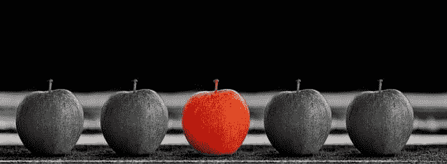

# 机器学习中的替代特征选择方法

> 原文：[`www.kdnuggets.com/2021/12/alternative-feature-selection-methods-machine-learning.html`](https://www.kdnuggets.com/2021/12/alternative-feature-selection-methods-machine-learning.html)



图片来源于 [Gerd Altmann](https://pixabay.com/users/geralt-9301/?utm_source=link-attribution&utm_medium=referral&utm_campaign=image&utm_content=1594742) [Pixabay](https://pixabay.com/?utm_source=link-attribution&utm_medium=referral&utm_campaign=image&utm_content=1594742)

你可能已经在网上搜索过“特征选择”，也可能找到大量描述三种选择方法的文章，即“过滤方法”、“包裹方法”和“嵌入方法”。

在“过滤方法”下，我们找到基于特征分布的统计测试。这些方法计算速度非常快，但在实践中，它们未必能为我们的模型提供好的特征。此外，当我们处理大数据集时，统计测试的 p 值通常非常小，突出显示了分布中的微小差异，这些差异可能并不真正重要。

“包裹方法”类别包括贪婪算法，这些算法将基于向前、向后或穷举搜索的每种可能特征组合进行尝试。对于每种特征组合，这些方法会训练一个机器学习模型，通常使用交叉验证，并确定其性能。因此，包裹方法计算开销非常大，通常无法实现。

另一方面，“嵌入方法”会训练一个单一的机器学习模型，并基于该模型返回的特征重要性来选择特征。这些方法在实践中通常效果很好，并且计算速度较快。然而，无法从所有机器学习模型中推导出特征重要性值。例如，我们无法从最近邻算法中推导出重要性值。此外，共线性会影响线性模型返回的系数值，或决策树算法返回的重要性值，这可能掩盖其真实的重要性。最后，决策树算法在非常大的特征空间中可能表现不佳，因此重要性值可能不可靠。

过滤方法难以解释，并且在实践中不常用；包裹方法计算开销大且常常无法实施；嵌入方法并不适用于每种场景或每个机器学习模型。那么我们该怎么做呢？我们还能如何选择预测特征？

幸运的是，还有更多方法可以选择监督学习的特征。我将在这篇博客文章中详细介绍其中三种方法。有关更多特征选择方法，请查看在线课程[机器学习特征选择](https://www.trainindata.com/p/feature-selection-for-machine-learning)。

### **替代特征选择方法**

在本文中，我将描述三种基于特征对模型性能影响的算法。它们通常被称为“混合方法”，因为它们具有 Wrapper 和 Embedded 方法的特征。一些方法依赖于训练多个机器学习模型，有点像 Wrapper 方法。某些选择程序则依赖于特征重要性，如 Embedded 方法。

抛开术语不谈，这些方法在工业界或数据科学竞赛中已被成功应用，并提供了额外的方式来发现某个机器学习模型的最具预测性的特征。

在整个文章中，我将展示一些特征选择方法的逻辑和过程，并展示如何使用开源库 Feature-engine 在 Python 中实现它们。让我们开始吧。

我们将通过以下方式进行讨论：

+   特征洗牌

+   特征性能

+   目标均值性能

### **特征洗牌**

特征洗牌，或称为排列特征重要性，指的是通过随机洗牌单一特征的值来评估该特征的重要性，这种方法通过观察模型性能得分的下降来进行。洗牌特征值的顺序（跨数据集的行）会改变特征与目标之间的原始关系，因此模型性能得分的下降表明模型对该特征的依赖程度。


该过程如下：

1.  它训练一个机器学习模型并确定其性能。

1.  它洗牌一个特征的值的顺序。

1.  它用第 1 步中训练的模型进行预测，并确定其性能。

1.  如果性能下降低于阈值，则保留该特征，否则将其移除。

1.  它从第 2 步开始重复，直到所有特征都被检查过。

通过洗牌特征进行选择有几个优点。首先，我们只需训练一个机器学习模型。重要性随后通过洗牌特征值并用该模型进行预测来分配。其次，我们可以为我们选择的任何监督机器学习模型选择特征。第三，我们可以利用开源实施这一选择程序，接下来的段落中我们将看到如何做到这一点。

**优点：**

+   它只训练一个机器学习模型，因此速度较快。

+   它适用于任何监督机器学习模型。

+   它可以在 Feature-engine 中找到，这是一个 Python 开源库。

不利的一面是，如果两个特征相关，当其中一个特征被洗牌时，模型仍然可以通过其相关变量访问信息。这可能导致两个特征的重要性值较低，即使它们可能*实际上*是重要的。此外，为了选择特征，我们需要定义一个任意的重要性阈值，低于该阈值的特征将被移除。阈值越高，选择的特征就越少。最后，特征洗牌引入了随机性因素，因此对于重要性边界的特征，即接近阈值的特征，算法的不同运行可能会返回不同的特征子集。

**考虑因素：**

+   相关性可能会影响特征重要性的解释。

+   用户需要定义一个任意的阈值。

+   随机性的因素使得选择过程具有非确定性。

鉴于此，通过特征洗牌选择特征是一种良好的特征选择方法，侧重于突出直接影响模型性能的变量。我们可以使用 Scikit-learn 手动推导[置换重要性](https://scikit-learn.org/stable/modules/generated/sklearn.inspection.permutation_importance.html)，然后选择那些显示出高于某个阈值的变量。或者，我们可以使用 Feature-engine 自动化整个过程。

**Python 实现**

让我们看看如何使用 Feature-engine 进行特征洗牌选择。我们将使用 Scikit-learn 提供的糖尿病数据集。首先，我们加载数据：

```py
import pandas as pd
from sklearn.datasets import load_diabetes
from sklearn.linear_model import LinearRegression
from feature_engine.selection import SelectByShuffling

# load dataset
diabetes_X, diabetes_y = load_diabetes(return_X_y=True)
X = pd.DataFrame(diabetes_X)
y = pd.DataFrame(diabetes_y)
```

我们设置了我们感兴趣的机器学习模型：

```py
# initialize linear regression estimator
linear_model = LinearRegression()
```

我们将基于 r² 的下降使用 3 折交叉验证来选择特征：

```py
# initialize the feature selector
tr = SelectByShuffling(estimator=linear_model, scoring="r2", cv=3)
```

使用 fit() 方法，转换器会找出重要变量——那些在打乱时导致 r² 下降的变量。默认情况下，如果性能下降超过所有特征引起的平均下降，则特征将被选择。

```py
# fit transformer
tr.fit(X, y)
```

使用 transform() 方法，我们从数据集中删除未选择的特征：

```py
Xt = tr.transform(X)
```

我们可以通过转换器的一个属性检查单个特征的重要性：

```py
tr.performance_drifts_

{0: -0.02368121940502793,
 1: 0.017909161264480666,
 2: 0.18565460365508413,
 3: 0.07655405817715671,
 4: 0.4327180164470878,
 5: 0.16394693824418372,
 6: -0.012876023845921625,
 7: 0.01048781540981647,
 8: 0.3921465005640224,
 9: -0.01427065640301245}
```

我们可以访问将被移除的特征名称，这些名称会在另一个属性中显示：

```py
tr.features_to_drop_

[0, 1, 3, 6, 7, 9]
```

就这样，简单。我们在 Xt 中得到了一个减少的数据框。

### **特征性能**

确定特征重要性的直接方法是仅使用该特征训练机器学习模型。在这种情况下，特征的“重要性”由模型的性能得分决定。换句话说，就是用单个特征训练的模型对目标的预测效果如何。差的性能指标表明特征较弱或无法预测。

该过程如下：

1.  它为每个特征训练一个机器学习模型。

1.  对于每个模型，它会进行预测并确定模型性能。

1.  它选择性能指标高于阈值的特征。

在这个选择过程中，我们为每个特征训练一个机器学习模型。该模型使用一个特征来预测目标变量。然后，我们通过交叉验证来确定模型性能，并选择性能高于某个阈值的特征。

一方面，这种方法计算成本较高，因为我们需要训练与数据集中特征数量相同的模型。另一方面，基于单一特征训练的模型往往训练速度较快。

使用这种方法，我们可以为任何我们想要的模型选择特征，因为重要性由性能指标决定。缺点是，我们需要提供一个任意的阈值来进行特征选择。阈值较高时，我们选择的特征组较小。有些阈值可能比较直观。例如，如果性能指标是 roc-auc，我们可以选择性能高于 0.5 的特征。对于其他指标，如准确率，什么值算好并不那么明确。

**优点：**

+   它适用于任何监督式机器学习模型。

+   它逐个探索特征，从而避免了相关性问题。

+   该方法在 Feature-engine 中可用，这是一个 Python 开源项目。

**考虑事项：**

+   每个特征训练一个模型可能会计算成本较高。

+   用户需要定义一个任意的阈值。

+   它不会捕捉特征交互。

我们可以利用 Feature-engine 通过单特征性能来实现选择。

**Python 实现**

让我们从 Scikit-learn 加载糖尿病数据集：

```py
import pandas as pd
from sklearn.datasets import load_diabetes
from sklearn.linear_model import LinearRegression
from feature_engine.selection import SelectBySingleFeaturePerformance

# load dataset
diabetes_X, diabetes_y = load_diabetes(return_X_y=True)
X = pd.DataFrame(diabetes_X)
y = pd.DataFrame(diabetes_y)
```

我们想要选择 r² > 0.01 的特征，利用线性回归并使用 3 折交叉验证。

```py
# initialize the feature selector
sel = SelectBySingleFeaturePerformance(
        estimator=LinearRegression(), scoring="r2", cv=3, threshold=0.01)
```

变换器使用 fit() 方法为每个特征拟合 1 个模型，确定性能，并选择重要特征。

```py
# fit transformer
sel.fit(X, y)
```

我们可以探索将被丢弃的特征：

```py
sel.features_to_drop_

[1]
```

我们还可以检查每个单独特征的性能：

```py
sel.feature_performance_

{0: 0.029231969375784466,
 1: -0.003738551760264386,
 2: 0.336620809987693,
 3: 0.19219056680145055,
 4: 0.037115559827549806,
 5: 0.017854228256932614,
 6: 0.15153886177526896,
 7: 0.17721609966501747,
 8: 0.3149462084418813,
 9: 0.13876602125792703}
```

使用 transform() 方法，我们可以从数据集中移除特征：

```py
# drop variables
Xt = sel.transform(X)
```

就这样。现在我们有了一个减少的数据集。

### **目标均值性能**

我现在讨论的选择过程是在 KDD 2009 数据科学竞赛中由 [Miller 和同事](http://proceedings.mlr.press/v7/miller09/miller09.pdf) 引入的。作者没有给这项技术命名，但由于它使用每组观察的目标均值作为预测的代理，我喜欢将这项技术称为“基于目标均值性能的选择”。

这种选择方法还为每个特征分配了一个“重要性”值。这个重要性值是从性能指标中得出的。有趣的是，该模型不训练任何机器学习模型。相反，它使用了一个简单的代理作为预测。

简而言之，该过程使用每个类别或每个区间（如果变量是连续的）的目标均值作为预测的代理。基于这个预测，它导出一个性能指标，如 r²、准确率或任何其他评估预测与实际情况的指标。

这个过程具体是如何工作的？

对于分类变量：

1.  它将数据框分成训练集和测试集。

1.  对于每个分类特征，它确定每个类别的平均目标值（使用训练集）。

1.  它用相应的目标均值替换测试中的类别。

1.  它使用编码特征和目标（在测试集上）确定一个性能指标。

1.  它选择性能高于阈值的特征。

对于分类值，基于训练集确定每个类别的目标均值。然后，在测试集中用学习到的值替换这些类别，并使用这些值来确定性能指标。

对于连续变量，这个过程相当类似：

1.  它将数据框分成训练集和测试集。

1.  对于每个连续特征，它将值排序到离散区间中，使用训练集找出这些区间的边界。

1.  它确定每个区间的平均目标值（使用训练集）。

1.  它将测试集中的变量按照 2 中识别出的区间进行排序。

1.  它用相应的目标均值替换区间（使用测试集）。

1.  它确定编码特征和目标之间的性能指标（在测试集上）。

1.  它选择性能高于阈值的特征。

对于连续变量，作者首先将观测值分到箱子中，这一过程称为离散化。他们使用了 1%的分位数。然后，他们使用训练集确定每个箱子中的目标均值，并在测试集中用目标均值替换箱子值后评估性能。

该特征选择技术非常简单；它涉及对每个水平（类别或区间）的响应进行平均，然后将这些值与目标值进行比较，以获得一个性能指标。尽管其简单，但它有许多优点。

首先，它不涉及训练机器学习模型，因此计算速度极快。其次，它能够捕捉与目标的非线性关系。第三，它适用于分类变量，这与绝大多数现有选择算法不同。它对异常值具有鲁棒性，因为这些值会被分配到一个极端的箱子中。根据作者的说法，它在分类变量和数值变量之间提供了相当的性能。而且，它是模型无关的。理论上，这个过程选择的特征适用于任何机器学习模型。

**优点：**

+   它计算速度快，因为没有训练机器学习模型。

+   它适用于分类变量和数值变量。

+   它对异常值具有鲁棒性。

+   它捕捉特征与目标之间的非线性关系。

+   它是模型无关的。

这种选择方法也有一些局限性。首先，对于连续变量，用户需要定义一个任意数量的区间来对值进行排序。这对于偏态变量来说是一个问题，因为大多数值可能会落在一个箱子里。其次，标签不频繁的分类变量可能导致不可靠的结果，因为这些类别的观察值很少。因此，每个类别的平均目标值将是不可靠的。在极端情况下，如果一个类别在训练集中不存在，我们将没有平均目标值作为代理来确定性能。

**注意事项：**

+   需要对偏态变量的区间数量进行调整。

+   稀有类别将提供不可靠的性能代理，或使该方法无法计算。

牢记这些注意事项，我们可以使用 Feature-engine 基于目标均值性能来选择变量。

**Python 实现**

我们将使用此方法从泰坦尼克号数据集中选择变量，该数据集混合了数值和分类变量。在加载数据时，我会进行一些预处理以方便演示，然后将其分为训练集和测试集。

```py
import pandas as pd
import numpy as np
from sklearn.model_selection import train_test_split
from sklearn.metrics import roc_auc_score
from feature_engine.selection import SelectByTargetMeanPerformance

# load data
data = pd.read_csv('https://www.openml.org/data/get_csv/16826755/phpMYEkMl')

# extract cabin letter
data['cabin'] = data['cabin'].str[0]

# replace infrequent cabins by N
data['cabin'] = np.where(data['cabin'].isin(['T', 'G']), 'N', data['cabin'])

# cap maximum values
data['parch'] = np.where(data['parch']>3,3,data['parch'])
data['sibsp'] = np.where(data['sibsp']>3,3,data['sibsp'])

# cast variables as object to treat as categorical
data[['pclass','sibsp','parch']] = data[['pclass','sibsp','parch']].astype('O')

# separate train and test sets
X_train, X_test, y_train, y_test = train_test_split(
    data.drop(['survived'], axis=1),
    data['survived'],
    test_size=0.3,
    random_state=0)
```

我们将基于 roc-auc 使用 2 折交叉验证来选择特征。首先需要注意的是，Feature-engine 允许我们使用交叉验证，这是对作者原始方法的改进。

Feature-engine 还允许我们决定如何确定数值变量的区间。我们可以选择等频或等宽区间。作者使用了 1%分位数，这适用于值分布较广的连续变量，但不适用于偏态变量。在这个演示中，我们将数值变量分成等频区间。

最终，我们希望选择 roc-auc 大于 0.6 的特征。

```py
# Feature-engine automates the selection of 
# categorical and numerical variables

sel = SelectByTargetMeanPerformance(
    variables=None,
    scoring="roc_auc_score",
    threshold=0.6,
    bins=3,
    strategy="equal_frequency",
    cv=2,# cross validation
    random_state=1, # seed for reproducibility
)
```

使用 fit()方法，转换器：

+   用目标均值替换类别

+   将数值变量排序为等频箱

+   用目标均值替换箱子

+   使用目标均值编码变量返回 roc-auc

+   选择 roc-auc > 0.6 的特征

```py
# find important features
sel.fit(X_train, y_train)
```

我们可以探索每个特征的 ROC-AUC：

```py
sel.feature_performance_

{'pclass': 0.6802934787230475,
 'sex': 0.7491365252482871,
 'age': 0.5345141148737766,
 'sibsp': 0.5720480307315783,
 'parch': 0.5243557188989476,
 'fare': 0.6600883312700917,
 'cabin': 0.6379782658154696,
 'embarked': 0.5672382248783936}
```

我们可以找到将从数据中删除的特征：

```py
sel.features_to_drop_

['age', 'sibsp', 'parch', 'embarked']
```

使用 transform()方法，我们从数据集中删除特征：

```py
# remove features
X_train = sel.transform(X_train)
X_test = sel.transform(X_test)
```

简单。现在我们已经减少了训练集和测试集的版本。

### **总结**

我们已经结束了文章。如果你看到这里，做得好，谢谢你的阅读。如果你想了解更多关于特征选择的内容，包括过滤器、包裹法、嵌入法和多种混合方法，请查看在线课程[机器学习特征选择](https://www.trainindata.com/p/feature-selection-for-machine-learning)。

有关机器学习的更多课程，包括特征工程、超参数优化和模型部署，请访问我们的[网站](https://www.trainindata.com/)。

要在 Python 中实现过滤器、包装器、嵌入式和混合选择方法，可以查看[Scikit-learn](https://scikit-learn.org/stable/modules/feature_selection.html)、[MLXtend](http://rasbt.github.io/mlxtend/user_guide/feature_selection/SequentialFeatureSelector/)和[Feature-engine](https://feature-engine.readthedocs.io/en/latest/index.html)中的选择模块。这些库附带了详尽的文档，将帮助你深入理解其背后的方法论。

**简历: [Soledad Galli, PhD](https://linkedin.com/in/soledad-galli)** 是[Train in Data](https://www.trainindata.com/)的首席数据科学家和机器学习讲师。Sole 教授中级和高级数据科学及机器学习课程。她曾在金融和保险行业工作，2018 年获得了[数据科学领袖奖](https://www.information-age.com/data-leaders-awards-2018-revealed-123472520/)，并于 2019 年被选为"[LinkedIn 的声音](https://www.linkedin.com/pulse/linkedin-top-voices-2019-data-science-analytics-lorenzetti-soper/)"。她还是 Python 开源库[Feature-engine](https://feature-engine.readthedocs.io/en/latest/index.html)的创作者和维护者。Sole 对分享知识和帮助他人在数据科学领域取得成功充满热情。

* * *

## 我们的前三个课程推荐

 1\. [谷歌网络安全证书](https://www.kdnuggets.com/google-cybersecurity) - 快速进入网络安全职业道路。

 2\. [谷歌数据分析专业证书](https://www.kdnuggets.com/google-data-analytics) - 提升你的数据分析技能

 3\. [谷歌 IT 支持专业证书](https://www.kdnuggets.com/google-itsupport) - 支持你的组织 IT 工作

* * *

### 更多相关主题

+   [机器学习模型的高级特征选择技术](https://www.kdnuggets.com/2023/06/advanced-feature-selection-techniques-machine-learning-models.html)

+   [特征选择: 科学与艺术的结合](https://www.kdnuggets.com/2021/12/feature-selection-science-meets-art.html)

+   [特征存储峰会 2022: 免费的特征工程会议](https://www.kdnuggets.com/2022/10/hopsworks-feature-store-summit-2022-free-conference-feature-engineering.html)

+   [OpenChatKit: 开源 ChatGPT 替代品](https://www.kdnuggets.com/2023/03/openchatkit-opensource-chatgpt-alternative.html)

+   [8 个开源 ChatGPT 和 Bard 的替代品](https://www.kdnuggets.com/2023/04/8-opensource-alternative-chatgpt-bard.html)

+   [ChatGLM-6B: 轻量级开源 ChatGPT 替代品](https://www.kdnuggets.com/2023/04/chatglm6b-lightweight-opensource-chatgpt-alternative.html)
