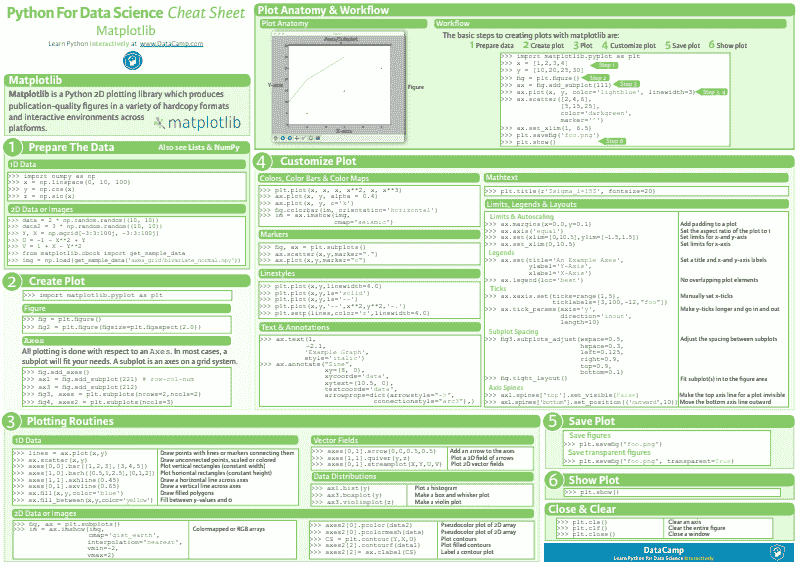
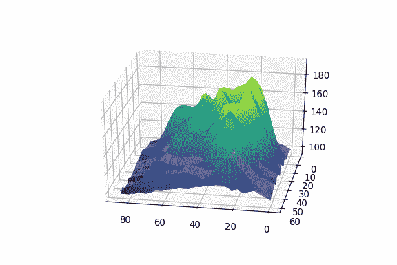
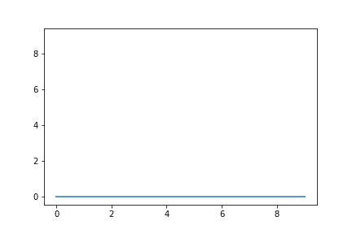
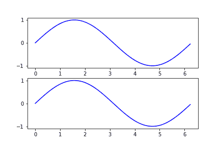
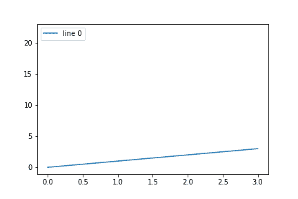

# 使用 Matplotlib 制作动画

> 原文：[`www.kdnuggets.com/2019/05/animations-with-matplotlib.html`](https://www.kdnuggets.com/2019/05/animations-with-matplotlib.html)

评论

**由[Parul Pandey](https://www.linkedin.com/in/parul-pandey-a5498975/)，数据科学爱好者**

[使用 Matplotlib 的雨滴模拟](https://matplotlib.org/gallery/animation/rain.htm)

* * *

## 我们的前三个课程推荐

 1\. [谷歌网络安全证书](https://www.kdnuggets.com/google-cybersecurity) - 快速进入网络安全职业。

 2\. [谷歌数据分析专业证书](https://www.kdnuggets.com/google-data-analytics) - 提升您的数据分析能力

 3\. [谷歌 IT 支持专业证书](https://www.kdnuggets.com/google-itsupport) - 支持您的组织的 IT

* * *

动画是一种展示现象的有趣方式。我们作为人类总是对动画和互动图表充满兴趣，而不是静态图表。当描绘时间序列数据时，例如多年来的股票价格、过去十年的气候变化、季节性和趋势，动画显得更有意义，因为我们可以看到某一参数随时间的变化。

上面的图像是一个[**雨滴模拟**](https://matplotlib.org/gallery/animation/rain.html)，它是使用 Matplotlib 库实现的，该库被亲切地称为**Python 可视化包的祖父**。Matplotlib 通过对 50 个散点的尺度和不透明度进行动画模拟雨滴落在表面上的效果。如今，Python 拥有许多强大的可视化工具，如 Plotly、Bokeh、Altair 等。这些库能够实现最先进的动画效果和互动性。然而，本文的目的是突出介绍这个库中的一个不太被探讨的方面，即**动画**，我们将探讨一些实现动画的方法。

### 概述

[Matplotlib](http://matplotlib.org/)是一个 Python 2D 绘图库，也是最受欢迎的库之一。大多数人都以 Matplotlib 开始他们的数据可视化之旅。使用 Matplotlib 可以轻松生成图表、直方图、功率谱、条形图、误差图、散点图等。它还可以与 Pandas 和 Seaborn 等库无缝集成，以创建更复杂的可视化效果。

Matplotlib 的一些优秀特性包括：

+   它的设计类似于 MATLAB，因此在两者之间切换相当容易。

+   包含许多渲染后端。

+   可以生成几乎任何图表（只需稍加努力）。

+   已经存在了十多年，因此拥有庞大的用户基础。

然而，Matplotlib 在某些领域并不那么突出，落后于其强大的对手。

+   Matplotlib 有一个命令式 API，通常过于冗长。

+   有时样式默认设置较差。

+   对于网页和交互式图形的支持较差。

+   对于大数据和复杂数据，往往较慢。

作为参考，这里有一份来自[**Datacamp**](https://s3.amazonaws.com/assets.datacamp.com/blog_assets/Python_Matplotlib_Cheat_Sheet.pdf)的 Matplotlib 备忘单，你可以通过它来巩固你的基础知识。



### 动画

Matplotlib 的 `animation` 基类处理动画部分。它提供了一个框架，在此框架上构建动画功能。主要有两个接口来实现：

`[FuncAnimation](https://matplotlib.org/api/_as_gen/matplotlib.animation.FuncAnimation.html#matplotlib.animation.FuncAnimation)` 通过反复调用函数 *func* 来制作动画。

`[ArtistAnimation](https://matplotlib.org/api/_as_gen/matplotlib.animation.ArtistAnimation.html#matplotlib.animation.ArtistAnimation):` 使用固定的 `Artist` 对象集进行动画。

然而，在这两者中，**FuncAnimation** 是最方便使用的。你可以在[文档](http://matplotlib.sourceforge.net/api/animation_api.html)中阅读更多信息，因为我们将只关注 `FuncAnimation` 工具。

**要求**

+   应安装包括 `numpy` 和 `matplotlib` 在内的模块。

+   要将动画保存为 mp4 或 gif 格式，需安装 `[ffmpeg](https://www.ffmpeg.org/)` 或 `[imagemagick](https://sourceforge.net/projects/imagemagick/files/)`。

一旦准备好，我们可以开始在 Jupyter Notebooks 中进行我们的第一个基础动画。本文的代码可以从相关的[**Github 仓库**](https://github.com/parulnith/Animations-with-Matplotlib)访问，或者你可以点击下面的图片在我的 binder 中查看它。


### **基础动画：移动的正弦波**

让我们使用 `FuncAnimation` 创建一个在屏幕上移动的正弦波的基础动画。该动画的源代码取自[Matplotlib 动画教程](http://jakevdp.github.io/blog/2012/08/18/matplotlib-animation-tutorial/)。我们先查看输出，然后将逐步解析代码以了解其内部工作原理。

```py

import numpy as np
from matplotlib import pyplot as plt
from matplotlib.animation import FuncAnimation
plt.style.use('seaborn-pastel')

fig = plt.figure()
ax = plt.axes(xlim=(0, 4), ylim=(-2, 2))
line, = ax.plot([], [], lw=3)

def init():
    line.set_data([], [])
    return line,
def animate(i):
    x = np.linspace(0, 4, 1000)
    y = np.sin(2 * np.pi * (x - 0.01 * i))
    line.set_data(x, y)
    return line,

anim = FuncAnimation(fig, animate, init_func=init,
                               frames=200, interval=20, blit=True)

anim.save('sine_wave.gif', writer='imagemagick')

```


+   在第 (7–9) 行，我们简单地创建了一个带有单个坐标轴的图形窗口。然后我们创建了一个空的线对象，该对象本质上是在动画中被修改的对象。线对象稍后将被填充数据。

+   在第 (11–13) 行，我们创建了 `init` 函数来实现动画。`init` 函数初始化数据并设置坐标轴的限制。

+   在第 14 到 18 行中，我们最终定义了动画函数，该函数以帧编号`i`作为参数，并创建一个正弦波（或其他动画），其偏移量取决于`i`的值。该函数返回一个包含已修改绘图对象的元组，这告诉动画框架哪些绘图部分应被动画化。

+   在第**20**行中，我们创建实际的动画对象。`blit`参数确保只有那些已更改的绘图部分会被重新绘制。

这就是在 Matplotlib 中创建动画的基本直觉。通过对代码进行一些调整，可以创建有趣的可视化效果。让我们来看看其中的一些。

### 一个增长的线圈

同样，[GeeksforGeeks](https://www.geeksforgeeks.org/graph-plotting-python-set-3/) 上有一个很好的示例，演示如何创建形状。现在，让我们利用 matplotlib 的`animation`类创建一个缓慢展开的移动线圈。代码与正弦波图非常相似，只需进行少量调整。

```py

import matplotlib.pyplot as plt 
import matplotlib.animation as animation 
import numpy as np 
plt.style.use('dark_background')

fig = plt.figure() 
ax = plt.axes(xlim=(-50, 50), ylim=(-50, 50)) 
line, = ax.plot([], [], lw=2) 

# initialization function 
def init(): 
	# creating an empty plot/frame 
	line.set_data([], []) 
	return line, 

# lists to store x and y axis points 
xdata, ydata = [], [] 

# animation function 
def animate(i): 
	# t is a parameter 
	t = 0.1*i 

	# x, y values to be plotted 
	x = t*np.sin(t) 
	y = t*np.cos(t) 

	# appending new points to x, y axes points list 
	xdata.append(x) 
	ydata.append(y) 
	line.set_data(xdata, ydata) 
	return line, 

# setting a title for the plot 
plt.title('Creating a growing coil with matplotlib!') 
# hiding the axis details 
plt.axis('off') 

# call the animator	 
anim = animation.FuncAnimation(fig, animate, init_func=init, 
							frames=500, interval=20, blit=True) 

# save the animation as mp4 video file 
anim.save('coil.gif',writer='imagemagick')

```


### 实时更新图表

实时更新图表在绘制动态量（如股票数据、传感器数据或其他时间相关数据）时非常有用。我们绘制一个基本图表，随着更多数据输入系统，它会自动更新。让我们绘制一个假设公司的一个月的股票价格。

```py

#importing libraries
import matplotlib.pyplot as plt
import matplotlib.animation as animation

fig = plt.figure()
#creating a subplot 
ax1 = fig.add_subplot(1,1,1)

def animate(i):
    data = open('stock.txt','r').read()
    lines = data.split('\n')
    xs = []
    ys = []

    for line in lines:
        x, y = line.split(',') # Delimiter is comma    
        xs.append(float(x))
        ys.append(float(y))

    ax1.clear()
    ax1.plot(xs, ys)

    plt.xlabel('Date')
    plt.ylabel('Price')
    plt.title('Live graph with matplotlib')	

ani = animation.FuncAnimation(fig, animate, interval=1000) 
plt.show()

```

现在，打开终端并运行 python 文件。你将得到一个如下所示的图表，该图表会自动更新如下：


这里的间隔是 1000 毫秒，即一秒钟。

### 3D 图形上的动画

创建 3D 图形是常见的，但如果我们能够对这些图形的视角进行动画处理呢？这个想法是改变相机视角，然后使用每个结果图像创建动画。在[The Python Graph Gallery](https://python-graph-gallery.com/342-animation-on-3d-plot/)中有一个很好的部分专门介绍了这一点。

在与笔记本相同的目录中创建一个名为**volcano**的文件夹。所有的图像将存储在这个文件夹中，然后在动画中使用。

```py

# library
from mpl_toolkits.mplot3d import Axes3D
import matplotlib.pyplot as plt
import pandas as pd
import seaborn as sns

# Get the data (csv file is hosted on the web)
url = 'https://python-graph-gallery.com/wp-content/uploads/volcano.csv'
data = pd.read_csv(url)

# Transform it to a long format
df=data.unstack().reset_index()
df.columns=["X","Y","Z"]

# And transform the old column name in something numeric
df['X']=pd.Categorical(df['X'])
df['X']=df['X'].cat.codes

# We are going to do 20 plots, for 20 different angles
for angle in range(70,210,2):

# Make the plot
    fig = plt.figure()
    ax = fig.gca(projection='3d')
    ax.plot_trisurf(df['Y'], df['X'], df['Z'], cmap=plt.cm.viridis, linewidth=0.2)

    ax.view_init(30,angle)

    filename='Volcano/Volcano_step'+str(angle)+'.png'
    plt.savefig(filename, dpi=96)
plt.gca()

```

这将会在 Volcano 文件夹中创建多个 PNG 文件。现在，使用 ImageMagick 将它们转换为动画。打开终端并导航到 Volcano 文件夹，然后输入以下命令：

```py

convert -delay 10 Volcano*.png animated_volcano.gif

```



### 使用 Celluloid 模块的动画

[Celluloid](https://github.com/jwkvam/celluloid) 是一个简化在 matplotlib 中创建动画过程的 Python 模块。该库创建一个 matplotlib 图形，并从中创建一个`Camera`。然后重用图形，并在每帧创建后，通过相机拍摄快照。最后，用所有捕获的帧创建动画。

**安装**

```py

pip install celluloid

```

这里是一些使用 Celluloid 模块的示例。

**最小**

```py

from matplotlib import pyplot as plt
from celluloid import Camera

fig = plt.figure()
camera = Camera(fig)
for i in range(10):
    plt.plot([i] * 10)
    camera.snap()
animation = camera.animate()
animation.save('celluloid_minimal.gif', writer = 'imagemagick')

```



**子图**

```py

import numpy as np
from matplotlib import pyplot as plt
from celluloid import Camera

fig, axes = plt.subplots(2)
camera = Camera(fig)
t = np.linspace(0, 2 * np.pi, 128, endpoint=False)
for i in t:
    axes[0].plot(t, np.sin(t + i), color='blue')
    axes[1].plot(t, np.sin(t - i), color='blue')
    camera.snap()

animation = camera.animate()  
animation.save('celluloid_subplots.gif', writer = 'imagemagick')

```



**图例**

```py

import matplotlib
from matplotlib import pyplot as plt
from celluloid import Camera

fig = plt.figure()
camera = Camera(fig)
for i in range(20):
    t = plt.plot(range(i, i + 5))
    plt.legend(t, [f'line {i}'])
    camera.snap()
animation = camera.animate()
animation.save('celluloid_legends.gif', writer = 'imagemagick')

```



### 总结

动画有助于突出可视化中的某些特征，这些特征在静态图表中无法轻易传达。不过，也要注意不必要和过度使用可视化，有时可能会使问题复杂化。数据可视化中的每个特征都应谨慎使用，以达到最佳效果。

**作者：[Parul Pandey](https://www.linkedin.com/in/parul-pandey-a5498975/)** 是一位数据科学爱好者，常为数据科学出版物如 Towards Data Science 撰写文章。

[原文](https://towardsdatascience.com/animations-with-matplotlib-d96375c5442c)。已获许可转载。

**相关：**

+   [用代码在 Python 中快速轻松地创建 5 个数据可视化](https://www.kdnuggets.com/2018/07/5-quick-easy-data-visualizations-python-code.html)

+   [Python 图表库](https://www.kdnuggets.com/2017/11/python-graph-gallery.html)

+   [D3.js 数据可视化图表库](https://www.kdnuggets.com/2019/03/d3js-graph-gallery-data-visualization.html)

### 更多相关主题

+   [使用 Matplotlib 的数据可视化入门](https://www.kdnuggets.com/2022/12/introduction-data-visualization-matplotlib.html)

+   [Python Matplotlib 速查表](https://www.kdnuggets.com/2023/01/python-matplotlib-cheat-sheets.html)

+   [使用 Matplotlib 和 Seaborn 创建视觉效果](https://www.kdnuggets.com/creating-visuals-with-matplotlib-and-seaborn)
