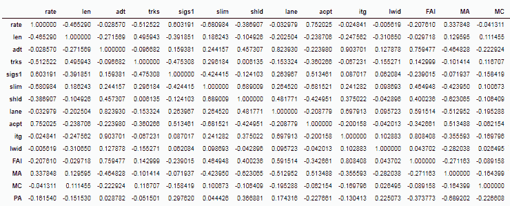
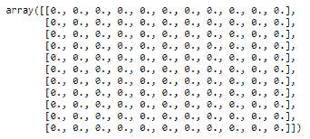
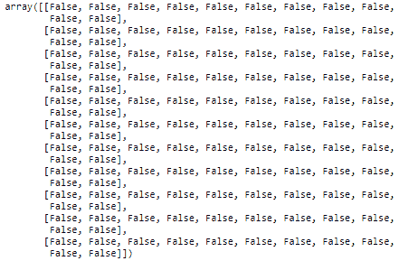

# 使用 5 个简单步骤创建相关矩阵的注释热图

> 原文：[`www.kdnuggets.com/2019/07/annotated-heatmaps-correlation-matrix.html`](https://www.kdnuggets.com/2019/07/annotated-heatmaps-correlation-matrix.html)

comments

**作者 [Julia Kho](https://www.linkedin.com/in/juliakho/)，数据科学家**


热图是一种数据的图形表示方式，其中数据值通过颜色表示。也就是说，它通过颜色来传达一个值给读者。当你处理大量数据时，这是一个很好的工具，可以帮助观众关注最重要的区域。

在本文中，我将引导你通过 5 个简单步骤创建你自己的相关矩阵注释热图。

1.  导入数据

1.  创建相关矩阵

1.  设置掩码以隐藏上三角

1.  在 Seaborn 中创建热图

1.  导出热图

你可以在我的 Jupyter Notebook 中找到这篇文章中的代码，位置在[这里](https://github.com/julia-git/Annotated_Heatmap)。

**1) 导入数据**

```py

df = pd.read_csv(“Highway1.csv”, index_col = 0)

```


这个高速公路事故数据集包含汽车事故率（每百万车公里的事故数）以及若干设计变量。关于数据集的更多信息可以在[这里](https://vincentarelbundock.github.io/Rdatasets/doc/carData/Highway1.html)找到。

**2) 创建相关矩阵**

```py

corr_matrix = df.corr()

```


我们通过 `.corr` 创建相关矩阵。请注意，htype 列在该矩阵中不存在，因为它不是数字型的。我们需要对 htype 进行虚拟化以计算相关性。

```py

df_dummy = pd.get_dummies(df.htype)
df = pd.concat([df, df_dummy], axis = 1)

```



此外，请注意相关矩阵的上三角部分对称于下三角部分。因此，我们的热图无需显示整个矩阵。在下一步中，我们将隐藏上三角部分。

**3) 设置掩码以隐藏上三角**

```py

mask = np.zeros_like(corr_matrix, dtype=np.bool)
mask[np.triu_indices_from(mask)]= True

```

让我们来解析上面的代码。`np.zeros_like()` 返回一个与给定数组具有相同形状和类型的零数组。通过传入相关矩阵，我们得到了如下的零数组。



`dtype=np.bool` 参数覆盖了数据类型，因此我们的数组是布尔数组。



`np.triu_indices_from(mask)` 返回数组上三角部分的索引。


现在，我们将上三角部分设置为 True。

`mask[np.triu_indices_from(mask)]= True`


现在，我们有一个可以用来生成热图的掩码。

**4) 在 Seaborn 中创建热图**

```py

f, ax = plt.subplots(figsize=(11, 15))

heatmap = sns.heatmap(corr_matrix,
                      mask = mask,
                      square = True,
                      linewidths = .5,
                      cmap = ’coolwarm’,
                      cbar_kws = {'shrink': .4,
                                ‘ticks’ : [-1, -.5, 0, 0.5, 1]},
                      vmin = -1,
                      vmax = 1,
                      annot = True,
                      annot_kws = {“size”: 12})

#add the column names as labels
ax.set_yticklabels(corr_matrix.columns, rotation = 0)
ax.set_xticklabels(corr_matrix.columns)

sns.set_style({'xtick.bottom': True}, {'ytick.left': True})

```


为了创建我们的热图，我们传入第 3 步中的相关矩阵和第 4 步中创建的掩码，以及自定义参数使热图更美观。如果你有兴趣了解每一行的作用，下面是参数的说明。

```py

#Makes each cell square-shaped.
square = True,
#Set width of the lines that will divide each cell to .5
linewidths = .5,
#Map data values to the coolwarm color space
cmap = 'coolwarm',
#Shrink the legend size and label tick marks at [-1, -.5, 0, 0.5, 1]
cbar_kws = {'shrink': .4, ‘ticks’ : [-1, -.5, 0, 0.5, 1]},
#Set min value for color bar
vmin = -1,
#Set max value for color bar
vmax = 1,
#Turn on annotations for the correlation values
annot = True,
#Set annotations to size 12
annot_kws = {“size”: 12})
#Add column names to the x labels
ax.set_xticklabels(corr_matrix.columns)
#Add column names to the y labels and rotate text to 0 degrees
ax.set_yticklabels(corr_matrix.columns, rotation = 0)
#Show tickmarks on bottom and left of heatmap
sns.set_style({'xtick.bottom': True}, {'ytick.left': True})

```

**5) 导出热图**

现在你有了热图，我们来导出它。

`heatmap.get_figure().savefig(‘heatmap.png’, bbox_inches=’tight’)`

如果你发现你有一个非常大的热图导出不正确，可以使用`bbox_inches = ‘tight’`来防止图像被裁剪。

感谢阅读！欢迎在下面的评论中分享你制作的热图。

**个人简介： [Julia Kho](https://www.linkedin.com/in/juliakho/)** 是一位对创意问题解决和用数据讲故事充满热情的数据科学家。她曾在环境咨询和空间数据处理方面有过经验。

[原文](https://towardsdatascience.com/annotated-heatmaps-in-5-simple-steps-cc2a0660a27d)。经许可转载。

**相关：**

+   PyViz：简化 Python 中的数据可视化过程

+   让你的数据发声!

+   适用于小型和大型数据的最佳数据可视化技术

* * *

## 我们的三大课程推荐

 1\. [Google 网络安全证书](https://www.kdnuggets.com/google-cybersecurity) - 快速进入网络安全职业生涯。

 2\. [Google 数据分析专业证书](https://www.kdnuggets.com/google-data-analytics) - 提升你的数据分析技能

 3\. [Google IT 支持专业证书](https://www.kdnuggets.com/google-itsupport) - 支持你所在的组织进行 IT 工作

* * *

### 更多相关话题

+   [Python 中的稀疏矩阵表示](https://www.kdnuggets.com/2020/05/sparse-matrix-representation-python.html)

+   [傻瓜指南：精准度、召回率和混淆矩阵](https://www.kdnuggets.com/2020/01/guide-precision-recall-confusion-matrix.html)

+   [在 Scikit-learn 中可视化混淆矩阵](https://www.kdnuggets.com/2022/09/visualizing-confusion-matrix-scikitlearn.html)

+   [使用 tfidfvectorizer 将文本文档转换为 TF-IDF 矩阵](https://www.kdnuggets.com/2022/09/convert-text-documents-tfidf-matrix-tfidfvectorizer.html)

+   [混淆矩阵、精准度和召回率解释](https://www.kdnuggets.com/2022/11/confusion-matrix-precision-recall-explained.html)

+   [数据科学（或机器学习）的矩阵乘法](https://www.kdnuggets.com/2022/11/matrix-multiplication-data-science-machine-learning.html)
