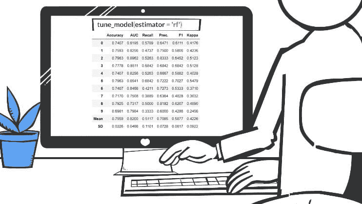
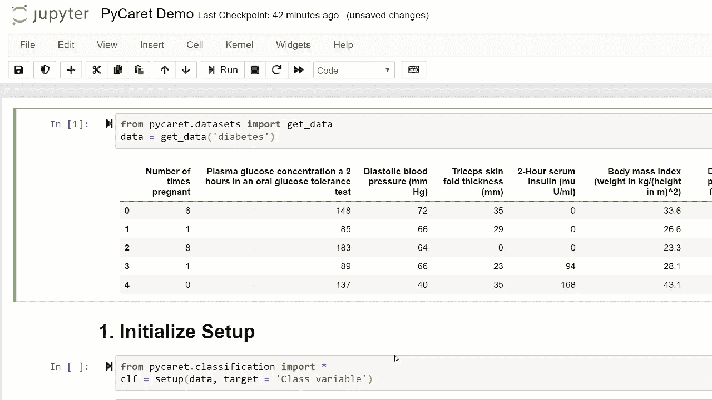
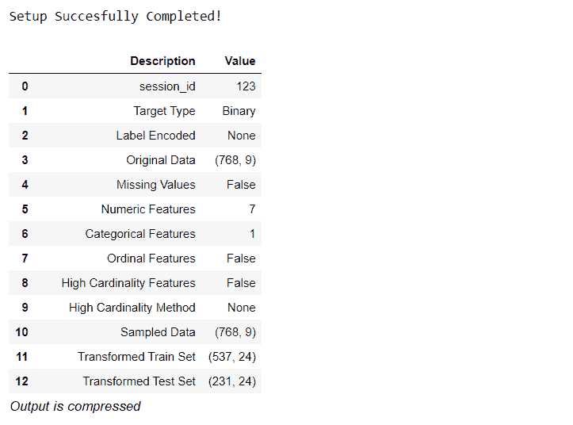
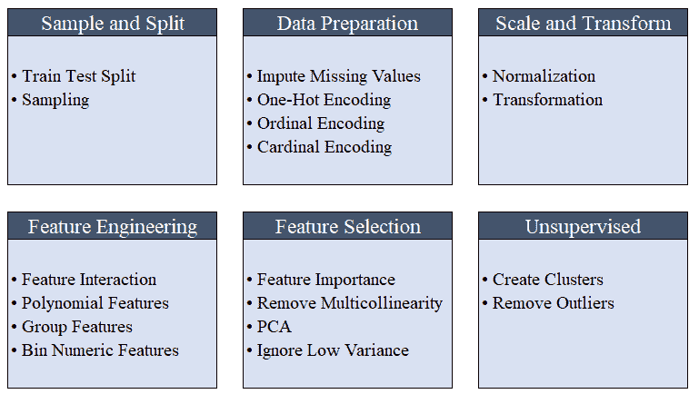
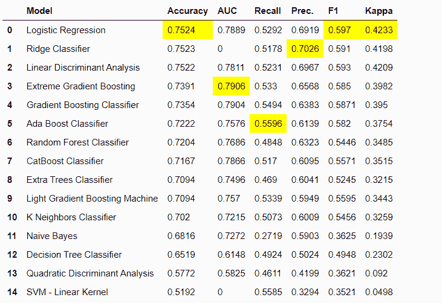
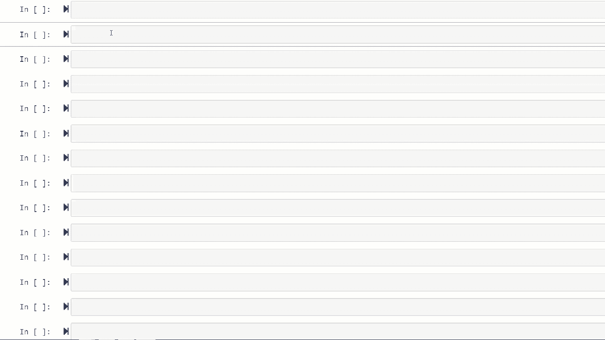
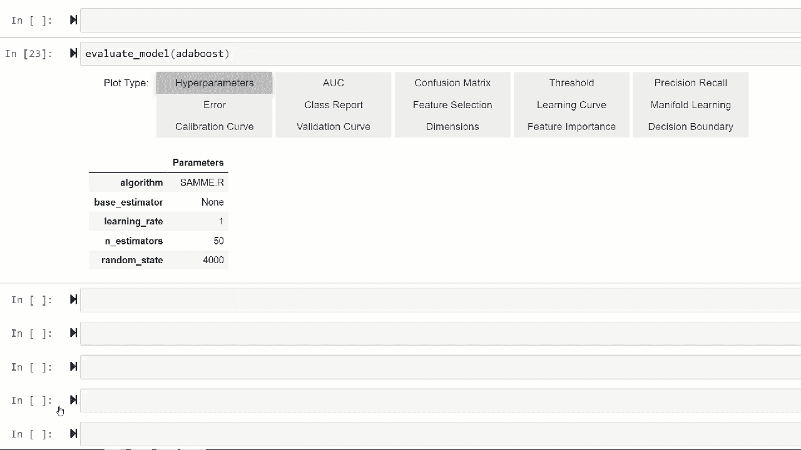
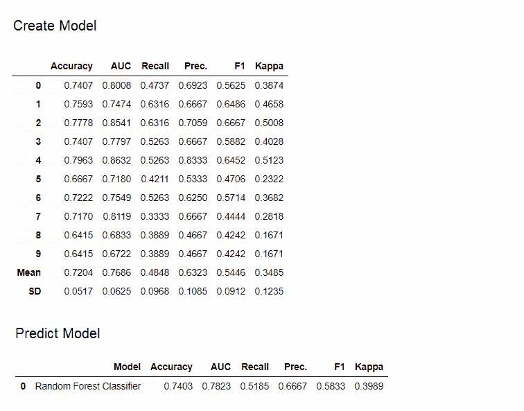
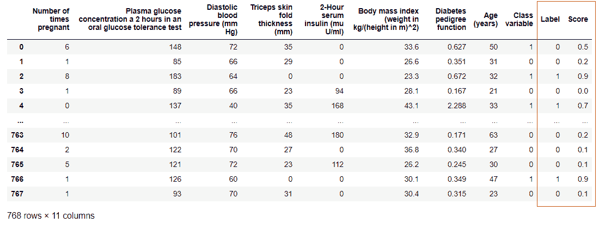

# 宣布 PyCaret 1.0.0

> 原文：[`www.kdnuggets.com/2020/04/announcing-pycaret.html`](https://www.kdnuggets.com/2020/04/announcing-pycaret.html)

评论

**由 [Moez Ali](https://www.linkedin.com/in/profile-moez/)，PyCaret 创始人及作者**



我们很高兴地宣布 [PyCaret](https://www.pycaret.org/)，一个开源的 Python 机器学习库，用于在**低代码**环境中训练和部署监督学习和无监督学习模型。PyCaret 让你可以在选择的笔记本环境中，从准备数据到部署模型，只需几秒钟。

与其他开源机器学习库相比，PyCaret 是一个替代的低代码库，可以用少量代码替代数百行代码。这使得实验速度快且高效。PyCaret 实质上是几个机器学习库和框架的 Python 包装器，如 [scikit-learn](https://scikit-learn.org/stable/)、 [XGBoost](https://xgboost.readthedocs.io/en/latest/)、 [Microsoft LightGBM](https://github.com/microsoft/LightGBM)、 [spaCy](https://spacy.io/) 等。

PyCaret 是**简单且** **易于使用**的。PyCaret 中执行的所有操作都顺序存储在一个**管道**中，该管道完全为**部署**而编排。无论是填补缺失值、转换分类数据、特征工程还是超参数调整，PyCaret 都能自动完成。要了解更多关于 PyCaret 的信息，请观看这个 1 分钟的视频。

*PyCaret 1.0.0 发布公告 — 一个开源、低代码的 Python 机器学习库*

### 入门 PyCaret

PyCaret 1.0.0 的第一个稳定版本可以使用 pip 安装。使用命令行界面或笔记本环境，运行以下代码单元以安装 PyCaret。

```py
pip install pycaret
```

如果你使用 [Azure notebooks](https://notebooks.azure.com/) 或 [Google Colab](https://colab.research.google.com/)，请运行以下代码单元以安装 PyCaret。

```py
!pip install pycaret
```

当你安装 PyCaret 时，所有依赖项会自动安装。 [点击这里](https://github.com/pycaret/pycaret/blob/master/requirements.txt) 查看完整依赖项列表。

### 再简单不过了 ????



### ???? 分步教程

### 1\. 获取数据

在这个分步教程中，我们将使用**‘diabetes’** 数据集，目标是根据血压、胰岛素水平、年龄等多个因素预测患者结果（0 或 1）。数据集可在 PyCaret 的 [github 仓库](https://github.com/pycaret/pycaret) 中找到。直接从仓库导入数据集的最简单方法是使用来自**pycaret.datasets**模块的**get_data**函数。

```py
from **pycaret.datasets** import **get_data**
diabetes = **get_data**('diabetes')
```


从 get_data 输出

???? PyCaret 可以直接与**pandas** 数据框配合使用。

### 2\. 设置环境

PyCaret 中任何机器学习实验的第一步是通过导入所需的模块并初始化**setup**( )来设置环境。此示例中使用的模块是 [**pycaret.classification**](https://www.pycaret.org/classification)**.**

一旦导入模块，**setup()**通过定义数据框（*‘diabetes’*）和目标变量（*‘Class variable’*）来初始化。

```py
from **pycaret.classification** import ***** exp1 = **setup**(diabetes, target = 'Class variable')
```



所有预处理步骤都在**setup()**中应用。PyCaret 提供了超过 20 个功能来准备机器学习数据，基于在*setup*函数中定义的参数创建转换管道。它自动协调所有依赖关系于**管道**中，因此您无需手动管理测试或未见数据集上的转换的顺序执行。PyCaret 的管道可以轻松地在不同环境之间转移，以进行大规模运行或轻松部署到生产环境。以下是 PyCaret 在首次发布时提供的预处理功能。



PyCaret 的预处理能力

数据预处理步骤，如缺失值填充、分类变量编码、标签编码（将是或否转换为 1 或 0）和训练-测试-拆分，在初始化 setup() 时会自动执行。 [点击这里](https://www.pycaret.org/preprocessing) 了解更多有关 PyCaret 预处理能力的信息。

### 3\. 比较模型

这是在监督机器学习实验中（[分类](https://www.pycaret.org/classification) 或 [回归](https://www.pycaret.org/regression)）推荐的第一步。该函数训练模型库中的所有模型，并使用 k 折交叉验证（默认 10 折）比较常见的评估指标。使用的评估指标有：

+   **分类模型：**准确率、AUC、召回率、精确度、F1、Kappa

+   **回归模型：**MAE, MSE, RMSE, R2, RMSLE, MAPE

```py
**compare_models**()
```



compare_models() 函数的输出

默认情况下，指标使用 10 折交叉验证进行评估。可以通过更改 ***fold ***参数的值来进行更改。

默认情况下，表格按‘Accuracy’（从高到低）值排序。可以通过更改 ***sort ***参数的值进行更改。

### 4\. 创建模型

在 PyCaret 的任何模块中创建模型就像编写**create_model**一样简单。它只需要一个参数，即作为字符串输入传递的模型名称。该函数返回一个包含 k 折交叉验证分数和一个训练过的模型对象的表格。

```py
adaboost = **create_model**('ada')
```


变量 ‘adaboost’ 存储了由**create_model**函数返回的训练模型对象，这是一个 scikit-learn 估计器。可以通过在变量后使用*句点（ . ）*来访问训练对象的原始属性。见下例。



训练模型对象的属性

???? PyCaret 提供了超过 60 种开源现成的算法。 [点击这里](https://www.pycaret.org/create-model) 查看 PyCaret 中可用的所有估计器/模型的完整列表。

### 5\. 调整模型

**tune_model** 函数用于自动调整机器学习模型的超参数。PyCaret 使用**随机网格搜索**在预定义的搜索空间中进行。这一函数返回一个包含 k 折交叉验证分数和一个训练模型对象的表格。

```py
tuned_adaboost = tune_model('ada')
```


???? **tune_model** 函数在无监督模块如 [pycaret.nlp](https://www.pycaret.org/nlp)、[pycaret.clustering](https://www.pycaret.org/clustering)和 [pycaret.anomaly](https://www.pycaret.org/anomaly)中可以与监督模块一起使用。例如，PyCaret 的 NLP 模块可以通过评估来自监督机器学习模型的目标/成本函数（如‘准确率’或‘R2’）来调整*主题数量*参数。

### 6\. 集成模型

**ensemble_model** 函数用于集成训练后的模型。它只接受一个参数，即训练模型对象。此函数返回一个包含 k 折交叉验证分数和一个训练模型对象的表格。

```py
# creating a decision tree model
dt = **create_model**('dt')# ensembling a trained dt model
dt_bagged = **ensemble_model**(dt)
```


???? 默认使用‘Bagging’方法进行集成，通过在 ***method*** 参数中使用‘Boosting’可以进行更改。

???? PyCaret 还提供了 [blend_models](https://www.pycaret.org/blend-models) 和 [stack_models](https://www.pycaret.org/stack-models) 功能，用于集成多个训练后的模型。

### 7\. 绘制模型

使用**plot_model** 函数可以对训练好的机器学习模型进行性能评估和诊断。它接受一个训练模型对象和类型为字符串的绘图类型作为输入。

```py
# create a model
adaboost = **create_model**('ada')# AUC plot
**plot_model**(adaboost, plot = 'auc')# Decision Boundary
**plot_model**(adaboost, plot = 'boundary')# Precision Recall Curve
**plot_model**(adaboost, plot = 'pr')# Validation Curve
**plot_model**(adaboost, plot = 'vc')
```


[点击这里](https://www.pycaret.org/plot-model) 了解更多关于 PyCaret 中不同可视化的信息。

或者，你可以使用**evaluate_model** 函数通过用户界面在笔记本中查看图表。

```py
**evaluate_model**(adaboost)
```



???? **plot_model** 函数在**pycaret.nlp** 模块中可用于可视化*文本语料库*和*语义主题模型*。 [点击这里](https://pycaret.org/plot-model/#nlp) 了解更多信息。

### 8\. 解释模型

当数据中的关系是非线性时，这在现实生活中很常见，我们通常会看到基于树的模型比简单的高斯模型表现更好。然而，这也意味着失去了可解释性，因为树基模型不像线性模型那样提供简单的系数。PyCaret 使用 [SHAP (SHapley Additive exPlanations](https://shap.readthedocs.io/en/latest/) 函数来实现**interpret_model**。

```py
# create a model
xgboost = **create_model**('xgboost')# summary plot
**interpret_model**(xgboost)# correlation plot
**interpret_model**(xgboost, plot = 'correlation')
```


测试数据集中某个数据点的解释（也称为 reason 参数）可以使用 'reason' 图进行评估。在下面的示例中，我们检查的是测试数据集中的第一个实例。

```py
**interpret_model**(xgboost, plot = 'reason', observation = 0) 
```


### 9\. 预测模型

迄今为止，我们看到的结果仅基于训练数据集上的 k-fold 交叉验证（默认为 70%）。为了查看模型在测试/持出数据集上的预测和性能，使用 **predict_model** 函数。

```py
# create a model
rf = **create_model**('rf')# predict test / hold-out dataset
rf_holdout_pred **= predict_model**(rf)
```



**predict_model** 函数也用于预测未见过的数据集。现在，我们将使用与训练相同的数据集作为 *代理* 来进行新未见数据集的预测。在实际应用中，**predict_model** 函数会迭代使用，每次都使用一个新的未见数据集。

```py
predictions = **predict_model**(rf, data = diabetes)
```



**predict_model** 函数还可以预测使用 [stack_models](https://www.pycaret.org/stack-models) 和 [create_stacknet](https://www.pycaret.org/classification/#create-stacknet) 函数创建的一系列模型。

**predict_model** 函数还可以直接从托管在 AWS S3 上的模型进行预测，使用 [deploy_model](https://www.pycaret.org/deploy-model) 函数。

### 10\. 部署模型

利用训练好的模型对未见过的数据集生成预测的一种方法是使用与模型训练相同的笔记本/IDE 中的 **predict_model** 函数。然而，对未见数据集进行预测是一个迭代过程；根据使用情况，预测的频率可以从实时预测到批量预测。PyCaret 的 **deploy_model** 函数允许将包括训练模型在内的整个流程从笔记本环境部署到云端。

```py
**deploy_model**(model = rf, model_name = 'rf_aws', platform = 'aws', 
             authentication =  {'bucket'  : 'pycaret-test'})
```

### 11\. 保存模型 / 保存实验

训练完成后，包含所有预处理转换和训练模型对象的整个流程可以保存为二进制 pickle 文件。

```py
# creating model
adaboost = **create_model**('ada')# saving model **save_model**(adaboost, model_name = 'ada_for_deployment')
```


你还可以将包括所有中间输出在内的整个实验保存为一个二进制文件。

```py
**save_experiment**(experiment_name = 'my_first_experiment')
```


**load_model** 和 **load_experiment** 函数可以用于加载保存的模型和保存的实验，这些函数在 PyCaret 的所有模块中都可用。

### 12\. 下一个教程

在下一个教程中，我们将展示如何在 Power BI 中使用训练好的机器学习模型，以在实际生产环境中生成批量预测。

请参见我们这些模块的初学者级别的笔记本：

[回归](https://www.pycaret.org/reg101)

[聚类](https://www.pycaret.org/clu101)

[异常检测](https://www.pycaret.org/anom101)

[自然语言处理](https://www.pycaret.org/nlp101)

[关联规则挖掘](https://www.pycaret.org/arul101)

### 开发流程中有哪些内容？

我们正在积极改进 PyCaret。我们的未来开发计划包括一个新的 **时间序列预测** 模块、与 **TensorFlow** 的集成以及 PyCaret 可扩展性的重大改进。如果你想分享你的反馈并帮助我们进一步改进，可以 [填写此表单](https://www.pycaret.org/feedback) 或在我们的 [GitHub](https://www.github.com/pycaret/) 或 [LinkedIn](https://www.linkedin.com/company/pycaret/) 页面留言。

### 想了解特定模块吗？

自 1.0.0 版本首次发布以来，PyCaret 现已提供以下模块供使用。点击下面的链接查看文档和工作示例。

[分类](https://www.pycaret.org/classification)

[回归分析](https://www.pycaret.org/regression) [聚类](https://www.pycaret.org/clustering)

[异常检测](https://www.pycaret.org/anomaly-detection) [自然语言处理](https://www.pycaret.org/nlp)

[关联规则挖掘](https://www.pycaret.org/association-rules)

### 重要链接

[用户指南 / 文档](https://www.pycaret.org/guide)

[Github 仓库](https://www.github.com/pycaret/pycaret)

[安装 PyCaret](https://www.pycaret.org/install)

[Notebook 教程](https://www.pycaret.org/tutorial)

[在 PyCaret 中贡献](https://www.pycaret.org/contribute)

如果你喜欢 PyCaret，请在我们的 GitHub 仓库上给我们 ⭐️。

想了解更多 PyCaret 的信息，请关注我们的 [LinkedIn](https://www.linkedin.com/company/pycaret/) 和 [Youtube](https://www.youtube.com/channel/UCxA1YTYJ9BEeo50lxyI_B3g)。

**Bio: [Moez Ali](https://www.linkedin.com/in/profile-moez/)** 是一名数据科学家，也是 PyCaret 的创始人和作者。

[原文](https://towardsdatascience.com/announcing-pycaret-an-open-source-low-code-machine-learning-library-in-python-4a1f1aad8d46)。经许可转载。

**相关：**

+   机器学习堆栈中的一个关键缺失部分

+   通过公共 API 共享你的机器学习模型

+   轻松使用 torchlayers 构建 PyTorch 模型

* * *

## 我们的前三个课程推荐

 1\. [Google 网络安全证书](https://www.kdnuggets.com/google-cybersecurity) - 快速进入网络安全职业生涯。

 2\. [Google 数据分析专业证书](https://www.kdnuggets.com/google-data-analytics) - 提升你的数据分析技能

 3\. [Google IT 支持专业证书](https://www.kdnuggets.com/google-itsupport) - 支持你组织的 IT 需求

* * *

### 更多相关主题

+   [宣布 PyCaret 3.0：开源、低代码 Python 机器学习](https://www.kdnuggets.com/2023/03/announcing-pycaret-30-opensource-lowcode-machine-learning-python.html)

+   [宣布博客写作比赛，获胜者将获得 NVIDIA GPU！](https://www.kdnuggets.com/2022/11/blog-writing-contest-nvidia-gpu.html)

+   [使用 PyCaret 进行二分类介绍](https://www.kdnuggets.com/2021/12/introduction-binary-classification-pycaret.html)

+   [使用 PyCaret 进行 Python 聚类介绍](https://www.kdnuggets.com/2021/12/introduction-clustering-python-pycaret.html)

+   [PyCaret 入门指南](https://www.kdnuggets.com/2022/11/getting-started-pycaret.html)
