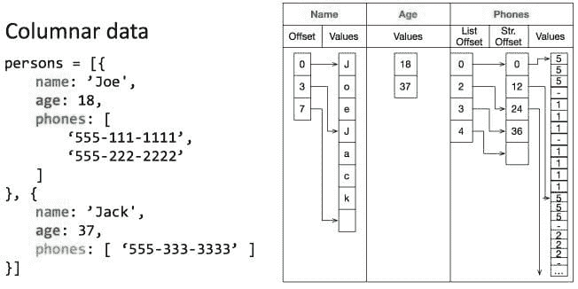
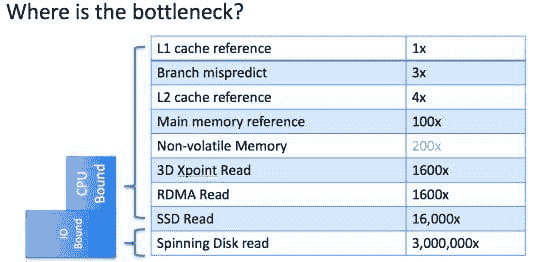
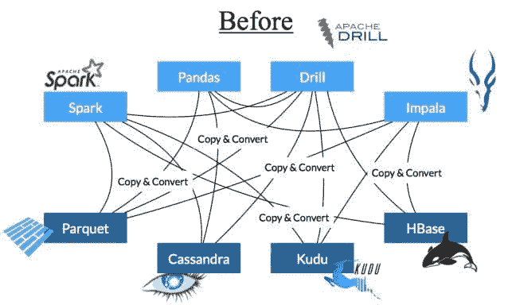
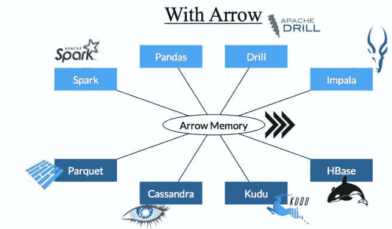
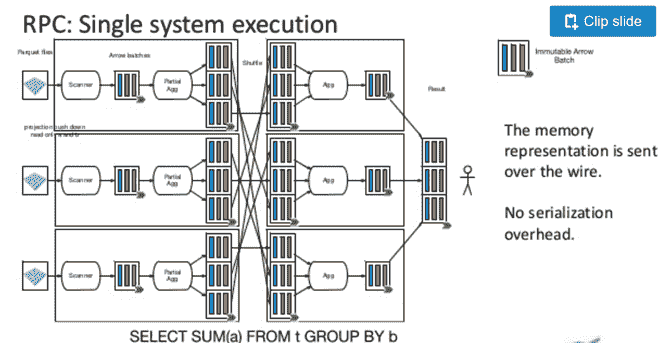

# Apache Arrow 和 Apache Parquet：为何我们需要针对列式数据的不同项目，用于磁盘和内存

> 原文：[`www.kdnuggets.com/2017/02/apache-arrow-parquet-columnar-data.html`](https://www.kdnuggets.com/2017/02/apache-arrow-parquet-columnar-data.html)

**作者：Julien LeDem，架构师，[Dremio](http://www.dremio.com/)。**

列式数据结构相比传统的行式数据结构在分析方面提供了许多性能优势。这些优势包括磁盘上的数据——更少的磁盘寻道，更有效的压缩，更快的扫描速度——以及内存中数据的 CPU 使用效率。今天，列式数据非常普遍，并被大多数分析数据库实现，包括 Teradata、Vertica、Oracle 等。

* * *

## 我们的三大课程推荐

 1\. [谷歌网络安全证书](https://www.kdnuggets.com/google-cybersecurity) - 加快进入网络安全职业的步伐。

 2\. [谷歌数据分析专业证书](https://www.kdnuggets.com/google-data-analytics) - 提升您的数据分析能力

 3\. [谷歌 IT 支持专业证书](https://www.kdnuggets.com/google-itsupport) - 支持您的组织的 IT

* * *

在 2012 年和 2013 年，我们 Twitter 和 Cloudera 的几个人创建了 Apache Parquet（最初称为 Red Elm，是 Google Dremel 的变位词），以将这些思想引入 Hadoop 生态系统。四年后，Parquet 成为磁盘上列式数据的标准，新的项目 Apache Arrow 随之出现，成为内存中列式数据的标准表示方式。本文将深入探讨我们为何需要两个项目，一个用于存储磁盘数据，一个用于处理内存数据，以及它们如何协同工作。

### 行的缺陷是什么，列的优点是什么？

在 2007 年，Vertica，一个早期的商业列式数据库，曾有一个聪明的营销口号“表格已转变”。这并不是一种糟糕的方式来形象化列式数据库的工作方式——将表格旋转 90 度，现在原本是读取行的变成了读取单列。这种方法在分析工作负载中具有许多优势。

大多数系统设计的目的是最小化磁盘寻道次数和扫描的数据量，因为这些操作可能会增加延迟。在事务处理工作负载中，当数据写入行式数据库的表中时，给定行的列被连续写入磁盘，这对于写入非常高效。分析工作负载则有所不同，因为大多数查询一次读取大量行的一个小列子集。在传统的行式数据库中，系统可能会对每一行进行寻道，并且大多数列会从磁盘读取到内存中，这是不必要的。

列式数据库将给定列的值在磁盘上连续组织。这具有显著减少多行读取寻址次数的优势。此外，压缩算法在单一数据类型上往往比在典型行中的混合类型上更为有效。其权衡在于写入速度较慢，但这对于分析而言是一个很好的优化，因为读取通常远远多于写入。

### 列式存储，与 Hadoop 会面

在 Twitter，我们是 Hadoop 的大用户，Hadoop 很可扩展，擅长存储各种数据，并且能够将负载并行化到数百或数千台服务器上。一般来说，Hadoop 的延迟较高，因此我们也大量使用 Vertica，这为我们提供了出色的性能，但只适用于我们数据的一个小子集。

我们认为通过在 HDFS 中更好地组织列式模型数据，我们可以显著提高 Hadoop 在分析作业中的性能，主要是 Hive 查询，但也适用于其他项目。当时我们大约有 4 亿用户，每天生成超过 100TB 的压缩数据，因此这个项目受到了广泛关注。

在早期测试中，我们看到了很多好处：我们减少了 28% 的存储开销，并且读取单列的时间减少了 90%。我们不断改进，添加了列特定压缩选项、字典压缩、位打包和游程长度编码，最终将存储再减少了 52%，读取时间再减少了 48%。

Parquet 还被设计用于处理像 JSON 这样的丰富结构数据。这对我们在 Twitter 和许多早期采用者来说非常有益，如今大多数 Hadoop 用户将数据存储在 Parquet 中。Hadoop 生态系统中的 Spark、Presto、Hive、Impala、Drill、Kite 等都广泛支持 Parquet。即使在 Hadoop 之外，它也在一些科学社区中得到了采用，例如 CERN 的 ROOT 项目。

### 基于 Parquet 思路的内存处理

自 Google 最初的论文激发 Hadoop 以来的 15 年里，硬件发生了很大变化。最重要的变化是 RAM 价格的显著下降。

目前的服务器拥有比我在 Twitter 时更多的 RAM，因为从内存中读取数据比从磁盘读取数据快上千倍，因此在数据领域中，如何为分析优化 RAM 的使用受到了极大的关注。

列式数据的权衡与内存中的情况不同。对于磁盘上的数据，通常 IO 主导延迟，这可以通过激进的压缩来解决，但会牺牲 CPU 性能。在内存中，访问速度更快，我们希望通过关注缓存局部性、流水线处理和 SIMD 指令来优化 CPU 吞吐量。

### 精简系统之间的接口

计算机科学中的一个有趣之处在于，尽管有一组共同的资源——RAM、CPU、存储、网络——但每种语言与这些资源的交互方式完全不同。当不同程序需要交互时——无论是在语言内还是跨语言——这些交接中的低效可能主导整体成本。这有点像在欧元出现之前的欧洲旅行，你需要每个国家不同的货币，到旅程结束时，你可以肯定因为所有的兑换而损失了很多钱！

我们认为这些交接是内存处理中的下一个明显瓶颈，因此着手在广泛的项目中开发一组通用接口，以消除在数据传输时不必要的序列化和反序列化。Apache Arrow 标准化了一种高效的内存列式表示，它与网络表示相同。今天，它在 13 个以上的项目中包括了一级绑定，包括 Spark、Hadoop、R、Python/Pandas 和我的公司 Dremio。

Python 在 Pandas 库中特别有很强的支持，并支持直接处理 Arrow 记录批次并将其持久化到 Parquet。

对于 Apache Arrow 来说，这仍然是早期阶段，但结果非常有前景。用户在各种工作负载中看到性能提升 10 倍到 100 倍并不少见。

### Parquet 和 Arrow 的协作

Parquet 和 Arrow 之间的互操作性从一开始就是目标。虽然每个项目都可以独立使用，但它们都提供了读取和写入格式之间的 API。 

由于两者都是列式存储，我们可以实现高效的向量化转换器，将一种格式转换为另一种格式，并且从 Parquet 读取到 Arrow 的速度比行式表示要快得多。我们仍在寻找使这种集成更加无缝的方法，包括一个向量化的 Java 读取器和完全类型等效性。

Pandas 是使用这两个项目的一个很好的例子。用户可以将 Pandas 数据框保存为 Parquet 并将 Parquet 文件读取到内存中的 Arrow。Pandas 可以直接在 Arrow 列上操作，为更快的 Spark 集成铺平道路。

在我当前的公司 Dremio，我们正在努力开发一个广泛使用 Apache Arrow 和 Apache Parquet 的新项目。你可以在 [www.dremio.com](http://www.dremio.com) 上了解更多信息。

**个人简介：** Julien LeDem，建筑师，[Dremio](http://www.dremio.com)的联合创始人，Apache Parquet 项目的 PMC 主席。他还是 Apache Pig 的提交者和 PMC 成员。Julien 是 Dremio 的建筑师，曾担任 Twitter 数据处理工具的技术负责人，并获得了一个两个字符的 Twitter 用户名（[@J_](https://twitter.com/j_))。在 Twitter 之前，Julien 在 Yahoo!担任首席工程师和技术负责人，工作于内容平台，并获得了 Hadoop 的初步培训。

**相关内容：**

+   Tungsten 的 Spark 更加明亮

+   大数据的 Spark：机器学习

+   大内存正在吞噬大数据——用于分析的数据集规模

### 更多相关话题

+   [成为出色数据科学家所需的 5 项关键技能](https://www.kdnuggets.com/2021/12/5-key-skills-needed-become-great-data-scientist.html)

+   [生成性 AI 时代，数据科学家还需要吗？](https://www.kdnuggets.com/2023/06/data-scientists-still-needed-age-generative-ai.html)

+   [低代码：开发者仍然需要吗？](https://www.kdnuggets.com/2022/04/low-code-developers-still-needed.html)

+   [在 Python 中加载数据的 5 种不同方法](https://www.kdnuggets.com/2020/08/5-different-ways-load-data-python.html)

+   [数据挖掘与机器学习有何不同？](https://www.kdnuggets.com/2022/06/data-mining-different-machine-learning.html)

+   [如何从不同背景过渡到数据科学？](https://www.kdnuggets.com/2023/05/transition-data-science-different-background.html)
