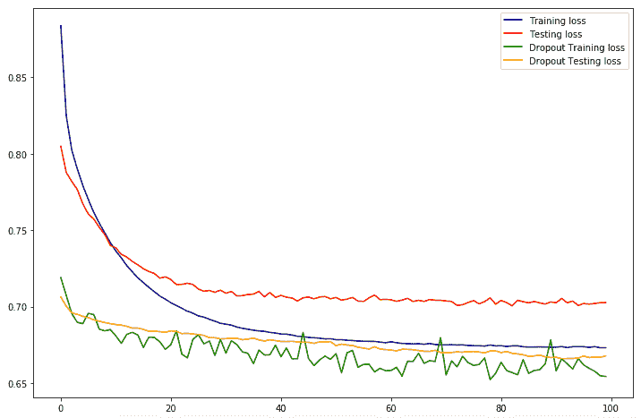
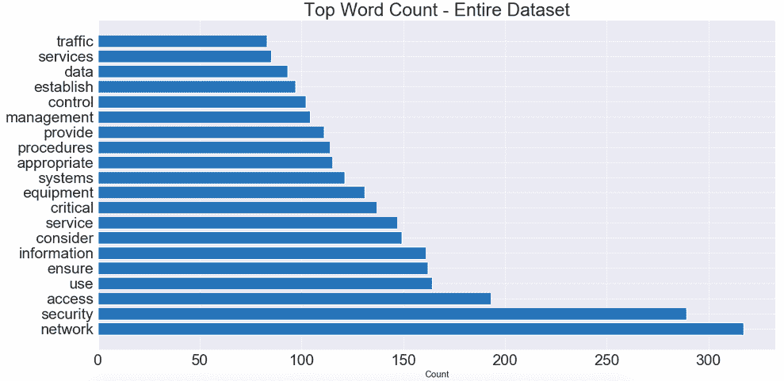
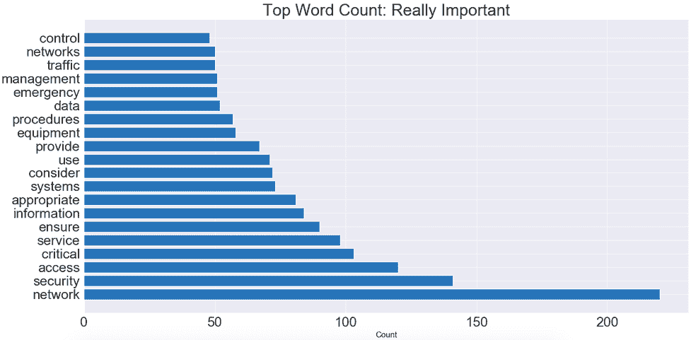
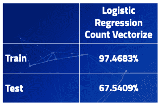
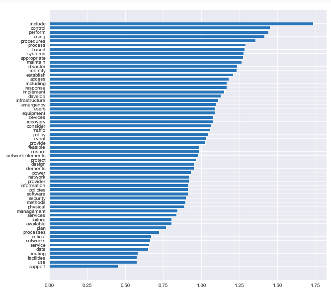

# 将数据科学应用于网络安全网络攻击与事件

> 原文：[`www.kdnuggets.com/2019/09/applying-data-science-cybersecurity-network-attacks-events.html`](https://www.kdnuggets.com/2019/09/applying-data-science-cybersecurity-network-attacks-events.html)

评论

**由 [Aakash Sharma](https://www.linkedin.com/in/aakashsharma21/) 撰写，数据科学家**

网络世界是一个广阔的概念。那时，我决定在大学本科期间进入网络安全领域。我被理解恶意软件、网络安全、渗透测试以及加密方面的概念所吸引，这些都在网络安全中扮演了重要角色。

* * *

## 我们的前三个课程推荐

 1\. [Google 网络安全证书](https://www.kdnuggets.com/google-cybersecurity) - 快速进入网络安全职业生涯。

 2\. [Google 数据分析专业证书](https://www.kdnuggets.com/google-data-analytics) - 提升您的数据分析水平

 3\. [Google IT 支持专业证书](https://www.kdnuggets.com/google-itsupport) - 支持您组织的 IT

* * *

能够保护基础设施是重要的，但仍然很有趣。当然有编码，但我从未真正学过如何将代码实现到网络安全原则中。这正是我接下来想要了解的内容，可以扩展我在信息技术和计算机科学方面的知识。我学到了更多关于编码的知识，尤其是在 Python 中。我对 Scala 有一些涉猎，并且在本科阶段已经对 Sequel 和 Java 应用程序有了很好的基础，在训练营期间学习这些让我感到更加自信。

数据科学沉浸式课程教会了我如何通过 Sequel、JSON、HTML 或网页抓取应用程序收集数据，然后对数据进行清洗，并应用与 Python 相关的代码进行统计分析。然后，我能够对数据进行建模，以发现趋势、做出预测或提供建议/推荐。我想将这些应用到我在 Cisco NetaCad、网络安全原则和软件开发方面的背景中。


FCC 标志

我随后想将此与我的网络安全背景联系起来。我决定从 Data.org 收集有关联邦通信委员会（FCC）的大量网络攻击数据。在这篇博客文章中，我决定写下我如何将数据科学知识与网络安全背景结合到现实世界的行业中。我将提供项目的一些背景信息，代码示例，并提供一些关于 FCC 如何更好地理解数据的见解。这可能对未来的情况或其他政府相关的网络安全项目有所帮助。

据我了解，FCC 遵循 CSRIC 最佳实践搜索工具，该工具允许您使用多种标准搜索 CSRIC 的最佳实践集合，包括网络类型、行业角色、关键词、优先级水平和 BP 编号。

通信安全、可靠性与互操作性委员会（CSRIC）的使命是向 FCC 提供建议，以确保，包括电信、媒体和公共安全在内的通信系统的最佳安全性和可靠性。

CSRIC 的成员关注一系列公共安全和国土安全相关的通信问题，包括：（1）通信系统和基础设施的可靠性和安全性，特别是移动系统；（2）911、增强型 911（E911）和下一代 911（NG911）；（3）紧急警报。

CSRIC 的建议将涉及对有害网络事件的预防和修复、制定最佳实践以提高整体通信可靠性、在自然灾害、恐怖袭击、网络安全攻击或其他对通信基础设施造成异常压力的事件中的通信服务的可用性和性能、在广泛或重大中断事件中迅速恢复通信服务，以及通信提供商可以采取的步骤，以帮助保护最终用户和服务器。

对我来说，处理这个项目的第一步是了解我需要完成的任务和这个项目的方向。我记得我需要向 FCC 提供建议，以确保电信、媒体和公共安全通信系统的最佳安全性和可靠性。

我在进行这个项目时考虑了不同的方法。第一种方法是直接深入数据本身，我关注了事件的优先级，并应用了大量的机器学习分类模型。第二种方法是能够对事件描述应用自然语言处理技术，并观察这与事件优先级的相关性。

通过这些，我们可以进行预测，并在此基础上提出建议，以更好地预防、理解或控制事件。我的想法是，如果我们能够通过解决较简单的事件来专注于更关键的事件，我们可以节省足够的资源，以进一步改善系统，以应对更复杂的事件。

所需条件：

+   一个 Python IDE

+   机器学习和统计包

+   扎实的数据科学概念知识

+   一些网络安全和网络相关概念的知识

开始吧！我们首先从导入任何我们打算使用的包开始，我通常会复制并粘贴一份对我以往数据科学项目有帮助的有用模块列表。

```py
import pandas as pd 
import numpy as np  
import scipy as sp  
import seaborn as sns
sns.set_style('darkgrid') 
import pickle       
import regex as re  
import gensimfrom nltk.stem import WordNetLemmatizer
from nltk.tokenize import RegexpTokenizer
from nltk.stem.porter import PorterStemmer
from nltk.stem.snowball import SnowballStemmer
from nltk.corpus import stopwords
from sklearn.feature_extraction import stop_words
from sklearn.feature_extraction.text import CountVectorizer, TfidfVectorizerimport matplotlib.pyplot as plt 
from sklearn.model_selection import train_test_split, GridSearchCV
from sklearn.preprocessing import StandardScaler 
from sklearn.naive_bayes import MultinomialNB  
from sklearn.linear_model import LinearRegression,LogisticRegression
from sklearn import metrics
from sklearn.ensemble import RandomForestClassifier, BaggingClassifier, AdaBoostClassifier, GradientBoostingClassifier
from sklearn.neighbors import KNeighborsClassifier
from sklearn.tree import DecisionTreeClassifier
from sklearn.pipeline import Pipeline
from keras import regularizers
from keras.models import Sequential
from keras.layers import Dense, Dropoutimport warnings
warnings.filterwarnings('ignore')%matplotlib inline
```

然后我们需要加载数据并查看：

```py
# Loads in the data into a Pandas data frame
fcc_csv = pd.read_csv('./data/CSRIC_Best_Practices.csv')
fcc_csv.head()
```

现在我们有了数据，可以开始探索、清理和理解这些数据。下面，我提供了一个用于基本数据探索性分析的函数。我们这样做是为了充分理解我们所处理的数据以及需要达到的整体目标。

以下函数将允许我们查看任何空值，将任何空白替换为下划线，重新格式化数据框索引，查看每列的数据类型，显示任何重复的数据，描述数据的统计分析并检查数据的形状。

```py
# Here is a function for basic exploratory data analysis:def eda(dataframe):
    # Replace any blank spaces w/ a underscore.
    dataframe.columns = dataframe.columns.str.replace(" ", "_")
    # Checks for the null values.
    print("missing values{}".format(dataframe.isnull().sum().sum()))
    # Checks the data frame range size.
    print("dataframe index: {}".format(dataframe.index))
    # Checks for data types of the columns within the data frame.
    print("dataframe types: {}".format(dataframe.dtypes))
    # Checks the shape of the data frame.
    print("dataframe shape: {}".format(dataframe.shape))
    # Gives us any statistical information of the data frame.
    print("dataframe describe: {}".format(dataframe.describe()))
    # Gives us the duplicated data of the data frame. print("duplicates{}".format(dataframe[dataframe.duplicated()].sum()))
    # A for loop that does this for every single column & their 
    # values within our data frame giving us all unique values.
    for item in dataframe:
        print(item)
        print(dataframe[item].nunique())# Let's apply this function to our entire data frame.
eda(fcc_csv)
```

根据数据，我们认为这是一个不平衡的分类问题！接下来我们需要做的是消除任何“NaN”或空值，并在一定程度上平衡我们的类别。根据我们的探索性数据分析，我们可以看到大多数数据在对象类型列中都有“NaN”值。我们可以使用下面的函数来解决这个问题！

```py
# Here's a function to convert NaN's in the data set to 'None' for 
# string objects.
# Just pass in the entire data frame.
def convert_str_nan(data):
    return data.astype(object).replace(np.nan, 'None', inplace = True)convert_str_nan(fcc_csv)
```


检查“优先级”列中的值数量

查看优先级列，我们有一个对象相关的列，该列对事件的严重性进行排名，分为重要、非常重要和关键。另一个与该优先级列对应的列将它们排名为 1 至 3，其中 1 为重要，2 为非常重要，3 为关键。根据优先级的多样性，我们可以看到数据是不平衡的。我们通过重新命名列以便更好地理解，然后平衡数据，专注于非常重要和关键事件来解决这个问题。

```py
# Let's rename the 'Priority_(1,2,3)' column so we can utilize it.
fcc_csv.rename(columns = {
    'Priority_(1,2,3)': 'Priorities'
},
inplace = True)# Let's view the values & how the correspond to the 'Priority' 
# column.
fcc_csv['Priorities'].value_counts()# We notice that we have an unbalanced classification problem.
# Let's group the "Highly Important" (2) & "Critical" (3) aspects 
# because that's where we can make recommendations.
# Let's double check that it worked.
fcc_csv['Priorities'] = [0 if i == 1 else 1 for i in fcc_csv['Priorities']]
fcc_csv['Priorities'].value_counts()
```


在我们平衡了类别之后，上述代码的结果

### **初步方法（理解数据）**

在接下来的部分，我将讨论我在理解优先级列时的初步方法。我很快发现这种方法并不是最好的，但对于在制定推荐时查看攻击优先级时我应该去哪里寻找提供了很多信息。

我的下一步是理解哪些列与我的优先级列在模式和趋势上最相关。似乎所有表现良好的列都是二元的！描述列是文本相关的，而机器不喜欢处理文本对象。使用以下代码，我们可以查看哪些列与我们的预测列正相关性最大，哪些列负相关性最大。

```py
# Let's view the largest negative correlated columns to our 
# "Priorities" column.
largest_neg_corr_list = fcc_csv.corr()[['Priorities']].sort_values('Priorities').head(5).T.columns
largest_neg_corr_list# Let's view the largest positive correlated columns to our 
# "Priorities" column.
largest_pos_corr_list = fcc_csv.corr()[['Priorities']].sort_values('Priorities').tail(5).T.columns.drop('Priorities')
largest_pos_corr_list
```


负相关最大

正相关最大

现在我们可以开始建立模型，以查看我们所做的工作是否能提供准确的预测或足够的推荐信息。让我们首先进行训练-测试分割，将这些相关列作为我们的特征，将优先级列作为我们的预测变量。

```py
# Let's pass in every column that is categorical into our X.
# These are the strongest & weakest correlated columns to our 
# "Priorities" variable. 
X = fcc_csv[['Network_Operator', 'Equipment_Supplier', 'Property_Manager', 'Service_Provider', 'wireline', 'wireless', 'satellite', 'Public_Safety']]
y = fcc_csv['Priorities'] # Our y is what we want to predict.# We have to train/test split the data so we can model the data on 
# our training set & test it.
X_train, X_test, y_train, y_test = train_test_split(X, y, test_size = 0.3, random_state = 42)# We need to transpose the trains so they contain the same amount of # rows.
X = X.transpose()
```

现在我们已经对特征进行了训练-测试分割，让我们应用网格搜索来找到**朴素贝叶斯分类器、随机森林分类器、Adaboost/梯度提升分类器**和**Keras 神经网络**的最佳参数或特征以实现完全准确性！但是这些分类器模型到底是什么意思呢？

简而言之，**朴素贝叶斯**分类器假设某个类别中特征的存在与其他特征的存在无关。让我们在我们的数据上看看吧！

```py
# Instantiates the Naive Bayes classifier.
mnb = MultinomialNB()
params = {'min_samples_split':[12, 25, 40]}# Grid searches our Naive Bayes.
mnb_grid = {}
gs_mnb = GridSearchCV(mnb, param_grid = mnb_grid, cv = 3)
gs_mnb.fit(X_train, y_train)
gs_mnb.score(X_train, y_train)# Scores the Naive Bayes.
gs_mnb.score(X_test, y_test)
```

**随机森林分类器**从训练集的随机选定子集中创建一组决策树，然后汇总不同决策树的投票来决定测试对象的最终类别。随机森林中的每棵决策树都会输出一个类别预测，投票最多的类别成为我们模型的预测。让我们进行建模吧！

```py
# Instantiates the random forest classifier.
rf = RandomForestClassifier(n_estimators = 10)# Grid searches our random forest classifier.
gs_rf = GridSearchCV(rf, param_grid = params, return_train_score = True, cv = 5)
gs_rf.fit(X_train, y_train)
gs_rf.score(X_train, y_train)# Our random forest test score.
gs_rf.score(X_test, y_test)
```


我们的 Adaboost 模型的图表，它已经过拟合了！

**AdaBoost** 是自适应增强的缩写。它基本上是一个用作分类器的机器学习算法。每当你有大量数据并希望将其划分为不同类别时，我们需要一个好的分类算法来完成这项任务。因此，‘boosting’（增强）这个词，正如它增强其他算法一样！

```py
scores_test = []
scores_train = []
n_estimators = []for n_est in range(30):
    ada = AdaBoostClassifier(n_estimators = n_est + 1, random_state = 42)
    ada.fit(X_train, y_train)
    n_estimators.append(n_est + 1)
    scores_test.append(ada.score(X_test, y_test))
    scores_train.append(ada.score(X_train, y_train))# Our Ada Boost score on our train set.
ada.score(X_train, y_train)# Our Ada Boost score on our test set.
ada.score(X_test, y_test)
```

**神经网络**是一组算法， loosely 模仿人脑设计，用于识别模式。它们通过一种机器感知的方式解释感官数据，对原始输入进行标记或聚类。我们甚至可以应用正则化来应对**过拟合**问题！



我们的正则化神经网络，它已经过拟合了！

```py
model_dropout = Sequential()n_input = X_train.shape[1]
n_hidden = n_inputmodel_dropout.add(Dense(n_hidden, input_dim = n_input, activation = 'relu'))
model_dropout.add(Dropout(0.5)) # refers to nodes in the first hidden layer
model_dropout.add(Dense(1, activation = 'sigmoid'))model_dropout.compile(loss = 'binary_crossentropy', optimizer = 'adam', metrics = ['acc'])history_dropout = model_dropout.fit(X_train, y_train, validation_data = (X_test, y_test), epochs = 100, batch_size = None)
```


我们模型的准确性

这告诉了我们什么？！根据训练分数和测试分数，我们可以看到我们的模型**过拟合**，在进行预测或分析趋势方面表现不佳。这意味着什么呢？我们的模型**过拟合**了！我们有**高方差**和**低偏差**！**高方差**可能导致算法对训练数据中的随机噪声建模，而不是建模预期的输出。由于它真的没有提供太多信息，我们仍然不能基于此做出推荐！

### 第二种方法（自然语言处理）——最佳路线

我的第二种方法是专注于描述列。在第一种方法之后，我想看看攻击的优先级与描述中给出的内容的相关性。描述列给了我们一个简短的解释，说明发生了什么，并建议一个符合 FCC 标准的解决方案，用于停止类似事件。

为了更好地理解描述列，我需要应用自然语言处理（NLP），因为计算机和统计模型不喜欢处理文本和词汇。但我们可以解决这个问题！我的方法与清理数据和调整优先级列时类似，但我应用了一些 NLP 概念来更好地理解描述、分析它、提出建议，甚至根据事件特有的词汇预测下一个事件是什么。

一些概念包括：

+   **预处理** 是将原始数据转换为干净数据集的技术。

+   **正则表达式** 是一串文本，允许你创建模式来帮助匹配、定位和管理文本。另一种清理文本的方法。

+   **词形还原** 是将词汇的不同形式归为一类，以便作为单个术语进行分析的过程。

+   **词干提取** 是将词形变化的词汇简化为词根、基本形式或根形式的过程。

+   **词频向量化** 计算词汇的频率。

+   **TFIDF 向量化** 是词汇的值随着词频的增加而成比例增加，但会受到语料库中词汇频率的影响。

让我们首先将正则表达式概念应用到我们已经清理过的数据上。我们还希望去除或清理一些在每个描述中都出现但并不频繁的常见词汇。

```py
# Let's clean the data using Regex.
# Let's use regex to remove the words: service providers, equipment # suppliers, network operators, property managers, public safety
# Let's also remove any mention of any URLs.fcc_csv['Description'] = fcc_csv.Description.map(lambda x: re.sub('\s[\/]?r\/[^s]+', ' ', x))
fcc_csv['Description'] = fcc_csv.Description.map(lambda x: re.sub('http[s]?:\/\/[^\s]*', ' ', x))
fcc_csv['Description'] = fcc_csv.Description.map(lambda x: re.sub('(service providers|equipment suppliers|network operators|property managers|public safety)[s]?', ' ', x,  flags = re.I))
```

现在我们已经清理了数据，我们应该应用一些预处理技术，以更好地理解每个事件描述中给出的词汇。

```py
# This is a text preprocessing function that gets our data ready for # modeling & creates new columns for the 
# description text in their tokenized, lemmatized & stemmed forms. 
# This allows for easy selection of 
# different forms of the text for use in vectorization & modeling.def preprocessed_columns(dataframe = fcc_csv, 
                        column = 'Description', 
                        new_lemma_column = 'lemmatized', 
                        new_stem_column = 'stemmed',
                        new_token_column = 'tokenized',
                        regular_expression = r'\w+'): 

    tokenizer = RegexpTokenizer(regular_expression)     
    lemmatizer = WordNetLemmatizer()                     
    stemmer = PorterStemmer()                            

    lemmatized = []                                      
    stemmed = []                                         
    tokenized = []

    for i in dataframe[column]:                        
        tokens = tokenizer.tokenize(i.lower())           
        tokenized.append(tokens)        lemma = [lemmatizer.lemmatize(token) for token in tokens]     
        lemmatized.append(lemma)                                              stems = [stemmer.stem(token) for token in tokens]            
        stemmed.append(stems)                                         

    dataframe[new_token_column] = [' '.join(i) for i in tokenized]    
    dataframe[new_lemma_column] = [' '.join(i) for i in lemmatized]   
    dataframe[new_stem_column] = [' '.join(i) for i in stemmed]   

    return dataframe
```

然后，我们想要在我们的词干化、词形还原和标记化的描述词汇上应用词频向量化，以控制英语中的常见停用词，我们可以使用以下代码来完成。然后我们可以看到整个数据集中最常见的词汇。

```py
# Instantiate a CountVectorizer removing english stopwords, ngram 
# range of unigrams & bigrams.cv = CountVectorizer(stop_words = 'english', ngram_range = (1,2), min_df = 25, max_df = .95)# Create a dataframe of our CV transformed tokenized words
cv_df_token = pd.SparseDataFrame(cv.fit_transform(processed['tokenized']), columns = cv.get_feature_names())
cv_df_token.fillna(0, inplace = True)cv_df_token.head()
```



整个数据集中的顶级词汇计数

我们可以看到，大多数出现的词汇与网络或安全相关。我们可以利用这些信息更好地了解这些事件的范围！这些是网络攻击吗？还是与网络仓库相关？等等。

但如果我们想要更多信息呢？我们可以根据事件的重要性或紧急程度对描述进行分组。也许这并不严重，所以它被标记为 0（不重要），或者非常严重，被标记为 1（非常重要）。我们可以使用下面的代码根据我们预处理的列来完成这项工作。然后我们可以可视化出最常见的非常重要的词汇。

```py
# Split our data frame into really "important" & "not important" 
# columns.
# We will use the "really_important" descriptions to determine 
# severity & to give recommendations/analysis.
fcc_really_important = processed[processed['Priorities'] == 1]
fcc_not_important = processed[processed['Priorities'] == 0]print(fcc_really_important.shape)
print(fcc_not_important.shape)
```



真正重要词汇的顶级词汇计数

最后，我们可以开始在分词后的数据上建模回归和分类指标。让我们通过管道应用逻辑回归模型，在这里我们可以应用网格搜索工具来调整我们的最佳特征或最佳参数。让我们建立我们的 X 变量，也就是我们的特征！我们将使用处理数据框中分词列的词语或特征。处理数据框是一个全新的数据框，包含了我们的分词、词干化和词形还原列。

我决定关注分词列，因为这个特定列在参数调整和准确率方面表现最好。为了缩短这篇博客文章的时间长度，我决定也关注分词列的表现。让我们也进行训练-测试分割。

```py
X_1 = processed['tokenized']# We're train test splitting 3 different columns.
# These columns are the tokenized, lemmatized & stemmed from the 
# processed dataframe.
X_1_train, X_1_test, y_train, y_test = train_test_split(X_1, y, test_size = 0.3, stratify = y, random_state = 42)
```

现在让我们创建一个使用网格搜索概念的**管道**来寻找最佳超参数。一旦网格搜索完成（这可能需要一段时间！），我们可以从网格搜索对象中提取各种信息和有用的对象。通常，我们会希望将几个转换器应用到数据集上，然后最终构建模型。如果你单独完成所有这些步骤，当你在测试数据上进行预测时，代码可能会很混乱。它也容易出错。幸运的是，我们有**管道**！

在这里我们将应用一个可以考虑 LASSO 和 Ridge 惩罚的逻辑回归模型。

**你应该：**

1.  拟合并验证数据上默认逻辑回归的准确率。

1.  在不同的正则化强度、Lasso 和 Ridge 惩罚上进行网格搜索。

1.  比较你优化后的逻辑回归模型在测试集上的准确率与基准准确率和默认模型。

1.  查看找到的最佳参数。选择了什么？这对我们的数据有什么启示？

1.  查看优化模型的（非零，如果选择了 Lasso 作为最佳）系数和相关预测变量。最重要的预测变量是什么？

```py
pipe_cv = Pipeline([
    ('cv', CountVectorizer()),
    ('lr', LogisticRegression())
])params = {
    'lr__C':[0.6, 1, 1.2],
    'lr__penalty':["l1", "l2"],
    'cv__max_features':[None, 750, 1000, 1250],
    'cv__stop_words':['english', None],
    'cv__ngram_range':[(1,1), (1,4)]
}
```

现在我们可以在网格搜索对象中应用管道到我们的逻辑回归模型上。注意`countvectorize`模型的实例化。我们这样做是因为我们想要看看这如何影响我们的准确率以及我们与网络攻击相关的词语的重要性。

```py
# Our Logistic Regression Model.
gs_lr_tokenized_cv = GridSearchCV(pipe_cv, param_grid = params, cv = 5)
gs_lr_tokenized_cv.fit(X_1_train, y_train)
gs_lr_tokenized_cv.score(X_1_train, y_train)gs_lr_tokenized_cv.score(X_1_test, y_test)
```



我们逻辑模型的改进准确率

那么我们可以从中推断什么呢？看起来我们在训练数据上模型的准确率有了大幅提高，并且测试数据上的准确率提高了 10%。然而，模型仍然是**过拟合**的！但仍然做得很棒！我们的最佳参数是什么？如果我们想调整未来的逻辑回归模型，我们可以利用这些信息！下面的代码将展示给我们！

```py
gs_lr_tokenized_cv.best_params_
```


我们在管道中通过逻辑网格搜索获得的最佳超参数

一个使用**L1**正则化技术的**回归**模型被称为 Lasso**回归**，而使用**L2**的模型被称为 Ridge**回归**。根据我们最佳的超参数，我们的模型偏好 Ridge 回归技术。现在我们想基于我们的逻辑回归做出预测，并能够提出建议。我们该如何进行？让我们看看与预测最佳 y 变量结果相关的特征系数。

```py
coefs = gs_lr_tokenized_cv.best_estimator_.steps[1][1].coef_
words = pd.DataFrame(zip(cv.get_feature_names(), np.exp(coefs[0])))
words = words.sort_values(1)
```



基于词汇出现频率和重要性的建议预测

### 建议与结论

现在我已经完成了建模和数据分析，我可以向 FCC 以及任何其他计划进行类似项目的数据科学家或数据分析师提出建议。

对于未来从事类似项目的数据科学家，获取更多数据、更好的数据样本，增加/减少模型复杂度，并进行**正则化**。这可以帮助应对**过拟合**数据的问题，就像我在这个项目中经历的那样。理解不平衡分类问题。这可以引导你解决问题的主要方向。

对于 FCC CSRIC 的最佳实践，我最好的建议是先解决简单问题，以避免频繁发生并消耗资源。这可以让他们专注于更重要和复杂的事件或攻击。基于我能预测的情况和分析的数据。


简单问题：

+   不同的电缆

+   电缆颜色编码

+   更好的仓库通风

+   增加电力容量

+   更好的硬件

+   天线间距


中等问题：

+   利用网络监控

+   在可行的情况下提供安全的电气软件

+   为新硬件和软件找到阈值

+   病毒保护


复杂：

+   最小化单点故障和软件缺陷

+   设备管理架构

+   安全网络/加密系统

**个人简介：[Aakash Sharma](https://www.linkedin.com/in/aakashsharma21/)** 是数据科学家、数据分析师、网络安全工程师、全栈软件开发者以及机器学习和人工智能爱好者。

[原文](https://towardsdatascience.com/reddit-post-classification-b70258d6affe)。已获得许可转载。

**相关：**

+   机器学习安全

+   PySyft 和私人深度学习的出现

+   大数据分析帮助转型的前五大领域

### 更多相关内容

+   [GPT-4 容易受到提示注入攻击，导致错误信息](https://www.kdnuggets.com/2023/05/gpt4-vulnerable-prompt-injection-attacks-causing-misinformation.html)

+   [准备好通过获得网络安全硕士学位来应对威胁…](https://www.kdnuggets.com/2022/07/baypath-prepared-manage-threat-ms-cybersecurity.html)

+   [准备好通过获得网络安全硕士学位来应对威胁…](https://www.kdnuggets.com/2022/12/baypath-prepared-manage-threat-ms-cybersecurity.html)

+   [在 Python 中应用描述性和推断性统计](https://www.kdnuggets.com/applying-descriptive-and-inferential-statistics-in-python)

+   [AI 自动化网络安全：自动化什么？](https://www.kdnuggets.com/ai-automated-cybersecurity-what-to-automate)

+   [通过构建 15 个神经网络项目学习深度学习](https://www.kdnuggets.com/2022/01/15-neural-network-projects-build-2022.html)
