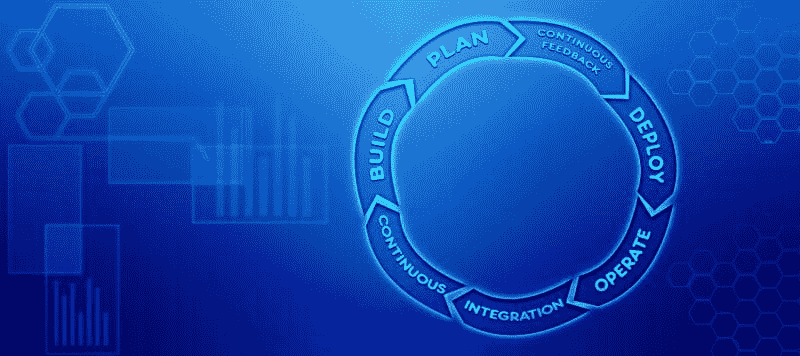

# 将机器学习应用于 DevOps

> 原文：[`www.kdnuggets.com/2018/02/applying-machine-learning-devops.html`](https://www.kdnuggets.com/2018/02/applying-machine-learning-devops.html)

 评论

**作者：[Prasanthi Korada](https://www.linkedin.com/in/devi-prasanthi-a761b280/)，安得拉大学**

使用静态工具进行打包、配置、部署和监控、APM 和日志管理的时代将结束。随着 Docker 的采用、云计算和 API 驱动的方法以及大规模部署应用的微服务，确保高可靠性需要出色的应对。因此，除了每次都重新发明轮子外，包含创新的云管理工具变得至关重要。随着机器学习和人工智能的兴起，越来越多的 DevOps 工具供应商将智能集成到他们的产品中，以进一步简化工程师的任务。

机器学习（ML）和 DevOps 之间的协同效应非常强大，它们的相关能力包括：

+   IT 操作分析（ITOA）

+   预测分析（PA）

+   人工智能（AI）

+   算法 IT 操作（AIOps）

[机器学习](https://en.wikipedia.org/wiki/Machine_learning)是人工智能（AI）的一种实际应用，表现为一组程序或算法。学习的方面依赖于训练时间和数据。机器学习从概念上代表了由 Gene Kim 提出的“持续学习文化”的加速和编码。团队可以挖掘线性模式、大规模复杂数据集和反模式，改进查询，发现新见解，并以计算机的速度不断重复。

机器学习在软件产品和应用中变得非常流行，涵盖从会计到热狗识别应用的所有领域。当这些机器学习技术应用到令人兴奋的项目中时，往往会遇到一些困难。

机器学习常常扩展现有应用程序的目的，包括网络商店推荐、聊天机器人中的语句分类等。这将成为带有新附加功能、大规模代码修改、修复错误或其他原因的巨大循环的一部分。

同样，机器学习可以以多种方式存在于下一代自动化中。[DevOps](https://en.wikipedia.org/wiki/DevOps)通过自动化实现了快速的软件开发生命周期（SDLC），但这种生命周期过于分散、动态、不透明和短暂，难以被人类理解。类似于自动化，机器学习独特地处理使用新交付流程和下一代原子化、可组合和扩展的应用程序生成的数据的量、速度和多样性。

### 将机器学习应用于 DevOps 的一些关键示例包括：

**跟踪应用交付**

来自‘DevOps 工具’如 Git、SonarQube、Jira、Ansible 等的活动数据提供了交付过程的可见性。对这些工具应用机器学习可以揭示数据中的异常——大量代码、长时间构建、晚期代码提交、缓慢发布速度，以识别许多软件开发浪费，包括过度任务切换、过度装饰、资源效率低、部分工作或过程慢等。

**确保应用程序质量**

机器学习通过分析测试工具的输出，可以智能地审查 QA 结果，基于发现高效地构建测试模式库。对‘已知良好版本’的理解有助于确保每次发布都进行全面测试，即使是新型缺陷，也提高了交付应用程序的质量。

**确保应用程序交付**

像指纹一样，用户行为模式可能是独特的。将机器学习应用于开发和运维用户行为有助于识别异常，这代表了危险活动。*例如*，异常模式访问代码库、部署活动、自动化例程、测试执行、系统配置等，可以突出显示用户在快速 pace 中进行‘熟悉的坏模式’，无论是有意还是无意。这些模式包括部署未经授权的代码、编写后门、窃取知识产权等。

**管理生产**

机器学习通过分析生产中的应用程序发挥其作用，因为与开发或测试相比，生产环境中的数据量、事务等更大。DevOps 团队使用机器学习来分析包括资源利用率、用户量等的一般模式，最终检测异常模式，如内存泄漏、DDOS 攻击和竞争条件。

**管理警报风暴**

机器学习的实际和最佳价值应用在于管理生产系统中的大量警报。这可能更加复杂，如“训练系统以识别‘已知良好’和不充分的警告，从而实现过滤，减少警报风暴和疲劳。

**故障排除和分类分析**

机器学习技术今天在分类分析中表现出色。它可以自动检测并分类已知问题甚至一些未知问题。这些工具可以检测一般处理中的异常，并分析发布日志与新部署进行关联。其他自动化工具也可以使用机器学习来生成工单、发出警报并分配到确切来源。

**防止生产故障**

在故障预防中，机器学习可以超越直线容量规划。它可以利用模式进行预测。所需的配置以实现期望的性能水平、新功能的客户使用百分比、新促销的基础设施需求、停机对客户参与的影响。机器学习在应用程序和系统中识别不明显的早期指标，使运营团队能够通过快速响应时间更快地避免问题。

**分析业务影响**

在 DevOps 中，要取得成功，了解代码发布对业务目标的影响至关重要。机器学习系统通过分析用户指标可以检测到良好和不良模式，从而在应用程序出现问题时生成对业务团队和编码人员的早期警告系统。

**结论**

尽管机器学习没有快捷的解决办法，也没有智能、创造力、经验和努力的替代品。但今天我们已经看到许多应用，随着我们不断推动边界，前景无限。

**简介: [Prasanthi Korada](https://www.linkedin.com/in/devi-prasanthi-a761b280/)** 是安得拉大学计算机科学研究生，出生并成长于卡金达。她目前在 [Mindmajix.com](http://Mindmajix.com) 担任内容贡献者。她的职业经历包括在 Vinutnaa IT 的内容写作。

Prominere 软件解决方案的服务和数字营销。她可以联系

通过 deviprasanthi7@gmail.com 联系她。也可以在 [LinkedIn](https://www.linkedin.com/in/devi-prasanthi-a761b280/) 和 [Twitter](https://twitter.com/deviprasanthi1) 上与她联系。

**相关内容:**

+   分析 DevOps 范式中的数据版本控制

+   连接数据系统和 DevOps

+   大数据科学: 期望与现实

* * *

## 我们的前三个课程推荐

 1\. [Google 网络安全证书](https://www.kdnuggets.com/google-cybersecurity) - 加快进入网络安全职业的步伐。

 2\. [Google 数据分析专业证书](https://www.kdnuggets.com/google-data-analytics) - 提升你的数据分析技能

 3\. [Google IT 支持专业证书](https://www.kdnuggets.com/google-itsupport) - 支持你的组织 IT

* * *

### 更多关于此主题

+   [通过这个免费的 DevOps 速成课程解锁你的潜力](https://www.kdnuggets.com/2023/03/corise-unlock-potential-with-this-free-devops-crash-course.html)

+   [10 个每个初学者都应学习的关键 DevOps 工具](https://www.kdnuggets.com/10-essential-devops-tools-every-beginner-should-learn)

+   [在 Python 中应用描述性和推断性统计](https://www.kdnuggets.com/applying-descriptive-and-inferential-statistics-in-python)

+   [每个机器学习工程师都应该掌握的 5 项机器学习技能…](https://www.kdnuggets.com/2023/03/5-machine-learning-skills-every-machine-learning-engineer-know-2023.html)

+   [KDnuggets 新闻，12 月 14 日：3 个免费的机器学习课程…](https://www.kdnuggets.com/2022/n48.html)

+   [学习数据科学、机器学习和深度学习的可靠计划](https://www.kdnuggets.com/2023/01/mwiti-solid-plan-learning-data-science-machine-learning-deep-learning.html)
