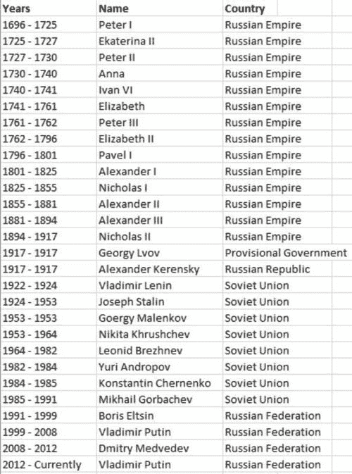
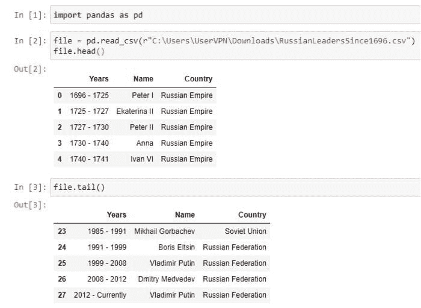
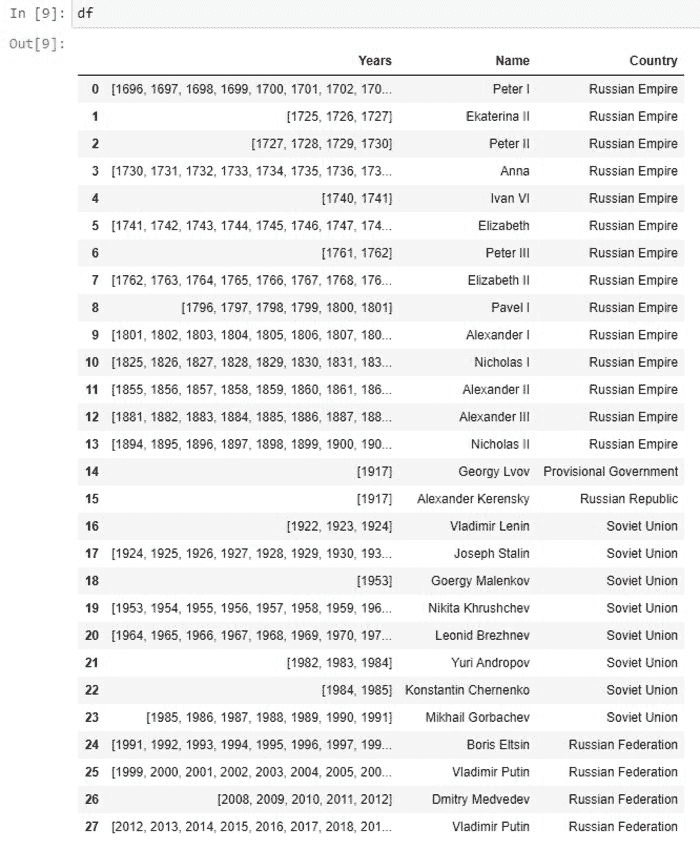
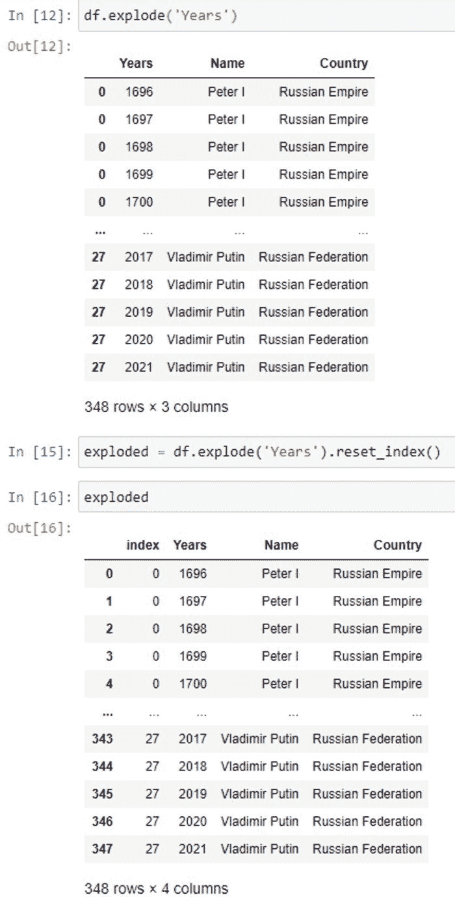

# 将 Python 的 Explode 函数应用于 Pandas DataFrames

> 原文：[`www.kdnuggets.com/2021/05/applying-pythons-explode-function-pandas-dataframes.html`](https://www.kdnuggets.com/2021/05/applying-pythons-explode-function-pandas-dataframes.html)

comments

**由 [Michael Mosesov](https://www.linkedin.com/in/michael-mosesov-2a04191a6/)，数据分析师**

**初始 csv 文件**

* * *

## 我们的前三个课程推荐

 1\. [Google 网络安全证书](https://www.kdnuggets.com/google-cybersecurity) - 快速进入网络安全职业轨道。

 2\. [Google 数据分析专业证书](https://www.kdnuggets.com/google-data-analytics) - 提升您的数据分析技能

 3\. [Google IT 支持专业证书](https://www.kdnuggets.com/google-itsupport) - 支持您组织的 IT 工作

* * *

在我们的案例中，我们将使用一个自 1696 年俄罗斯帝国建立以来的俄罗斯领导者历史数据集，特别是他们的名字、政府缩写和在位年限。目标是克隆/展开数据集，以便可以按年份访问每位总督。例如，当前数据集格式无法显示在 1700 年的领导者，如果您尝试访问该行。

这可以通过在两个日期之间使用连字符（-）展开“Years”列来解决。

**我们的目标是将列表样式的每个元素转换为一行，同时保持 Python 分配给每一行的相同索引。**

*P.s. 1917 年至 1922 年间有大约 5 年的内战，没有单一的官方国家。*

*P.s.s. 数据集被缩减到大约 300 年，862 年以来俄罗斯有更多的领导者。*

一开始，我们将 Pandas 库导入 Jupyter Notebook，并查看数据的第一行和最后一行。数据操作过程的第一步是使用 pd.DataFrame 创建数据框：

**快速 Jupyter Notebook 数据预览**

`explode()` 函数用于将列表样式的每个元素转换为一行，因此我们的第一个任务是创建一个用逗号分隔的“Years”列中的值列表。

但在此之前，必须将“Years”列中的所有值转换为数字。根据最后一行的观察，我们看到 Python 需要额外的编辑才能应用 explode 函数并展开“Years”列中的年份，将所有值转换为数字，这意味着将“目前”替换为“2021”，因为这是文章撰写的年份。

在这种情况下，值的替换可以使用 lambda() 函数和 x.replace 完成，如下方代码所示，它也适用于数据框中的所有值，如果你需要在许多行中进行更改。

**Lambda 函数帮助替换任何大小和行位置的数据框中的值**

下一步是通过破折号拆分“Years”列中的日期，以扩展/展开数据框。如上所述，这一操作的目的是自动展开和扩展两个年份之间的破折号。以下函数将帮助我们创建由逗号而非破折号分隔的日期列表：

**尽管这些步骤可以单独完成，但 Python 允许将它们合并为一行代码**

操作数据框后，以下结果应该显示出来：

在确认“Years”列中的所有值都是列表格式后，我们终于可以对整个数据集应用 explode 函数了。

**对整个数据框应用 explode() 函数的结果**

现在我们可以看到 explode 函数的结果，它可以用于需要展开和扩展数据框列的情况，从而使其更易于访问。如果需要在原始分配给唯一行的索引之外添加额外的索引，可以应用 reset_index()。创建一个新的“exploded” pd.DataFrame 以将结果保存到 CSV 格式的数据集中也是至关重要的。

**保存新的、展开的数据框**

通过 explode() 处理后，“Years”列中的日期已经在数据集中展开，现在每个领导人的治理年份代表一个新行。在此之前，函数如 lambda()、list() 和 map() 让我们节省了时间，并自动扩展了日期之间的值（在我们的例子中是年份）。这种方法在处理日期时很有用，并且可以轻松应用于任何领域的小型或大型数据集。

以下是导出数据集的 CSV 预览。虽然初始“index”保留分配给每个唯一值（来自展开的“Years”），但左侧增加了一个索引，涵盖了 348 行：

**最终编辑版本的预览**

**简历：[Michael Mosesov](https://www.linkedin.com/in/michael-mosesov-2a04191a6/)** 是一名位于俄罗斯的数据分析师。

[原文](https://mosesov62.medium.com/applying-python-explode-function-to-pd-dataframe-e5f6dfc20690)。经许可转载。

**相关：**

+   在 Python 中简单计时的方法

+   如何使用 Modin 加速 Pandas

+   完整 EDA（探索性数据分析）的 11 个必备代码块

### 更多相关话题

+   [每位数据科学家都应该了解的三个 R 库（即使你使用 Python）](https://www.kdnuggets.com/2021/12/three-r-libraries-every-data-scientist-know-even-python.html)

+   [是什么让 Python 成为初创企业理想的编程语言](https://www.kdnuggets.com/2021/12/makes-python-ideal-programming-language-startups.html)

+   [停止学习数据科学以寻找目的，并且找到目的来……](https://www.kdnuggets.com/2021/12/stop-learning-data-science-find-purpose.html)

+   [一个 90 亿美元的 AI 失败，深入分析](https://www.kdnuggets.com/2021/12/9b-ai-failure-examined.html)

+   [学习数据科学统计的最佳资源](https://www.kdnuggets.com/2021/12/springboard-top-resources-learn-data-science-statistics.html)

+   [成功数据科学家的 5 大特征](https://www.kdnuggets.com/2021/12/5-characteristics-successful-data-scientist.html)
