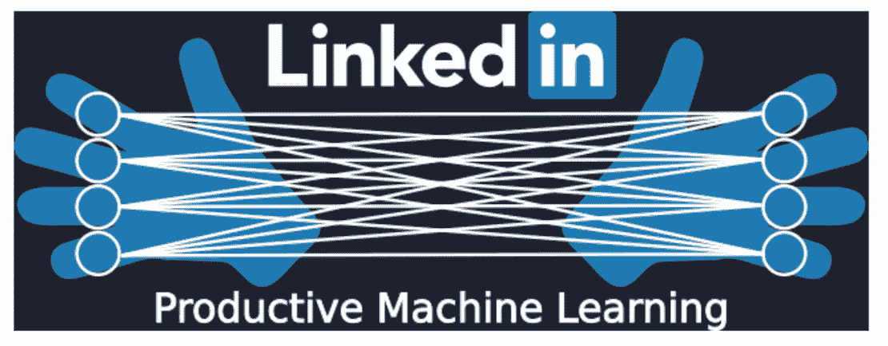

# LinkedIn 用于改进机器学习模型中特征管理的架构

> 原文：[`www.kdnuggets.com/2020/05/architecture-linkedin-feature-management-machine-learning-models.html`](https://www.kdnuggets.com/2020/05/architecture-linkedin-feature-management-machine-learning-models.html)

评论



LinkedIn 是机器学习创新的前沿公司之一。面对大规模的机器学习应用挑战，LinkedIn 工程团队成为开源机器学习堆栈的常规贡献者，并且提供了一些在机器学习过程中学到的最佳实践的内容。在 LinkedIn 体验的核心，我们有推荐新连接、工作或职位候选人的内容流。这个内容流由多个基于机器学习模型的推荐系统提供，这些系统需要不断的实验、版本管理和评估。这些目标依赖于非常强大的特征工程过程。最近，LinkedIn 揭示了他们的特征工程方法的一些细节，以支持快速实验，其中包含一些非常独特的创新。

LinkedIn 等组织面临的机器学习问题规模令数据科学家难以理解。构建和维护一个有效的机器学习模型已经足够困难，试想协调数千个机器学习程序以实现一致的体验。特征工程是允许快速实验机器学习程序的关键要素之一。例如，假设一个 LinkedIn 成员由 100 个特征描述，而呈现在成员首页的内容流由 50 多个机器学习模型提供。假设每秒都有数万人加载他们的 LinkedIn 页面，那么所需的特征计算数量大致如下：

*(特征数量) X (同时在线的 LinkedIn 成员数量) X (机器学习模型数量) > 100 X 10000 X 50 > 50,000,000 每秒*

对大多数刚开始机器学习之旅的组织来说，这个数字实在是难以想象。这样的规模要求以灵活且易于解释的方式表示特征，以便在不同的基础设施（如 Spark、Hadoop、数据库系统等）中重复使用。LinkedIn 最新版本的特征架构引入了类型化特征的概念，以表达和重用特征。这一思想源于之前 LinkedIn 机器学习推理和训练架构中的挑战。

### 第一个版本

像任何大型敏捷组织一样，LinkedIn 的机器学习架构在不同的基础设施中不断演变。例如，下图展示了基于 Spark 和 Hadoop 的 LinkedIn 在线和离线推理基础设施的特征架构。

在线特征架构针对通用性进行了优化，能够表示字符串以存储分类数据和单一类型的浮点值。该设计在表示整数计数、具有已知域的分类数据以及交互特征方面导致了效率损失。另一方面，HDFS 特征快照优化了简单的离线连接，每个特征都是特定的而非统一的，并且未考虑在线系统。不同类型特征表示之间的不断转换在进行特征实验时引入了常规摩擦，并且在不同系统中复制更新时面临挑战。


### 类型化特征

为了应对初始特征架构的一些局限性，LinkedIn 引入了一种新的特征存储方式，即在整个系统中使用带有特征特定元数据的张量单一格式。张量是大多数流行深度学习框架（如 TensorFlow 或 PyTorch）中使用的标准计算单元。从这个角度来看，使用张量可以在不牺牲底层格式的情况下实现复杂的线性代数操作。大多数数据科学家对张量结构非常熟悉，因此这种新表示相对容易融入机器学习程序中。

需要注意的一点是，新的 LinkedIn 结构专门为特征设计，而不是依赖像 Avro 这样的通用数据类型格式。通过建立在张量之上，特征总是以相同的通用模式进行序列化。这允许在不更改任何 API 的情况下灵活地快速添加新特征。这得益于元数据，它将以前空间效率较低的字符串或自定义定义的模式映射到整数。

以下代码演示了使用 LinkedIn 的新类型特征模式定义特征的方式。具体来说，定义了一个名为“historicalActionsInFeed”的特征，该特征将列出成员在 Feed 上执行的历史操作。特征元数据信息在旗舰命名空间内定义，包括名称和版本。这使得任何系统都可以使用 urn *urn:li:(flagship,historicalActionsInFeed,1,0)* 在元数据系统中查找该特征。从这个特征定义中，有两个重要的维度，包括*“feedActions”*中不同操作类型的分类列表，以及表示成员历史中不同时间窗口的离散计数。

```py
// Feature definition:
historicalActionsInFeed: {
  doc: "Historical interactions on feed for members. go/linkToDocumentation"
  version: "1.0"
  dims: [
    feedActions-1-0,
    numberOfDays-1-0
  ]
  valType: INT
  availability: ONLINE
}
//////////
// Dimension definitions:
feedActions: {
  doc: "The actions a user can take on main feed"
  version: "1.0"
  type: categorical : {
    idMappingFile: "feedActions.csv"
  }
}
numberOfDays: {
  doc: "Count of days for historical windowing"
  type: discrete
}
//////////
// Categorical definition (feedActions.csv):
0, OUT_OF_VOCAB
1, Comment
2, Click
3, Share
```

### 第二个版本

引入新的功能和元数据表示模型后，分发成为了新的挑战。如何在数千个机器学习模型和几十个基础设施组件之间有效分发新功能？答案比预期的更简单。LinkedIn 为每种元数据类型创建了一个单一的、文本化的真实来源，该来源被存储在源代码管理下，并作为工件库发布。真是聪明！任何机器学习系统只需声明依赖关系即可提取所需的元数据结构。此外，LinkedIn 的类型化特征解决方案包括一个对不同特征存储操作的元数据解析库。


LinkedIn 的新型特征架构包括一些有趣的想法，可以简化大规模机器学习系统的特征工程。通过使用张量作为基础计算单元，LinkedIn 创建了一个可以轻松插入任何机器学习框架中的特征表示。此外，使用元数据可以丰富特征的表示。早期报告显示，新的类型化特征架构使 LinkedIn 的推理系统性能提高了 20%以上，这在这种规模下是一个显著的数字。很期待这些想法在不久的将来开源。

[原文](https://medium.com/@jrodthoughts/the-architecture-used-at-linkedin-to-improve-feature-management-in-machine-learning-models-c7bd6ae54db)。已获得许可转载。

**相关：**

+   高级特征工程和预处理的 4 个技巧

+   微软研究揭示三项推进深度生成模型的努力

+   特征提取的指南

* * *

## 我们的前三大课程推荐

 1\. [Google 网络安全证书](https://www.kdnuggets.com/google-cybersecurity) - 快速进入网络安全职业生涯。

 2\. [Google 数据分析专业证书](https://www.kdnuggets.com/google-data-analytics) - 提升您的数据分析技能

 3\. [Google IT 支持专业证书](https://www.kdnuggets.com/google-itsupport) - 支持您的组织的 IT 工作

* * *

### 更多相关话题

+   [KDnuggets 新闻，5 月 18 日：5 个免费机器学习托管平台](https://www.kdnuggets.com/2022/n20.html)

+   [数据网格架构：重新构想数据管理](https://www.kdnuggets.com/2022/05/data-mesh-architecture-reimagining-data-management.html)

+   [2022 特征存储峰会：关于特征工程的免费会议](https://www.kdnuggets.com/2022/10/hopsworks-feature-store-summit-2022-free-conference-feature-engineering.html)

+   [提高机器学习模型的 7 种方法](https://www.kdnuggets.com/7-ways-to-improve-your-machine-learning-models)

+   [机器学习模型的高级特征选择技术](https://www.kdnuggets.com/2023/06/advanced-feature-selection-techniques-machine-learning-models.html)

+   [KDnuggets™ 新闻 22:n07，2 月 16 日：如何学习机器数学…](https://www.kdnuggets.com/2022/n07.html)
