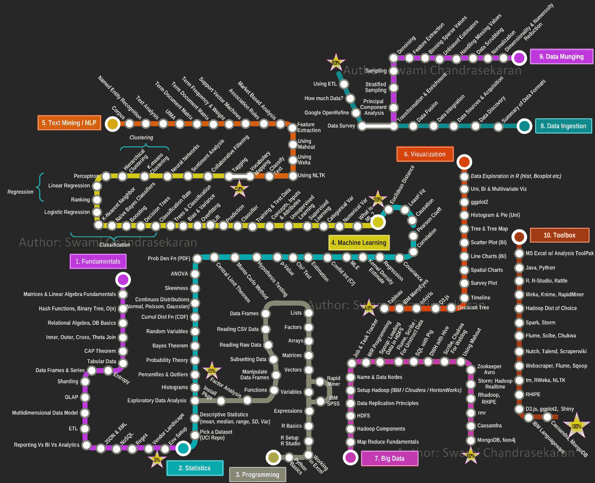

# 数据科学的艺术

> 原文：[`www.kdnuggets.com/2018/01/art-learning-data-science.html`](https://www.kdnuggets.com/2018/01/art-learning-data-science.html)

 评论

**作者 [Aparna C Shastry](https://medium.com/@aparnack)**。

近年来，我确信 90%的 LinkedIn 流量都包含以下术语之一：DS、ML 或 DL——即数据科学、机器学习或深度学习的缩写。不过要注意一个陈词滥调：“80%的统计数据都是临时编造的”。如果你对这些缩写有些眨眼错过，或许你需要搜索一下，然后继续阅读这篇文章。此篇文章有两个目标。首先，它试图让所有数据科学学习者感到安心。其次，如果你刚刚开始接触数据科学，这可能会作为你下一步的指南。

* * *

## 我们的前三大课程推荐

 1\. [Google 网络安全证书](https://www.kdnuggets.com/google-cybersecurity) - 快速进入网络安全职业生涯。

 2\. [Google 数据分析专业证书](https://www.kdnuggets.com/google-data-analytics) - 提升你的数据分析技能

 3\. [Google IT 支持专业证书](https://www.kdnuggets.com/google-itsupport) - 支持你所在组织的 IT 工作

* * *

这是我在互联网上看到的一张图片：

相当令人不知所措，是吧！！！

**从哪里开始！如何开始？：**

我在 2017 年 10 月初开始了数据科学的旅程。最初的 15 天仅花在尝试回答一个问题上：“什么是数据科学”以一种让我信服的方式。在浏览了各种互联网资源、Quora、Medium、Springboard 博客和电子书、Udacity 博客、Forbes、datascience.com、KDnuggets、datasciencecentral.com、analyticsvidhya 以及随机的网络爬取后，我吸收了所有信息（别怪我没提醒你，只有一撮盐是不够的），我得出结论，数据科学（用通俗的话来说）就是让计算机使用数据绘制漂亮的图表，并将其转化为一个有意义的故事，以解决商业问题。是的，就是这么简单。不，不是吗？是的，是的。嗯，数据科学工作主要分为两大类，这里我说的是面向商业的数据科学。另一类的最终产品不是故事，而是数据驱动的产品。我们不在此讨论，因为那样我们就会转向机器学习工程。通常，Google、Facebook 等公司有数据驱动的角色，属于第二类。许多学术研究也是第二类的。

回到第一种类型，让我给它一个稍微高级一点的定义。数据科学是利用历史数据通过清理和分析来回答商业问题的过程，然后将其拟合到一个（或多个）机器学习模型中，并通常进行预测和建议措施以防止可能的未来问题。啊，这真是太酷了，不是吗？一旦我对第一个问题感到信服，我就开始思考学习它的最佳方法。

**“最佳学习方法”？！**

再次花了几天时间查找这个短语，结果发现了无数的建议。这次除了尝试其中一些之外没有其他选择。我拥有电子和通信工程的本科和硕士学位，以及十年的编程经验，涉及语言如 C/C++、Octave/Matlab、Verilog/SystemVerilog、Perl。数学从小就是我最喜欢的科目，概率在硕士阶段最为喜爱。编程经验和概率在我这方面是一个明显的优势。

我对“机器学习”这个术语有点害怕，我是那种喜欢正面面对恐惧的人，所以最终报名了 Andrew 教授的 Coursera 课程。这是我上过的第一个课程，我很高兴它对我很有效。我对 Python 这只蛇和这个语言都感到非常害怕，但幸运的是 Andrew 的课程练习是用 Octave 进行的。我尝试从 Coursera、Udacity、Edx 和 Datacamp 学习 Python 基础，最终选择了 Coursera 和 Datacamp。我知道作为数据科学初学者，R 可能是更好的起点。然而，在那个时候，我对只走数据科学路线并不太自信。Python 更为通用。我同时参加了多个平台上的几门课程。尝试了 Udacity 上的机器学习入门、统计学、计算机科学基础、数据科学入门等课程。由于我不喜欢在概念被神经元吸收时有干扰，所以没有继续很长时间。

**非数据科学，但仍为科学课程：**

同时，我已经很久没有上过课程了。我在 Coursera 上找到了一门由加州大学圣地亚哥分校提供的“学习如何学习”的课程。这门课程帮助我确认了我所应用的学习技巧足够好。此外，它消除了我对自己是否年纪不足以学习新事物的疑虑，因为最近的研究证明，某些活动如锻炼、冥想或只是走在自然中（这也是我做的）能在大脑中产生新的神经元并形成新的连接。介绍的[番茄工作法](https://en.wikipedia.org/wiki/Pomodoro_Technique)很有帮助。我还发现这是学习印度商学院开设的“幸福与成就的一生”课程的合适时机。这门课程的内容使我更加冷静地追求数据科学的热情。它提醒我为了纯粹的学习乐趣而学习，并专注于过程，而不是最终成果。虽然这些内容不是技术性的，但我发现它们对快速和有效的学习非常有帮助。

**聚会/项目：**

我参加了十月中旬的一个聚会，发现这是由一家本地数据科学咨询公司组织的，该公司也提供培训。我对他们的模式不是很满意。他们用你的钱进行培训，如果你表现良好，就会招聘你成为员工。从聚会中得到的结论是：“MOOCs 不会让你找到工作，真实的项目、Kaggle 竞赛、个人博客会带来机会。来自知名机构的硕士学位会有影响，但同一机构的 MOOC 证书没有价值。”

我对此的看法是：“学习的路径并不重要。重要的是，你能够完成一个真实的数据科学项目。”如果你能在面试中证明这一点，为什么不能找到一份工作呢？你不需要花费数千美元参加训练营或获得 MOOC 证书。你需要具备一套素质/才能/技能才能成为数据科学家：对高中数学基础知识（概率论和统计学）的良好理解，强烈的好奇心，探索精神，学习新事物的倾向，对编程的熟悉，文档编写和演讲的能力，以及最重要的是，你必须知道你具备这些素质。[如果你对自己有怀疑，首先需要将这些疑虑清除掉。] 其余的学习（如机器学习）会随之而来。公司，特别是像我所在的小城镇，急需数据科学家，他们正在寻找招聘优秀数据科学家的途径。不过要记住，完成几个真实的数据科学项目，并通过报告/演示或 github 库向潜在雇主展示是至关重要的。如果你不确定如何进行真实项目，一种方法是寻求行业专家的技术指导。然后，找工作的过程需要另写一篇文章，超出了本篇的范围。

**所以……**

总结来说，填补基本知识的最佳路径是什么？没有捷径。尝试几个平台，看看哪个最适合你。从 MOOCs 开始，然后动手实践。确保有条理地记录你的学习过程。首先学习一个你不擅长的主题。例如，如果你已经知道 C++，不要直接跳到 Python，而是要知道你最终可以做到。尝试机器学习，看是否喜欢，因为这就是区分数据科学家和数据分析师或数据工程师的因素。如果你不喜欢自己学习其中任何一个领域，很可能即使在训练营中也无法学会。数据科学是一个需要每天学习的领域：新工具、新概念/算法、新业务/领域，可能是地球上的任何东西，只有步骤，没有终点。

**简介： [Aparna C Shastry](https://medium.com/@aparnack)** 是一名数据科学志愿者、学习者、两个可爱孩子的父母（教师）。

[原文](https://medium.com/@aparnack/the-art-of-learning-data-science-65b9f703f932)。已获许可转载。

**相关内容**

+   [**最佳数据科学与分析硕士课程——欧洲版**](https://www.kdnuggets.com/2017/12/best-masters-data-science-analytics-europe.html)

+   [**机器学习工程师，数据科学家——美国新兴顶尖职位**](https://www.kdnuggets.com/2017/12/linkedin-machine-learning-data-scientist-top-jobs.html)

+   [**我能成为数据科学家吗：对 1001 个数据科学家档案的研究**](https://www.kdnuggets.com/2017/12/research-1001-data-scientist-profiles.html)

### 更多相关主题

+   [成为优秀数据科学家所需的 5 项关键技能](https://www.kdnuggets.com/2021/12/5-key-skills-needed-become-great-data-scientist.html)

+   [每个初学者数据科学家应该掌握的 6 种预测模型](https://www.kdnuggets.com/2021/12/6-predictive-models-every-beginner-data-scientist-master.html)

+   [2021 年最佳 ETL 工具](https://www.kdnuggets.com/2021/12/mozart-best-etl-tools-2021.html)

+   [停止学习数据科学以寻找目标，并寻找目标……](https://www.kdnuggets.com/2021/12/stop-learning-data-science-find-purpose.html)

+   [学习数据科学统计的顶级资源](https://www.kdnuggets.com/2021/12/springboard-top-resources-learn-data-science-statistics.html)

+   [建立一个坚实的数据团队](https://www.kdnuggets.com/2021/12/build-solid-data-team.html)
