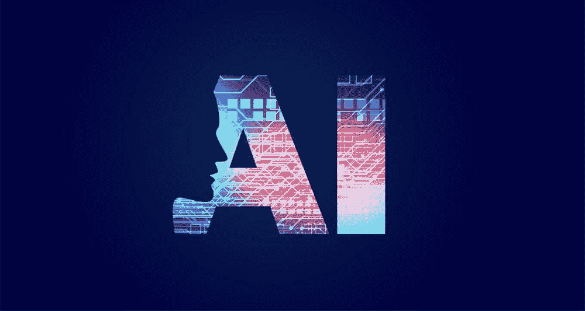

# 2022 年人工智能项目创意

> 原文：[`www.kdnuggets.com/2022/01/artificial-intelligence-project-ideas-2022.html`](https://www.kdnuggets.com/2022/01/artificial-intelligence-project-ideas-2022.html)

[背景矢量图由 starline 创建 - www.freepik.com](https://www.freepik.com/vectors/background)

作为数据科学行业的初学者，你一定读过无数篇描述创建数据科学项目重要性的文章。事实上，我[因为展示了我的项目](https://towardsdatascience.com/18-months-into-my-data-science-journey-dfd2fa2c8dc9)而获得了我的第一份数据科学职位。

然而，并不是每个数据科学项目都能让你获得行业职位。

我曾经审查过数据科学申请者的简历，大多数人都在初级职位申请中被拒绝，甚至没有进入面试阶段。

其中一些候选人在简历中确实包括了项目——但他们展示的项目过于简单。这些是他们在训练营或在线课程中创建的项目，对他们的申请反而起到了负面作用。

招聘人员会快速浏览数百份简历来寻找相同的职位。如果每个候选人在申请的项目部分都展示了一个泰坦尼克号生存预测模型，那么他们之间就没有任何区别了。

要在求职时真正脱颖而出，构建独特且富有创意的项目是很重要的。

招聘经理知道你在申请入门级职位时不可能掌握整个机器学习工具链。这不是他们所寻找的。技能可以随着时间的推移得到磨练，而许多东西可以在工作中学习。

你只需比其他申请者多做一步。展示一个有创意的项目，并围绕它讲述一个故事。这表明你对学习充满热情——你愿意花时间创建一些东西，并不是因为你能立即获得收益，而是因为你喜欢这样做。这种学习的愿望是大多数优秀经理和招聘人员积极寻找的特质，因为其他技能可以随着时间的推移得到磨练。

在这篇文章中，我将为你提供一份人工智能项目创意列表，这些项目会在你的简历上显得非常出色。

我自己想出了这些项目并亲自构建了它们，如果有相关链接的话，我会提供给你。我希望你能从这些项目中获得灵感，甚至可能会创建出你自己的版本。

## 名人长相模型

这是我去年创建的一个项目。我创建了一个网页应用，允许用户上传自己或他人的照片，底层的机器学习模型会预测他们的名人长相。

我使用了这个名人数据库来构建模型。后端使用了 Flask，前端使用了 Javascript 和 HTML。模型训练使用了 VGG16——一个流行的预训练神经网络。

你可以在[这里](https://towardsdatascience.com/a-complete-deep-learning-portfolio-project-9c5dc7f3f2ef)找到这个项目的详细说明。

## 哈利·波特性格预测

这是我之前创建的另一个项目。我构建了一个文本预测模型，该模型可以根据用户输入的句子预测他们的哈利·波特性格双胞胎。

我使用了 MBTI 性格预测数据集来完成这个任务，并且根据我从 Google 搜索中获得的信息，将每个哈利·波特角色映射到他们各自的 MBTI 类型。

高度准确？可能不是。不过，创建这个模型还是很有趣的。

为了完成这个任务，我尝试了一个 LSTM 模型（这是一个常用于预测序列（如文本数据）的递归神经网络架构）。我还尝试使用了 FastAI 库中内置的预训练模型，并使用 MBTI 数据集进行了再次训练。

最终，我创建了一个网络应用程序，用户可以输入一句话，预测结果会显示在屏幕上。这个界面是使用名为 JupyterDash 的包创建的。

## 年龄检测模型

这是一个在许多现实世界场景中都有应用的项目想法。很多时候，未成年人或掠夺者试图在社交或约会平台上隐藏他们的年龄。这些应用程序中的许多并没有很好地进行审核，很多这些档案最终未被检测到，导致不幸的情况发生。

一个能够基于用户的头像准确预测年龄的模型可以帮助过滤和限制年龄不合适的用户。

[这里](https://www.thepythoncode.com/article/predict-age-using-opencv)是一些可以帮助你开始构建这个模型的资源。

## 约会/友谊匹配算法

你是否曾经在约会网站上向右滑动过某个人，却在几小时的无聊对话后才意识到你们之间完全没有共同点？

你可以创建一个匹配算法来解决这个问题！如果你是机器学习的新手，你可以从一个简单的基于相关性的解决方案开始。

创建一个用户档案数据集和一个针对每个用户的问卷，包括基本的人口统计信息和兴趣细节。然后你可以创建一个相关性矩阵来评分每个用户回答之间的相似性，并相应地提供推荐。

[这里](https://towardsdatascience.com/how-i-built-my-own-dating-app-algorithm-2f6def15feb1)有一个我找到的关于创建你自己匹配算法的教程。试试，然后加入你自己的创意吧！

## 结论

上述列出的项目并不复杂。它们简单，可以使用像 OpenCV 这样的包中可用的预训练模型和模块构建。

这些项目与我在候选人简历上常见的项目的主要区别在于创造力。这些项目有所不同。它们尝试解决现实世界中经常遇到的问题，或者它们本身很有趣。

在为你的简历构建数据科学项目时，可以考虑这些思路。创建一个用户可以互动的界面。注重数据展示和讲故事的技能，不要让这些项目只是静静地放在你的 GitHub 仓库里。

**[Natassha Selvaraj](https://www.natasshaselvaraj.com/)** 是一位自学成才的数据科学家，对写作充满热情。你可以在[LinkedIn](https://www.linkedin.com/in/natassha-selvaraj-33430717a/)上与她联系。

### 更多相关主题

+   [2022 年最受欢迎的人工智能技能](https://www.kdnuggets.com/2022/08/indemand-artificial-intelligence-skills-learn-2022.html)

+   [19 个适合初学者的数据科学项目创意](https://www.kdnuggets.com/2021/11/19-data-science-project-ideas-beginners.html)

+   [5 个项目创意，让数据科学家保持最新](https://www.kdnuggets.com/2022/07/5-project-ideas-stay-uptodate-data-scientist.html)

+   [掌握数据工程的项目创意](https://www.kdnuggets.com/project-ideas-to-master-data-engineering)

+   [免费人工智能与深度学习速成课程](https://www.kdnuggets.com/2022/07/free-artificial-intelligence-deep-learning-crash-course.html)

+   [从人工智能到机器学习的演变…](https://www.kdnuggets.com/2022/08/evolution-artificial-intelligence-machine-learning-data-science.html)
