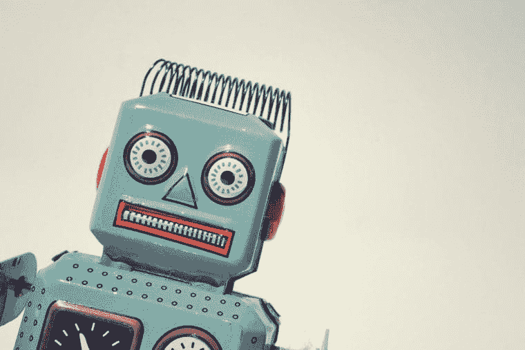
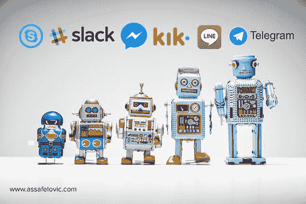

# 人工智能和聊天机器人的语音识别：入门指南

> 原文：[`www.kdnuggets.com/2017/01/artificial-intelligence-speech-recognition-chatbots-primer.html`](https://www.kdnuggets.com/2017/01/artificial-intelligence-speech-recognition-chatbots-primer.html)

对话用户界面（CUI）是当前人工智能发展的核心。尽管许多应用和产品仅仅是“*机械土耳其人*”——即表面上自动化的机器，而实际工作却由隐藏的人完成——但在符号或统计学习方法中，语音识别有许多有趣的进展。

* * *

## 我们的前三个课程推荐

 1\. [谷歌网络安全证书](https://www.kdnuggets.com/google-cybersecurity) - 快速进入网络安全职业生涯。

 2\. [谷歌数据分析专业证书](https://www.kdnuggets.com/google-data-analytics) - 提升你的数据分析技能

 3\. [谷歌 IT 支持专业证书](https://www.kdnuggets.com/google-itsupport) - 支持你的组织的 IT 工作

* * *

尤其是，深度学习在增强机器人的能力方面远远超过了传统的自然语言处理（即词袋模型、TF-IDF 等），并且创造了“*对话即平台*”的概念，这正在颠覆应用市场。

***我们的智能手机目前代表了每平方厘米最昂贵的购买领域***（甚至比比佛利山庄房屋的每平方米价格还要贵），不难想象，拥有一个独特的机器人界面将使这个领域几乎没有价值。

但这一切都不可能实现，如果没有大量投资于语音识别研究。*深度强化学习*（DFL）在过去几年里一直是主宰，它依靠人类的反馈。然而，我个人认为，我们很快将转向 B2B（机器人对机器人）训练，原因很简单：***奖励结构***。如果人们的付出得到足够的回报，他们会花时间训练他们的机器人。

这不是一个新概念，李登（微软）及其团队对此非常了解。他实际上提供了一个很好的[人工智能机器人三重分类](http://venturebeat.com/2016/08/01/how-deep-reinforcement-learning-can-help-chatbots/)：

+   寻找信息的机器人；

+   寻找信息以完成特定任务的机器人；

+   具有*社交*能力和任务的机器人（他称之为*社交机器人*或*聊天机器人*）

对于前两项，奖励结构确实比较容易定义，而第三项则更复杂，这使得现在更难以处理。

当这第三类技术完全实现时，我们将发现自己生活在一个机器彼此之间和与人类之间以相同方式沟通的世界。在这个世界里，***机器人对机器人***的商业模式将成为一种常态，并且将由两种类型的机器人构成：***主控机器人***和***跟随机器人***。

我相信，语音识别领域的研究以及该特定领域的技术堆栈将不断积累。这将导致一些玩家创建“通用”机器人（主控机器人），其他人将使用这些机器人作为其（外围）接口和应用程序的网关。然而，这种集中（几乎是垄断）的情境的好处是，尽管有两级复杂性，我们不会遇到影响当前深度学习运动的黑箱问题，因为机器人（无论是主控还是跟随）**将以简单的英语而非任何编程语言相互沟通。**

图片来源：[`blog.dlvrit.com/2016/05/facebook-messenger-chatbots/`](https://blog.dlvrit.com/2016/05/facebook-messenger-chatbots/)

### **通往主控机器人的挑战**

传统上，我们可以将语音识别的深度学习模型视为***基于检索的模型***或***生成模型***。第一类模型使用启发式方法从预定义的响应中提取答案，根据输入和上下文进行回答，而后者则每次从头生成新的响应。

目前语音识别的最先进技术已经[自 2012 年以来有了很大进展](https://humanizing.tech/artificial-intelligence-what-it-is-and-why-now-4e4431942623#.dok638e4g)，包括深度 Q 网络（DQN）、深度信念网络（DBN）、长短期记忆 RNN、门控循环单元（GRU）、序列到序列学习（Sutskever 等，2014）和张量乘积表示（关于语音识别的出色概述，请参见 Deng 和 Li，2013）。

所以，如果深度学习突破能够提高我们对*机器认知*的理解，那是什么阻碍了我们实现完美的社交机器人呢？我能想到至少有几个原因。

首先，**机器翻译**仍处于起步阶段。谷歌最近创建了“神经机器翻译”，这是该领域的一个重要进展，新版本甚至支持***零样本翻译***（即在没有训练的语言中进行翻译）。

其次，语音识别[仍主要是一个监督过程](https://groups.csail.mit.edu/sls/publications/2012/Glass-ISSPA12.pdf)。我们可能需要在无监督学习方面做更多的努力，并最终更好地整合符号和神经表示。

此外，关于人类语音识别还有许多细微差别，我们尚未能够完全嵌入到机器中。MetaMind 在这一领域做得很出色，并且最近推出了[**联合多任务**](http://metamind.io/research/multiple-different-natural-language-processing-tasks-in-a-single-deep-model/)（JMT）和[**动态共注意力网络**](http://metamind.io/research/state-of-the-art-deep-learning-model-for-question-answering/)（DCN），分别是一个**端到端可训练**的模型，允许不同层之间的协作，以及一个通过文档阅读的网络，它拥有[*根据正在尝试回答的问题的文档内部表示*](https://tryolabs.com/blog/2016/12/06/major-advancements-deep-learning-2016/)。

最终，到目前为止创建的自动语音识别（ASR）引擎要么缺乏*个性*，要么完全没有*时空背景*。这两个方面对于通用的 CUI（对话用户界面）至关重要，目前为止只有少数几个研究尝试过（Yao 等人，2015 年；Li 等人，2016 年）。

图片来源：[`www.assafelovic.com/`](http://www.assafelovic.com/)

### 市场如何分布？

这最初并不是本文的部分内容，但我发现快速浏览一下这个领域的主要参与者是有用的，以便理解语音识别在商业环境中的重要性。

机器人的历史可以追溯到 Eliza（1966 年，首个机器人）、Parry（1968 年），然后是 ALICE 和 Clever 在九十年代以及最近的微软小冰，但在过去 2–3 年中有了很大的发展。

我喜欢根据这个 2x2 矩阵来思考这个市场。实际上，你可以将机器人分类为原生机器人或使能机器人，设计用于特定应用或通用应用。这一分类的边界仅仅是粗略的，你可能会发现有公司在这两个象限之间交集的地方运营：

机器人分类矩阵

根据这一分类，我们可以识别出四种不同类型的初创公司：

+   ***员工型机器人：*** 这些机器人是在特定行业或应用领域内创建的。它们是独立的框架，不需要额外的训练，准备好即插即用；

+   ***通用用户界面***：这些是代表对通用对话界面最纯粹的追求的本地应用程序；

+   ***机器人承包商***：这些是被“聘用”来完成特定任务的机器人，但它们是作为通用型机器人创建的。通常比其员工型机器人便宜且不那么专业，与主应用程序以某种共生方式存在。考虑将这一类别视为*功能性机器人*而非*行业专家*（第一类）可能更有用；

+   ***机器人工厂***：这些是促进你创建自己机器人的一类初创公司。

提供了一些（并非详尽的）每组中运作的公司的例子，但可以明显看出市场正在变得拥挤且非常有利可图。

### **最终思考**

在深度学习语音识别领域工作是一个令人兴奋的时刻。不仅研究界，市场也迅速认识到这一领域作为 AGI 发展的关键步骤的重要性。

当前 ASR 和聊天机器人的状态很好地反映了狭义 AI 和通用智能之间的区别，我认为我们应该谨慎管理投资者和客户的期望。我也相信，并非每个人都会在这个领域分得一杯羹，只有少数玩家会占据大部分市场，但这个领域变化如此迅速，很难对其做出预测。

**参考文献**

Deng, L., Li, X. (2013). “语音识别的机器学习范式：概述”。 IEEE 音频、语音和语言处理学报 21(5)。

Li, J., Galley, M., Brockett, C., Spithourakis, G., Gao, J., Dolan, W. B. (2016). “基于角色的神经对话模型”。 [ACL (1)](http://dblp.uni-trier.de/db/conf/acl/acl2016-1.html#LiGBSGD16)。

Sutskever, I., Vinyals, O., Le, Q. (2014). “序列到序列学习与神经网络”。 [NIPS 2014](http://dblp.uni-trier.de/db/conf/nips/nips2014.html#SutskeverVL14): 3104–3112.

Yao, K., Zweig, G., Peng, B. (2015). “带意图的注意力神经网络对话模型”。 [CoRR abs/1510.08565](http://dblp.uni-trier.de/db/journals/corr/corr1510.html#YaoZP15)

**个人简介： [Francesco Corea](https://www.linkedin.com/in/francesco-corea-6b4b4a44)** 是一位基于英国伦敦的决策科学家和数据战略师。

[原文](https://medium.com/cyber-tales/ai-and-speech-recognition-a-primer-for-chatbots-a63af042526a#.gyel8unzr)。经许可转载。

**相关内容：**

+   激发聊天机器人的 10 种关键机器学习能力

+   人工智能分类矩阵

+   关于人工智能的 13 个预测

### 更多内容

+   [语音识别指标的演变](https://www.kdnuggets.com/2022/10/evolution-speech-recognition-metrics.html)

+   [Web LLM: 将 LLM 聊天机器人带到浏览器](https://www.kdnuggets.com/2023/05/webllm-bring-llm-chatbots-browser.html)

+   [推出 OpenChat：一个免费且简单的构建平台…](https://www.kdnuggets.com/2023/06/introducing-openchat-free-simple-platform-building-custom-chatbots-minutes.html)

+   [免费人工智能与深度学习速成课程](https://www.kdnuggets.com/2022/07/free-artificial-intelligence-deep-learning-crash-course.html)

+   [人工智能与元宇宙](https://www.kdnuggets.com/2022/02/artificial-intelligence-metaverse.html)

+   [人工智能系统中的不确定性量化](https://www.kdnuggets.com/2022/04/uncertainty-quantification-artificial-intelligencebased-systems.html)
