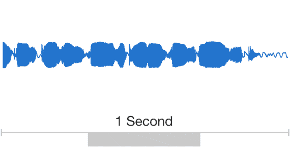
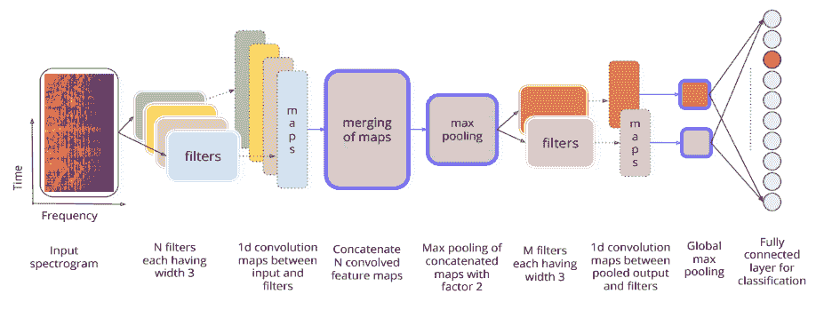
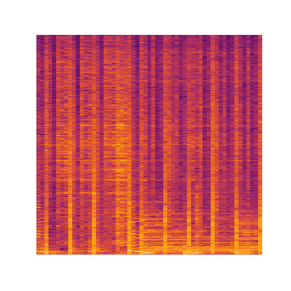
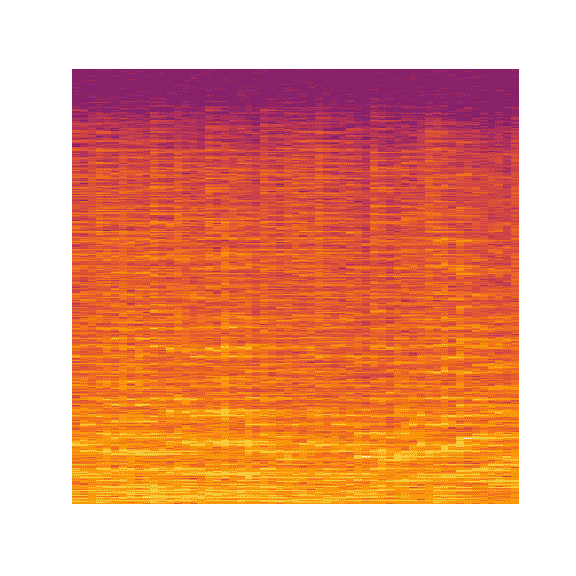
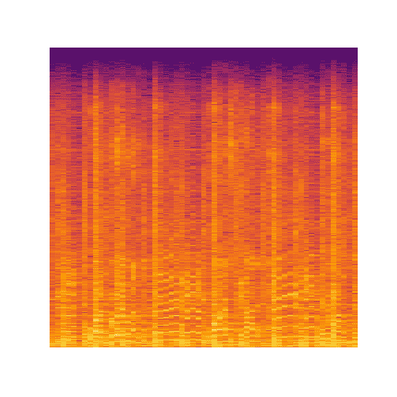
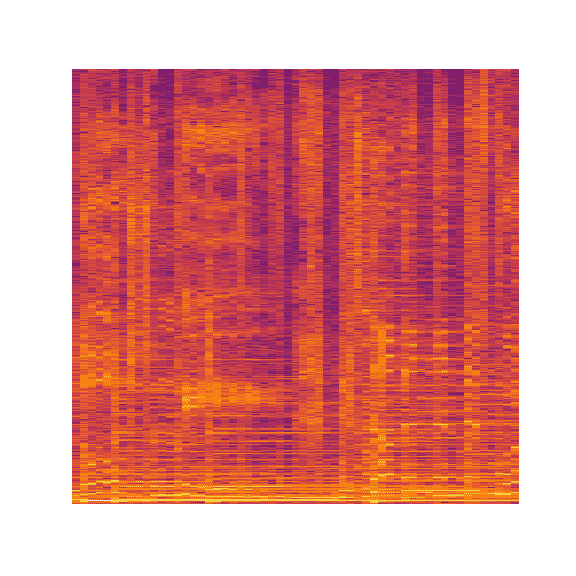
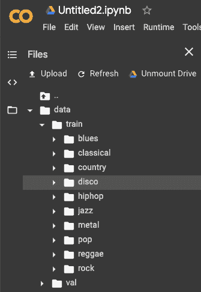
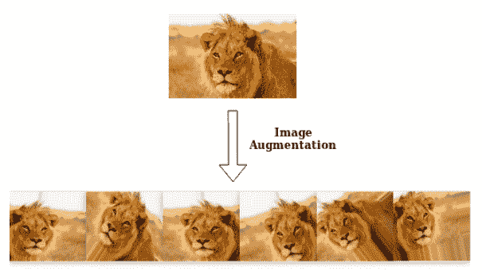
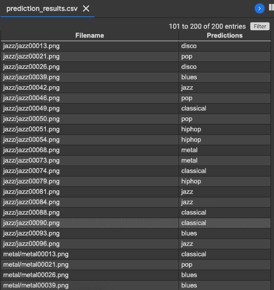

# 使用 Python 进行音频数据分析（第二部分）

> 原文：[`www.kdnuggets.com/2020/02/audio-data-analysis-deep-learning-python-part-2.html`](https://www.kdnuggets.com/2020/02/audio-data-analysis-deep-learning-python-part-2.html)

评论

图像 [来源](https://deepmind.com/blog/article/wavenet-generative-model-raw-audio)

在 [上一篇文章](https://levelup.gitconnected.com/audio-data-analysis-using-deep-learning-part-1-7f6e08803f60)中，我们开始讨论音频信号；我们看到如何使用 Librosa Python 库对其进行解释和可视化。我们还学习了如何从声音/音频文件中提取必要的特征。

我们通过构建一个人工神经网络（ANN）来进行音乐类型分类结束了上一篇文章。

在本文中，我们将构建一个卷积神经网络进行音乐类型分类。

现在，深度学习在音乐类型分类中越来越多地被使用：特别是卷积神经网络（CNN），它将谱图作为输入，视为图像，寻找不同类型的结构。

卷积神经网络（CNN）与普通神经网络非常相似：它们由具有可学习权重和偏差的神经元组成。每个神经元接收一些输入，执行点积，并可选地进行非线性处理。整个网络仍然表示一个单一的可微分分数函数：从原始图像像素到类别分数。它们仍然有一个损失函数（例如 SVM/Softmax）在最后一个（全连接）层，并且我们为学习普通神经网络开发的所有技巧/方法仍然适用。

那么有什么变化呢？ConvNet 架构明确假设输入是图像，这使我们可以将某些特性编码到架构中。这些特性使得前向函数的实现更加高效，并大大减少了网络中的参数数量。


[来源](https://gfycat.com/deadlydeafeningatlanticblackgoby-three-blue-one-brown-machines-learning)

它们能够检测主要特征，这些特征随后由 CNN 架构的后续层结合，从而检测出更高阶的复杂和相关的新特征。

数据集包含 1000 个音频轨道，每个轨道 30 秒长。它包含 10 种类型，每种类型由 100 个轨道表示。这些轨道都是 22050 Hz 单声道 16 位音频文件，格式为.wav。

数据集可以从 [marsyas 网站](http://marsyas.info/downloads/datasets.html)下载

包含 10 种音乐类型，即

+   Blues

+   Classical

+   Country

+   Disco

+   Hiphop

+   Jazz

+   Metal

+   Pop

+   Reggae

+   Rock

每种类型包含 100 首歌曲。数据集总量：1000 首歌曲。

在继续之前，我建议使用[Google Colab](https://colab.research.google.com/notebooks/intro.ipynb#recent=true)来处理与神经网络相关的所有工作，因为它是**免费的**，并提供 GPU 和 TPU 作为运行环境。

### **卷积神经网络实现**



从输入声谱图中提取特征并加载到全连接层的步骤。

所以让我们开始构建一个用于类别分类的 CNN。

首先加载所有必要的库。

```py
import pandas as pd
import numpy as np
from numpy import argmax
import matplotlib.pyplot as plt
%matplotlib inline
import librosa
import librosa.display
import IPython.display
import random
import warnings
import os
from PIL import Image
import pathlib
import csv
# sklearn Preprocessing
from sklearn.model_selection import train_test_split
#Keras
import keras
import warnings
warnings.filterwarnings('ignore')
from keras import layers
from keras.layers import Activation, Dense, Dropout, Conv2D, Flatten, MaxPooling2D, GlobalMaxPooling2D, GlobalAveragePooling1D, AveragePooling2D, Input, Add
from keras.models import Sequential
from keras.optimizers import SGD
```

现在将音频数据文件转换为 PNG 格式的图像，或者基本上是为每个音频提取声谱图。我们将使用 librosa Python 库为每个音频文件提取声谱图。

```py
 genres = 'blues classical country disco hiphop jazz metal pop reggae rock'.split()
for g in genres:
    pathlib.Path(f'img_data/{g}').mkdir(parents=True, exist_ok=True)
    for filename in os.listdir(f'./drive/My Drive/genres/{g}'):
        songname = f'./drive/My Drive/genres/{g}/{filename}'
        y, sr = librosa.load(songname, mono=True, duration=5)
        print(y.shape)
        plt.specgram(y, NFFT=2048, Fs=2, Fc=0, noverlap=128, cmap=cmap, sides='default', mode='default', scale='dB');
        plt.axis('off');
        plt.savefig(f'img_data/{g}/{filename[:-3].replace(".", "")}.png')
        plt.clf()
```

上面的代码将创建一个**img_data**目录，其中包含按类别分类的所有图像。


各种类型的示例声谱图：迪斯科、古典、蓝调和乡村音乐。   

迪斯科与古典音乐   

蓝调与乡村音乐

我们的下一步是将数据拆分为训练集和测试集。

安装 split-folders。

```py
pip install split-folders
```

我们将数据按 80%用于训练，20%用于测试集进行拆分。

```py
import split-folders
# To only split into training and validation set, set a tuple to `ratio`, i.e, `(.8, .2)`.
split-folders.ratio('./img_data/', output="./data", seed=1337, ratio=(.8, .2)) # default values
```

上面的代码返回父目录下的 2 个目录，分别用于训练集和测试集。



**图像增强：**

图像增强通过不同的处理方式或多种处理组合来人工创建训练图像，例如随机旋转、平移、剪切和翻转等。

执行图像增强，与其用大量图像训练模型，我们可以用较少的图像训练模型，并通过不同的角度和修改图像来训练模型。



[图像增强](https://towardsdatascience.com/machinex-image-data-augmentation-using-keras-b459ef87cd22)

Keras 有一个**ImageDataGenerator**类，允许用户以非常简单的方式实时执行图像增强。你可以在 Keras 的官方[文档](https://keras.io/preprocessing/image/)中阅读有关内容。

```py
from keras.preprocessing.image import ImageDataGenerator
train_datagen = ImageDataGenerator(
        rescale=1./255, # rescale all pixel values from 0-255, so aftre this step all our pixel values are in range (0,1)
        shear_range=0.2, #to apply some random tranfromations
        zoom_range=0.2, #to apply zoom
        horizontal_flip=True) # image will be flipper horiztest_datagen = ImageDataGenerator(rescale=1./255)
```

ImageDataGenerator 类有三个方法**flow()、flow_from_directory() 和 flow_from_dataframe()**，用于从大的 numpy 数组和包含图像的文件夹中读取图像。

我们将在这篇博客中仅讨论 flow_from_directory()。

```py
training_set = train_datagen.flow_from_directory(
        './data/train',
        target_size=(64, 64),
        batch_size=32,
        class_mode='categorical',
        shuffle = False)test_set = test_datagen.flow_from_directory(
        './data/val',
        target_size=(64, 64),
        batch_size=32,
        class_mode='categorical',
        shuffle = False )
```

flow_from_directory()具有以下参数。

+   **directory：**存在一个文件夹的路径，其中包含所有测试图像。例如，在这种情况下，训练图像位于./data/train 中。

+   **batch_size：**将其设置为能整除测试集中图像总数的某个数字。

    为什么这只对 test_generator 适用？

    实际上，你应该在训练和验证生成器中将“batch_size”设置为一个能够整除你的训练集和验证集中图像总数的数字，但这之前并不重要，因为即使 batch_size 与训练或验证集中样本数不匹配，并且每次从生成器中获取图像时有些图像会被遗漏，也会在你训练的下一个 epoch 中进行采样。

    但对于测试集，你应该正好采样一次图像，不多也不少。如果感到困惑，可以将其设置为 1（但可能会稍微慢一点）。

+   **class_mode：**如果你只有两个类别要预测，则设置为“binary”，如果不是，则设置为“categorical”，如果你正在开发自动编码器系统，输入和输出可能是相同的图像，则设置为“input”。

+   **shuffle：**将其设置为*False*，因为你需要按照“顺序”提供图像，以预测输出并将其与唯一的 ID 或文件名进行匹配。

创建一个卷积神经网络：

```py
model = Sequential()
input_shape=(64, 64, 3)#1st hidden layer
model.add(Conv2D(32, (3, 3), strides=(2, 2), input_shape=input_shape))
model.add(AveragePooling2D((2, 2), strides=(2,2)))
model.add(Activation('relu'))#2nd hidden layer
model.add(Conv2D(64, (3, 3), padding="same"))
model.add(AveragePooling2D((2, 2), strides=(2,2)))
model.add(Activation('relu'))#3rd hidden layer
model.add(Conv2D(64, (3, 3), padding="same"))
model.add(AveragePooling2D((2, 2), strides=(2,2)))
model.add(Activation('relu'))#Flatten
model.add(Flatten())
model.add(Dropout(rate=0.5))#Add fully connected layer.
model.add(Dense(64))
model.add(Activation('relu'))
model.add(Dropout(rate=0.5))#Output layer
model.add(Dense(10))
model.add(Activation('softmax'))model.summary()
```

使用[随机梯度下降（SGD）](https://en.wikipedia.org/wiki/Stochastic_gradient_descent)编译/训练网络。梯度下降在我们有一个凸曲线时效果很好。但是如果我们没有凸曲线，梯度下降会失败。因此，在随机梯度下降中，每次迭代时会随机选择几个样本，而不是整个数据集。

```py
epochs = 200
batch_size = 8
learning_rate = 0.01
decay_rate = learning_rate / epochs
momentum = 0.9
sgd = SGD(lr=learning_rate, momentum=momentum, decay=decay_rate, nesterov=False)
model.compile(optimizer="sgd", loss="categorical_crossentropy", metrics=['accuracy'])
```

现在，用 50 个 epochs 来训练模型。

```py
model.fit_generator(
        training_set,
        steps_per_epoch=100,
        epochs=50,
        validation_data=test_set,
        validation_steps=200)
```

现在，既然 CNN 模型已经训练好了，我们来评估它。`evaluate_generator()`使用你的测试输入和输出。它首先使用训练输入进行预测，然后通过将其与测试输出进行比较来评估性能。因此，它给出的是一个性能测量，即在你的案例中是准确率。

```py
#Model Evaluation
model.evaluate_generator(generator=test_set, steps=50)#OUTPUT
[1.704445120342617, 0.33798882681564246]
```

所以损失为 1.70，准确率为 33.7%。

最后，让你的模型在测试数据集上进行一些预测。在每次调用**predict_generator**之前，你需要重置 test_set。这一点很重要，如果你忘记重置**test_set**，你将得到奇怪顺序的输出。

```py
test_set.reset()
pred = model.predict_generator(test_set, steps=50, verbose=1)
```

到现在为止，**predicted_class_indices**已经包含了预测标签，但你不能直接知道预测的结果，因为你看到的只是像 0、1、4、1、0、6 这样的数字。你需要将预测标签与它们的唯一 ID（如文件名）进行映射，以找出你为哪个图像做了预测。

```py
predicted_class_indices=np.argmax(pred,axis=1)

labels = (training_set.class_indices)
labels = dict((v,k) for k,v in labels.items())
predictions = [labels[k] for k in predicted_class_indices]
predictions = predictions[:200]
filenames=test_set.filenames
```

将***filenames***和***predictions***作为两个独立的列追加到一个 pandas 数据框中。但在此之前，请检查两者的大小，它们应该是相同的。

```py
print(len(filename, len(predictions)))
# (200, 200)
```

最后，将结果保存到 CSV 文件中。

```py
results=pd.DataFrame({"Filename":filenames,
                      "Predictions":predictions},orient='index')
results.to_csv("prediction_results.csv",index=False)
```



输出

我已经在 50 个 epochs 上训练了模型（这本身在 Nvidia K80 GPU 上执行花费了 1.5 小时）。如果你想提高准确率，可以将训练 CNN 模型时的 epochs 数增加到 1000 或更多。

### 结论

这表明 CNN 是自动特征提取的可行替代方案。这一发现支持了我们的假设，即音乐数据的内在特征变化与图像数据类似。我们的 CNN 模型具有高度的可扩展性，但在将训练结果推广到未见过的音乐数据时不够稳健。这可以通过扩大数据集以及增加数据输入量来克服。

好了，这篇关于使用深度学习和 Python 进行音频数据分析的两篇文章系列就此结束。希望大家喜欢阅读这篇文章，欢迎在评论区分享你的意见/想法/反馈。

### 感谢阅读本文!!!

**简介：[Nagesh Singh Chauhan](https://www.linkedin.com/in/nagesh-singh-chauhan-6936bb13b/)** 是 CirrusLabs 的大数据开发人员。他在电信、分析、销售、数据科学等多个领域拥有超过 4 年的工作经验，并在多个大数据组件方面具有专业知识。

[原文](https://levelup.gitconnected.com/audio-data-analysis-using-deep-learning-with-python-part-2-4a1f40d3708d)。经许可转载。

**相关内容：**

+   音频文件处理：使用 Python 处理 ECG 音频

+   R 中的音频文件处理基础

+   2020 年阅读的人工智能书籍

* * *

## 我们的前三大课程推荐

 1\. [谷歌网络安全证书](https://www.kdnuggets.com/google-cybersecurity) - 快速开启网络安全职业生涯

 2\. [谷歌数据分析专业证书](https://www.kdnuggets.com/google-data-analytics) - 提升你的数据分析技能

 3\. [谷歌 IT 支持专业证书](https://www.kdnuggets.com/google-itsupport) - 支持你的组织的 IT 需求

* * *

### 更多相关话题

+   [创建一个使用 Python 从音频中提取主题的 Web 应用程序](https://www.kdnuggets.com/2023/01/creating-web-application-extract-topics-audio-python.html)

+   [Bark：终极音频生成模型](https://www.kdnuggets.com/2023/05/bark-ultimate-audio-generation-model.html)

+   [WavJourney：进入音频故事情节生成的世界](https://www.kdnuggets.com/wavjourney-a-journey-into-the-world-of-audio-storyline-generation)

+   [如何使用 LangChain 实现 Agentic RAG：第一部分](https://www.kdnuggets.com/how-to-implement-agentic-rag-using-langchain-part-1)

+   [使用 Datawig，这是一个用于缺失值填补的 AWS 深度学习库](https://www.kdnuggets.com/2021/12/datawig-aws-deep-learning-library-missing-value-imputation.html)

+   [动手强化学习课程第三部分：SARSA](https://www.kdnuggets.com/2022/01/handson-reinforcement-learning-course-part-3-sarsa.html)
