# 音频文件处理：使用 Python 的心电图音频

> 原文：[`www.kdnuggets.com/2020/02/audio-file-processing-ecg-audio-python.html`](https://www.kdnuggets.com/2020/02/audio-file-processing-ecg-audio-python.html)

评论

**由 [Taposh Dutta Roy](https://www.linkedin.com/in/taposh/)，凯瑟 Permanente**

在我上一篇关于 “[R 中的音频文件处理基础](https://medium.com/@taposhdr/basics-of-audio-file-processing-in-r-81c31a387e8e)” 的文章中，我们讨论了音频处理的基础知识，并查看了一些 R 语言的示例。在这篇文章中，我们将探讨音频文件处理的一个应用——心电图心跳分析，并用 Python 编写代码。

为了更好地理解这一点，我们将探讨：心脏的基本解剖、测量、心音的起源和特征、心音分析技术以及用于分析声音的 Python 代码。本文中的 Python 代码将讨论如何读取、处理数据并开发一个非常简单的模型。在下一篇文章中，我们将进行更多的数据处理并开发更好的模型。

进一步说明，我不是临床医生，因此我的所有知识都是通过阅读论文、博客和文章获得的。我列出了所有的来源和参考文献。我将从心脏在 [胸腔](https://www.britannica.com/science/thoracic-cavity) 的位置开始，如下所示

来源：Google

### **哺乳动物心脏的基本解剖**

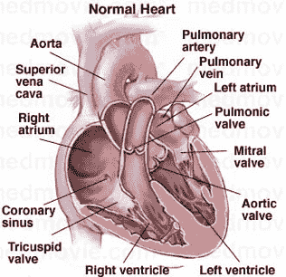

来源：medmov

哺乳动物心脏的 5 个基本解剖区域：

1.  四个心脏腔室

1.  四个心脏瓣膜

1.  四层心脏组织

1.  大心脏血管

1.  自然心脏起搏器和心脏传导系统

### 人类心脏

人类心脏是一个四腔室的泵，有两个*心房*用于从静脉收集血液，两个*心室*用于将血液泵送到动脉。

来源： [阿密特·盖伊博士](https://fhs.mcmaster.ca/medicine/cardiology/faculty_member_amit.htm) 的研究工作

心脏的右侧将血液泵送到肺循环（肺部），左侧将血液泵送到体循环（身体其余部分）。来自肺循环的血液通过肺静脉返回到左心房，来自体循环的血液通过上/下腔静脉返回到右心房。

两组瓣膜控制血液的流动：房室瓣（僧帽瓣和三尖瓣）在心房和心室之间，半月瓣（主动脉瓣和肺动脉瓣）在心室和动脉之间。

### 电控

心脏的周期性活动由电传导系统控制。电信号源自右心房中的专门起搏细胞（*sino-atria node*），并通过心房传播到 AV 结（一个延迟连接点）以及心室。电动作电位激发心肌细胞，引起心腔的机械收缩。

### 机械系统：收缩期与舒张期

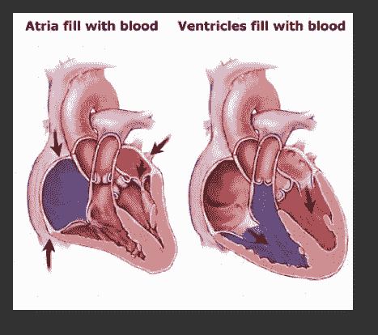

心室的收缩阶段称为*systole*。心室收缩后是一个称为*diastole*的休息或充血阶段。心脏的机械活动包括血液流动、心腔壁的振动以及瓣膜的开合。

收缩期细分为：

舒张期细分为

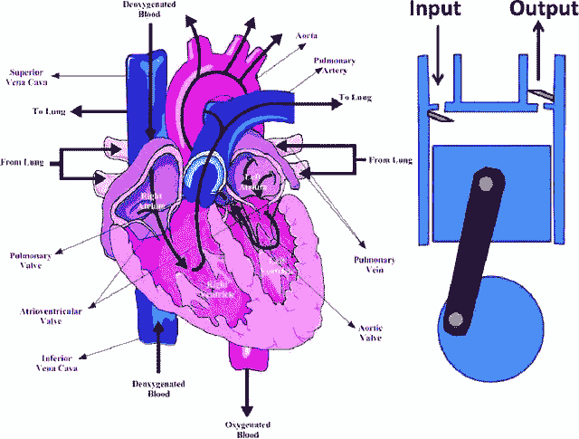

右侧：心脏肌肉的垂直切面显示了心脏的内部结构。左侧：一个往复泵的示意图，具有泵腔和输入输出端口以及方向相反的阀门。(来源： [`www.morganclaypool.com/doi/pdf/10.2200/S00187ED1V01Y200904BME031`](https://www.morganclaypool.com/doi/pdf/10.2200/S00187ED1V01Y200904BME031))

### 调节系统

人体是一个复杂的系统，具有多种协同工作的子系统。其中一些帮助我们调节心脏的系统有——自主神经系统、内分泌系统、呼吸系统。这些系统与电气和机械因素共同作用，使我们的心脏正常运作。

自主神经系统调节心率：交感神经系统增强自动性，而副交感神经系统（迷走神经）则抑制它。神经系统还调节心腔的机械收缩性。

内分泌系统分泌如胰岛素和肾上腺素等激素，这些激素影响心肌的收缩性。

呼吸系统导致胸腔压力的周期性变化，从而影响血流、静脉压力和静脉回流，触发反射反应（压力感受器反射、贝恩布里奇反射），进而调节心率。心率在吸气时增加，呼气时减少。

其他机械因素包括血管的周围阻力，可能因内外因素（如狭窄）而变化，导致的静脉回流，瓣膜的状态（撕裂、钙化）

其他电气因素包括异位起搏细胞、传导问题、再入环路

如 Amit Guy 博士所示，系统的复杂性和相互作用如下所示—

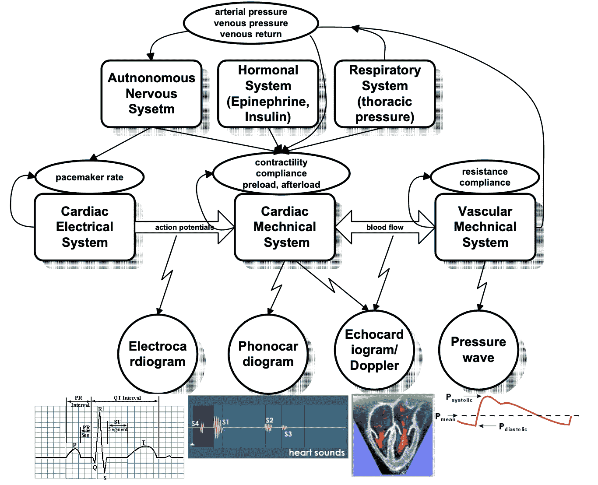

来源：Amit Guy 博士的研究

### 心音

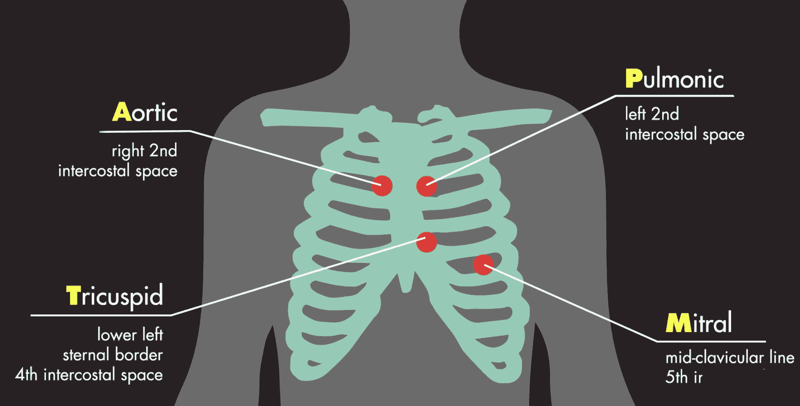

来源: [`www.youtube.com/watch?v=FtXNnmifbhE&list=PL3n8cHP87ijDnqI8_5WQlS4tN37D6P4dH`](https://www.youtube.com/watch?v=FtXNnmifbhE&list=PL3n8cHP87ijDnqI8_5WQlS4tN37D6P4dH)

最常用来监听心音的四个位置是根据可以最好地听到心瓣膜的部位来命名的：

+   主动脉区 — 位于第二右肋间隙中心。

+   肺动脉区 — 在左侧胸骨边缘的第二肋间隙。

+   三尖瓣区 — 在左侧胸骨边缘的第四肋间隙。

+   二尖瓣区 — 在心尖部，位于第五肋间隙的锁骨中线处。

不同类型的心音如下：

1.  **S1** — 心室收缩开始

1.  **S2** — 半月瓣关闭

1.  **S3** — 心室奔马律

1.  **S4** — 房性奔马律

1.  **EC** — 收缩期射血音

1.  **MC** — 中收缩期音

1.  **OS** — 舒张音或开瓣音

1.  **杂音**

基本心音（FHS）通常包括第一心音（S1）和第二心音（S2）。

S1 发生在等容收缩期开始时，当二尖瓣和三尖瓣因心室内压力快速增加而关闭。

S2 发生在舒张期开始时，主动脉瓣和肺动脉瓣关闭。

虽然 FHS 是最易识别的心周期声音，但心脏的机械活动也可能导致其他可听见的声音，如第三心音（S3）、第四心音（S4）、收缩期射血音（EC）、中收缩期音（MC）、舒张音或开瓣音（OS），以及由血流湍流和高速流动引起的心脏杂音。

### 数据

我们从 [Physionet 挑战网站](https://physionet.org/content/challenge-2016/1.0.0/) 的 2016 挑战 — 心音记录分类中获取 ECG 数据。该挑战的目标是分类正常、异常和不明确的心音。为了演示目的，我们将其分类为 2 类 — 正常和异常（以便于演示）。

### **Python 代码**

类似于 R，Python 中有几个用于处理音频数据的库。在这段代码中，我们将使用其中一个库 — [librosa](https://librosa.github.io/librosa/)

+   librosa

+   scipy

+   wav

我们将使用 librosa，因为它也可以用于音频特征提取。

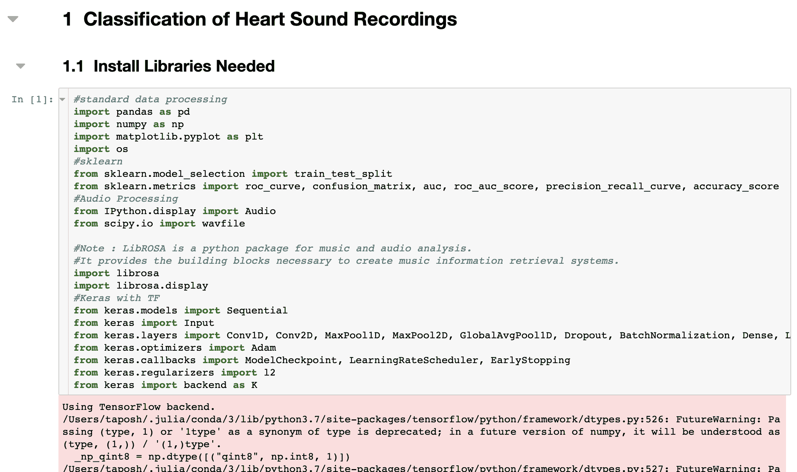

安装库

Librosa 返回数据和默认设置为 22050 的采样率，但你可以更改此设置或使用原始采样率。让我们加载一个音频文件并查看信号。

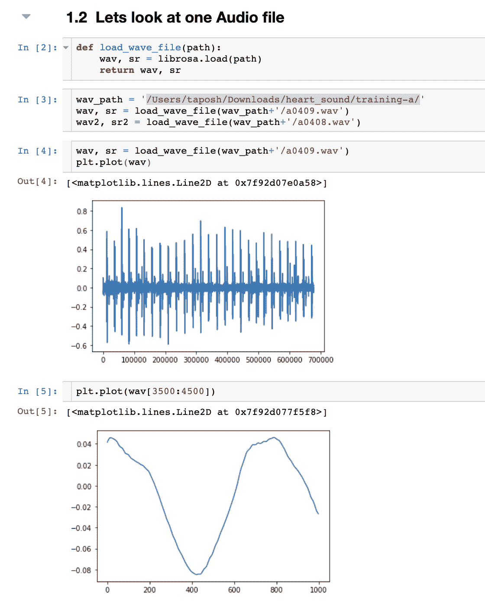

接下来，重新加载所有训练数据集并创建一个完整的训练文件。下面的代码解释了如何做到这一点。我们还将数据分类为正常和异常数据。

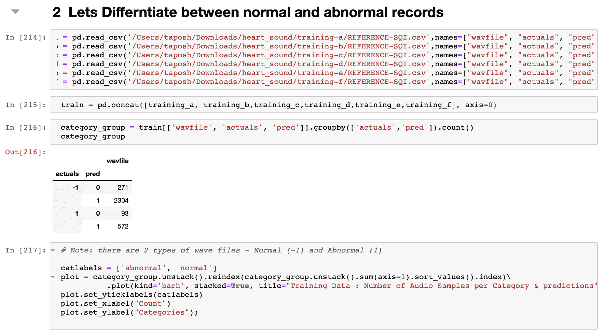

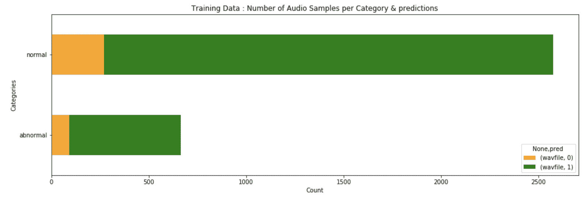

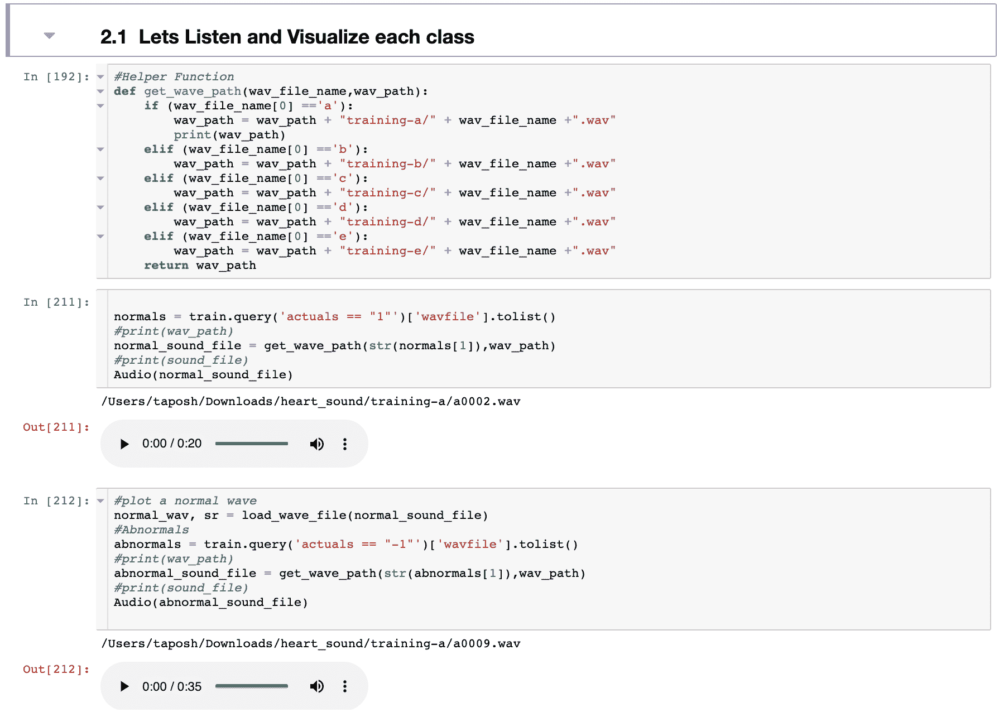

观察：文件长度不同

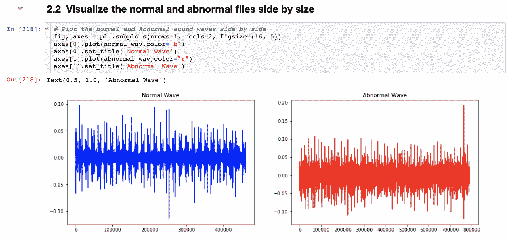

这里需要注意的另一点是音频文件的时长。第一个文件为 20 秒，而第二个为 35 秒。处理这个问题有两种方法：

1\. 用零填充音频到给定长度

2\. 重复音频以达到给定长度，例如所有音频样本的最大长度

同时，请注意我们的库 Librosa 的默认采样率设置为 22050（仅供参考，你可以更改此设置或使用原始采样率）。有关采样率的定义和其他细节，请参见之前的帖子：“[R 中的音频文件处理基础](https://medium.com/@taposhdr/basics-of-audio-file-processing-in-r-81c31a387e8e)”

采样 & 将所有文件设置为相同长度

用于零填充和音频重复的辅助函数

获取模型处理的数据（注意：此过程需要时间）

所有文件长度相同并且填充零

让我们查看`wave_files`，我们看到每个文件都有一行，每行有 110250 列的值。（记住我们的音频长度是 110250）

我们已经快准备好将这些数据传递给算法了。我们需要创建测试和训练数据集。这是用原始数据训练模型，而不进行任何特征工程。让我们看看结果如何。

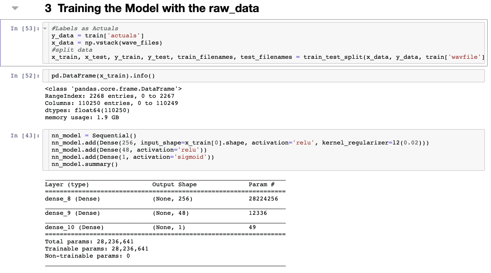

我们将使用“adam”优化器和 binary_crossentropy，详细信息请查看[论文](https://arxiv.org/abs/1412.6980)。

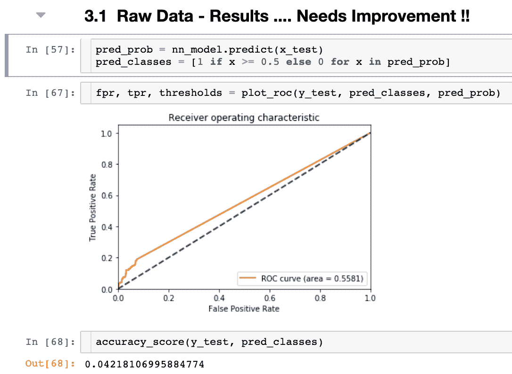

在下一篇文章中，我们将使用在初始文章中讨论的频率策略，并用 python 改进分数。

源代码：[`github.com/taposh/audio_processing/blob/master/code/python-code/heart_beat_python.ipynb`](https://github.com/taposh/audio_processing/blob/master/code/python-code/heart_beat_python.ipynb)

**简介：Taposh Dutta Roy** 领导 Kaiser Permanente 的 KPInsight 创新团队。这些是基于他个人研究的想法。这些想法和建议并不代表 Kaiser Permanente，Kaiser Permanente 对内容不承担任何责任。如果你有问题，可以通过[linkedin](https://www.linkedin.com/in/taposh/)联系 Dutta Roy 先生。

### **参考文献：**

Goldberger AL, Amaral LAN, Glass L, Hausdorff JM, Ivanov PCh, Mark RG, Mietus JE, Moody GB, Peng C-K, Stanley HE. PhysioBank, PhysioToolkit, 和 PhysioNet：复杂生理信号的新研究资源组件（2003）。《循环》101(23)：e215-e220。

[R 中的音频文件处理基础](https://medium.com/@taposhdr/basics-of-audio-file-processing-in-r-81c31a387e8e)

在当今时代，数字音频已成为我们生活的一部分。你可以与 Siri、Alexa 交流或说“好的……

[人体心脏基础解剖 - 心血管研究网络项目](http://www.cardio-research.com/basic-anatomy-of-the-human-heart)

心脏在哺乳动物中进化以履行其独特而关键的功能，即将血液排出和收集……

[人体心脏基础解剖 - 心血管研究网络项目](http://www.cardio-research.com/basic-anatomy-of-the-human-heart)

心脏在哺乳动物中进化以履行其独特而关键的功能，即将血液排出和收集……

[麦克马斯特大学医学院 >> 心脏科](https://fhs.mcmaster.ca/medicine/cardiology/faculty_member_amit.htm)

心脏科部门积极参与本科医学教育及住院医生的培训……

[LibROSA - librosa 0.7.2 文档](https://librosa.github.io/librosa/)

LibROSA 是一个用于音乐和音频分析的 Python 包。它提供了创建音乐所需的构建块……

[`arxiv.org/abs/1412.6980`](https://arxiv.org/abs/1412.6980)

[`www.researchgate.net/publication/210290203_Phonocardiography_Signal_Processing`](https://www.researchgate.net/publication/210290203_Phonocardiography_Signal_Processing)

[胸腔 | 解剖学](https://www.britannica.com/science/thoracic-cavity)

胸腔是身体第二大空腔，由肋骨、脊柱和……

[原文](https://medium.com/@taposhdr/audio-file-processing-ecg-audio-using-python-a919a9351952)。经许可转载。

**相关：**

+   使用深度神经网络构建音频分类器

+   人工智能改变医疗行业的 5 种方式

+   10 个 Python 字符串处理技巧与窍门

* * *

## 我们的三大课程推荐

 1\. [Google 网络安全证书](https://www.kdnuggets.com/google-cybersecurity) - 快速进入网络安全职业道路

 2\. [Google 数据分析专业证书](https://www.kdnuggets.com/google-data-analytics) - 提升你的数据分析技能

 3\. [Google IT 支持专业证书](https://www.kdnuggets.com/google-itsupport) - 支持你的组织的 IT 工作

* * *

### 更多相关话题

+   [Python 中的大文件并行处理](https://www.kdnuggets.com/2022/07/parallel-processing-large-file-python.html)

+   [KDnuggets 新闻，7 月 20 日：机器学习算法解释](https://www.kdnuggets.com/2022/n29.html)

+   [使用 Python 创建一个从音频中提取话题的 Web 应用程序](https://www.kdnuggets.com/2023/01/creating-web-application-extract-topics-audio-python.html)

+   [使用 Python 的 Watchdog 监控你的文件系统](https://www.kdnuggets.com/monitor-your-file-system-with-pythons-watchdog)

+   [Bark: 终极音频生成模型](https://www.kdnuggets.com/2023/05/bark-ultimate-audio-generation-model.html)

+   [WavJourney: 音频故事生成的探索之旅](https://www.kdnuggets.com/wavjourney-a-journey-into-the-world-of-audio-storyline-generation)
