# 使用 GPT-4 和 Python 自动化枯燥的任务

> 原文：[`www.kdnuggets.com/2023/03/automate-boring-stuff-chatgpt-python.html`](https://www.kdnuggets.com/2023/03/automate-boring-stuff-chatgpt-python.html)

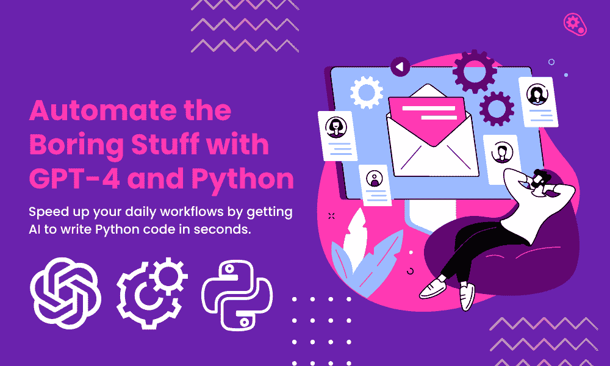

编辑提供的图片

2023 年 3 月 14 日，OpenAI 推出了 GPT-4，这是他们语言模型中最新且最强大的版本。

在推出仅几个小时内，GPT-4 令人大吃一惊，它将一个 [手绘草图转化为功能性网站](https://officechai.com/startups/gpt-4-can-create-a-working-website-from-a-hand-drawn-sketch-in-seconds/)， [通过了律师考试](https://www.iit.edu/news/gpt-4-passes-bar-exam)，并 [生成了准确的维基百科文章摘要](https://theconversation.com/evolution-not-revolution-why-gpt-4-is-notable-but-not-groundbreaking-201858)。

它在解决数学问题和基于逻辑和推理的问题回答方面也优于其前身 GPT-3.5。

ChatGPT 是建立在 GPT-3.5 之上的聊天机器人，并对公众开放，因其“幻觉”现象而臭名昭著。它会生成看似正确的回答，并用“事实”来为其答案辩护，尽管这些“事实”充满错误。

一位用户在 Twitter 上发帖，因为模型坚持认为大象的蛋是所有陆地动物中最大的：

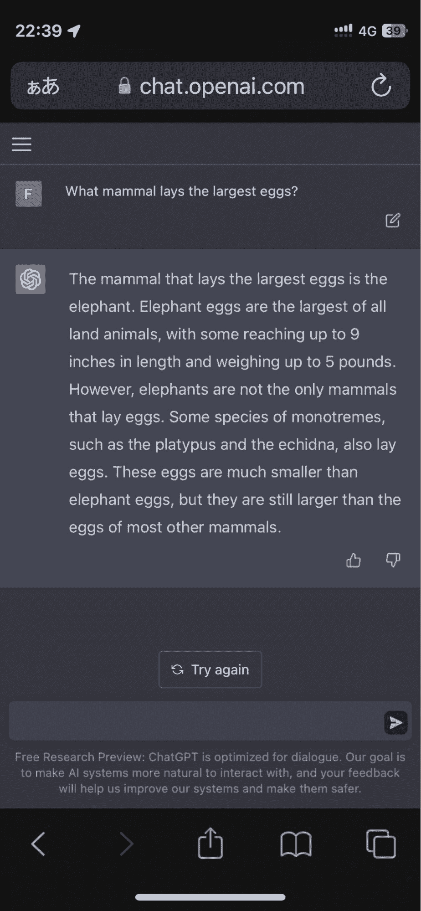

图片来自 [FioraAeterna](https://twitter.com/FioraAeterna/status/1599760552686862336?lang=en)

事情没有止步于此。该算法继续用虚假的事实来证实其回答，几乎让我一度信服。

GPT-4 则较少出现“幻觉”。OpenAI 最新的模型更难以被欺骗，并且不会像其前任那样频繁地自信地生成虚假信息。

# 为什么要使用 GPT-4 自动化工作流程？

作为一名数据科学家，我的工作要求我找到相关的数据源，预处理大型数据集，并建立高度准确的机器学习模型，以推动业务价值。

我花费了大量时间从不同的文件格式中提取数据，并将其整合到一个地方。

在 ChatGPT 于 2022 年 11 月首次推出后，我寻求该聊天机器人来指导我的日常工作流程。我使用这个工具来节省在琐碎工作上的时间——以便我可以专注于提出新想法和创建更好的模型。

一旦 GPT-4 发布，我对它是否会改变我正在做的工作感到好奇。使用 GPT-4 是否相比于其前辈有显著的好处？它是否能帮我节省比使用 GPT-3.5 时更多的时间？

在这篇文章中，我将向你展示我如何使用 ChatGPT 自动化数据科学工作流程。

我将创建相同的提示，并将其输入到 GPT-4 和 GPT-3.5 中，以查看前者是否确实表现更好并节省更多时间。

# 如何访问 ChatGPT？

如果你想跟随我在本文中所做的每一步，你需要访问 GPT-4 和 GPT-3.5。

## GPT-3.5

GPT-3.5 可以在 OpenAI 的网站上公开获取。只需访问[`chat.openai.com/auth/login`](https://chat.openai.com/auth/login)，填写所需信息，你将可以访问该语言模型：


图片来自[ChatGPT](https://chat.openai.com/auth/login)

## GPT-4

另一方面，GPT-4 目前隐藏在付费墙之后。要访问该模型，你需要通过点击“升级到 Plus”来升级到 ChatGPTPlus。

每月订阅费用为 20 美元/月，可以随时取消：


图片来自[ChatGPT](https://chat.openai.com/auth/login)

如果你不想支付每月的订阅费用，你也可以加入 GPT-4 的[API 候补名单](https://openai.com/waitlist/gpt-4-api)。一旦你获得了 API 访问权限，你可以按照[这个](https://holypython.com/python-api-tutorial/openai-gpt-4-api-quick-guide/)指南在 Python 中使用它。

如果你当前没有访问 GPT-4，也没关系。

你仍然可以使用后台使用 GPT-3.5 的免费版本 ChatGPT 来跟随这个教程。

# 使用 GPT-4 和 Python 自动化数据科学工作流程的 3 种方法

## 1\. 数据可视化

在进行探索性数据分析时，生成一个 Python 中的快速可视化通常有助于我更好地理解数据集。

不幸的是，这项任务可能会变得非常耗时——尤其是当你不知道使用正确的语法来获得期望的结果时。

我经常发现自己在查找 Seaborn 的广泛文档，并使用 StackOverflow 来生成一个 Python 图表。

让我们看看 ChatGPT 是否可以帮助解决这个问题。

在这一部分中，我们将使用[Pima 印第安糖尿病](https://www.kaggle.com/datasets/uciml/pima-indians-diabetes-database?resource=download)数据集。如果你想跟随 ChatGPT 生成的结果，你可以下载数据集。

下载数据集后，让我们使用 Pandas 库将其加载到 Python 中，并打印数据框的头部：

```py
import pandas as pd

df = pd.read_csv('diabetes.csv')
df.head()
```


这个数据集中有九个变量。其中一个名为“Outcome”，是目标变量，用于告诉我们一个人是否会发展糖尿病。其余的变量是用于预测结果的自变量。

好的！所以我想看看这些变量中哪些对一个人是否会发展糖尿病有影响。

为了实现这一点，我们可以创建一个聚类条形图，以可视化数据集中所有依赖变量中的“Diabetes”变量。

实际上，这段代码编写起来相当简单，但我们从简单开始。随着文章的进展，我们将转向更复杂的提示。

### 使用 GPT-3.5 的数据可视化

由于我拥有 ChatGPT 的付费订阅，每次访问时，工具都允许我选择要使用的基础模型。

我要选择 GPT-3.5：


来自 ChatGPT Plus 的图像

如果你没有订阅，你可以使用免费的 ChatGPT 版本，因为聊天机器人默认使用 GPT-3.5。

现在，让我们输入以下提示，以使用糖尿病数据集生成可视化：

> 我有一个包含 8 个独立变量和 1 个因变量的数据集。因变量 “Outcome” 告诉我们一个人是否会患糖尿病。
> 
> 独立变量 “Pregnancies”、“Glucose”、“BloodPressure”、“SkinThickness”、“Insulin”、“BMI”、“DiabetesPedigreeFunction” 和 “Age” 用于预测这个结果。
> 
> 你能生成 Python 代码来按结果可视化所有这些独立变量吗？输出应该是一个按“Outcome”变量着色的聚类柱状图。总共有 16 根柱子，每个独立变量 2 根。

这是模型对上述提示的回应：


一件立即显现的事情是模型假设我们想从 Seaborn 导入数据集。它可能做出这个假设是因为我们要求它使用 Seaborn 库。

这并不是一个大问题，我们只需要在运行代码之前更改一行代码。

这是由 GPT-3.5 生成的完整代码片段：

```py
import seaborn as sns
import matplotlib.pyplot as plt

# Load the dataset
dataset = pd.read_csv("diabetes.csv")

# Create the bar chart
sns.barplot(
    x="variable",
    y="value",
    hue="Outcome",
    data=pd.melt(dataset, id_vars=["Outcome"]),
    ci=None,
)

# Set the title and labels
plt.title("Dependent Variables by Outcome")
plt.xlabel("Independent Variables")
plt.ylabel("Value")

# Show the chart
plt.show() 
```

你可以将其复制并粘贴到你的 Python IDE 中。

这是运行上述代码后生成的结果：

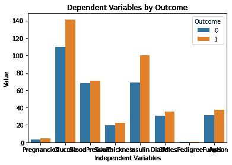

这个图表看起来很完美！它完全符合我在 ChatGPT 中输入提示时的预期。

不过，有一个突出的问提是图表上的文字出现了重叠。我打算问模型是否可以帮助我们解决这个问题，输入以下提示：

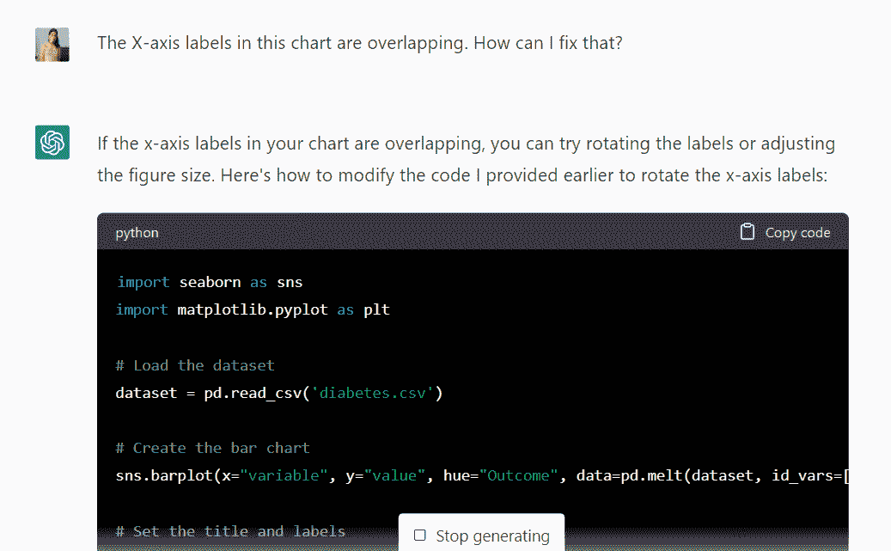

算法解释说，我们可以通过旋转图表标签或调整图形大小来防止这种重叠。它还生成了新的代码来帮助我们实现这一点。

让我们运行这段代码看看是否能得到期望的结果：

```py
import seaborn as sns
import matplotlib.pyplot as plt

# Load the dataset
dataset = pd.read_csv("diabetes.csv")

# Create the bar chart
sns.barplot(
    x="variable",
    y="value",
    hue="Outcome",
    data=pd.melt(dataset, id_vars=["Outcome"]),
    ci=None,
)

# Set the title and labels
plt.title("Dependent Variables by Outcome")
plt.xlabel("Independent Variables")
plt.ylabel("Value")

# Rotate the x-axis labels by 45 degrees and set horizontal alignment to right
plt.xticks(rotation=45, ha="right")

# Show the chart
plt.show()
```

上面的代码行应该生成以下输出：

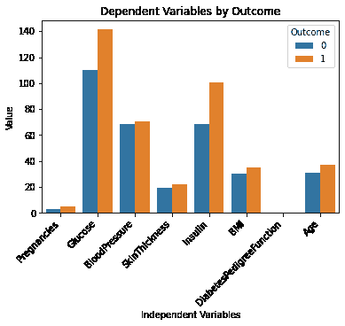

这看起来很棒！

通过仅仅查看这个图表，我现在对数据集有了更好的理解。看来血糖和胰岛素水平较高的人更容易患糖尿病。

此外，请注意，“DiabetesPedigreeFunction”变量在此图表中没有提供任何信息。这是因为该特征的尺度较小（在 0 和 2.4 之间）。如果你想进一步实验 ChatGPT，可以让它生成单个图表中的多个子图来解决这个问题。

### 使用 GPT-4 进行数据可视化

现在，让我们将相同的提示输入到 GPT-4 中，看看是否会得到不同的响应。我将选择 ChatGPT 中的 GPT-4 模型，并输入与之前相同的提示：

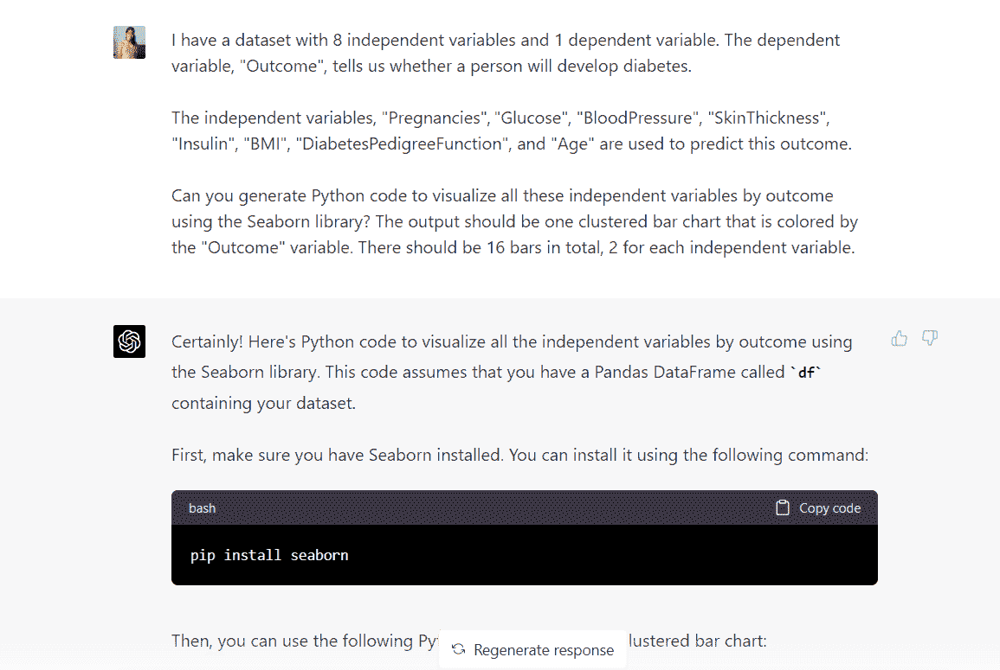

注意 GPT-4 不假设我们会使用 Seaborn 内置的 dataframe。

它告诉我们将使用一个名为 “df” 的 dataframe 来构建可视化，这比 GPT-3.5 生成的响应有所改进。

这是该算法生成的完整代码：

```py
import pandas as pd
import seaborn as sns
import matplotlib.pyplot as plt

# Assuming your DataFrame is called df
# First, you need to melt the DataFrame to make 
# it suitable for creating a clustered bar chart
melted_df = pd.melt(
    df,
    id_vars=["Outcome"],
    var_name="Independent Variable",
    value_name="Value",
)

# Create the clustered bar chart
plt.figure(figsize=(12, 6))
sns.barplot(
    data=melted_df,
    x="Independent Variable",
    y="Value",
    hue="Outcome",
    ci=None,
)

# Customize the plot
plt.title("Independent Variables by Outcome")
plt.ylabel("Average Value")
plt.xlabel("Independent Variables")
plt.legend(title="Outcome", loc="upper right")

# Show the plot
plt.show()
```

上述代码应生成以下图表：


这太完美了！

尽管我们没有要求，GPT-4 还是包含了一行代码以增加图表的大小。这个图表上的标签都清晰可见，所以我们不需要像之前那样返回并修改代码。

这比 GPT-3.5 生成的响应要高一个档次。

总体而言，GPT-3.5 和 GPT-4 在生成执行数据可视化和分析任务的代码方面似乎都很有效。

需要注意的是，由于你不能将数据上传到 ChatGPT 界面，你应该为模型提供准确的数据集描述，以获得最佳结果。

## 2\. 处理 PDF 文档

尽管这不是一个常见的数据科学用例，但我曾经需要从数百个 PDF 文件中提取文本数据来构建情感分析模型。数据是非结构化的，我花了很多时间来提取和预处理它。

我还经常与研究人员合作，他们阅读和创建关于特定行业当前事件的内容。他们需要跟上新闻，分析公司报告，并阅读行业内的潜在趋势。

与其阅读公司报告中的 100 页，不如直接提取你感兴趣的词汇，只阅读包含这些关键词的句子，不更简单吗？

或者，如果你对趋势感兴趣，可以创建一个自动化工作流，展示关键词随时间的增长，而不是手动查看每份报告。

在本节中，我们将使用 ChatGPT 在 Python 中分析 PDF 文件。我们将要求聊天机器人提取 PDF 文件的内容并将其写入文本文件。

再次，这将使用 GPT-3.5 和 GPT-4 来查看生成的代码是否有显著差异。

### 使用 GPT-3.5 阅读 PDF 文件

在本节中，我们将分析一个公开的 PDF 文档，标题为 [工程师机器学习简介](https://arxiv.org/pdf/1709.02840.pdf)。如果您想在本节中跟着编码，请确保下载此文件。

首先，让我们让算法生成提取数据并将其保存到文本文件中的 Python 代码：

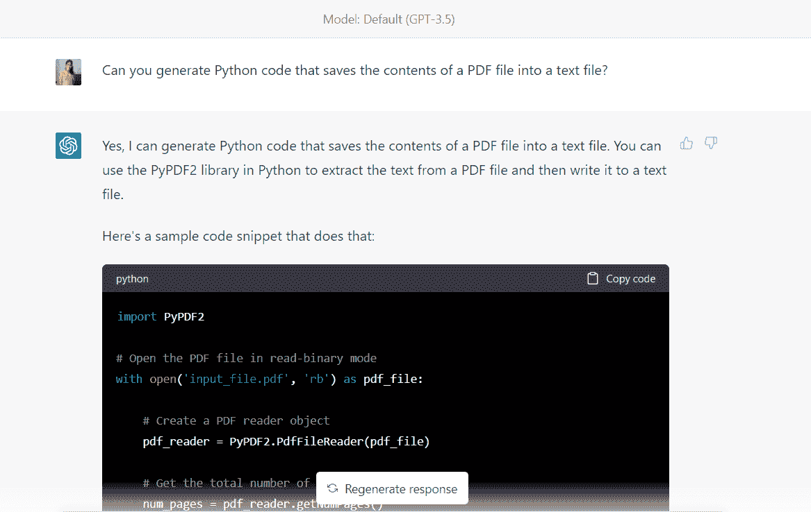

这是算法提供的完整代码：

```py
import PyPDF2

# Open the PDF file in read-binary mode
with open("Intro_to_ML.pdf", "rb") as pdf_file:
    # Create a PDF reader object
    pdf_reader = PyPDF2.PdfFileReader(pdf_file)

    # Get the total number of pages in the PDF file
    num_pages = pdf_reader.getNumPages()

    # Create a new text file
    with open("output_file.txt", "w") as txt_file:
        # Loop through each page in the PDF file
        for page_num in range(num_pages):
            # Get the text from the current page
            page_text = pdf_reader.getPage(page_num).extractText()

            # Write the text to the text file
            txt_file.write(page_text)
```

（注意：在运行此代码之前，请确保将 PDF 文件名更改为您之前保存的名称。）

不幸的是，在运行 GPT-3.5 生成的代码后，我遇到了以下 Unicode 错误：


让我们回到 GPT-3.5，看看模型是否能解决这个问题：

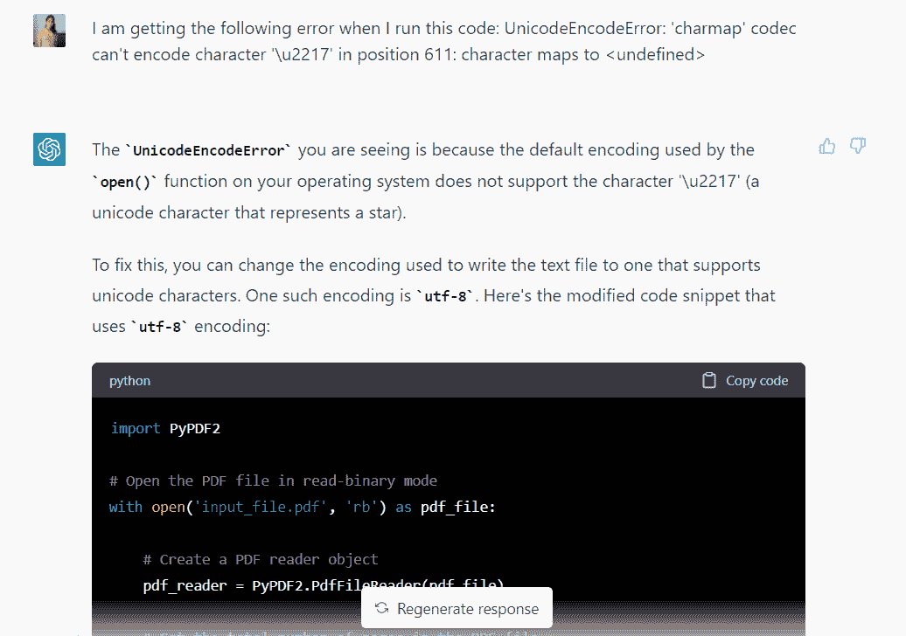

我将错误粘贴到 ChatGPT 中，模型回应说可以通过将编码更改为 “utf-8” 来修复。它还给我一些反映此更改的修改过的代码：

```py
import PyPDF2

# Open the PDF file in read-binary mode
with open("Intro_to_ML.pdf", "rb") as pdf_file:
    # Create a PDF reader object
    pdf_reader = PyPDF2.PdfFileReader(pdf_file)

    # Get the total number of pages in the PDF file
    num_pages = pdf_reader.getNumPages()

    # Create a new text file with utf-8 encoding
    with open("output_file.txt", "w", encoding="utf-8") as txt_file:
        # Loop through each page in the PDF file
        for page_num in range(num_pages):
            # Get the text from the current page
            page_text = pdf_reader.getPage(page_num).extractText()

            # Write the text to the text file
            txt_file.write(page_text)
```

这段代码成功执行，并创建了一个名为 “output_file.txt” 的文本文件。所有 PDF 文档中的内容已被写入该文件：

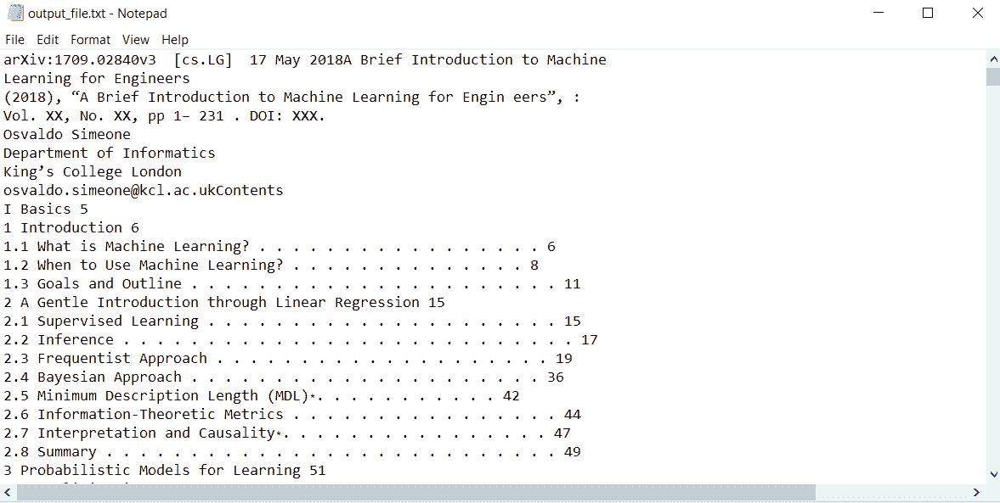

### 使用 GPT-4 阅读 PDF 文件

现在，我将相同的提示粘贴到 GPT-4 中，看看模型会提出什么：

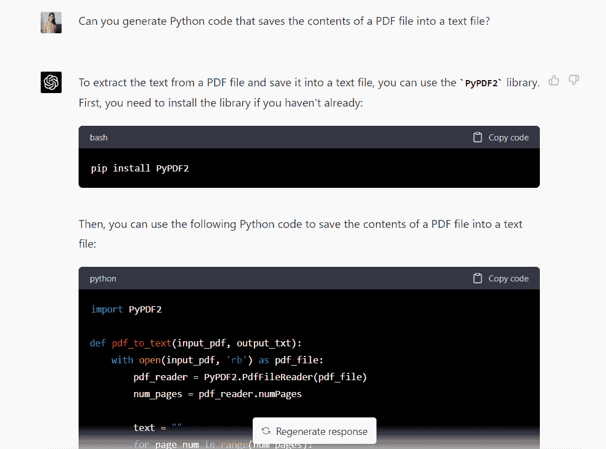

这是 GPT-4 生成的完整代码：

```py
import PyPDF2

def pdf_to_text(input_pdf, output_txt):
    with open(input_pdf, "rb") as pdf_file:
        pdf_reader = PyPDF2.PdfFileReader(pdf_file)
        num_pages = pdf_reader.numPages

        text = ""
        for page_num in range(num_pages):
            page = pdf_reader.getPage(page_num)
            text += page.extractText()
    with open(output_txt, "w", encoding="utf-8") as text_file:
        text_file.write(text)

input_pdf = "Intro_to_ML.pdf"
output_txt = "output_gpt4.txt"
pdf_to_text(input_pdf, output_txt)
```

看这个！

与 GPT-3.5 不同，GPT-4 已经明确指定应使用 “utf-8” 编码来打开文本文件。我们不需要像以前那样回过头来修改代码。

GPT-4 提供的代码应该能成功执行，您应该能在创建的文本文件中看到 PDF 文档的内容。

还有许多其他技术可以用来自动化 PDF 文档。如果您想进一步探索，以下是一些您可以在 ChatGPT 中输入的其他提示：

+   你能写出合并两个 PDF 文件的 Python 代码吗？

+   如何使用 Python 计算 PDF 文档中特定单词或短语的出现次数？

+   你能写出从 PDF 中提取表格并将其写入 Excel 的 Python 代码吗？

我建议您在空闲时间尝试一些这些方法 - 您会惊讶于 GPT-4 如何迅速帮助您完成那些通常需要几个小时的琐碎任务。

## 3. 发送自动化邮件

我每周花费数小时阅读和回复电子邮件。这不仅耗时，而且在追赶紧迫的截止日期时，保持对邮件的掌控也可能非常有压力。

尽管你不能让 ChatGPT 为你写所有的电子邮件（我希望可以），你仍然可以使用它来编写在特定时间发送的计划电子邮件程序，或修改一个可以发送给多人单个电子邮件模板。

在这一部分，我们将让 GPT-3.5 和 GPT-4 帮助我们编写一个 Python 脚本来发送自动化电子邮件。

### 使用 GPT-3.5 发送自动化电子邮件

首先，让我们输入以下提示来生成发送自动化电子邮件的代码：

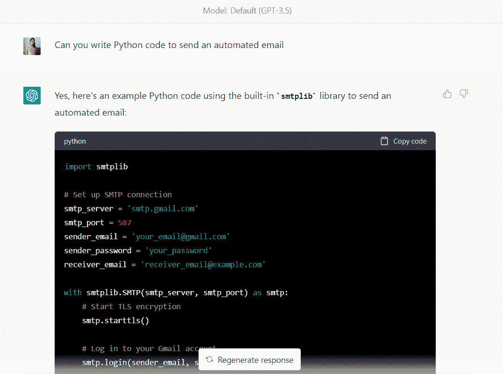

这是 GPT-3.5 生成的完整代码（在运行此代码之前，请确保更改电子邮件地址和密码）：

```py
import smtplib

# Set up SMTP connection
smtp_server = "smtp.gmail.com"
smtp_port = 587
sender_email = "your_email@gmail.com"
sender_password = "your_password"
receiver_email = "receiver_email@example.com"

with smtplib.SMTP(smtp_server, smtp_port) as smtp:
    # Start TLS encryption
    smtp.starttls()

    # Log in to your Gmail account
    smtp.login(sender_email, sender_password)

    # Compose your email message
    subject = "Automated email"
    body = "Hello,\n\nThis is an automated email sent from Python."
    message = f"Subject: {subject}\n\n{body}"

    # Send the email
    smtp.sendmail(sender_email, receiver_email, message)
```

不幸的是，这段代码没有成功执行。它生成了以下错误：

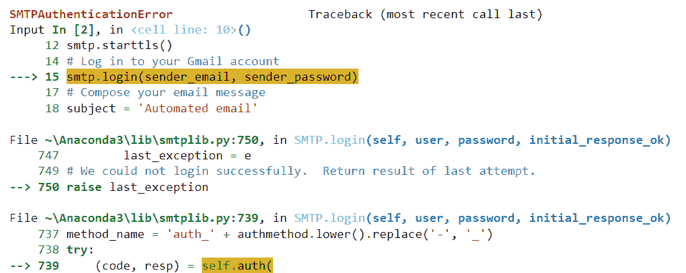

让我们把这个错误粘贴到 ChatGPT 中，看看模型是否能帮助我们解决它：


好的，算法指出了几个可能导致我们遇到此错误的原因。

我确切知道我的登录凭据和电子邮件地址是有效的，而且代码中没有任何拼写错误。因此，这些原因可以排除。

GPT-3.5 还建议允许不太安全的应用程序可能会解决这个问题。

然而，如果你尝试这样做，你将不会在 Google 帐户中找到允许访问不太安全应用程序的选项。

这是因为 Google [不再](https://support.google.com/accounts/answer/6010255?hl=en) 允许用户由于安全原因允许不太安全的应用程序。

最后，GPT-3.5 还提到如果启用了两步验证，则应生成应用程序密码。

我没有启用两步验证，所以我打算（暂时）放弃这个模型，看看 GPT-4 是否有解决方案。

### 使用 GPT-4 发送自动化电子邮件

好的，如果你在 GPT-4 中输入相同的提示，你会发现算法生成的代码与 GPT-3.5 给出的非常相似。这将导致我们之前遇到的相同错误。

让我们看看 GPT-4 是否能帮助我们修复这个错误：

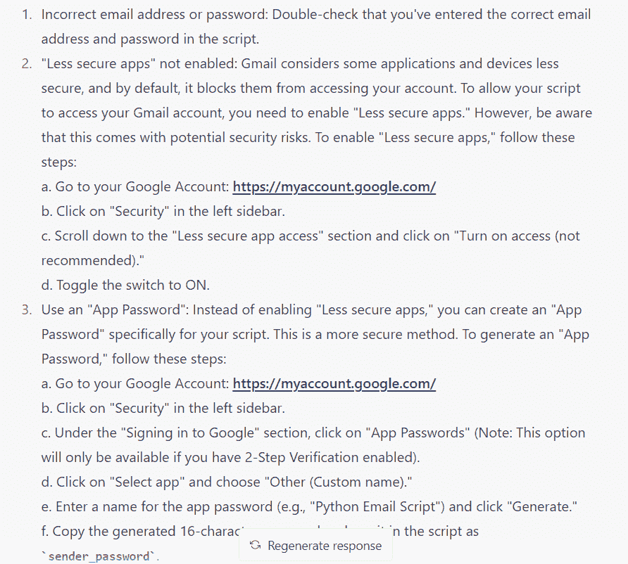

GPT-4 的建议与我们之前看到的非常相似。

然而，这次，它给出了逐步完成每个步骤的详细说明。

GPT-4 也建议创建应用程序密码，所以我们来试试看。

首先，访问你的 Google 帐户，导航到“安全性”，并启用两步验证。然后，在同一部分，你应该会看到一个名为“应用程序密码”的选项。

点击它，以下屏幕将出现：

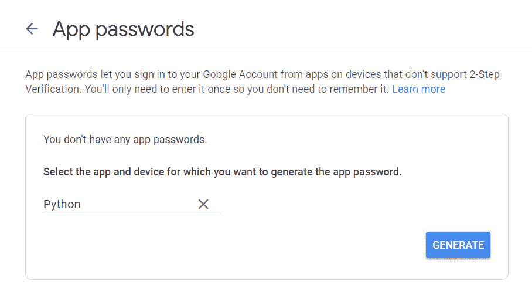

你可以输入任何你喜欢的名称，然后点击“生成”。

将会出现一个新的应用程序密码。

用此应用密码替换 Python 代码中的现有密码，并再次运行代码：

```py
import smtplib

# Set up SMTP connection
smtp_server = "smtp.gmail.com"
smtp_port = 587
sender_email = "your_email@gmail.com"
sender_password = "YOUR_APP_PASSWORD"
receiver_email = "receiver_email@example.com"

with smtplib.SMTP(smtp_server, smtp_port) as smtp:
    # Start TLS encryption
    smtp.starttls()

    # Log in to your Gmail account
    smtp.login(sender_email, sender_password)

    # Compose your email message
    subject = "Automated email"
    body = "Hello,\n\nThis is an automated email sent from Python."
    message = f"Subject: {subject}\n\n{body}"

    # Send the email
    smtp.sendmail(sender_email, receiver_email, message)
```

这次应该会成功运行，您的收件人将收到如下邮件：


完美！

由于 ChatGPT，我们已经成功通过 Python 发送了自动化邮件。

如果您想更进一步，我建议生成允许您：

1.  同时向多个收件人发送批量邮件

1.  向预定义的电子邮件地址列表发送计划邮件

1.  向收件人发送根据其年龄、性别和位置量身定制的邮件。

**[Natassha Selvaraj](https://www.natasshaselvaraj.com/)** 是一位自学成才的数据科学家，热衷于写作。您可以通过 [LinkedIn](https://www.linkedin.com/in/natassha-selvaraj-33430717a/) 与她联系。

* * *

## 我们的前三名课程推荐

 1\. [谷歌网络安全证书](https://www.kdnuggets.com/google-cybersecurity) - 快速入门网络安全职业。

 2\. [谷歌数据分析专业证书](https://www.kdnuggets.com/google-data-analytics) - 提升您的数据分析技能

 3\. [谷歌 IT 支持专业证书](https://www.kdnuggets.com/google-itsupport) - 支持您组织的 IT

* * *

### 更多相关内容

+   [使用 Python 自动化 Microsoft Excel 和 Word](https://www.kdnuggets.com/2021/08/automate-microsoft-excel-word-python.html)

+   [使用 Python 自动化的 5 个任务](https://www.kdnuggets.com/2021/06/5-tasks-automate-python.html)

+   [使用 Python 自动化数据清理的 5 个简单步骤](https://www.kdnuggets.com/5-simple-steps-to-automate-data-cleaning-with-python)

+   [使用 Promptr 和 GPT 自动化您的代码库](https://www.kdnuggets.com/2023/04/automate-codebase-promptr-gpt.html)

+   [使用 ChatGPT Canva 插件自动化图形设计活动](https://www.kdnuggets.com/automate-graphic-design-activity-with-chatgpt-canva-plugin)

+   [AI-自动化网络安全：自动化哪些方面？](https://www.kdnuggets.com/ai-automated-cybersecurity-what-to-automate)
