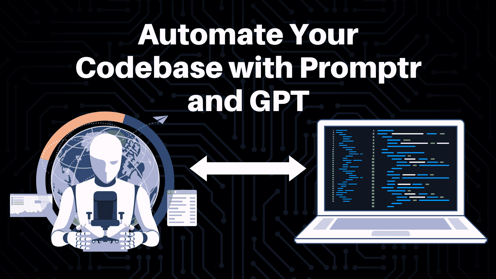
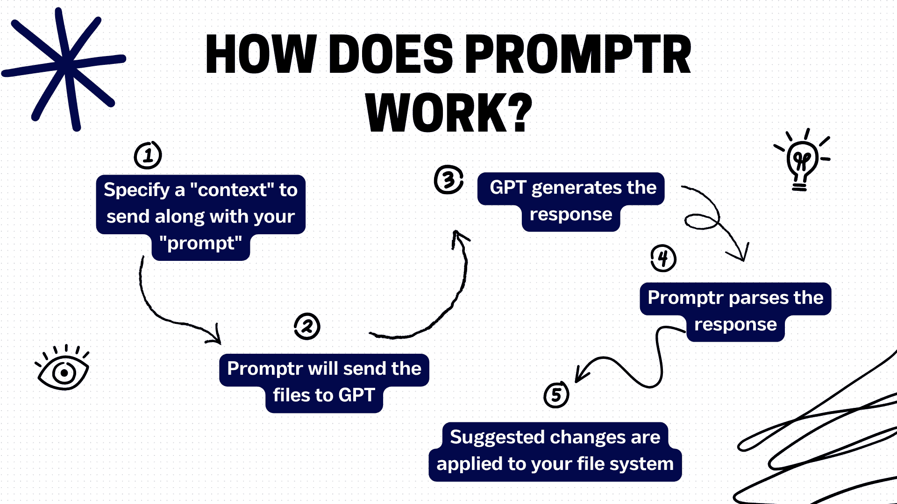

# 使用 Promptr 和 GPT 自动化你的代码库

> 原文：[`www.kdnuggets.com/2023/04/automate-codebase-promptr-gpt.html`](https://www.kdnuggets.com/2023/04/automate-codebase-promptr-gpt.html)



作者提供的图片

# 介绍

随着人工智能领域的增长和发展，我们见证了 GPT、ChatGPT、Bard 等强大工具的兴起。程序员们使用这些工具来简化他们的工作流程和优化他们的代码库。这使他们能够更多地专注于构建程序的核心逻辑，而减少在更琐碎和重复任务上的时间。然而，程序员们面临将代码复制到这些模型中、获取推荐，然后更新代码库的问题。对于那些经常这样做的人来说，这个过程变得非常繁琐。

幸运的是，现在已经有了解决这个问题的方案。让我介绍你一个开源的命令行工具 Promptr，它允许程序员在不离开编辑器的情况下自动化他们的代码库。听起来很酷吧？如果你想了解更多关于这个工具是如何工作的，它提供了什么以及如何设置它，请放松一下，我会为你解释的。

# 什么是 Promptr？

Promptr 是一个 CLI 工具，它使将 GPT 代码推荐应用到你的代码库变得更加容易。你可以通过一行代码进行代码重构、实现通过测试的类、实验 LLM、执行调试和故障排除等。根据其**官方文档**：

> “这在 GPT4 中效果最佳，因为它具有更大的上下文窗口，但 GPT3 在较小的范围内仍然有用。” ([来源 - GitHub](https://github.com/ferrislucas/promptr))

这个工具接受几个由空格分隔的参数，指定模式、模板、提示和生成输出的其他设置。

**一般语法：**

```py
promptr  -m <mode> [options] <file1> <file2> <file3> ...
```

例如：

+   +   **-m, --mode <mode>:** 它指定使用的模式（GPT-3 或 GPT-4）。默认模式是 GPT-3

    +   **-d, --dry-run:** 这是一个可选标志，仅将提示发送到模型，但不会在你的文件系统中反映更改。

    +   **-i, --interactive:** 启用交互模式，允许用户输入各种输入。

    +   **-p, --prompt <prompt>:** 这是一个非交互模式，它可以是一个包含提示的字符串或 URL/路径

    同样，你还可以根据你的用例使用他们 GitHub 存储库中提到的其他选项。现在，你可能会好奇这一切是如何在幕后发生的。让我们来深入探讨一下。

    # Promptr 是如何工作的？

    

    作者提供的图片

    首先，你需要清理工作区域并提交任何更改。然后，你需要编写一个包含明确指令的提示，就像你在向一位经验不足的同事解释任务一样。之后，指定你将与提示一起发送给 GPT 的上下文。请注意，提示是你给 GPT 的指令，而上下文是 GPT 执行代码库操作所需了解的文件。例如，

    ```py
    promptr -p "Cleanup the code in this file" index.js
    ```

    这里的 index.js 指的是上下文，而“清理此文件中的代码”是你给 GPT 的提示。Promptr 将其发送给 GPT 并等待响应，因为这可能需要一些时间。然后 GPT 生成的响应首先由 Promptr 解析，然后将建议的更改应用到你的文件系统中。这就是全部！简单却非常有用的工具。

    # 设置 Promptr 以自动化你的代码库

    以下是在本地计算机上设置 Promptr 的步骤：

    ## 要求

    +   [Node.js v18 或更高版本](https://nodejs.org/en/download)

    +   [OpenAI API 密钥](https://platform.openai.com/account/api-keys)

    ## 安装

    打开终端或命令行窗口。根据你使用的包管理器运行以下任一命令以全局安装 Promptr：

    **Npm:**

    ```py
    npm install -g @ifnotnowwhen/promptr
    ```

    **Yarn:**

    ```py
    yarn global add @ifnotnowwhen/promptr
    ```

    你也可以通过将当前版本的二进制文件复制到你的路径中来安装 Promptr，但目前仅支持 macOS 用户。

    安装完成后，你可以通过执行以下命令来验证：

    ```py
    promptr --version
    ```

    ## 设置 OpenAI API 密钥

    你需要一个 OpenAI API 密钥来使用 Promptr。如果你没有，可以注册一个免费账户来获得高达 $18 的免费积分。

    一旦你获得了密钥，你必须设置环境变量 ‘OPENAI_API_KEY’。

    **对于 Mac 或 Linux：**

    ```py
    export OPENAI_API_KEY=<your secret key>
    ```

    **对于 Windows：**

    点击“编辑系统环境变量”以添加新的变量 ‘OPENAI_API_KEY’，并将其值设置为你从 OpenAI 账户收到的密钥。

    # 结论

    尽管它允许人们像维护文本文件一样对其代码进行操作，但这项技术仍处于早期阶段，有一些缺点。例如，如果 GPT 建议删除文件，则可能会导致数据丢失，因此建议在使用前提交你的重要工作。同样，一些人对使用 OpenAI API 的每个令牌费用表示担忧。不过，我很好奇何时我们能开发出可以自我修复的软件。如果你想尝试一下，这里是官方 GitHub 存储库的链接 - [Promptr](https://github.com/ferrislucas/promptr)。

    **[Kanwal Mehreen](https://www.linkedin.com/in/kanwal-mehreen1)** 是一位有抱负的软件开发人员，对数据科学和 AI 在医学中的应用充满兴趣。Kanwal 被选为 2022 年 APAC 区域的 Google Generation 学者。Kanwal 喜欢通过撰写关于热门话题的文章来分享技术知识，并热衷于提高女性在科技行业中的代表性。

    * * *

    ## 我们的前三名课程推荐

     1\. [谷歌网络安全证书](https://www.kdnuggets.com/google-cybersecurity) - 快速进入网络安全职业的捷径。

     2\. [谷歌数据分析专业证书](https://www.kdnuggets.com/google-data-analytics) - 提升你的数据分析能力

     3\. [谷歌 IT 支持专业证书](https://www.kdnuggets.com/google-itsupport) - 支持组织的信息技术

    * * *

    ### 更多相关内容

    +   [用 GPT-4 和 Python 自动化枯燥的任务](https://www.kdnuggets.com/2023/03/automate-boring-stuff-chatgpt-python.html)

    +   [认识 Gorilla：加州大学伯克利分校和微软的 API 增强 LLM…](https://www.kdnuggets.com/2023/06/meet-gorilla-uc-berkeley-microsoft-apiaugmented-llm-outperforms-gpt4-chatgpt-claude.html)

    +   [使用 Python 自动化 Microsoft Excel 和 Word](https://www.kdnuggets.com/2021/08/automate-microsoft-excel-word-python.html)

    +   [用 Python 自动化的 5 个任务](https://www.kdnuggets.com/2021/06/5-tasks-automate-python.html)

    +   [使用 ChatGPT Canva 插件自动化平面设计活动](https://www.kdnuggets.com/automate-graphic-design-activity-with-chatgpt-canva-plugin)

    +   [人工智能自动化网络安全：要自动化什么？](https://www.kdnuggets.com/ai-automated-cybersecurity-what-to-automate)
