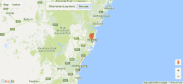

# Python、Selenium 和 Google 的地理编码自动化：免费和付费

> 原文：[`www.kdnuggets.com/2019/11/automate-geocoding-free-paid-python-selenium-google.html`](https://www.kdnuggets.com/2019/11/automate-geocoding-free-paid-python-selenium-google.html)

评论

地理编码是空间分析的起点。无论是地理编码一个地方还是居住地，准确的地理编码器是确保你的分析在正确轨道上的第一步。本教程将带你了解两种选项，它们利用 Python、Selenium 和 Google 地理编码 API 自动化地理编码过程。自动化是每个数据科学家都需要学习的技能。但自动化工作流因人而异，不是每个人的工作流都是一样的。当我们认为重复相同的过程过于耗时，而你的时间更值得用在其他事情上时，自动化就是我们要追求的目标。

### 免费的 Python 和 Selenium 地理编码

* * *

## 我们的前三个课程推荐

 1\. [谷歌网络安全证书](https://www.kdnuggets.com/google-cybersecurity) - 快速进入网络安全职业生涯。

 2\. [谷歌数据分析专业证书](https://www.kdnuggets.com/google-data-analytics) - 提升你的数据分析技能

 3\. [谷歌 IT 支持专业证书](https://www.kdnuggets.com/google-itsupport) - 支持你组织的 IT 部门

* * *

[来源](https://www.mapdevelopers.com/geocode_tool.php)

第一个教程是为了在没有付费服务的情况下自动化我的地理编码过程。根据我的个人观察，只要满足以下标准，我的脚本给了我至少 70% 的准确性：

+   地址中不得包含地点名称。

+   拼写错误最少

+   国家也是地址的一部分

该脚本假设你正在：

+   使用 xlxs 文件扩展名（Microsoft Excel 工作簿）

+   整个地址在一列中。

+   使用 Google Chrome

*注意：在使用 Selenium 时，确保你下载并将 [Google Chrome Diriver 文件](https://chromedriver.chromium.org/downloads) 保存在与脚本相同的目录中，并且版本与您的 Google Chrome 浏览器兼容。*

**最终输出将是一个包含地理编码地址和坐标的 Excel 文件，地址和坐标分列。**

```py

from selenium import webdriver
from selenium.webdriver.common.keys import Keys
from selenium.webdriver.support.ui import Select
from selenium.common.exceptions import ElementClickInterceptedException
import pandas as pd
import time
from openpyxl import load_workbook
from random import randint

wb_name = "xxx.xlsx" #file name

wb = load_workbook(wb_name, data_only = True)
ws = wb['sheet_name']
address_list =[]
link_col = xx  #column number

coord_prospects = pd.DataFrame() 

for row in ws.iter_rows(min_row = x , max_row = x, min_col = link_col, max_col=link_col):
    if str(row[0].value) != "None":
        address_list.append(row[0].value)

driver = webdriver.Chrome(options=options)
#driver.minimize_window() #this is optional if the opening google chrome window gets annoying
driver.get('https://www.mapdevelopers.com/geocode_tool.php')
add = driver.find_element_by_class_name('form-control')

for t,a in enumerate(address_list):
    print ("Geocoding...",t+1,"/",len(address_list),str(round(t/len(address_list)*100,2)),"%"," : ", a)
    add.clear()
    add.send_keys(a)
    try:
        search1 = driver.find_element_by_xpath('//*[@id="search-form"]/div[1]/span[2]').click()
        time.sleep(3)
        search2 = driver.find_element_by_xpath('//*[@id="search-form"]/div[1]/span[2]').click()
        time.sleep(3)
    except ElementClickInterceptedException:
        time.sleep(2)
        search = driver.find_element_by_xpath('//*[@id="search-form"]/div[1]/span[2]').click()
    lat=driver.find_element_by_id('display_lat')
    lng=driver.find_element_by_id('display_lng')
    street=driver.find_element_by_id('display_address')
    city=driver.find_element_by_id('display_city')
    postcode=driver.find_element_by_id('display_zip')
    state=driver.find_element_by_id('display_state')
    county=driver.find_element_by_id('display_county')
    country=driver.find_element_by_id('display_country')
    latlng = pd.DataFrame({'Latitude':pd.Series(lat.text),
                            'Longitude':pd.Series(lng.text),
                            'Street':pd.Series(street.text),
                            'City':pd.Series(city.text),
                            'Postcode':pd.Series(postcode.text),
                            'State':pd.Series(state.text),
                            'County':pd.Series(county.text),
                            'Country':pd.Series(country.text)})
    coord_prospects = coord_prospects.append(latlng, ignore_index=True)
    print(coord_prospects.tail(1))
    print("   ")

coord_prospects.to_excel('xxxx.xlsx') #name of output excel file

driver.close()

```

一旦你更新了 `wb_name`、`link_col` 和输出 Excel 文件的名称，你就可以开始运行脚本。

上述脚本运行后将打开 Google Chrome 浏览器并访问 https://www.mapdevelopers.com/geocode_tool.php，在那里你将看到你的地理编码过程。如果不是为了自动化，通常的情况是保持 Excel 和 Google 界面打开，并进行重复的复制和粘贴操作。拥有成千上万行数据的人将只是浪费时间。

有许多方法可以自动化和改进地理编码，这是我个人开发的一种方法，用于在不想支付 API 费用且不受时间限制的情况下。这让我提到使用免费地理编码方法与 API 相比的一些缺点：

+   尽管相比之下速度较慢，但比手动地理编码更高效快速

+   准确性几乎没有被超越

### Google Geocoding 与 Python

[来源](https://cloud.google.com/blog/products/maps-platform/address-geocoding-in-google-maps-apis)

Google 以前允许每天进行一定数量（约 2,500 次 API 调用）的地理编码免费使用。这虽然是一个令人恼火的限制，但它允许即使地址有一些拼写错误也能进行高精度地理编码，更何况如果你有地点名称的话会更好。**但最近 Google 现在对每次 API 调用收费**。

如果没有弄错的话，目前的费用是每 1,000 次 API 调用 $5，每 100,000 次以上的 API 调用 $4。换句话说，前 100,000 次 API 调用的费用是每次 $0.005。超过 500,000 次的情况可能需要联系他们的销售团队。有关 Geocoding API 计费的信息请见 [这里](https://developers.google.com/maps/documentation/geocoding/usage-and-billing)。**每个新注册都可以获得 $200 的信用额度**。

要开始使用 Google Geocoder API，你必须获得一个 API 密钥：[Google 开发者 API 密钥](https://developers.google.com/maps/documentation/geolocation/get-api-key)

一旦你获得了他们的地理编码服务的 API 密钥，你就可以开始使用他们的服务。使用的地址也可以包括地点名称，这通常会改善结果。如果它在 Google 地图上可以找到，那么可以使用 Google 的地理编码器来提取坐标。

```py

import pandas as pd
import googlemaps

api = "xxx" #API Key

df = pd.read_excel("xxx.xlsx") #file name

geocoder = googlemaps.Client(key=api)
df['Latitude'] = None
df['Longitude'] = None
df['Google Address'] = None

for i in range(len(df)):
    print("Geocoding..."+" "+str(i)+"/"+str(len(df)) + " " + str(round(i/len(df)*100,2))+"%")
    result = geocoder.geocode(df.loc[i,"xxx"]) # xxx is the name of the column with the full address
    try:
        lat = result[0]["geometry"]["location"]["lat"]
        lng = result[0]["geometry"]["location"]["lng"]
        address = result[0]["formatted_address"]
        df.loc[i,"Latitude"] = lat
        df.loc[i,"Longitude"] = lng
        df.loc[i,"Google Address"] = address
    except:
        lat=None
        lng=None
        location=None
print(df)
df.to_excel("xxx.xlsx") #name of output file

```

你只需要添加的部分是 `api`、`df`、包含完整地址的列名称和最后的输出文件名称。

上述脚本将返回一个包含三个新列的 Excel 文件：'纬度'、'经度'、'Google 地址'。它将比任何自定义脚本更快。Google 无疑是最受欢迎的地理编码 API，因为它在客户端项目中非常可靠。在商业环境中，如果客户希望将其客户的住所坐标进行映射、可视化和分析，那么解释使用 Google 进行地理编码将是简单易懂的。

这种方法使用的代码行数更少，维护起来更容易。由于没有限制且每次 API 调用的价格相对便宜，因此在一定程度上是可行的。

**相关：**

+   使用 Folium 在 Python 中可视化地理空间数据

+   如何从零开始构建数据科学项目

+   将 OpenStreetMap 数据转化为 ML 训练标签以进行目标检测

### 更多相关内容

+   [成为伟大数据科学家所需的 5 项关键技能](https://www.kdnuggets.com/2021/12/5-key-skills-needed-become-great-data-scientist.html)

+   [每个初学者数据科学家应掌握的 6 种预测模型](https://www.kdnuggets.com/2021/12/6-predictive-models-every-beginner-data-scientist-master.html)

+   [2021 年最佳 ETL 工具](https://www.kdnuggets.com/2021/12/mozart-best-etl-tools-2021.html)

+   [Python 中的地理编码：完整指南](https://www.kdnuggets.com/2022/11/geocoding-python-complete-guide.html)

+   [使用管道编写干净的 Python 代码](https://www.kdnuggets.com/2021/12/write-clean-python-code-pipes.html)

+   [是什么让 Python 成为初创企业理想的编程语言](https://www.kdnuggets.com/2021/12/makes-python-ideal-programming-language-startups.html)
