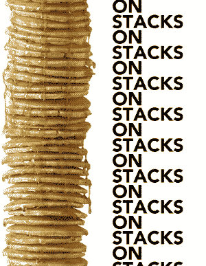
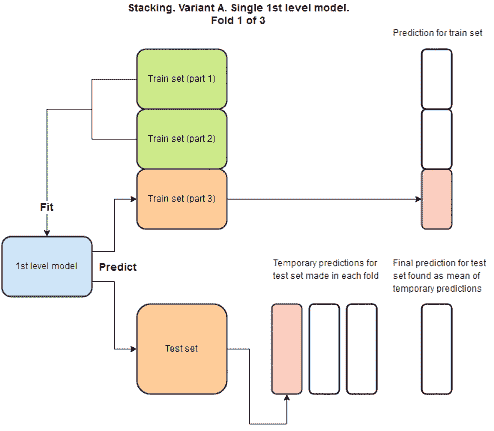

# 在 Python 中自动化堆叠：如何在节省时间的同时提升性能

> 原文：[`www.kdnuggets.com/2019/08/automate-stacking-python-boost-performance.html`](https://www.kdnuggets.com/2019/08/automate-stacking-python-boost-performance.html)

 评论

**作者 [Lukas Frei](https://www.linkedin.com/in/lukas-k-frei/)，PwC**

### 介绍

* * *

## 我们的前三个课程推荐

 1\. [Google 网络安全证书](https://www.kdnuggets.com/google-cybersecurity) - 快速进入网络安全职业道路

 2\. [Google 数据分析专业证书](https://www.kdnuggets.com/google-data-analytics) - 提升你的数据分析技能

 3\. [Google IT 支持专业证书](https://www.kdnuggets.com/google-itsupport) - 支持你所在的组织的 IT

* * *

使用堆叠（堆叠泛化）在提升机器学习算法到新高度时是一个非常热门的话题。例如，如今大多数甚至所有获奖的 Kaggle 提交都使用某种形式的堆叠或其变体。堆叠泛化首次在 1992 年的论文*Stacked Generalization*中由**David Wolpert**提出，*其主要目的是减少泛化误差*。根据 Wolpert 的说法，它们可以被理解为“交叉验证的更复杂版本”*。虽然 Wolpert 自己当时指出堆叠泛化的许多部分是“黑艺”，但似乎构建越来越大的堆叠泛化模型比小的堆叠泛化模型更有优势。然而，随着这些模型规模的不断扩大，它们的复杂性也在增加。自动化构建不同架构的过程将显著简化这一过程。本文的其余部分将讨论我最近遇到的一个包***vecstack***，它正试图实现这一点***。

来源：[`giphy.com/gifs/funny-food-hRsayJrDAx8WY`](https://giphy.com/gifs/funny-food-hRsayJrDAx8WY)

### 堆叠泛化是什么样的？

堆叠泛化结构的主要思想是使用一个或多个第一层模型，通过这些模型进行预测，然后使用这些预测作为特征来拟合一个或多个第二层模型。为了避免过拟合，通常使用交叉验证来预测训练集的 OOF（折外）部分。这个包中有两种不同的变体，但我将在这一段中描述“变体 A”。在这种变体中，我们通过计算所有预测值的均值或众数来得到最终预测。整个过程可以使用以下来自 vecstack 文档的 GIF 进行可视化：



### 用例: 为分类构建堆叠泛化

在查看了文档之后，是时候亲自尝试使用这个包，看看它如何工作。为此，我决定使用 UCI 机器学习库中提供的葡萄酒数据集。这个数据集的问题陈述是使用 13 个特征，这些特征代表了葡萄酒的不同方面，以预测葡萄酒来自意大利的哪个三种品种之一。

要开始，让我们首先导入项目中需要的包：

```py
import pandas as pd
from sklearn.datasets import load_iris
from sklearn.model_selection import train_test_split
from sklearn.metrics import accuracy_score
from sklearn.neighbors import KNeighborsClassifier
from sklearn.ensemble import RandomForestClassifier
from xgboost import XGBClassifier
from vecstack import stacking
```

现在我们准备好导入数据并查看，以更好地了解数据的样子：

```py
link = 'https://archive.ics.uci.edu/ml/machine-learning-databases/wine/wine.data'
names = ['Class', 'Alcohol', 'Malic acid', 'Ash',
         'Alcalinity of ash' ,'Magnesium', 'Total phenols',
         'Flavanoids', 'Nonflavanoid phenols', 'Proanthocyanins',     'Color intensity', 'Hue', 'OD280/OD315 of diluted wines',
         'Proline']df = pd.read_csv(link, header=None, names=names)
df.sample(5)
```

运行上述代码块，我们得到：


请注意，我使用了**.sample()**而不是**.head()**，以避免由于假设整个数据集具有前五行的结构而可能被误导。幸运的是，这个数据集没有任何缺失值，因此我们可以直接使用它来测试我们的包，而无需进行通常需要的数据清理和准备。

接下来，我们将把响应变量从输入变量中分离出来，并按照 vecstacks 文档中的示例执行 80:20 的训练-测试-拆分。

```py
y = df[['Class']]
X = df.iloc[:,1:]X_train, X_test, y_train, y_test = train_test_split(X, y, test_size=0.2, random_state=0)
```

我们离有趣的部分越来越近了。还记得之前的 GIF 吗？现在是定义几个第一层模型进行堆叠泛化的时候了。这一步绝对值得单独写一篇文章，但为了简单起见，我们将使用三个模型：KNN 分类器、随机森林分类器和 XGBoost 分类器。

```py
models = [
    KNeighborsClassifier(n_neighbors=5,
                        n_jobs=-1),

    RandomForestClassifier(random_state=0, n_jobs=-1,
                           n_estimators=100, max_depth=3),

    XGBClassifier(random_state=0, n_jobs=-1, learning_rate=0.1,
                  n_estimators=100, max_depth=3)
]
```

这些参数在设置之前没有进行调优，因为本文的目的是测试包。如果你想优化性能，不应该仅仅复制和粘贴这些。

从文档中获取下一部分代码，我们实际上是使用第一层模型进行预测，以执行 GIF 的第一部分：

```py
S_train, S_test = stacking(models,
                           X_train, y_train, X_test,
                           regression=False,

                           mode='oof_pred_bag',

                           needs_proba=False,

                           save_dir=None,

                           metric=accuracy_score,

                           n_folds=4,

                           stratified=True,

                           shuffle=True,

                           random_state=0,

                           verbose=2)
```

堆叠函数接受几个输入：

+   ***models***: 我们之前定义的第一层模型

+   ***X_train, y_train, X_test***: 我们的数据

+   ***regression***: 布尔值，指示是否要将函数用于回归。在我们的情况下设置为 False，因为这是一个分类问题

+   ***模式:*** 使用之前描述的交叉验证中的外折

+   ***needs_proba***: 布尔值，指示是否需要类别标签的概率

+   ***save_dir***: 将结果保存到目录布尔值

+   ***metric***: 使用什么评估指标（我们在开始时导入了 accuracy_score）

+   ***n_folds***: 用于交叉验证的折数

+   ***stratified***: 是否使用分层交叉验证

+   ***shuffle***: 是否打乱数据

+   ***random_state***: 设置随机状态以确保可重复性

+   ***verbose***: 这里的 2 指打印所有信息

这样做后，我们得到如下输出：

```py
task:         [classification]
n_classes:    [3]
metric:       [accuracy_score]
mode:         [oof_pred_bag]
n_models:     [4]model  0:     [KNeighborsClassifier]
    fold  0:  [0.72972973]
    fold  1:  [0.61111111]
    fold  2:  [0.62857143]
    fold  3:  [0.76470588]
    ----
    MEAN:     [0.68352954] + [0.06517070]
    FULL:     [0.68309859]model  1:     [ExtraTreesClassifier]
    fold  0:  [0.97297297]
    fold  1:  [1.00000000]
    fold  2:  [0.94285714]
    fold  3:  [1.00000000]
    ----
    MEAN:     [0.97895753] + [0.02358296]
    FULL:     [0.97887324]model  2:     [RandomForestClassifier]
    fold  0:  [1.00000000]
    fold  1:  [1.00000000]
    fold  2:  [0.94285714]
    fold  3:  [1.00000000]
    ----
    MEAN:     [0.98571429] + [0.02474358]
    FULL:     [0.98591549]model  3:     [XGBClassifier]
    fold  0:  [1.00000000]
    fold  1:  [0.97222222]
    fold  2:  [0.91428571]
    fold  3:  [0.97058824]
    ----
    MEAN:     [0.96427404] + [0.03113768]
    FULL:     [0.96478873]
```

再次参考 GIF，现在只需在我们的预测上拟合我们选择的第二级模型以做出最终预测。在我们的案例中，我们将使用 XGBoost 分类器。这一步骤与 sklearn 中的常规拟合和预测没有显著不同，只是我们用预测值 S_train 代替 X_train 来训练模型。

```py
model = XGBClassifier(random_state=0, n_jobs=-1, learning_rate=0.1,
                      n_estimators=100, max_depth=3)

model = model.fit(S_train, y_train)y_pred = model.predict(S_test)print('Final prediction score: [%.8f]' % accuracy_score(y_test, y_pred))Output: Final prediction score: [0.97222222]
```

### 结论

利用 vecstacks 的堆叠自动化，我们已经成功预测出正确的葡萄酒品种，准确率约为 97.2%！如你所见，该 API 与 sklearn API 不冲突，因此在尝试加快堆叠工作流时，它可以提供一个有用的工具。

一如既往，如果你有任何反馈或发现错误，请随时与我联系。

*参考文献*：

[1] David H. Wolpert, [堆叠泛化](https://www.researchgate.net/publication/222467943_Stacked_Generalization) (1992), 神经网络

[2] Igor Ivanov, [Vecstack](https://github.com/vecxoz/vecstack) (2016), GitHub

[3] M. Forina 等, [葡萄酒数据集](https://archive.ics.uci.edu/ml/datasets/wine) (1991), UCI 机器学习库

**简介: [Lukas Frei](https://www.linkedin.com/in/lukas-k-frei/)** 是 PwC 的数据科学顾问。

[原文](https://towardsdatascience.com/automate-stacking-in-python-fc3e7834772e). 经许可转载。

**相关：**

+   这里是你如何加速你的数据科学工作在 GPU 上

+   用 Numpy 加速你的 Python 代码的一个简单技巧

+   GPU 加速的数据分析与机器学习

### 更多相关话题

+   [大数据如何实时拯救生命：IoV 数据分析帮助…](https://www.kdnuggets.com/how-big-data-is-saving-lives-in-real-time-iov-data-analytics-helps-prevent-accidents)

+   [转行数据科学时犯的 5 个错误](https://www.kdnuggets.com/2023/07/5-mistakes-made-switching-data-science-career.html)

+   [提升你的机器学习模型性能！](https://www.kdnuggets.com/2023/04/manning-boost-machine-learning-model-performance.html)

+   [使用 Promptr 和 GPT 自动化你的代码库](https://www.kdnuggets.com/2023/04/automate-codebase-promptr-gpt.html)

+   [使用 Python 自动化的 5 个任务](https://www.kdnuggets.com/2021/06/5-tasks-automate-python.html)

+   [使用 Python 自动化 Microsoft Excel 和 Word](https://www.kdnuggets.com/2021/08/automate-microsoft-excel-word-python.html)
