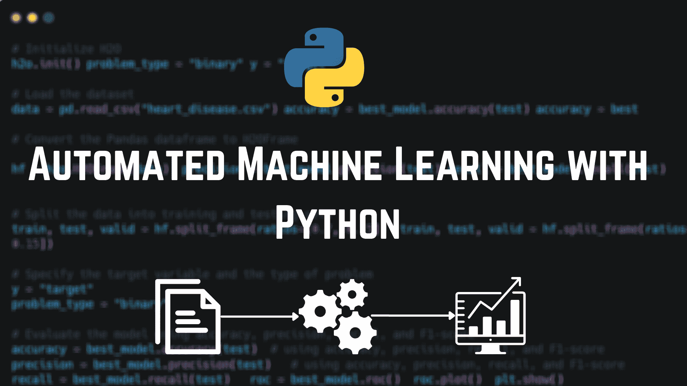
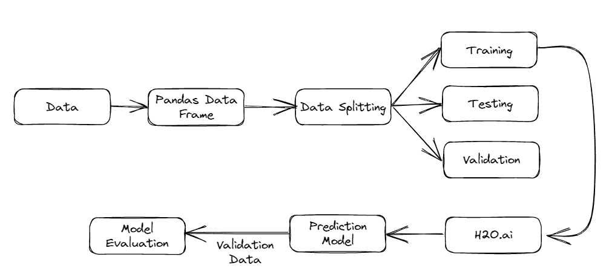
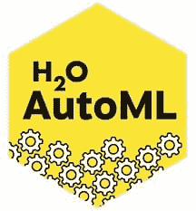

# 使用 Python 的自动化机器学习：案例研究

> 原文：[`www.kdnuggets.com/2023/04/automated-machine-learning-python-case-study.html`](https://www.kdnuggets.com/2023/04/automated-machine-learning-python-case-study.html)



作者提供的图像

在今天的世界中，所有组织都希望使用机器学习来分析他们每天从用户那里生成的数据。在机器或深度学习算法的帮助下，他们可以分析这些数据。之后，他们可以在生产环境中预测测试数据。但是，如果我们开始按照所述流程操作，我们可能会面临构建和训练机器学习模型等问题，因为这既耗时又需要编程、统计、数据科学等领域的专业知识。

* * *

## 我们的前 3 名课程推荐

 1\. [Google 网络安全证书](https://www.kdnuggets.com/google-cybersecurity) - 快速进入网络安全职业生涯。

 2\. [Google 数据分析专业证书](https://www.kdnuggets.com/google-data-analytics) - 提升您的数据分析能力

 3\. [Google IT 支持专业证书](https://www.kdnuggets.com/google-itsupport) - 支持您的组织 IT

* * *

因此，为了克服这些挑战，自动化机器学习（AutoML）应运而生，成为自动化机器学习管道中许多方面的热门解决方案。因此，在本文中，我们将通过一个关于心脏病预测的实际案例来讨论 AutoML 与 Python 的结合。

# 案例研究：心脏病预测

我们可以轻易观察到，与心脏相关的问题是全球主要的死亡原因。减少这些影响的唯一方法是通过一些自动化方法早期检测疾病，从而减少消耗的时间，并采取一些预防措施以减少其影响。因此，考虑到这个问题，我们将探索一个与医疗患者记录相关的数据集，以建立一个机器学习模型，从中我们可以预测患者患心脏病的可能性或概率。这种解决方案可以轻松应用于医院，医生可以尽快提供一些治疗。

我们在这个案例研究中遵循的完整模型管道如下所示。



图 1 AutoML 模型管道 | 作者提供的图像

## 实施

**步骤 1：** 在开始实现之前，让我们导入所需的库，包括用于矩阵操作的 NumPy、用于数据分析的 Pandas 和用于数据可视化的 Matplotlib。

```py
import numpy as np
import pandas as pd
import matplotlib.pyplot as plt
import h2o
from h2o.automl import H2OAutoML
```

**步骤 2：** 在以上步骤中导入所有必需的库之后，我们现在将尝试加载我们的数据集，同时利用 Pandas 数据框以优化的方式存储数据，因为它们在空间和时间复杂度方面比其他数据结构（如链表、数组、树等）更高效。

此外，我们可以执行数据预处理，以准备数据进行进一步建模和泛化。要下载我们在这里使用的数据集，你可以轻松访问[链接](https://www.kaggle.com/datasets/volodymyrgavrysh/heart-disease)。

```py
# Initialize H2O
h2o.init()

# Load the dataset
data = pd.read_csv("heart_disease.csv")

# Convert the Pandas data frame to H2OFrame
hf = h2o.H2OFrame(data)
```

**步骤 3：** 在准备好机器学习模型的数据后，我们将使用一个著名的自动化机器学习库 H2O.ai，它帮助我们创建和训练模型。



图片由[H2O.ai](https://www.google.com/imgres?imgurl=https%3A%2F%2Fdocs.h2o.ai%2Fh2o%2Flatest-stable%2Fh2o-docs%2F_images%2Fh2o-automl-logo.jpg&imgrefurl=https%3A%2F%2Fdocs.h2o.ai%2Fh2o%2Flatest-stable%2Fh2o-docs%2Fautoml.html&tbnid=mgiBQv6I-GgcqM&vet=12ahUKEwixg-CS4d79AhWOA7cAHeu1BsQQMygBegUIARDMAQ..i&docid=NCAbmuegOrnzoM&w=835&h=900&q=h2o%20automated%20learning&ved=2ahUKEwixg-CS4d79AhWOA7cAHeu1BsQQMygBegUIARDMAQ)提供

这个平台的主要好处是它提供了高级 API，我们可以轻松自动化管道的许多方面，包括特征工程、模型选择、数据清理、超参数调整等，这大大减少了训练机器学习模型所需的时间，适用于任何数据科学项目。

**步骤 4：** 现在，为了构建模型，我们将使用 H2O.ai 库的 API，为此，我们必须指定问题的类型，无论是回归问题还是分类问题，或其他类型，并注明目标变量。然后，该库会自动为给定问题选择最佳模型，包括如支持向量机、决策树、深度神经网络等算法。

```py
# Split the data into training and testing sets
train, test, valid = hf.split_frame(ratios=[0.7, 0.15])

# Specify the target variable and the type of problem
y = "target"
problem_type = "binary"
```

**步骤 5：** 在从一组算法中最终确定最佳模型后，最关键的任务是根据涉及的超参数对模型进行微调。这个调整过程涉及许多技术，如网格搜索交叉验证等，这有助于找到给定问题的最佳超参数集。

```py
# Run AutoML
aml = H2OAutoML(max_models=10, seed=1, balance_classes=True)
aml.train(y=y, training_frame=train, validation_frame=valid)

# View the leaderboard
lb = aml.leaderboard
print(lb)

# Get the best model
best_model = aml.leader
```

**步骤 6：** 现在，最后的任务是检查模型的性能，使用评估指标，如分类问题的混淆矩阵、精确度、召回率等，以及回归模型的均方误差（MSE）、平均绝对误差（MAE）、均方根误差（RMSE）和 R 平方值，以便我们可以找到一些关于模型在生产环境中表现的推论。

```py
# Make predictions on the test data
preds = best_model.predict(test)

# Convert the predictions to a Pandas dataframe
preds_df = preds.as_data_frame()

# Evaluate the model using accuracy, precision, recall, and F1-score
accuracy = best_model.accuracy(test)
precision = best_model.precision(test)
recall = best_model.recall(test)
f1 = best_model.f1(test)

print("Accuracy:", accuracy)
print("Precision:", precision)
print("Recall:", recall)
print("F1-score:", f1)
```

**步骤-7**：最后，我们将绘制 ROC 曲线，该曲线展示了假阳性率（即模型预测结果与实际结果不符，并且模型预测为正类，而实际属于负类）和假阴性率（即模型预测结果与实际结果不符，并且模型预测为负类，而实际属于正类）之间的关系，同时打印混淆矩阵，最终完成对测试数据的模型预测和评估。然后我们将关闭我们的 H2O。

```py
# Plot the ROC curve
roc = best_model.roc()
roc.plot()
plt.show()

# Plot the confusion matrix
cm = best_model.confusion_matrix()
cm.plot()
plt.show()

# Shutdown H2O
h2o.shutdown()
```

你可以从[这里](https://drive.google.com/file/d/1SzW_kP7R5u6pEWoRl0NR3JJGwtptTXWF/edit)访问提到的代码的笔记本。

# 结论

总结这篇文章，我们探讨了自动化整个机器学习或数据科学任务过程的一个最受欢迎的平台的不同方面，通过这个平台，我们可以轻松地使用 Python 编程语言创建和训练机器学习模型，同时我们还涵盖了一个著名的心脏病预测案例研究，这有助于加深对如何有效使用这些平台的理解。使用这些平台，机器学习管道可以轻松优化，从而节省工程师在组织中的时间，减少系统延迟和资源利用，如 GPU 和 CPU 核心，这些对广大用户来说都非常可及。

**[Aryan Garg](https://www.linkedin.com/in/aryan-garg-1bbb791a3/)** 是一名电气工程学士学位学生，目前在本科最后一年。他对 Web 开发和机器学习领域充满兴趣，并在这些方向上追求自己的兴趣，渴望进一步工作。

### 更多相关内容

+   [KDnuggets 新闻，12 月 14 日：3 个免费的机器学习课程……](https://www.kdnuggets.com/2022/n48.html)

+   [完整的机器学习学习路线图](https://www.kdnuggets.com/2022/12/complete-machine-learning-study-roadmap.html)

+   [使用 Python 的自动化机器学习：不同方法的比较……](https://www.kdnuggets.com/2023/03/automated-machine-learning-python-comparison-different-approaches.html)

+   [超级学习指南：免费的算法和数据结构电子书](https://www.kdnuggets.com/2022/06/super-study-guide-free-algorithms-data-structures-ebook.html)

+   [完整的数据科学学习路线图](https://www.kdnuggets.com/2022/08/complete-data-science-study-roadmap.html)

+   [完整的数据工程学习路线图](https://www.kdnuggets.com/2022/11/complete-data-engineering-study-roadmap.html)
