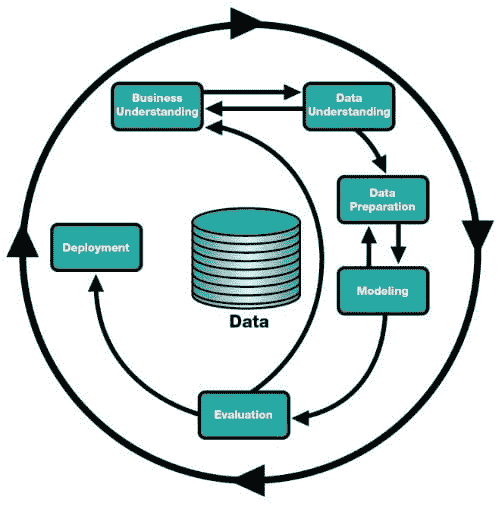

# 自动化机器学习与自动化数据科学

> 原文：[`www.kdnuggets.com/2018/07/automated-machine-learning-vs-automated-data-science.html`](https://www.kdnuggets.com/2018/07/automated-machine-learning-vs-automated-data-science.html)

 评论

自动化机器学习不断获得更多关注，但似乎仍然对自动化机器学习到底是什么存在一些困惑。它是否与自动化数据科学相同？

让我们从独立定义的数据科学和机器学习开始了解。

* * *

## 我们的前三大课程推荐

 1\. [谷歌网络安全证书](https://www.kdnuggets.com/google-cybersecurity) - 快速进入网络安全职业轨道。

 2\. [谷歌数据分析专业证书](https://www.kdnuggets.com/google-data-analytics) - 提升你的数据分析技能

 3\. [谷歌 IT 支持专业证书](https://www.kdnuggets.com/google-itsupport) - 支持你所在组织的 IT

* * *

**数据科学** 是将[科学方法](https://en.wikipedia.org/wiki/Scientific_method)应用于从数据中提取知识和见解这一广泛概念。想一想这个描述的广泛性和包容性。实际上，它的包容性如此之大，以至于没有一个公认的定义或范围来描述数据科学。当然，很多尝试定义或范围的努力都可以找到，也许在非常松散的边界上会有一些共识，但没有人能让我相信存在一个足够具体的定义，能被大多数数据科学家接受。此外，究竟什么是**数据科学家**？

**机器学习**，根据[汤姆·米切尔](http://www.cs.cmu.edu/~tom/mlbook.html)的说法，是“关心如何构造能随着经验自动改进的计算机程序”的问题。稍微正式一点，这些计算机程序被称为“如果在任务类 *T* 中的性能，经过性能测量 *P* 的测量，随着经验 *E* 的增加而提高，则说它们从经验 *E* 中学习”（同样，[米切尔](http://www.cs.cmu.edu/~tom/mlbook.html)）。

我（和许多人）认为机器学习是一个相对定义明确且比较狭窄的领域，而“数据科学”绝对不是。仅仅在这两个独立的概念前面加上“自动化”这个词，并不能让它们变得等同。机器学习和数据科学不是同一个东西，就像**自动化**机器学习与**自动化**数据科学不是同一个东西一样。机器学习只是数据科学家手中的众多工具之一。

转换话题，**[自动化机器学习](https://www.kdnuggets.com/2017/01/current-state-automated-machine-learning.html)** 是“自动化自动化的自动化”。这听起来像是无聊的文字游戏？一点也不。与机器学习相比，Sebastian Raschka 曾说 计算机编程涉及自动化，而机器学习则“完全是关于自动化自动化”。如果这是真的，那么自动化机器学习就是“自动化自动化的自动化”。编程通过管理机械任务解放我们；机器学习使计算机学会如何最好地执行这些机械任务；自动化机器学习则使计算机学会如何优化学习如何执行这些机械操作的结果。

由于在我看来，机器学习的实践可以归结为 2 个主要的总体任务，在一个受限的实际定义中，我们可以认为自动化机器学习的核心是 1) 特征工程和/或选择的自动化优化，以及 2) 超参数调整。语义上，机器学习模型的训练虽然是这些自动化步骤的结果，但它在自动化机器学习过程中是附带的，而模型评估和模型选择等自动化步骤是辅助的。见图 1。

**图 1**。自动化机器学习过程（核心自动化流程用红色表示，辅助流程用黄色表示）

那么什么是**自动化数据科学**？自动化数据科学包括尝试自动化数据科学过程中的任何部分[数据科学过程](https://www.kdnuggets.com/2016/03/data-science-process-rediscovered.html)（例如 CRISP-DM，图 2），即从数据中提取知识和洞察的过程。这将*包括*机器学习，作为数据科学家的一种工具。因此，自动化机器学习可以作为自动化数据科学中的一个工具，但自动化机器学习并不等同于自动化数据科学。

但自动化数据科学将超越这一点，可能包括全自动或部分自动化任务，例如探索性数据分析和数据可视化。你也可以考虑自动化数据收集、数据清理或数据准备纳入这一范围。

数据科学的某些方面显然比其他方面更难以自动化（如假设检验、沟通、领域知识、制定基于数据的策略等），这就是为什么“数据科学”不能像应用于任何其他领域的科学方法那样被完全自动化（自动化整个过程与自动化过程中的工具之间存在区别）。在可预见的未来，人类的参与至关重要，不仅是为了监督和纠正任何级别的自动化，还为了启动对洞察力的搜索。我们可能能够自动化探索性调查，以确定我们应当可能应用数据科学流程来回答哪些问题，甚至在这一阶段通过事实和数据进行增强，但人类因素仍需对哪些行动路径值得追求做出微妙的决策。

**图 2**。数据挖掘的跨行业标准流程（CRISP-DM）过程模型，通常用于指导实践中的数据科学过程

[兰迪·奥尔森](http://www.randalolson.com/)，自动化机器学习的倡导者及[自动化机器学习工具 TPOT](https://epistasislab.github.io/tpot/)的开发者，表示这些自动化工具不应被视为数据科学家的替代品，而应视为数据科学助手（TPOT 被称为“你的数据科学助手”，暗示机器学习可能不等同于数据科学，但通常是数据科学流程中的一个重要部分）。这些工具消除了诸如在大量模型超参数和选择特征组合上运行实验等重复任务，取而代之的是使过程中的人类能够专注于更重要和指导性的问题。

[Sandro Saitta 的这句话](https://www.kdnuggets.com/2016/08/data-science-automation-debunking-misconceptions.html)总结了数据科学社区内外对这个话题的许多困惑：

> 当你阅读关于自动化数据科学和数据科学竞赛的新闻时，没有行业经验的人可能会感到困惑，并认为数据科学仅仅是建模，并且可以完全自动化。

所以我再次强调，自动化机器学习与自动化数据科学并不相同。

**相关**：

+   自动化机器学习的现状

+   数据科学自动化：揭穿误解

+   TPOT：一个用于自动化数据科学的 Python 工具

### 更多相关内容

+   [停止学习数据科学以寻找目标，并寻找目标去…](https://www.kdnuggets.com/2021/12/stop-learning-data-science-find-purpose.html)

+   [数据科学学习统计学的最佳资源](https://www.kdnuggets.com/2021/12/springboard-top-resources-learn-data-science-statistics.html)

+   [成功数据科学家的 5 个特征](https://www.kdnuggets.com/2021/12/5-characteristics-successful-data-scientist.html)

+   [每个数据科学家都应该知道的三个 R 库（即使你使用 Python）](https://www.kdnuggets.com/2021/12/three-r-libraries-every-data-scientist-know-even-python.html)

+   [一个 90 亿美元的 AI 失败案例分析](https://www.kdnuggets.com/2021/12/9b-ai-failure-examined.html)

+   [是什么让 Python 成为初创公司理想的编程语言](https://www.kdnuggets.com/2021/12/makes-python-ideal-programming-language-startups.html)
