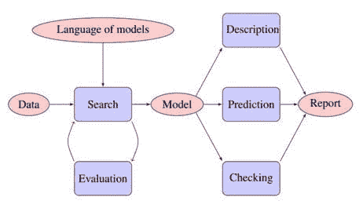
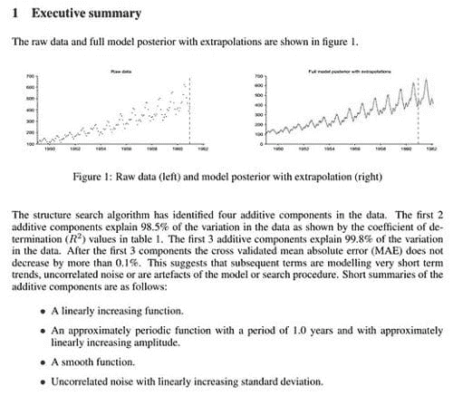
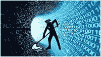

# 自动统计学家与数据科学的深度渴望自动化

> 原文：[`www.kdnuggets.com/2015/02/automated-statistician-data-science.html`](https://www.kdnuggets.com/2015/02/automated-statistician-data-science.html)

数据科学能否实现自动化？这个价值十亿美元的问题既令人极为感兴趣，又在某种程度上并不令人意外。数据科学活动如数据模型选择、优化、推断等的自动化所可能带来的巨大进步范围，引发了对这一想法的极大兴趣。同时，我们生活在大数据时代，这意味着人工方法无法跟上数据量、速度和多样性快速增长的步伐。因此，自动化对于可持续进步是不可避免的。然而，我们何时能达到这一目标仍然值得讨论。

不可否认的是，数据科学中的相当一部分工作是枯燥的。尝试各种机器学习模型并选择最佳的模型与预测变量组合非常耗时，且理论上听起来并没有实际操作中那么有趣。如果基础数据是完美的，我们本可以从理论上决定最佳模型。但在现实生活中，数据常常伴随着许多缺陷——错误、缺失值、不同的尺度/单位等。面对这些不同的数据特征，需要大量实验才能确定哪种机器学习（ML）模型能最好地表示数据。如今，我们有相当多的 ML 模型，每个模型都有许多固有的细微变化，更适合特定的情况。选择模型与选择预测变量密切相关，考虑到我们处理的数据的高度多维性，这一点尤为艰巨。因此，选择合适的模型就像是在大海捞针。

理解手动方法的问题不仅仅在于所需的工时，还在于任务所需的强制性技能。因此，实际上有两种解决方案（假设自动化尚不可行）：招募具备必要技能的更多人员（即数据科学家），或通过使用创新技术消除对这些专业技能的需求，从而使组织中的几乎每个人都能理解和执行这些数据科学任务。后者是由[剑桥大学](http://www.automaticstatistician.com/)的[Zoubin Ghahramani 教授](http://mlg.eng.cam.ac.uk/zoubin/)领导的[自动统计学家](http://www.automaticstatistician.com/)项目的重点。

主要挑战不在于软件开发，而在于在自动推理、模型构建与比较、数据可视化与解释领域所需的高级机器学习。对于任何输入数据集，自动统计师会参考开放式的模型语言来搜索（贪婪方法）并评估可能的候选模型。选定的模型及其他数据推断随后会在 10 到 15 页的报告中解释，以便非专家理解。

自动统计师的一个显著特点是其针对非专家的简单报告。将统计表示中的见解转换为人类可理解的形式在分析的广泛理解和应用中起着至关重要的作用。以下是为航空乘客量数据集生成的报告摘录，展示了非平稳周期性：

另一个显著特点是报告中包含的模型批评。这些批评回答了关键问题（例如，数据是否符合模型的假设？），并包括后验预测检查、依赖性测试和残差测试的结果。

该项目目前处于早期阶段。将近一年前，自动统计师项目 [赢得了$750,000 的 Google 聚焦研究奖](http://mlg.eng.cam.ac.uk/?p=1578)。

> 第一个问题是目前的机器学习方法仍然需要相当的人工专业知识来设计合适的特征和模型。第二个问题是尽管当前方法的输出是准确的，但往往难以理解，这使得信任变得困难。来自剑桥的“自动统计师”项目旨在解决这两个问题，通过使用贝叶斯模型选择策略来自动选择良好的模型/特征，并以易于理解的方式解释结果，形成易于理解的自动生成报告。
> 
> - Kevin Murphy，Google 高级研究科学家
> 
> (来源: [UC ML Group News](http://mlg.eng.cam.ac.uk/?p=1578))

为了成功转向行业，该项目必须解决各种挑战，如减少在大量模型空间中搜索的计算复杂性，并提高描述复杂统计推断的语言表达能力。

尝试自动化数据科学不仅限于学术界。各种初创公司如 [Skytree](http://www.skytree.net/company/pr/skytree-automates-data-science-new-enterprise-class-machine-learning-platform/) 和 [BigML](https://bigml.com/) 在这方面取得了重大进展。还有一些初创公司如 [Narrative Science](http://www.narrativescience.com/) 提供将数值分析结果转化为可读报告的服务。

模型选择和评估并不是数据科学中自动化被热切期望的唯一领域。 实际上，要使基础数据达到这个阶段，数据必须首先经历数据清理（也称为“数据整理”、“数据处理”或“数据清洁工作”）。 KDnuggets 调查表明，数据清理和准备占据了数据挖掘项目中超过 60%的时间。自动化数据准备的目标正在被包括 [Paxata](http://www.paxata.com/) 和 [Trifacta](http://www.trifacta.com/) 在内的几家初创公司追求。

除了将数据科学家从单调的工作中解救出来，使非专家能够执行数据科学任务外，自动化还提供了以速度、规模和准确性执行这些关键任务的主要好处。这是可持续分析的核心要求。

自动化日益增长的趋势会对数据科学家及其就业前景产生不利影响吗？这要看情况。如果你是一名将工作视为典型的 8am – 5pm 工作、任务明确且需要重复执行的数据科学家，你一定会对自动化感到担忧。另一方面，如果你是一名热爱自己工作的数据科学家，但对不具挑战性、重复的任务感到厌烦，你肯定会欢迎自动化的到来。

总结：**无论喜欢还是讨厌，自动化已经在数据科学领域扎根并持续发展**。

**相关：**

+   35 岁以下的大数据创新者

+   (深度学习的深层缺陷)

+   Rachel Hawley，SAS 谈数据科学为何需要沟通技能

### 更多相关话题

+   [如何通过使用自动化 EDA 工具来应对数据科学评估测试](https://www.kdnuggets.com/2022/04/ace-data-science-assessment-test-automatic-eda-tools.html)

+   [我如何使用 Grounding DINO 进行自动图像标注](https://www.kdnuggets.com/2023/05/automatic-image-labeling-grounding-dino.html)

+   [数据科学工作流中的自动化](https://www.kdnuggets.com/2023/03/automation-data-science-workflows.html)

+   [免费 Python 自动化课程](https://www.kdnuggets.com/2022/07/free-automate-python-course.html)

+   [3 个有用的 Python 自动化脚本](https://www.kdnuggets.com/2022/11/3-useful-python-automation-scripts.html)

+   [2022 年及以后的顶级 AI 和数据科学工具与技术](https://www.kdnuggets.com/2022/03/nvidia-0317-top-ai-data-science-tools-techniques-2022-beyond.html)
