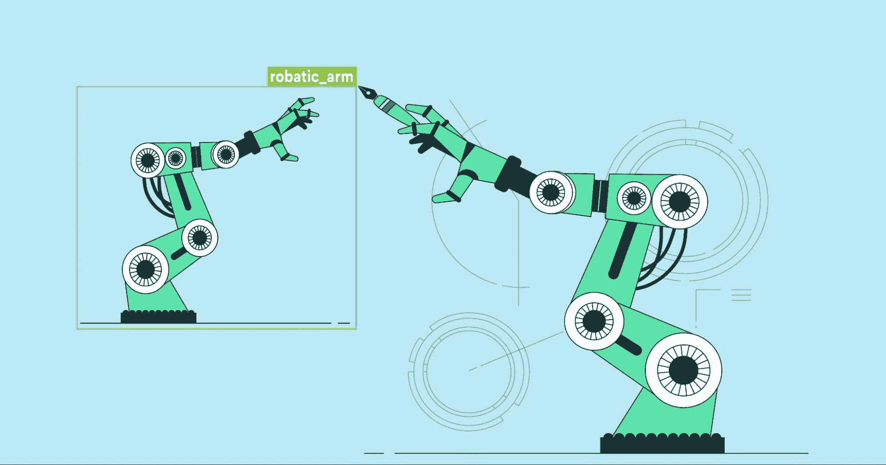
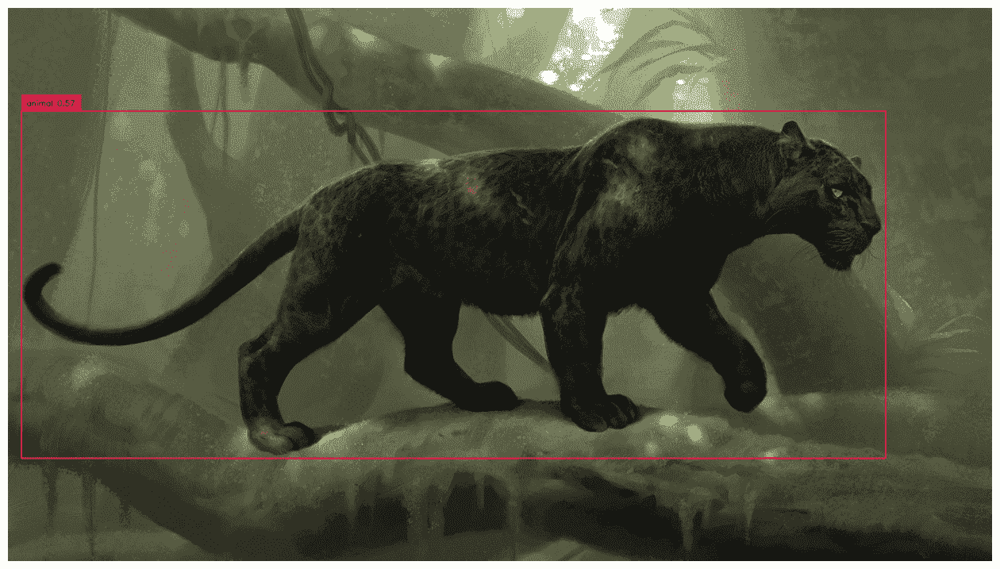
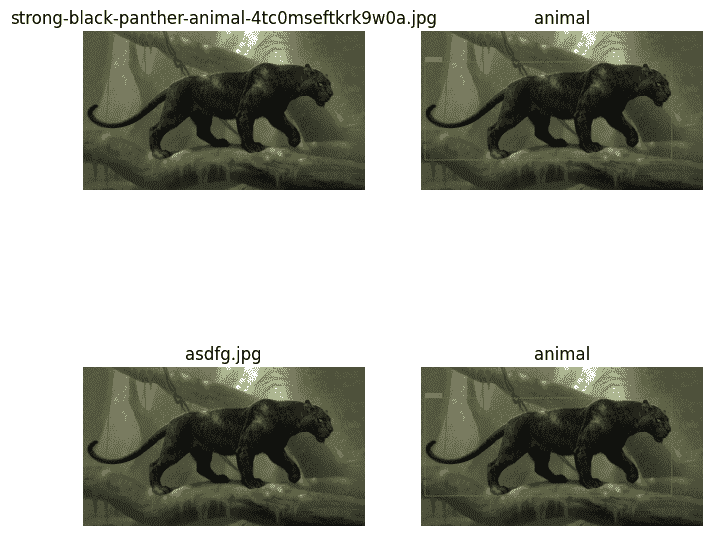

# 如何使用 Grounding DINO 进行自动图像标注

> 原文：[`www.kdnuggets.com/2023/05/automatic-image-labeling-grounding-dino.html`](https://www.kdnuggets.com/2023/05/automatic-image-labeling-grounding-dino.html)

作为一名机器学习开发者，我个人认为图像标注是乏味、耗时且昂贵的任务。但幸运的是，随着计算机视觉领域的最新进展，特别是像**Grounding DINO**这样强大的零样本目标检测器的出现，我们实际上可以自动化大部分图像标注过程，适用于大多数使用案例。我们可以编写一个 Python 脚本，完成 95%的工作。我们的唯一任务是在最后审核这些标注，并可能添加或删除一些边界框。



图片来源于作者

* * *

## 我们的前三大课程推荐

 1\. [谷歌网络安全证书](https://www.kdnuggets.com/google-cybersecurity) - 快速开启网络安全职业生涯。

 2\. [谷歌数据分析专业证书](https://www.kdnuggets.com/google-data-analytics) - 提升你的数据分析技能

 3\. [谷歌 IT 支持专业证书](https://www.kdnuggets.com/google-itsupport) - 支持你在 IT 领域的工作

* * *

*在开始自动图像标注之前，我们应该了解什么是 Grounding DINO？我们为什么要使用它？*

Grounding DINO 可以通过给定的提示输入（如类别名称或引用表达）检测主要对象。解决开放集目标检测的主要方法是将语言引入封闭集检测器中。DINO 用于开放集概念泛化：为了有效融合语言和视觉模态，我们将封闭集检测器概念上分为三个阶段：主干、颈部和头部。然后，我们提出了一种紧密融合的解决方案，通过在颈部查询初始化和头部融合语言信息，Grounding DINO 包括特征增强器、语言引导查询选择和跨模态解码器以实现跨模态融合。

Grounding DINO 在 COCO 数据集检测零样本转移基准上实现了 52.5 的平均精度（AP），该基准在 COCO 数据集上没有任何训练数据，在 COCO 数据集上微调后达到了 63.0 AP。它在 OdinW 零样本基准上以 26.1 的平均 AP 创下了新纪录。我们还探索了如何通过仅训练语言和融合模块来利用预训练的 DINO。与基线模型相比，Grounding DINO 从 DINO 收敛得更快。

我们的 Grounding DINO 还可以与稳定扩散合作进行图像编辑，例如，我们可以检测图像中的绿山并生成带有文本提示的红山新图像，也可以通过首先检测面部来修改一个人的背景，我们还可以使用 GLIGEN 进行更详细的控制，如给每个框分配一个对象，这是我们的模型 Grounding DINO 用于开放集目标检测。

*好的，深入自动图像标注部分，这里我使用的是* ***Google Colab*** *以获得高计算能力。*

# 让我们开始，

确保我们可以访问 GPU。我们可以使用 nvidia-smi 命令检查 GPU 是否连接。如果遇到任何问题，请导航到 Edit -> Notebook settings -> Hardware accelerator，设置为 GPU，然后点击 Save，这将大大缩短自动标注完成的时间。

nvidia-smi

# 安装 Grounding DINO 模型

我们的项目将使用突破性的设计——[Grounding DINO](https://github.com/IDEA-Research/GroundingDINO) 来进行零样本检测。我们需要先安装它。

```py
!git clone https://github.com/IDEA-Research/GroundingDINO.git
%cd GroundingDINO
!git checkout -q 57535c5a79791cb76e36fdb64975271354f10251
!pip install -q -e . 
```

[supervision](https://github.com/roboflow/supervision) python 索引包将帮助我们处理、过滤和可视化我们的检测结果，并保存我们的数据集，它将成为我们演示所有部分的粘合剂。与 Grounding DINO 一起安装了一个较小版本的“supervision”。但为了这次演示，我们需要最新版本中的新功能。为了安装版本“0.6.0”，我们首先需要卸载当前的“supervision”版本。

```py
!pip uninstall -y supervision
!pip install -q supervision==0.6.0

import supervision as svn
print(svn.__version__) 
```

# Grounding DINO 模型权重下载

我们需要配置文件和模型权重文件以运行 Grounding DINO。我们已经克隆了 Grounding DINO 仓库，其中包含配置文件。另一方面，我们必须下载权重文件。我们在将路径写入变量 GROUNDING_DINO_CONFIG_PATH 和 GROUNDING_DINO_CHECKPOINT_PATH 后，检查路径是否准确以及文件是否存在。

```py
import os

GROUNDING_DINO_CONFIG_PATH = os.path.join("groundingdino/config/GroundingDINO_SwinT_OGC.py")
print(GROUNDING_DINO_CONFIG_PATH, "; exist:", os.path.isfile(GROUNDING_DINO_CONFIG_PATH))
!mkdir -p weights
%cd weights

!wget -q https://github.com/IDEA-Research/GroundingDINO/releases/download/v0.1.0-alpha/groundingdino_swint_ogc.pth
import os
%cd /content/GroundingDINO
GROUNDING_DINO_CHECKPOINT_PATH = os.path.join("weights/groundingdino_swint_ogc.pth")
print(GROUNDING_DINO_CHECKPOINT_PATH, "; exist:", os.path.isfile(GROUNDING_DINO_CHECKPOINT_PATH)) 
```

假设你已经安装了 PyTorch，你可以使用以下命令行导入 torch 并设置计算设备：

```py
import torch

DEVICE = torch.device('cuda' if torch.cuda.is_available() else 'cpu') 
```

# 加载 Grounding DINO 模型

```py
from groundingdino.util.inference import Model

grounding_dino_model = Model(model_config_path=GROUNDING_DINO_CONFIG_PATH, model_checkpoint_path=GROUNDING_DINO_CHECKPOINT_PATH)
```

# 数据集准备

创建一个名为 data 的文件夹，并将未标注的图像移动到该文件夹中。

```py
!mkdir -p data 
```

# 单图像掩膜自动标注

在自动标注整个数据集之前，让我们先关注单张图像。

```py
SOURCE_IMAGE_PATH = "/content/GroundingDINO/data/example_image_3.png"
CLASSES = ['person','dog'] #add the class name to be labeled automatically
BOX_TRESHOLD = 0.35
TEXT_TRESHOLD = 0.15
```

# 使用 Grounding DINO 进行零样本目标检测

我们将使用下面描述的 enhance_class_name 函数，通过一些提示工程来获得更好的 Grounding DINO 检测。

```py
from typing import List

def enhance_class_name(class_names: List[str]) -> List[str]:
   return [
       f"all {class_name}s"
       for class_name
       in class_names
   ]
import cv2
import supervision as sv

# load image
image = cv2.imread(SOURCE_IMAGE_PATH)

# detect objects
detections = grounding_dino_model.predict_with_classes(
   image=image,
   classes=enhance_class_name(class_names=CLASSES),
   box_threshold=BOX_TRESHOLD,
   text_threshold=TEXT_TRESHOLD
)

# annotate image with detections
box_annotator = svn.BoxAnnotator()
labels = [
   f"{CLASSES[class_id]} {confidence:0.2f}"
   for _, _, confidence, class_id, _
   in detections]
annotated_frame = box_annotator.annotate(scene=image.copy(), detections=detections, labels=labels)

%matplotlib inline
svn.plot_image(annotated_frame, (16, 16))
```



# 全数据集掩膜自动标注

```py
import os

IMAGES_DIRECTORY = "./data"
IMAGES_EXTENSIONS = ['jpg', 'jpeg', 'png']

CLASSES = ['person','dog]
BOX_TRESHOLD = 0.35
TEXT_TRESHOLD = 0.15
```

# 从图像中提取标签

```py
import cv2
from tqdm.notebook import tqdm

images = {}
annotations = {}

image_paths = svn.list_files_with_extensions(
   directory=IMAGES_DIRECTORY,
   extensions=IMAGES_EXTENSIONS)

for image_path in tqdm(image_paths):
   image_name = image_path.name
   image_path = str(image_path)
   image = cv2.imread(image_path)

   detections = grounding_dino_model.predict_with_classes(
       image=image,
       classes=enhance_class_name(class_names=CLASSES),
       box_threshold=BOX_TRESHOLD,
       text_threshold=TEXT_TRESHOLD
   )
   detections = detections[detections.class_id != None]
   images[image_name] = image
   annotations[image_name] = detections
```

# 绘制结果

```py
plot_images = []
plot_titles = []

box_annotator = svn.BoxAnnotator()
mask_annotator = svn.MaskAnnotator()

for image_name, detections in annotations.items():
   image = images[image_name]
   plot_images.append(image)
   plot_titles.append(image_name)

   labels = [
       f"{CLASSES[class_id]} {confidence:0.2f}"
       for _, _, confidence, class_id, _
       in detections]
   annotated_image = mask_annotator.annotate(scene=image.copy(), detections=detections)
   annotated_image = box_annotator.annotate(scene=annotated_image, detections=detections, labels=labels)
   plot_images.append(annotated_image)
   title = " ".join(set([
       CLASSES[class_id]
       for class_id
       in detections.class_id
   ]))
   plot_titles.append(title)

svn.plot_images_grid(
   images=plot_images,
   titles=plot_titles,
   grid_size=(len(annotations), 2),
   size=(2 * 4, len(annotations) * 4) 
```



# 以 Pascal VOC XML 格式保存标签

```py
%cd /content/GroundingDINO
!mkdir annotations
ANNOTATIONS_DIRECTORY = "/content/GroundingDINO/annotations"

MIN_IMAGE_AREA_PERCENTAGE = 0.002
MAX_IMAGE_AREA_PERCENTAGE = 0.80
APPROXIMATION_PERCENTAGE = 0.75
svn.Dataset(
   classes=CLASSES,
   images=images,
   annotations=annotations
).as_pascal_voc(
   annotations_directory_path=ANNOTATIONS_DIRECTORY,
   min_image_area_percentage=MIN_IMAGE_AREA_PERCENTAGE,
   max_image_area_percentage=MAX_IMAGE_AREA_PERCENTAGE,
   approximation_percentage=APPROXIMATION_PERCENTAGE
) 
```

感谢阅读 !!!

这里是一个 [完整 colab 文件](https://colab.research.google.com/drive/17yOBr8kVfbJPfEl3pZVbfJBEqlqqsHtM?usp=sharing) 的链接。

参考资料：[`arxiv.org/abs/2303.05499`](https://arxiv.org/abs/2303.05499) 和 [`github.com/IDEA-Research/GroundingDINO`](https://github.com/IDEA-Research/GroundingDINO)

**[Parthiban M](https://www.linkedin.com/in/parthibanma/)** 目前居住在印度钦奈，并在 [SeeWise](https://www.seewise.ai/) 工作。他是一名机器学习开发者，具有广泛的经验，能够通过使用计算机视觉、TensorFlow 和深度学习来理解问题并提供解决方案。

### 更多相关内容

+   [如何通过使用自动 EDA 工具在数据科学评估测试中取得优异成绩](https://www.kdnuggets.com/2022/04/ace-data-science-assessment-test-automatic-eda-tools.html)

+   [机器学习的数据标注：市场概况、方法和工具](https://www.kdnuggets.com/2021/12/data-labeling-ml-overview-and-tools.html)

+   [使用 Tensorflow 训练图像分类模型的指南](https://www.kdnuggets.com/2022/12/guide-train-image-classification-model-tensorflow.html)

+   [如何将 RGB 图像转换为灰度图像](https://www.kdnuggets.com/2019/12/convert-rgb-image-grayscale.html)

+   [图像识别和自然语言处理的迁移学习](https://www.kdnuggets.com/2022/01/transfer-learning-image-recognition-natural-language-processing.html)

+   [使用卷积神经网络（CNNs）进行图像分类](https://www.kdnuggets.com/2022/05/image-classification-convolutional-neural-networks-cnns.html)
