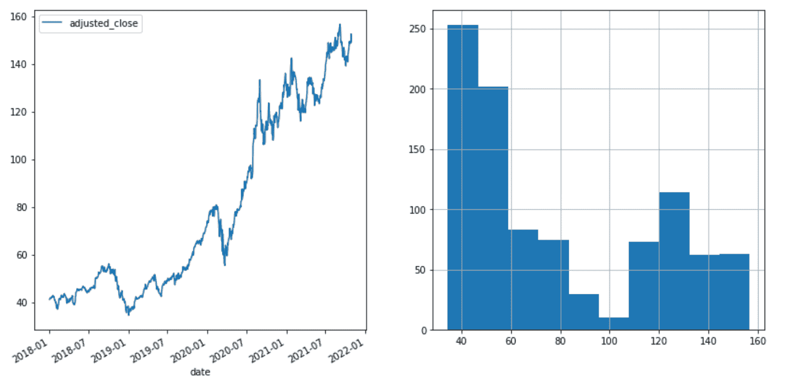
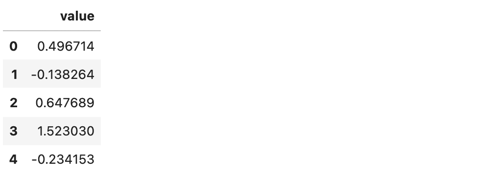
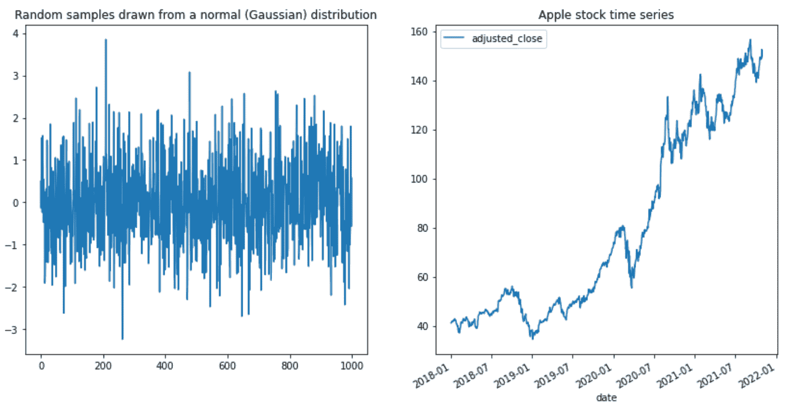
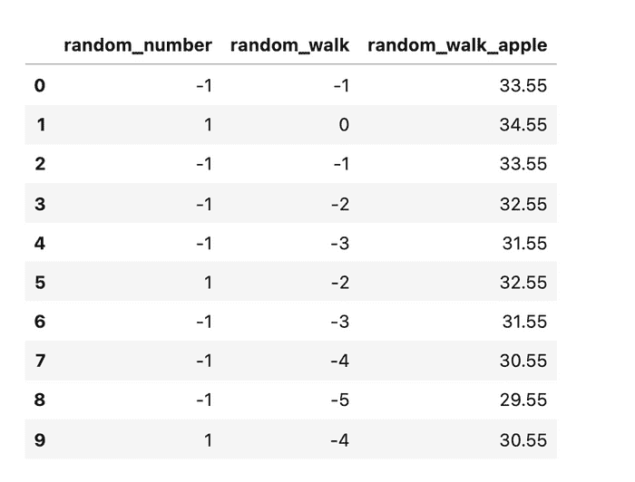
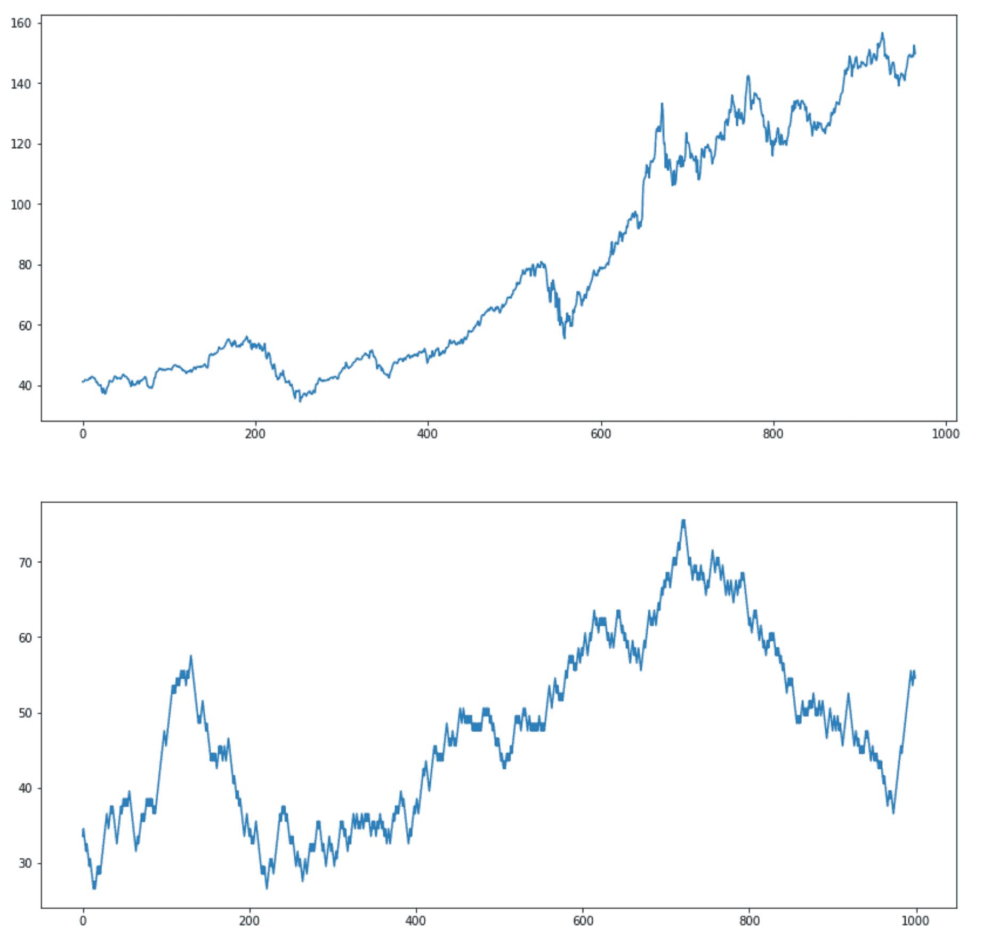
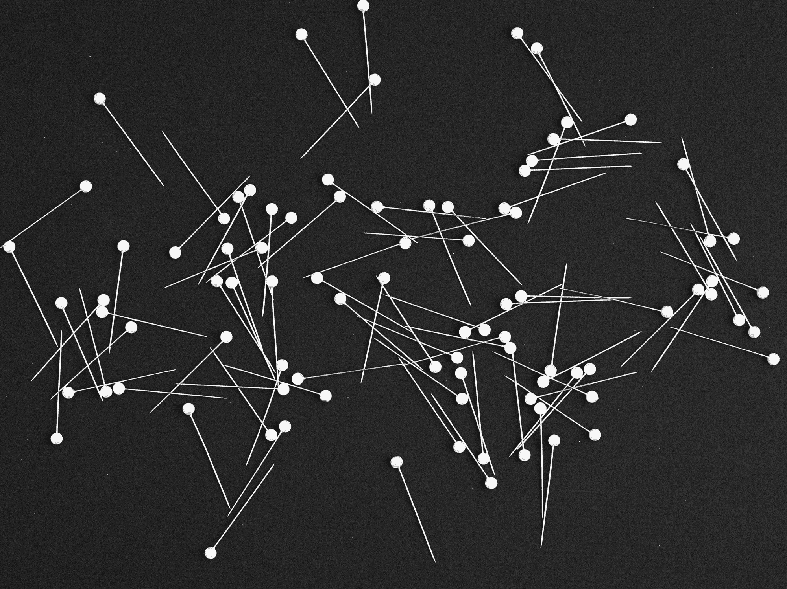
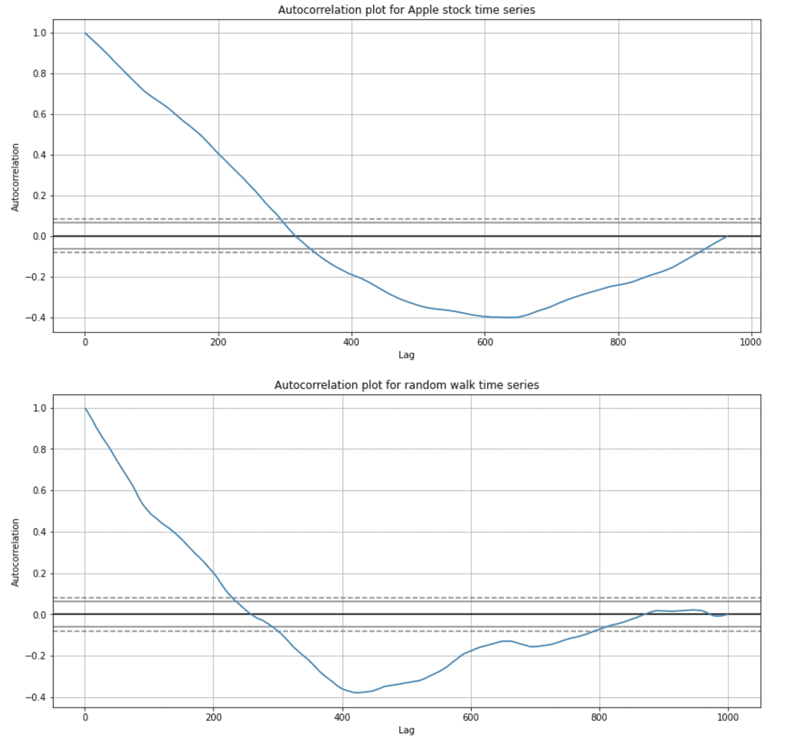
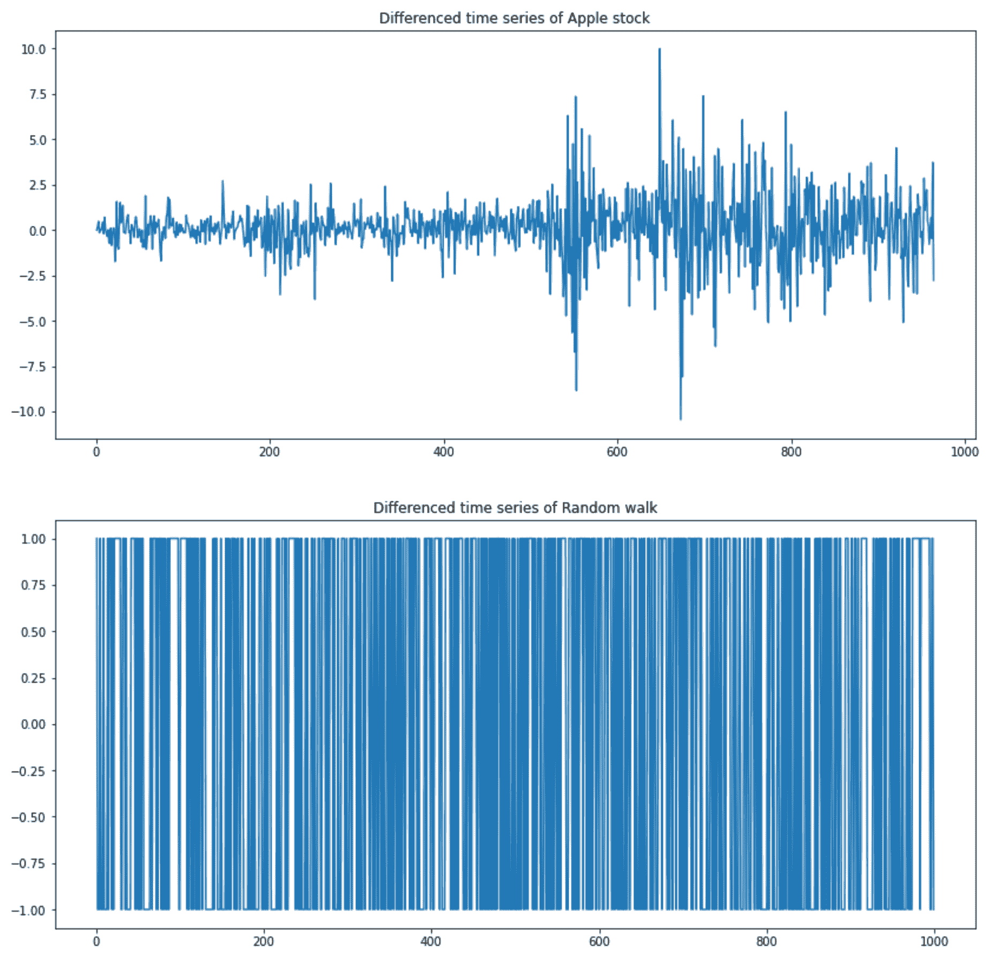
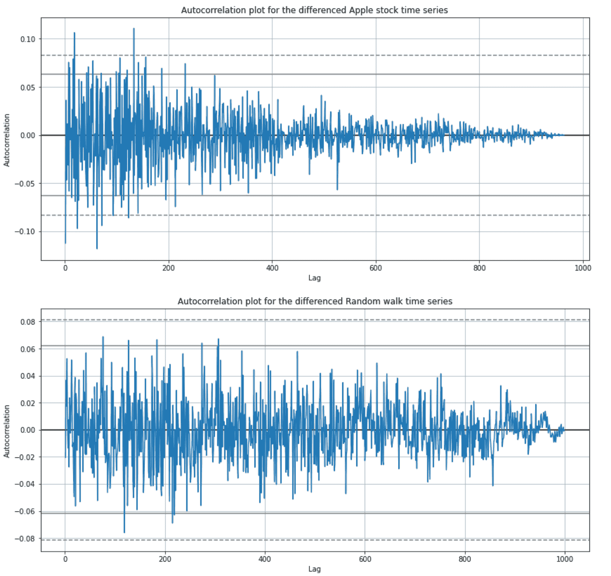

# 避免时间序列预测中的这些错误

> 原文：[`www.kdnuggets.com/2021/12/avoid-mistakes-time-series-forecasting.html`](https://www.kdnuggets.com/2021/12/avoid-mistakes-time-series-forecasting.html)

评论

**作者：[Roman Orac](https://www.linkedin.com/in/romanorac/?originalSubdomain=si)，高级数据科学家**


图片来源：[Photoholgic](https://unsplash.com/@photoholgic?utm_source=medium&utm_medium=referral) 在 [Unsplash](https://unsplash.com/?utm_source=medium&utm_medium=referral)

时间序列预测是数据科学的一个子领域，涉及预测 COVID 的传播、股票价格、每日电力消费……我们可以继续列举下去。

> 数据科学是一个广泛的研究领域，几乎没有“全才”

数据科学领域是一个广泛的研究领域。许多数据科学家在整个职业生涯中处理的是非顺序数据（经典分类和回归机器学习），他们在职业生涯中从未训练过时间序列预测模型。

这是可以预期的，因为数据科学领域的快速发展。跟上所有子领域变得越来越困难。

计划转入时间序列领域的数据科学家可以做好迎接有趣挑战的准备，因为处理这种数据需要不同的专业方法。

在本文中，我们将深入探讨几个容易陷入的常见时间序列预测陷阱。我基于金融股票数据进行示例，但这些方法也可以应用于其他时间序列数据。

通过阅读本文，你将学到：

+   如何使用 pandas 下载金融时间序列数据

+   如何在时间序列信号中找到峰值和谷值

+   什么是（以及如何使用）自相关图

+   如何检查时间序列是否具有统计显著信号

> 全才，什么都懂，精通的却没有

## 我们只需要收集数据


图片来源：[Hans Eiskonen](https://unsplash.com/@eiskonen?utm_source=medium&utm_medium=referral) 在 [Unsplash](https://unsplash.com/?utm_source=medium&utm_medium=referral)

一个谬误（以及从一开始就是注定要失败的项目）是，当软件工程师认为他们可以简单地收集股票市场数据，然后将其放入深度神经网络中找到有利可图的模式时。

> 深度神经网络会自动找到有利可图的模式，对吗？

别误会我，拥有数据是有用的，但最难的部分在于建模。

有数据服务网站，如 [EOD Historical Data](https://eodhistoricaldata.com/)，提供各种金融数据，并提供免费计划。首先识别有利可图的模式更有意义，因为你可以通过单个 pandas 命令下载历史数据。


[EOD Historical Data](https://eodhistoricaldata.com/) 提供各种金融数据，并有一个免费的计划（作者制作的截图）

## 下载数据的 pandas 命令是什么？

让我们看看下面的例子，我从 2018 年 1 月 1 日起下载了苹果股票的每日价格：

```py
import pandas as pdstock = "AAPL.US"
from_date = "2018-01-01"
to_date = "2021-10-29"
period = "d"eon_url = f"[`eodhistoricaldata.com/api/eod/{stock}?api_token=OeAFFmMliFG5orCUuwAKQ8l4WWFQ67YX&from={from_date}&to={to_date}&period={period}&fmt=json`](https://eodhistoricaldata.com/api/eod/%7Bstock%7D?api_token=OeAFFmMliFG5orCUuwAKQ8l4WWFQ67YX&from={from_date}&to={to_date}&period={period}&fmt=json)"df = pd.read_json(eon_url)
```


从 2018 年 1 月 1 日起的苹果股票每日价格（作者提供的图片）

然后我们可以通过以下方式可视化苹果股票的调整收盘价和价格分布：

```py
fig, axes = plt.subplots(nrows=1, ncols=2, figsize=(14, 7))col = "adjusted_close"
df.plot(x="date", y=col, ax=axes[0])
df[col].hist(ax=axes[1])
```



苹果股票调整收盘价和价格分布（作者提供的图片）

## 寻找峰值和低谷


图片由 [Claudel Rheault](https://unsplash.com/@claudelrheault?utm_source=medium&utm_medium=referral) 提供，来源于 [Unsplash](https://unsplash.com/?utm_source=medium&utm_medium=referral)

时间序列预测学习问题的一个常见定义是，在时间序列信号上找到峰值和低谷，这些作为机器学习算法的目标变量。

让我们首先减少数据规模，以便更容易可视化：

```py
df_sub = df[df["date"] > "2020-01-01"].copy().reset_index(drop=True)
```

然后找到峰值：

```py
from scipy.signal import find_peakspeaks = find_peaks(df_sub["adjusted_close"])
```


包含峰值索引的数组（作者提供的图片）

然后找到低谷：

```py
troughs = find_peaks(-df_sub["adjusted_close"])
```

然后我们可以进行可视化

```py
ax = df_sub.plot(x="date", y="adjusted_close", figsize=(14, 7))df_sub.iloc[peaks[0]].plot.scatter(x="date", y="adjusted_close", ax=ax, color="green")df_sub.iloc[troughs[0]].plot.scatter(x="date", y="adjusted_close", ax=ax, color="red")
```


苹果股票时间序列的峰值和低谷（作者提供的图片）

现在数据集已经标记了进出信号，我们只需将神经网络拿出来，坐下来放松一下，对吧？

不完全正确！

> 技术分析师可能会指出上述例子中的前瞻性偏差。
> 
> 为什么？
> 
> 因为`find peaks`函数一次性处理整个信号。如果我们基于滞后指标在其基础上定义决策逻辑，它将遭受前瞻性偏差。
> 
> [来自维基百科](https://en.wikipedia.org/wiki/Technical_analysis)：
> 
> 在金融领域，技术分析是一种通过研究过去市场数据，主要是价格和成交量，来预测价格方向的方法。
> 
> 但这只是一个问题，如果我们依赖于技术分析的话。
> 
> 让我们回到机器学习。

从机器学习的角度来看，上述定义是可以的，如果我们将信号分为 3 部分。例如：

+   第一部分用于训练（前 60%）

+   第二部分用于验证（第二 10%）

+   最后一部分用于样本外测试（最后 30%）

`find peaks`函数的输出仅用于目标，并且不会泄露到特征中。

那么这个学习问题定义有什么问题呢？

我们在对数据应用机器学习算法之前需要回答的百万美元问题：

> 时间序列中是否存在信号，还是只是随机噪声？

## 时间序列中是否存在信号？


照片由 [Clarisse Meyer](https://unsplash.com/@clarissemeyer?utm_source=medium&utm_medium=referral) 提供，来自 [Unsplash](https://unsplash.com/?utm_source=medium&utm_medium=referral)

让我们将从高斯分布中生成的随机数与苹果股票时间序列进行比较。

使用下面的命令，我从均值为零、标准差为 1 的高斯分布（也称为正态分布）中生成了 1000 个随机数：

```py
np.random.seed(42)normal_dist = pd.DataFrame(np.random.normal(size=1000), columns=["value"])
```



从正态分布中提取的随机数（图像由作者提供）

现在，让我们可视化生成的数字并将其与苹果股票时间序列进行比较：

```py
fig, axes = plt.subplots(nrows=1, ncols=2, figsize=(14, 7))normal_dist["value"].plot(
    ax=axes[0],
    title="Random samples drawn from a normal (Gaussian) distribution",
)df.plot(x="date", y="adjusted_close", ax=axes[1], title="Apple stock time series")
```



将高斯分布的随机样本与苹果股票时间序列进行比较（图像由作者提供）

你不需要是科学家就能注意到，苹果股票时间序列具有递增的模式，而高斯数值则只是随机上下波动。

> 苹果股票时间序列真的有一个机器学习算法可以学习的模式吗？

## 让我带你去进行一次（随机的）游走


照片由 [Jonas Weckschmied](https://unsplash.com/@jweckschmied?utm_source=medium&utm_medium=referral) 提供，来自 [Unsplash](https://unsplash.com/?utm_source=medium&utm_medium=referral)

随机游走是一种统计工具，它生成-1 和 1 的随机数，下一个数字依赖于前一个状态。这提供了一些一致性，与独立的随机数字不同。随机游走可以帮助我们确定我们的时间序列是否可预测。

让我们看下面的例子。

在第一步中，我们生成了一个包含 1000 个随机选择的-1 和 1 的数字列表。

```py
np.random.seed(42)random_walk = pd.DataFrame()
random_walk.loc[:, "random_number"] = np.random.choice([-1, 1], size=1000, replace=True)
```

然后，我们将生成的随机值累积总结，以增加对前一个状态的依赖：

```py
random_walk.loc[:, "random_walk"] = random_walk["random_number"].cumsum()
```

苹果股票的初始调整后收盘价为 34.55。让我们将这个数字添加到 random_walk 中，以便我们使用相同的尺度：

```py
random_walk.loc[:, "random_walk_apple"] = random_walk["random_walk"] + 34.55
```

最终结果是一个包含生成的随机游走的 pandas Dataframe：



生成的随机游走的 Dataframe（图像由作者提供）

现在，让我们将随机生成的游走与实际的苹果股票时间序列进行比较：

```py
fig, axes = plt.subplots(nrows=2, ncols=1, figsize=(14, 14))df["adjusted_close"].plot(ax=axes[0])
random_walk["random_walk_apple"].plot(ax=axes[1])
```



苹果股票时间序列和随机游走（图像由作者提供）

我故意没有在上述图表中包含标题。你能告诉我哪个是随机的，哪个是实际的苹果股票时间序列吗？

## 我们的时间序列是可以预测的吗，还是随机的？



照片由 [Universal Eye](https://unsplash.com/@universaleye?utm_source=medium&utm_medium=referral) 提供，来自 [Unsplash](https://unsplash.com/?utm_source=medium&utm_medium=referral)

为了回答这个问题，我们需要将随机生成的序列的属性与苹果股票时间序列的属性进行比较。

一个有用的工具是自相关图，它展示了每个观察值与前几个时间步的观察值的相关性。

> [来自维基百科](https://en.wikipedia.org/wiki/Autocorrelation)：
> 
> 自相关是信号与其延迟副本的相关性，作为延迟的函数。非正式地说，它是观察值之间的相似性，作为它们之间时间滞后的函数。

随机游走的构造方式（当前状态是从前一个状态计算得出的+1 或-1——对前一个状态的高度依赖），我们可以预期在最初的几个时间步中会有很高的自相关性，随着滞后的增加而线性下降。

Pandas 有一个 [autocorrelation_plot](https://pandas.pydata.org/docs/reference/api/pandas.plotting.autocorrelation_plot.html) 函数，它计算自相关并在自相关图上进行可视化。

让我们可视化随机游走和苹果股票时间序列的自相关图。

```py
fig, axes = plt.subplots(nrows=2, ncols=1, figsize=(14, 14))axes[0].set_title("Autocorrelation plot for Apple stock time series")
pd.plotting.autocorrelation_plot(df["adjusted_close"], ax=axes[0])axes[1].set_title("Autocorrelation plot for random walk time series")
pd.plotting.autocorrelation_plot(random_walk["random_walk_apple"], ax=axes[1])
```



随机游走和苹果股票时间序列的自相关图（图像由作者提供）

图中的 x 轴显示自相关，y 轴显示滞后。图中的水平线对应于 95%和 99%置信区间。虚线是 99%置信区间。高于这些线的值在统计上是显著的。

正如我们对随机游走序列的预期一样，前 100 个时间步中有很高的自相关性，随着滞后的增加而线性下降。

令人惊讶的是（或者对一些人来说不惊讶），苹果股票时间序列的自相关性类似于随机游走自相关图。

## 让深度神经网络回到休眠状态……


图片由 [Pierre Bamin](https://unsplash.com/@bamin?utm_source=unsplash&utm_medium=referral&utm_content=creditCopyText) 提供，来源于 [Unsplash](https://unsplash.com/s/photos/noise?utm_source=unsplash&utm_medium=referral&utm_content=creditCopyText)

让我们通过从当前观察值中移除前一个观察值的值来使两个时间序列平稳——差分。通过应用差分操作，我们去除了时间的函数。

以下命令对苹果股票和随机游走时间序列应用差分操作：

```py
# applying differencing operation
# [1:] is used to remove the first value which is nullapple_stationary = df["adjusted_close"].diff()[1:]
random_walk_stationary = random_walk["random_walk_apple"].diff()[1:]
```


差分的苹果股票时间序列（图像由作者提供）

现在，让我们可视化差分时间序列：

```py
fig, axes = plt.subplots(nrows=2, ncols=1, figsize=(14, 14))apple_stationary.plot(ax=axes[0], title="Differenced time series of Apple stock")random_walk_stationary.plot(ax=axes[1], title="Differenced time series of Random walk")
```



苹果股票和随机游走的差分时间序列（图像由作者提供）

差分的随机游走时间序列只有-1 和+1，正如预期的那样。差分的苹果股票时间序列有更多的波动，但这些波动是否显著？

我们可以通过差分时间序列上的自相关图来检查这一点：

```py
fig, axes = plt.subplots(nrows=2, ncols=1, figsize=(14, 14))pd.plotting.autocorrelation_plot(apple_stationary, ax=axes[0])
pd.plotting.autocorrelation_plot(random_walk_stationary, ax=axes[1])
```



差分的随机游走和苹果股票时间序列的自相关图（图像由作者提供）

请记住，超出水平线的自相关值具有统计显著性。

差分后的苹果股票时间序列有几个自相关值超出 99%的置信区间，但差分后的随机游走时间序列也有几个值超出 95%的置信区间，我们知道信号是随机的，因此我们可以将这些归因于统计错误。

## 结论


图片来源于 [Ferdinand Stöhr](https://unsplash.com/@fellowferdi?utm_source=medium&utm_medium=referral) 在 [Unsplash](https://unsplash.com/?utm_source=medium&utm_medium=referral)

在文章中，我们对真实世界的时间序列数据进行了几个统计检查，我们确定其信号是随机的。

**我对此的看法是什么？**

你可能会感到惊讶（就像我一样），我们在苹果股票时间序列中没有发现任何统计显著的信号。

当我们不断听到关于机器学习算法如何在股市上做出自动决策的故事时，这怎么可能呢？

好吧，虽然我确信机器学习算法被用于做出这样的决策——Marcos López de Prado 为此写了一整本书——但我也确信它们使用了更多的数据。我指的不是更多的价格数据，而是一种不同类型的数据，这种数据影响了股票价格的变动。

你可以阅读[维基百科上的随机游走假设](https://en.wikipedia.org/wiki/Random_walk_hypothesis)，该假设认为股市价格按照随机游走演变（即价格变化是随机的），因此无法预测。

对此你有什么想法？请在下方评论中告诉我。

**简介： [Roman Orac](https://www.linkedin.com/in/romanorac/?originalSubdomain=si)** 是一名机器学习工程师，在改进文档分类和项目推荐系统方面取得了显著成功。Roman 拥有管理团队、指导初学者和向非工程师解释复杂概念的经验。

[原文](https://python.plainenglish.io/avoid-these-mistakes-with-time-series-forecasting-7ee84b80ed65)。经允许转载。

**相关内容：**

+   前 5 名时间序列方法

+   对有志成为数据科学家的建议——你最常见的问题解答

+   基于 LSTM 的 RNN 的多变量时间序列分析

* * *

## 我们的前三名课程推荐

 1\. [Google 网络安全证书](https://www.kdnuggets.com/google-cybersecurity) - 加入网络安全职业的快速通道。

 2\. [Google 数据分析专业证书](https://www.kdnuggets.com/google-data-analytics) - 提升你的数据分析能力

 3\. [谷歌 IT 支持专业证书](https://www.kdnuggets.com/google-itsupport) - 支持您的组织 IT

* * *

### 更多相关主题

+   [避免这些每个 AI 新手都会犯的 5 个常见错误](https://www.kdnuggets.com/avoid-these-5-common-mistakes-every-novice-in-ai-makes)

+   [使用 Ploomber、Arima、Python 和 Slurm 进行时间序列预测](https://www.kdnuggets.com/2022/03/time-series-forecasting-ploomber-arima-python-slurm.html)

+   [使用 statsmodels 和 Prophet 进行时间序列预测](https://www.kdnuggets.com/2023/03/time-series-forecasting-statsmodels-prophet.html)

+   [利用 XGBoost 进行时间序列预测](https://www.kdnuggets.com/2023/08/leveraging-xgboost-timeseries-forecasting.html)

+   [新手数据科学家应避免的错误](https://www.kdnuggets.com/2022/06/mistakes-newbie-data-scientists-avoid.html)

+   [5 个常见的数据科学错误及其避免方法](https://www.kdnuggets.com/5-common-data-science-mistakes-and-how-to-avoid-them)
