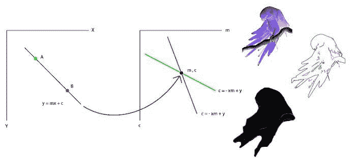
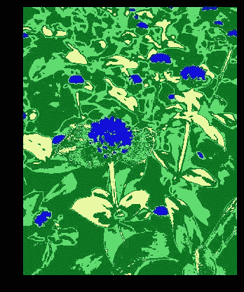
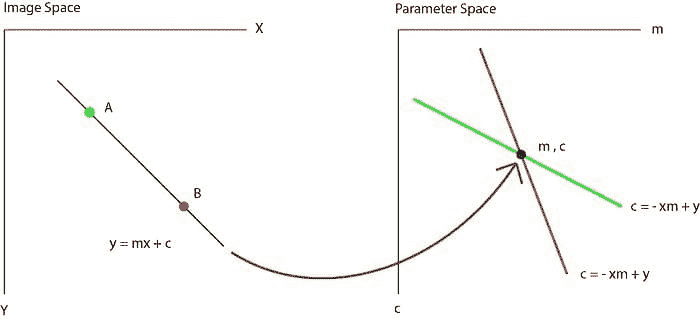

# 使用 Python 的基础图像数据分析 – 第四部分

> 原文：[`www.kdnuggets.com/2018/10/basic-image-analysis-python-p4.html`](https://www.kdnuggets.com/2018/10/basic-image-analysis-python-p4.html)

 评论



之前，我们已经看到了一些 Python 中非常基础的图像分析操作。在这最后一部分基础图像分析中，我们将探讨以下内容。

* * *

## 我们的三大推荐课程

 1\. [Google 网络安全证书](https://www.kdnuggets.com/google-cybersecurity) - 快速通道进入网络安全职业生涯。

 2\. [Google 数据分析专业证书](https://www.kdnuggets.com/google-data-analytics) - 提升你的数据分析技能

 3\. [Google IT 支持专业证书](https://www.kdnuggets.com/google-itsupport) - 支持你所在组织的 IT

* * *

以下内容是我在上一学期完成的学术图像处理课程的反映。因此，我不打算将其应用于生产领域。相反，本文的目的是尝试实现一些基本图像处理技术的基础知识。为此，我将主要使用 [**SciKit-Image**](https://scikit-image.org/) 和 [**numpy**](http://www.numpy.org/) 来执行大部分操作，尽管我会不时使用其他库，而不是使用像 [**OpenCV**](https://opencv.org/) 这样的最受欢迎的工具：

我原本计划将这个系列分成两部分，但由于内容的吸引力及其各种结果，我不得不将其分为四部分。你可以在这里找到前三部分：

[第一部分](https://www.kdnuggets.com/2018/07/basic-image-data-analysis-numpy-opencv-p1.html) | [第二部分](https://www.kdnuggets.com/2018/07/image-data-analysis-numpy-opencv-p2.html) | [第三部分](https://www.kdnuggets.com/2018/09/image-data-analysis-python-p3.html)

现在，让我们开始吧！

### 阈值处理

**大津法**

阈值处理是图像处理中的一种非常基础的操作。将灰度图像转换为单色图像是常见的图像处理任务。而且，一个好的算法总是以良好的基础开始！

大津阈值处理是一种简单而有效的全局自动阈值方法，用于将灰度图像（如前景和背景）二值化。在图像处理领域，大津阈值处理方法（1979 年）用于基于**直方图**的形状进行自动**二值化**水平决策。它完全基于对图像直方图的计算。

该算法假设图像由两类基本类别组成：**前景**和**背景**。然后计算一个最佳阈值，以最小化这两类的加权类内方差。

Otsu 阈值在从医学成像到低级计算机视觉的许多应用中被使用。它有许多优点和假设。

[Otsu 方法的数学公式](https://iphton.github.io/iphton.github.io/Image-Processing-in-Python-Part-2/#5-bullet)。这将引导你到我的主页，在那里我们解释了 Otsu 方法背后的数学。

**算法**

如果我们在这个简单的逐步算法中加入一点数学，这样的解释就会演变：

+   计算每个强度级别的直方图和概率。

+   设置初始 wi 和 μi。

+   从阈值 **t = 0** 到 **t = L-1** 步进：

    +   更新： wi 和 μi

    +   计算： σ2b(t)

期望的阈值对应于 σ2b(t)的最大值。

```py

import numpy as np
import imageio
import matplotlib.pyplot as plt

pic = imageio.imread('img/potato.jpeg')
plt.figure(figsize=(7,7))
plt.axis('off')
plt.imshow(pic);

```


```py

def otsu_threshold(im):

    # Compute histogram and probabilities of each intensity level
    pixel_counts = [np.sum(im == i) for i in range(256)]

    # Initialization
    s_max = (0,0)

    for threshold in range(256):

        # update
        w_0 = sum(pixel_counts[:threshold])
        w_1 = sum(pixel_counts[threshold:])

        mu_0 = sum([i * pixel_counts[i] for i in range(0,threshold)]) / w_0 if w_0 > 0 else 0       
        mu_1 = sum([i * pixel_counts[i] for i in range(threshold, 256)]) / w_1 if w_1 > 0 else 0

        # calculate - inter class variance
        s = w_0 * w_1 * (mu_0 - mu_1) ** 2

        if s > s_max[1]:
            s_max = (threshold, s)

    return s_max[0]
def threshold(pic, threshold):
    return ((pic > threshold) * 255).astype('uint8')

gray = lambda rgb : np.dot(rgb[... , :3] , [0.21 , 0.72, 0.07]) 

plt.figure(figsize=(7,7))
plt.imshow(threshold(gray(pic), otsu_threshold(pic)), cmap='Greys')
plt.axis('off');

```


好，但不完美。如果直方图可以假设具有**双峰分布**并假设在两个峰之间具有深且尖锐的谷，则 Otsu 方法表现相对较好。

因此，如果物体区域相对于背景区域较小，则直方图不再表现出双峰性，并且如果物体和背景强度的方差与均值差异相比较大，或者图像被加性噪声严重污染，灰度直方图的尖锐谷值会被退化。

结果是，Otsu 方法确定的可能不正确的阈值会导致分割错误。但我们可以进一步 [改进 Otsu 方法](https://en.wikipedia.org/wiki/Otsu%27s_method#Improvements)。

### **KMeans 聚类**

k-means 聚类是一种 [向量量化](https://en.wikipedia.org/wiki/Vector_quantization)方法，源自信号处理，在 [聚类分析](https://en.wikipedia.org/wiki/Cluster_analysis) 和 [数据挖掘](https://en.wikipedia.org/wiki/Data_mining)中广受欢迎。

在 Otsu 阈值处理中，我们找到最小化类内像素方差的阈值。因此，我们可以在色彩空间中寻找聚类，而不是从灰度图像中寻找阈值，这样我们就得到了 [K-means 聚类](https://en.wikipedia.org/wiki/K-means_clustering) 技术。

```py

from sklearn import cluster

import matplotlib.pyplot as plt
# load image
pic = imageio.imread('img/purple.jpg') 

plt.figure(figsize=(7,7))
plt.imshow(pic)
plt.axis('off');

```


为了对图像进行聚类，我们需要将其转换为二维数组。

```py

x, y, z = pic.shape
pic_2d = pic.reshape(x*y, z)
```

接下来，我们使用 [scikit-learn 的 cluster](http://scikit-learn.org/stable/modules/generated/sklearn.cluster.KMeans.html) 方法来创建聚类。我们将 **n_clusters** 设为 5 以形成五个聚类。结果图像中会出现这些聚类，将其分成五个具有不同颜色的部分。

聚类数 5 是通过启发式选择的用于演示。可以更改簇的数量，以视觉验证不同颜色的图像，并确定最接近所需簇数的设置。

```py

%%time

# fit on the image with cluster five
kmeans_cluster = cluster.KMeans(n_clusters=5)
kmeans_cluster.fit(pic_2d)

cluster_centers = kmeans_cluster.cluster_centers_
cluster_labels = kmeans_cluster.labels_
Wall time: 16.2 s
```

一旦簇形成后，我们可以使用簇中心和标签重建图像，以显示具有分组模式的图像。

```py

plt.figure(figsize=(7,7))
plt.imshow(cluster_centers[cluster_labels].reshape(x, y, z))
plt.axis('off');

```



### 线检测

**霍夫变换**

霍夫变换是一种流行的技术，用于检测任何形状，只要我们能够将该形状表示为数学形式。即使形状稍微破损或扭曲，它也能检测到。我们不会深入分析霍夫变换的机制，而是提供直观的数学描述，然后在代码中实现，并提供一些资源以便更详细地理解它。

[霍夫变换的数学公式](https://iphton.github.io/iphton.github.io/Image-Processing-in-Python-Part-2/#7-bullet)。这将会重定向到我的主页，在那里我们解释了霍夫变换方法背后的数学。



```py

where
ρ = distance from origin to the line. [-Dmax, Dmax]
Dmax is the diagonal length of the image.

θ = angle from origin to the line. [-90° to 90°]

```

**算法**

+   角点或边缘检测

+   ρ范围和θ范围的创建

    +   ρ：-Dmax 到 Dmax

    +   θ：-90 到 90

+   霍夫累加器

    +   2D 数组，其中行数等于ρ值的数量，列数等于θ的数量。

+   在累加器中进行投票

    +   对于每个边缘点和每个θ值，找到最近的ρ值，并在累加器中递增该索引。

+   峰值寻找

    +   累加器中的局部最大值表示输入图像中最突出的线条的参数。

```py

def hough_line(img):
    # Rho and Theta ranges
    thetas = np.deg2rad(np.arange(-90.0, 90.0))
    width, height = img.shape
    diag_len = int(np.ceil(np.sqrt(width * width + height * height)))   # Dmax
    rhos = np.linspace(-diag_len, diag_len, diag_len * 2.0)

    # Cache some resuable values
    cos_t = np.cos(thetas)
    sin_t = np.sin(thetas)
    num_thetas = len(thetas)

    # Hough accumulator array of theta vs rho
    accumulator = np.zeros((2 * diag_len, num_thetas), dtype=np.uint64)
    y_idxs, x_idxs = np.nonzero(img)  # (row, col) indexes to edges

    # Vote in the hough accumulator
    for i in range(len(x_idxs)):
        x = x_idxs[i]
        y = y_idxs[i]

        for t_idx in range(num_thetas):
            # Calculate rho. diag_len is added for a positive index
            rho = round(x * cos_t[t_idx] + y * sin_t[t_idx]) + diag_len
            accumulator[rho, t_idx] += 1
    return accumulator, thetas, rhos

```

### **边缘检测**

边缘检测是一种图像处理技术，用于找到图像中对象的边界。它通过检测亮度的不连续性来工作。常见的边缘检测算法包括：

+   Sobel

+   Canny

+   Prewitt

+   Roberts 和

+   模糊逻辑方法。

在这里，我们将介绍最流行的方法之一，即**Canny 边缘检测**。

**[Canny 边缘检测](https://en.wikipedia.org/wiki/Canny_edge_detector#Process_of_Canny_edge_detection_algorithm)**

一种多阶段边缘检测操作，能够检测图像中各种边缘。现在，Canny 边缘检测算法的过程可以分解为 5 个不同的步骤：

1.  应用高斯滤波器

1.  找到强度梯度

1.  应用非最大抑制

1.  应用双重阈值

1.  通过滞后跟踪边缘。

让我们直观地理解其中的每一个。有关更全面的概述，请查看本文末尾提供的链接。然而，本文已经变得很长，因此我们决定不在此处提供完整的代码实现，而是给出该代码算法的直观概述。但可以跳到[代码库](https://github.com/iphton/Image-Data-Analysis-Using-Pythons/tree/gh-pages/Segmentation/Object%20Detection/Canny%20Edge%20Detector)查看代码 :)

[Canny 边缘检测的过程](https://iphton.github.io/iphton.github.io/Image-Processing-in-Python-Part-2/#8-bullet)。这将重定向到我的主页，我们在其中解释了 Canny 边缘检测方法背后的数学原理。

这标志着 Python 中基础图像处理的 4 部分系列的结束。我希望大家能够跟上，如果你觉得我犯了重要错误，请在评论中告诉我！

完整的源代码可以在：[GitHub.](https://github.com/iphton/Image-Data-Analysis-Using-Pythons)

**相关内容：**

+   [使用 Numpy 和 OpenCV 进行基础图像数据分析 – 第一部分](https://www.kdnuggets.com/2018/07/basic-image-data-analysis-numpy-opencv-p1.html)

+   [Python 中的基础图像处理 – 第二部分](https://www.kdnuggets.com/2018/07/image-data-analysis-numpy-opencv-p2.html)

+   [使用 Python 进行基础图像数据分析 – 第三部分](https://www.kdnuggets.com/2018/09/image-data-analysis-python-p3.html)

### 更多相关主题

+   [KDnuggets 新闻，6 月 29 日：数据科学的 20 个基本 Linux 命令……](https://www.kdnuggets.com/2022/n26.html)

+   [它活过来了！用 Python 和一些便宜的组件构建你的第一个机器人……](https://www.kdnuggets.com/2023/06/manning-build-first-robots-python-cheap-basic-components.html)

+   [使用 Tensorflow 训练图像分类模型指南](https://www.kdnuggets.com/2022/12/guide-train-image-classification-model-tensorflow.html)

+   [我如何使用 Grounding DINO 进行自动图像标注](https://www.kdnuggets.com/2023/05/automatic-image-labeling-grounding-dino.html)

+   [如何使用 LangChain 实现 Agentic RAG：第一部分](https://www.kdnuggets.com/how-to-implement-agentic-rag-using-langchain-part-1)

+   [数据科学的 8 个基本统计概念](https://www.kdnuggets.com/2020/06/8-basic-statistics-concepts.html)
