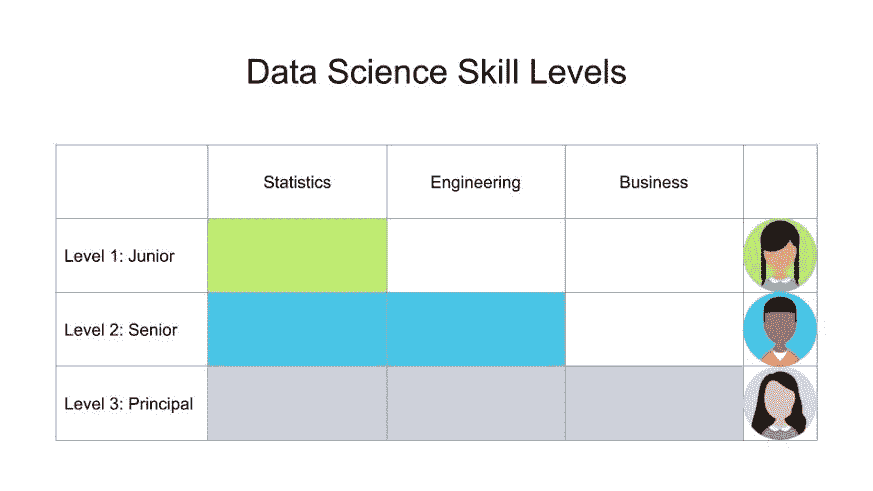
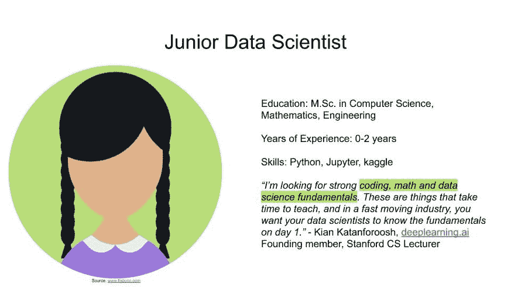
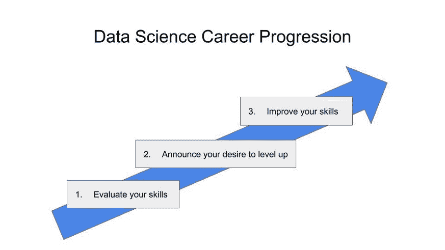

# 成为 3.0 级数据科学家

> 原文：[`www.kdnuggets.com/2019/05/becoming-a-level-3-data-scientist.html`](https://www.kdnuggets.com/2019/05/becoming-a-level-3-data-scientist.html)

 评论

**由 [Jan Zawadzki](https://www.linkedin.com/in/jan-zawadzki/), Carmeq GmbH 的数据与人工智能项目负责人**

公司招聘数据科学家分为三个级别：初级、高级或首席。不论您是刚刚入门数据科学还是希望转行，您不可避免地会发现自己处于这些级别之一。

 图片来源：[Kelly Sikkema](https://unsplash.com/photos/PgToaHfQjq0?utm_source=unsplash&utm_medium=referral&utm_content=creditCopyText) 在 [Unsplash](https://unsplash.com/search/photos/high-score?utm_source=unsplash&utm_medium=referral&utm_content=creditCopyText)

* * *

## 我们的前三大课程推荐

 1\. [谷歌网络安全证书](https://www.kdnuggets.com/google-cybersecurity) - 快速迈入网络安全职业生涯。

 2\. [谷歌数据分析专业证书](https://www.kdnuggets.com/google-data-analytics) - 提升您的数据分析能力

 3\. [谷歌 IT 支持专业证书](https://www.kdnuggets.com/google-itsupport) - 在 IT 方面支持您的组织

* * *

本文旨在阐明每个数据科学职业级别的期望与范围之外的内容。虽然公司可能有不同的职位名称，但本文提供了一个通用的基准。此外，文章最后提供了有关如何为转向人工智能或获得应得晋升的职业准备的一些实用建议。

让我们升级一下。

### 数据科学技能矩阵

数据科学家应在三个领域具有知识：统计学、工程学和商业。然而，您不必一开始就精通这三个领域。在寻求入门级职位时，应该关注哪些技能？随着职业发展的推进，哪些技能变得更加重要？

以下图表展示了从 1.0 到 3.0 级别的数据科学市场期望。这些结果基于我在该领域的个人经验以及与 [斯坦福](https://profiles.stanford.edu/kian-katanforoosh/)、[eBay](https://www.productschool.com/blog/product-management-2/ebay-pm-explains-why-you-need-artificial-intelligence-for-product/)、[Axel Springer](https://www.axelspringer.com/en/) 和 [Xing](https://www.xing.com/profile/Sebastien_Foucaud/cv) 的专家和影响者的对话。为了避免混淆，我们将职位称为 1.0 级到 3.0 级。

让我们详细分析这些职位的期望。

### 初级数据科学家 — 进入 1.0 级

原型初级数据科学家是年轻的毕业生。热门的学习领域包括计算机科学、数学或工程。初级数据科学家有 0–2 年的工作经验，熟悉使用 Python 或 R 创建结构化数据集的原型。她参加过 kaggle 比赛，并有一个 GitHub 个人资料。

初级数据科学家可以为公司提供巨大的价值。他们刚刚完成在线课程，可以立即提供帮助。他们通常是自学成才，因为很少有大学提供数据科学学位，因此展现了巨大的承诺和好奇心。他们对自己选择的领域充满热情，渴望学习更多。初级数据科学家擅长原型设计，但在工程和商业思维方面仍然欠缺熟练度。

> 初级数据科学家应该对机器学习有强烈的热情。你可以通过参与开源项目或参加 kaggle 挑战来展示你的热情。 — [Dat Tran](https://medium.com/@datitran)，Axel Springer AI 负责人

**他们的工作**

如果公司正在招聘初级数据科学家，通常数据科学团队已经到位。公司希望得到帮助，以便让更有经验的同事的工作变得更轻松。这包括快速测试新想法、调试和重构现有模型。你将作为团队的对手讨论想法。你会提出改进的方法。你对自己的代码负责，不断努力提高代码质量和影响力。你是一个出色的团队成员，始终寻求支持你的队友，帮助他们构建出色的数据产品。

**他们不做的事情**

初级数据科学家没有复杂产品解决方案的工程经验。因此，她在团队中工作，将数据科学模型投入生产。由于初级数据科学家刚加入公司，她尚未深入了解公司的业务。因此，她不被期望提出新的产品来影响[基础商业方程](https://towardsdatascience.com/business-basics-for-data-scientists-862f116a82da)。然而，始终期望的是对学习的渴望和提升技能的愿望。

> 我对初级数据科学家完成非平凡项目的能力很感兴趣。完成的意思是这个项目是由个人 — 或团队 — 从头到尾完成的，并最终成为一个完善的产品。我发现这与数据科学家在工作中领导项目的能力相关。 — [Kian Katanforoosh](https://www.linkedin.com/in/kiankatan/)，deeplearning.ai 创始成员，斯坦福计算机科学讲师

如果你在担任初级数据科学家时表现出色，你对数据科学模型有着深厚的理解背景。你展示了对学习工程和公司业务的强烈好奇心，以提升你的技能。

下一个级别是什么样的？让我们接下来了解一下高级数据科学家。

### 高级数据科学家——达到 Level 2.0

高级数据科学家已经曾担任过初级数据科学家、软件工程师，或完成了博士学位。他在该领域有 3–5 年的相关经验，编写可重用的代码，并在云环境中构建弹性的 数据管道。

> 高级数据科学家应该能够框定数据科学问题。优秀的候选人具有来自过去数据科学经验的深刻洞察。我还会深入了解他们编写生产代码的能力。 — [基安·卡坦福鲁什](https://www.linkedin.com/in/kiankatan/)

公司更愿意聘用高级数据科学家，因为他们在合理的薪水下提供了巨大的价值。他们比初级数据科学家更有经验，从而避免了昂贵的[新手错误](https://towardsdatascience.com/top-5-mistakes-of-greenhorn-data-scientists-90fa26201d51)。他们的成本也低于首席数据科学家，但仍然期望能够交付生产中的数据科学模型。这是一个非常有趣的阶段，已经超过了 Level 1.0，同时还有成长到 Level 3.0 的空间。

**他们做的事情**

高级数据科学家掌握了将数学模型投入生产的艺术。虽然首席数据科学家或业务经理分配任务，但高级数据科学家以构建架构良好的产品为荣。他们避免模型中的逻辑缺陷，对表现过于优异的系统保持怀疑，并以正确准备数据为荣。高级数据科学家指导初级数据科学家，并向管理层解答业务问题。

**他们不做的事情**

高级数据科学家不需要领导整个团队。高级数据科学家的职责不是提出新产品的想法，因为这些想法是由经验更丰富的同事和经理产生的。虽然高级数据科学家了解他们所构建产品的细节，但不要求他们了解所有数据驱动产品的整体架构。Level 2.0 的数据科学家在统计学方面很有造诣，并且在工程方面比 Level 1.0 的数据科学家更强，但避开了 Level 3.0 中的不那么有趣的业务部分。

> 高级数据科学家必须能够将他们的代码投入生产（在数据工程师的支持下）。高级数据科学家应该能够独立完成他们所承担的项目。 — [塞巴斯蒂安·福考德](https://www.linkedin.com/in/sfoucaud/)，Xing 数据科学副总裁

高级数据科学家的表现取决于他们模型所产生的影响。他对统计模型的内部工作原理及其实施有很好的直觉。他正在进一步了解公司业务，但尚未被期望提供商业问题的解决方案。

照片由 [Carl Raw](https://unsplash.com/photos/8Gdayy2Lhi0?utm_source=unsplash&utm_medium=referral&utm_content=creditCopyText) 提供，来源于 [Unsplash](https://unsplash.com/search/photos/game?utm_source=unsplash&utm_medium=referral&utm_content=creditCopyText)

现在我们已经探讨了 2.0 级别，让我们看看最终的 3.0 级别是什么样的。

### 首席数据科学家 — 最终关卡 3.0

首席数据科学家是数据科学团队中经验最丰富的成员。她拥有 5 年以上的经验，对各种数据科学模型非常熟悉。她了解将模型投入实际使用的最佳实践。她知道如何编写计算效率高的代码，并且时刻关注高影响力的商业项目。

除了她无可挑剔的工程技能和对使用的科学模型的深刻理解外，她还深刻理解公司所处的业务。她在数据科学方面对业务基线产生了显著影响。

> 首席数据科学家需要在编写任何代码之前，对所解决的业务问题有非常好的理解。这意味着他们需要具备在实施之前验证想法的能力。这种方法能提高数据科学项目的成功率。 — [Adnan Boz](https://www.linkedin.com/in/adnanboz/)，eBay 的 AI 产品负责人

**他们做的事情**

首席数据科学家负责创建高影响力的数据科学项目。她需要与利益相关者紧密协调，领导一个可能的跨职能团队，为特定问题提供最佳解决方案。因此，她的领导能力在 1.0 和 2.0 级别中不断提升。首席数据科学家还充当不同部门产品经理的技术顾问。凭借她在主要数据科学类别中的丰富经验和技能，她成为任何项目中极具价值的资产。

**他们不做的事情**

虽然在讨论所需技能时，首席数据科学家不负责招聘新团队成员。尽管她了解公司业务并建议具有影响力的新产品，但市场采纳仍由产品经理负责。她也会领导团队，但职业发展决策仍由团队领导做出。

> 首席数据科学家应能独立地推动项目，而无需依赖数据科学主管。此人应具备初步的领导技能，因此沟通清晰、富有同理心以及对人才有敏锐的眼光非常重要。 — [Dat Tran](https://www.linkedin.com/in/dat-tran-a1602320/)

首席数据科学家已经了解了产品失败的原因，因此她能够成功推动新项目。她在产品讨论中是重要的贡献者，并且喜欢向公司普及数据科学知识。凭借她在交付有影响力的数据科学解决方案方面的经验，她是数据科学部门最宝贵的资产。

照片由[Val Vesa](https://unsplash.com/photos/P0F_zH39qhs?utm_source=unsplash&utm_medium=referral&utm_content=creditCopyText)拍摄，[Unsplash](https://unsplash.com/search/photos/senior?utm_source=unsplash&utm_medium=referral&utm_content=creditCopyText)

现在你已经了解了从数据科学家 1.0 到 2.0 再到 3.0 的不同期望，让我们来探讨如何利用这些知识提升你的职业生涯。

### 提升你的数据科学职业

无论你是希望进入数据科学职业游戏的 1.0 级别，还是希望晋升到更高的级别，采取以下步骤来进行你的下一步职业发展。

**1\. 评估你的技能**

首先，将你的技能与数据科学技能矩阵进行比较。你的统计技能有多扎实？你的工程技能如何？你的商业敏感度如何？

**2\. 规划你的晋升**

许多公司有年度晋升周期来推动员工的晋升。[朱莉·卓](https://medium.com/@joulee)，Facebook 的产品设计副总裁，建议作为晋升的第一步，让你的[晋升愿望公开](https://www.linkedin.com/feed/update/urn%3Ali%3Aactivity%3A6524377847119826944/)。在晋升周期开始时，向你的经理表明你希望提升职业发展。询问你的经理如何评估你目前的技能水平以及达到下一个数据科学职业水平的期望是什么。

**3\. 提升你的技能**

一旦你分析了自己的技能并表明了晋升的愿望，就该提升自己的技能了。

照片由[Samuel Zeller](https://unsplash.com/photos/rk_Zz3b7G2Y?utm_source=unsplash&utm_medium=referral&utm_content=creditCopyText)拍摄，[Unsplash](https://unsplash.com/search/photos/development?utm_source=unsplash&utm_medium=referral&utm_content=creditCopyText)

你想进入人工智能领域吗？那么就要对统计模型有深入的了解，并学习如何使用结构化数据集解决问题。你想进入 3.0 级别吗？确保你的数学、工程和[商业技能](https://towardsdatascience.com/top-5-business-related-books-every-data-scientist-should-read-6e252a3f2713)都掌握了。掌握这些要点，你就能为与经理谈判升职做好充分准备。

### 关键要点

探索数据科学职业等级是有趣的。请记住以下关键要点：

+   初级数据科学家具备良好的统计技能。

+   高级数据科学家擅长将模型投入生产。

+   首席数据科学家知道如何创造商业价值。

+   要提升水平，评估你的技能，宣布你想要进步的愿望，并致力于提高突出的技能。

数据科学职业等级之间存在细微差别。例如，Séb Foucaud 更看重初级数据科学家的工程技能而非数学技能。一些高级数据科学家可能会发现自己对构建可扩展的数据管道充满热情，并转型为数据工程师角色。一些首席数据科学家倾向于发展技术专长，而其他人则更愿意专注于商业技能。无论你选择哪条职业路径，围绕数据科学三大主要领域提升你的技能将会使你走得更远。

本文继续教育数据科学家成为商业精英的系列。该系列旨在帮助你提升整体数据科学技能。如果你喜欢这种格式，请**关注**我在[LinkedIn](https://www.linkedin.com/in/jan-zawadzki/)或[Medium](https://medium.com/@janzawadzki)，以获取最新文章。

照片来自[Mirko Blicke](https://unsplash.com/photos/RndRFUz8RS4?utm_source=unsplash&utm_medium=referral&utm_content=creditCopyText)于[Unsplash](https://unsplash.com/search/photos/stairs?utm_source=unsplash&utm_medium=referral&utm_content=creditCopyText)

**个人简介：[Jan Zawadzki](https://www.linkedin.com/in/jan-zawadzki/)**拥有 5 年的全球咨询和数据科学家经验。Jan 目前在 Carmeq GmbH 担任自驾车领域的项目负责人，Carmeq GmbH 是大众汽车集团的创新车队。Jan 热衷于通过机器学习推动汽车行业的发展，并分享他在商业和数据科学领域的知识。他是 Medium 上“Towards Data Science”刊物的月度贡献者，也是 Deep Learning.ai 的大使，支持深度学习大师 Andrew Ng 的团队。

[原文](https://towardsdatascience.com/becoming-a-level-3-0-data-scientist-52641ff73cb3)。经许可转载。

**相关：**

+   第三波数据科学家

+   接受数据科学家工作邀请前需审视的 5 件事

+   数据科学面试问题——三个案例面试示例

### 更多相关话题

+   [成为数据优先企业的好处](https://www.kdnuggets.com/2022/07/benefits-becoming-datafirst-enterprise.html)

+   [为什么 TinyML 应用案例越来越受欢迎？](https://www.kdnuggets.com/2022/10/tinyml-cases-becoming-popular.html)

+   [成为技术行业专家的终极路线图](https://www.kdnuggets.com/the-ultimate-roadmap-to-becoming-specialised-in-the-tech-industry)

+   [初级数据科学家：下一个层级](https://www.kdnuggets.com/2022/02/junior-data-scientist-next-level.html)

+   [50 级数据科学家：需要了解的 Python 库](https://www.kdnuggets.com/level-50-data-scientist-python-libraries-to-know)

+   [将数据科学职业发展到下一个层级](https://www.kdnuggets.com/2021/12/sas-advance-data-science-career-next-level.html)
