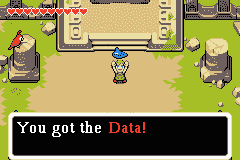
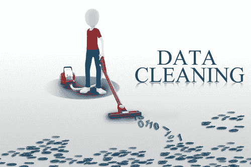

# 数据科学流程初学者指南

> 原文：[`www.kdnuggets.com/2018/05/beginners-guide-data-science-pipeline.html`](https://www.kdnuggets.com/2018/05/beginners-guide-data-science-pipeline.html)

 评论

**[Randy Lao](https://www.linkedin.com/in/randylaosat/)，机器学习助教**

> * * *
> 
> ## 我们的前三大课程推荐
> ## 
>  1\. [Google 网络安全证书](https://www.kdnuggets.com/google-cybersecurity) - 快速进入网络安全职业
> 
>  2\. [Google 数据分析专业证书](https://www.kdnuggets.com/google-data-analytics) - 提升你的数据分析技能
> 
>  3\. [Google IT 支持专业证书](https://www.kdnuggets.com/google-itsupport) - 支持你的组织的 IT
> 
> * * *
> 
> “信不信由你，你和数据没有什么不同。把自己置于数据的角度，你会看到原因。”

从前有一个名叫数据的男孩。在他的生活中，他总是试图理解他的目的是什么。**我有哪些价值？** **我能对这个世界产生什么影响？** **数据的来源是什么？** 你和数据有任何相似之处吗？这些问题一直萦绕在他的脑海中，幸运的是，通过运气的眷顾，数据终于找到了一个解决方案，并经历了巨大的转变。

一切都始于数据在走过一排排时，发现了一个奇怪但有趣的管道。管道一端是入口，另一端是出口。管道上还标有五个不同的字母：“**O.S.E.M.N.**”。出于好奇，数据决定进入管道。长话短说…… **数据进去了，见解出来了。**

**提醒：** 本文将简要介绍典型数据科学流程的高级概述。从框定业务问题到创建可操作的见解。*别担心，这将是一次轻松的阅读！*

### 数据科学是 OSEMN

**你很棒。我很棒。数据科学是** **OSEMN**。你可能会问，为什么数据科学是“棒”的？好吧，作为一个有抱负的数据科学家，你有机会锻炼你作为**巫师**和**侦探**的能力。所谓巫师，是指拥有自动预测的能力！而侦探则是指发现数据中未知模式和趋势的能力！

了解数据科学流程的典型工作流程是商业理解和解决问题的重要步骤。**如果你对数据科学流程感到困惑，那就别再担心了。本文正是为你准备的！** 我找到一个非常简单的缩写，来自**希拉里·梅森和克里斯·威金斯**，你可以在整个数据科学流程中使用。那个缩写就是**O.S.E.M.N.**

### OSEMN 流程

+   **O — **获取我们的数据

+   **S **— 清理/清洗我们的数据

+   **E — **探索/可视化我们的数据将帮助我们发现模式和趋势

+   **M — **建模我们的数据将赋予我们作为专家的预测能力

+   **N — **解读我们的数据

### 业务问题

因此，在我们开始**OSEMN**流程之前，我们必须首先考虑的是我们要解决的**问题**。**再说一遍**。在我们开始做“数据科学”之前，我们必须首先考虑我们要解决的**问题**。如果你有一个小问题要解决，那么你最多只能得到一个小解决方案。如果你有一个*大*问题要解决，那么你就有可能得到一个*大*解决方案。

**问问自己：**

+   我们如何将**数据**转化为**美元**？

+   我希望通过这些数据产生什么影响？

+   我们的模型为业务带来了什么价值？

+   什么能为我们节省大量资金？

+   我们可以做些什么来提高业务效率？

> “给我钱！”

了解这个基本概念会让你走得更远，并在成为“数据科学家”之路上取得更大成功（这是我认为的…对不起我不是！）不过，这仍然是你必须做的重要一步！无论你的模型预测得多么准确，无论你获得了多少数据，无论你的流程有多么**OSEMN**…**你的解决方案或可操作的见解仅仅取决于你设定的问题。**

> “优秀的数据科学更关乎你提出的数据问题，而不是数据清洗和分析” — 莱利·纽曼

### 获取你的数据

作为数据科学家，你无法在没有数据的情况下进行任何操作。通常来说，在获取数据时需要考虑一些因素。你必须**识别**所有可用的数据集（这些数据集可以来自互联网或外部/内部数据库）。你还必须将数据提取到**可用格式**（.csv、json、xml 等）。

**所需技能**：

+   **数据库管理**：MySQL, PostgresSQL, MongoDB

+   **查询关系型数据库**

+   **检索非结构化数据**：文本、视频、音频文件、文档

+   **分布式存储**：Hadoop、Apache Spark/Flink

### 数据的**清理/清洗**

清理第 5 列！**这个阶段应该需要最多的时间和精力。** 因为你的机器学习模型的结果和输出只与输入的数据质量相关。基本上，垃圾进垃圾出。

**目标：**

+   **检查数据**：理解你正在处理的每个特征，识别错误、缺失值和损坏记录

+   **清理数据：** 丢弃、替换和/或填补缺失值/错误

**所需技能：**

+   **脚本语言：** Python，R，SAS

+   **数据处理工具：** Python Pandas，R

+   **分布式处理**：Hadoop，Map Reduce / Spark

> “准备好的人已经赢得了一半的战斗。”——**米格尔·德·塞万提斯**

### 探索（探索性数据分析）

现在在探索阶段，我们尝试**理解**数据中有哪些模式和值。我们将使用不同类型的**可视化**和**统计测试**来支持我们的发现。这是我们通过各种图表和分析来揭示数据背后的隐藏含义的地方。出去探索吧！

> “停泊在港湾的船是安全的——但那不是船只建造的目的。”——**约翰·A·谢德**

**目标：**

+   通过可视化和图表在数据中查找模式

+   通过使用统计方法识别和测试重要变量来提取特征

**所需技能：**

+   **Python：** Numpy，Matplotlib，Pandas，Scipy

+   **R：** GGplot2，Dplyr

+   **推论统计**

+   **实验设计**

+   **数据可视化**

**提示：** 在进行分析时，让你的*“蛛丝马迹”*感知敏锐。要有发现奇怪模式或趋势的敏感性。时刻留意有趣的发现！

**设计考虑：** 大多数时候，人们直接进入可视化“让我们完成它”。一切都与最终用户有关，他们将解读这些内容。**关注你的受众**。

### 建模（机器学习）

现在进入有趣的部分。模型在统计学上是一般规则。把机器学习模型看作是工具箱中的工具。你将有机会使用许多算法来实现不同的业务目标。你使用的特征越好，你的预测能力就会越强。在清理数据并找出最重要的特征后，将模型作为预测工具使用，只会增强你的业务**决策能力**。

> 预测分析正逐渐成为变革者。它不仅仅是回顾分析“发生了什么？”，而是帮助高管回答“接下来会发生什么？”以及“我们应该怎么做？”（《福布斯杂志》，2010 年 4 月 1 日）

**预测能力示例**：一个很好的例子可以在沃尔玛的供应链中看到。沃尔玛能够预测在某个店铺位置在飓风季节期间会售罄所有的**草莓口味的 Pop-tarts**。通过数据挖掘，他们的历史数据表明，在飓风事件发生前，最受欢迎的商品是**Pop-tarts**。尽管听起来很疯狂，这是真实的故事，并强调了不要低估预测分析的力量。

**目标：**

+   **深入分析：**创建预测模型/算法

+   **评估和完善模型**

**所需技能：**

+   **机器学习**：监督/无监督算法

+   **评估方法**

+   **机器学习库**：Python（Sci-kit Learn）/ R（CARET）

+   **线性代数与多变量微积分**

> “模型是嵌入数学中的观点” — 凯西·奥尼尔

### 解释（数据讲述）

讲故事时间到了！数据管道中最重要的步骤是理解并学习如何通过沟通解释你的发现。讲述故事是关键，不要低估它。**这关乎于与人们建立联系、说服他们和帮助他们。**理解你的观众并与他们建立联系是数据讲述的最佳部分之一。

> “我相信讲故事的力量。故事让我们的心灵打开到一个新的地方，从而开启我们的思维，这通常会导致行动” — 梅琳达·盖茨

**情感**在数据讲述中扮演着重要角色。人们不会自动理解你的发现。产生影响的最佳方式是通过情感讲述你的故事。作为人类，我们天生受到情感的影响。**如果你能触动你观众的情感，那么你，我的朋友，就是掌控者。**在展示数据时，请记住心理学的力量。理解你的观众并与他们建立联系是数据讲述的最佳部分之一。

**最佳实践：**我强烈建议的一个好的实践是反复排练你的数据故事。**如果你是家长，那么有好消息给你。**与其在孩子睡前读那些典型的**苏斯博士**的书，不如尝试用你的数据分析结果让他们入睡！**因为如果一个孩子能理解你的解释，那么任何人，尤其是你的老板，也都能理解！**

> “如果你不能向一个六岁孩子解释它，你自己也不理解它。” — 阿尔伯特·爱因斯坦

**目标：**

+   **识别业务洞察**：回到业务问题

+   **根据你的发现进行可视化**：保持简单并以优先级驱动

+   **讲述清晰且可操作的故事**：有效地与非技术观众沟通

**所需技能：**

+   **业务领域知识**

+   **数据可视化工具**：Tableau、D3.JS、Matplotlib、GGplot、Seaborn

+   **沟通**：展示/演讲 & 报告/写作

### 更新你的模型

不要担心你的故事不会在这里结束。随着你的模型投入生产，定期更新模型是很重要的，这取决于你收到新数据的频率。收到的数据越多，更新的频率就越高。**假设你是** **亚马逊**，并且你引入了一个新的“鞋类特性”供客户购买。你的旧模型没有这个特性，因此你必须更新包含该特性的模型。如果不这样做，你的模型会随着时间的推移而退化，性能也会变差，从而导致你的业务也会退化。引入新特性会通过不同的变化或可能与其他特性的相关性改变模型的性能。

### 结论

**总结：**

+   确定你的业务问题

+   **获取你的数据**

**获取**你的数据，**清理**你的数据，**用可视化探索**你的数据，**用不同的机器学习算法建模**你的数据，**通过评估解释**你的数据，并**更新**你的模型。

> 记住，我们与数据并无不同。我们都有价值、目标，以及在这个世界上存在的理由。

你将面临的大多数问题实际上是工程问题。即使拥有伟大的机器学习大神的所有资源，大多数影响也将来自优秀的特性，而不是优秀的机器学习算法。所以，基本的方法是：

1.  确保你的管道端到端都很稳固

1.  从一个合理的目标开始

1.  直观地理解你的数据

1.  确保你的管道保持稳固

**这种方法希望能带来大量的收入和/或让许多人长时间感到满意。**

**所以……下次有人问你什么是数据科学时，告诉他们：**

> “数据科学即 OSEMN”

**希望大家今天学到了一些东西！如果你们想在这篇文章中添加任何内容，请随时留言，不要犹豫！任何形式的反馈都非常感谢。不要害怕分享！谢谢！**

在 LinkedIn 上与我联系：

[`www.linkedin.com/in/randylaosat`](https://www.linkedin.com/in/randylaosat)

**简介：[Randy Lao](https://www.linkedin.com/in/randylaosat/)** 是一名机器学习教学助理。如果机会不敲门，就自己造一扇门！

[原文](https://www.linkedin.com/pulse/life-data-science-osemn-randy-lao/)。经许可转载。

**相关内容：**

+   使用 Scikit-learn 管道管理机器学习工作流 第一部分：温和的介绍

+   命令行中的数据科学：探索数据

+   一小时内开始机器学习！

### 更多相关内容

+   [停止学习数据科学以寻找目的，并寻找目的以……](https://www.kdnuggets.com/2021/12/stop-learning-data-science-find-purpose.html)

+   [学习数据科学统计学的顶级资源](https://www.kdnuggets.com/2021/12/springboard-top-resources-learn-data-science-statistics.html)

+   [成功的数据科学家的 5 个特征](https://www.kdnuggets.com/2021/12/5-characteristics-successful-data-scientist.html)

+   [每个数据科学家都应该知道的三个 R 库（即使你使用 Python）](https://www.kdnuggets.com/2021/12/three-r-libraries-every-data-scientist-know-even-python.html)

+   [一个 90 亿美元的 AI 失败案例分析](https://www.kdnuggets.com/2021/12/9b-ai-failure-examined.html)

+   [是什么让 Python 成为初创企业理想的编程语言](https://www.kdnuggets.com/2021/12/makes-python-ideal-programming-language-startups.html)
