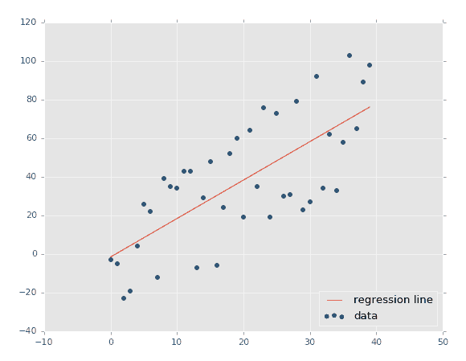
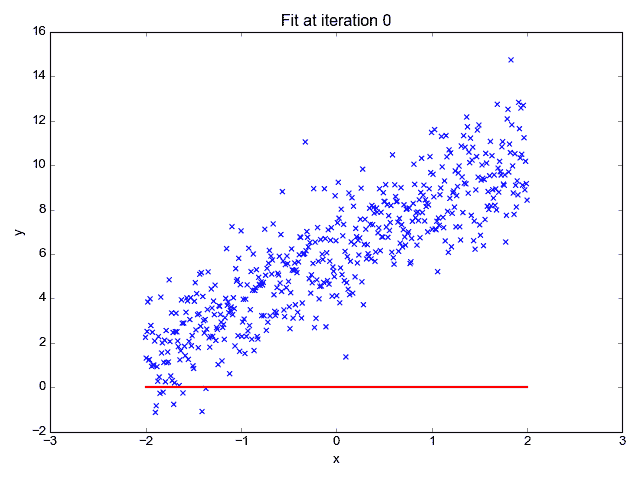
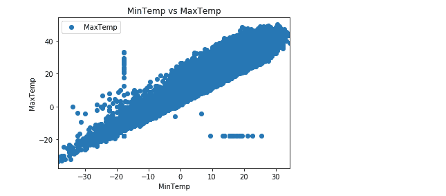
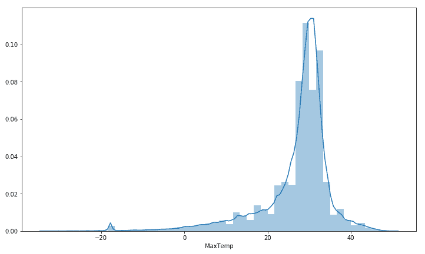
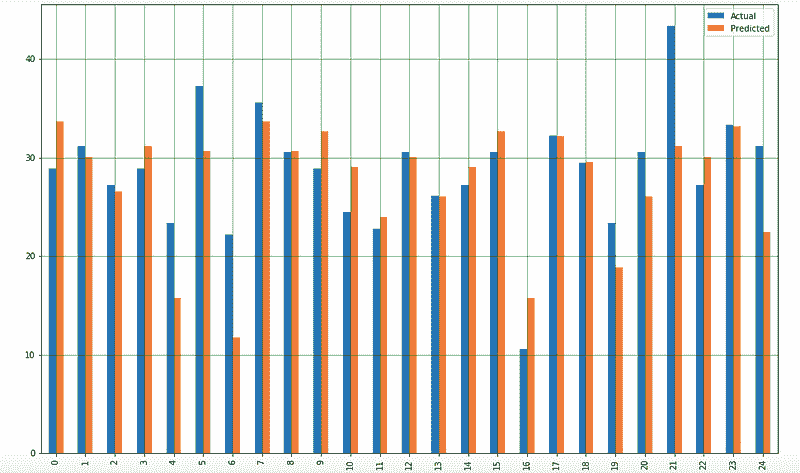
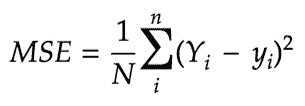

# Python 中的线性回归初学者指南，使用 Scikit-Learn

> 原文：[`www.kdnuggets.com/2019/03/beginners-guide-linear-regression-python-scikit-learn.html`](https://www.kdnuggets.com/2019/03/beginners-guide-linear-regression-python-scikit-learn.html)

评论

[来源](https://www.disruptordaily.com/category/digital-transformation/)

监督学习算法有两种类型：回归和分类。前者预测连续值输出，而后者预测离散输出。例如，预测房价是一个回归问题，而预测肿瘤是恶性还是良性是一个分类问题。

* * *

## 我们的前三大课程推荐

 1\. [谷歌网络安全证书](https://www.kdnuggets.com/google-cybersecurity) - 快速通道进入网络安全职业。

 2\. [谷歌数据分析专业证书](https://www.kdnuggets.com/google-data-analytics) - 提升你的数据分析技能

 3\. [谷歌 IT 支持专业证书](https://www.kdnuggets.com/google-itsupport) - 支持你组织的 IT 需求

* * *

在本文中，我们将简要研究什么是线性回归，以及如何使用**Scikit-Learn**（这是 Python 中最受欢迎的机器学习库之一）来实现两个变量和多个变量的线性回归。

### **线性回归理论**

在代数中，“线性”一词指的是两个或更多变量之间的线性关系。如果我们在二维空间（两个变量之间）绘制这种关系，我们会得到一条直线。

线性回归的任务是基于给定的自变量（x）预测因变量（y）的值。因此，这种回归技术找出 x（输入）和 y（输出）之间的线性关系。因此，称之为线性回归。如果我们将自变量（x）绘制在 x 轴上，将因变量（y）绘制在 y 轴上，线性回归将给我们一条最佳拟合数据点的直线，如下图所示。

我们知道直线的方程基本上是：



[来源](https://pythonprogramming.net/regression-introduction-machine-learning-tutorial/)

上述直线的方程是：

**Y = mx + b**

> 其中 b 是截距，m 是直线的斜率。所以基本上，线性回归算法给出的是截距和斜率（在二维中）的最优值。y 和 x 变量保持不变，因为它们是数据特征，不能改变。我们可以控制的值是截距（b）和斜率（m）。根据截距和斜率的不同，可以有多条直线。线性回归算法的基本原理是，它在数据点上拟合多条直线，并返回误差最小的那一条。

同样的概念可以扩展到变量多于两个的情况。这被称为多元线性回归。例如，考虑一个场景，你需要根据房子的面积、卧室数量、该地区居民的平均收入、房子的年龄等因素来预测房价。在这种情况下，因变量（目标变量）依赖于几个自变量。涉及多个变量的回归模型可以表示为：

**y = b[***0***] + m[***1***]b[***1***] + m[***2***]b[***2***] + m[***3***]b[***3***] + ... m[***n***]b[***n***]**

这是一个[超平面](https://en.wikipedia.org/wiki/Hyperplane)的方程。请记住，在二维中，线性回归模型是直线；在三维中是平面，而在三维以上则是超平面。

在本节中，我们将学习如何使用 Python 的 Scikit-Learn 库来实现回归函数。我们将从涉及两个变量的简单线性回归开始，然后逐步过渡到涉及多个变量的线性回归。

### **简单线性回归**



线性回归

在探索二战空袭行动数据集时，回忆起诺曼底登陆几乎因恶劣天气而被推迟，我下载了这些时期的天气报告，以便与轰炸行动数据集中的任务进行比较。

你可以从[**这里**](https://drive.google.com/open?id=1fiHg5DyvQeRC4SyhsVnje5dhJNyVWpO1)下载数据集。

数据集包含全球各个气象站记录的天气条件信息。信息包括降水量、降雪量、气温、风速，以及当天是否有雷暴或其他恶劣天气条件。

因此，我们的任务是以最低气温作为输入特征来预测最高气温。

让我们开始编码：

导入所有需要的库：

```py
import pandas as pd  
import numpy as np  
import matplotlib.pyplot as plt  
import seaborn as seabornInstance 
from sklearn.model_selection import train_test_split 
from sklearn.linear_model import LinearRegression
from sklearn import metrics
%matplotlib inline
```

以下命令使用 pandas 导入 CSV 数据集：

```py
dataset = pd.read_csv('/Users/nageshsinghchauhan/Documents/projects/ML/ML_BLOG_LInearRegression/Weather.csv')
```

让我们通过检查数据集中的行数和列数来稍微探索一下数据。

```py
dataset.shape
```

你应该会收到输出为 (119040, 31)，这意味着数据包含 119040 行和 31 列。

要查看数据集的统计细节，我们可以使用 `describe()`：

```py
dataset.describe()
```


数据集的统计视图

最后，让我们将数据点绘制在二维图上，以直观地查看数据集，并查看我们是否可以手动找到数据之间的关系，使用以下脚本：

```py
dataset.plot(x='MinTemp', y='MaxTemp', style='o')  
plt.title('MinTemp vs MaxTemp')  
plt.xlabel('MinTemp')  
plt.ylabel('MaxTemp')  
plt.show()
```

我们选择了 MinTemp 和 MaxTemp 进行分析。以下是 MinTemp 和 MaxTemp 之间的二维图。



我们来查看一下平均最高温度，一旦我们绘制出来，就可以观察到平均最高温度介于 25 到 35 之间。

```py
plt.figure(figsize=(15,10))
plt.tight_layout()
seabornInstance.distplot(dataset['MaxTemp'])
```



平均最高温度介于 25 到 35 之间。

我们的下一步是将数据分为“属性”和“标签”。

属性是独立变量，而标签是依赖变量，其值需要预测。在我们的数据集中，我们只有两列。我们希望根据记录的最低温度（MinTemp）预测最高温度（MaxTemp）。因此，我们的属性集将包括存储在 X 变量中的“MinTemp”列，标签将是存储在 y 变量中的“MaxTemp”列。

```py
X = dataset['MinTemp'].values.reshape(-1,1)
y = dataset['MaxTemp'].values.reshape(-1,1)
```

接下来，我们使用以下代码将 80%的数据分配给训练集，将 20%的数据分配给测试集。

test_size 变量是我们实际指定测试集比例的地方。

```py
X_train, X_test, y_train, y_test = train_test_split(X, y, test_size=0.2, random_state=0)
```

在将数据分为训练集和测试集之后，最后是训练我们的算法。为此，我们需要导入 LinearRegression 类，实例化它，并调用`fit()`方法，使用我们的训练数据。

```py
regressor = LinearRegression()  
regressor.fit(X_train, y_train) #training the algorithm
```

正如我们讨论的那样，线性回归模型基本上找到截距和斜率的最佳值，从而得出最符合数据的直线。要查看线性回归算法为我们的数据集计算的截距和斜率值，请执行以下代码。

```py
#To retrieve the intercept:
print(regressor.intercept_)

#For retrieving the slope:
print(regressor.coef_)
```

结果应分别为约 10.66185201 和 0.92033997。

这意味着最低温度每变化一个单位，最高温度的变化约为 0.92%。

现在我们已经训练了我们的算法，是时候做一些预测了。为此，我们将使用我们的测试数据，看看算法预测的百分比分数有多准确。要对测试数据进行预测，请执行以下脚本：

```py
y_pred = regressor.predict(X_test)
```

现在将`X_test`的实际输出值与预测值进行比较，执行以下脚本：

```py
df = pd.DataFrame({'Actual': y_test.flatten(), 'Predicted': y_pred.flatten()})
df
```


实际值与预测值的比较

我们还可以使用以下脚本将比较结果可视化为条形图：

注意：由于记录数量庞大，为了表示目的，我只取了 25 条记录。

```py
df1 = df.head(25)
df1.plot(kind='bar',figsize=(16,10))
plt.grid(which='major', linestyle='-', linewidth='0.5', color='green')
plt.grid(which='minor', linestyle=':', linewidth='0.5', color='black')
plt.show()
```



显示实际值与预测值比较的条形图。

虽然我们的模型不是非常精确，但预测的百分比接近实际值。

让我们将直线与测试数据一起绘制：

```py
plt.scatter(X_test, y_test,  color='gray')
plt.plot(X_test, y_pred, color='red', linewidth=2)
plt.show()
```


预测与测试数据

上图中的直线显示我们的算法是正确的。

最后的步骤是评估算法的性能。这个步骤特别重要，用于比较不同算法在特定数据集上的表现。对于回归算法，通常使用三个评估指标：

**1\. 平均绝对误差**（MAE）是绝对误差的均值。计算公式为：


**2\. 均方误差**（MSE）是平方误差的均值，计算公式为：



**3\. 均方根误差**（RMSE）是平方误差均值的平方根：


幸运的是，我们不需要手动执行这些计算。Scikit-Learn 库提供了预先构建的函数，可以用来为我们找出这些值。

让我们使用测试数据找到这些指标的值。

```py
print('Mean Absolute Error:', metrics.mean_absolute_error(y_test, y_pred))  
print('Mean Squared Error:', metrics.mean_squared_error(y_test, y_pred))  
print('Root Mean Squared Error:', np.sqrt(metrics.mean_squared_error(y_test, y_pred)))
```

你应该会收到类似这样的输出（但可能会略有不同）：

```py
('Mean Absolute Error:', 3.19932917837853)
('Mean Squared Error:', 17.631568097568447)
('Root Mean Squared Error:', 4.198996082109204)
```

你可以看到均方根误差的值为 4.19，超过了所有温度百分比均值（即 22.41）的 10%。这意味着我们的算法并不是非常准确，但仍能做出相当不错的预测。

### 相关话题

+   [做出预测：Python 中线性回归的初学者指南](https://www.kdnuggets.com/2023/06/making-predictions-beginner-guide-linear-regression-python.html)

+   [比较线性回归与逻辑回归](https://www.kdnuggets.com/2022/11/comparing-linear-logistic-regression.html)

+   [使用线性回归模型的 3 个理由，而不是…](https://www.kdnuggets.com/2021/08/3-reasons-linear-regression-instead-neural-networks.html)

+   [线性回归与逻辑回归：简明解释](https://www.kdnuggets.com/2022/03/linear-logistic-regression-succinct-explanation.html)

+   [KDnuggets 新闻 22:n12，3 月 23 日：最佳数据科学书籍…](https://www.kdnuggets.com/2022/n12.html)

+   [数据科学中的线性回归](https://www.kdnuggets.com/2022/07/linear-regression-data-science.html)
