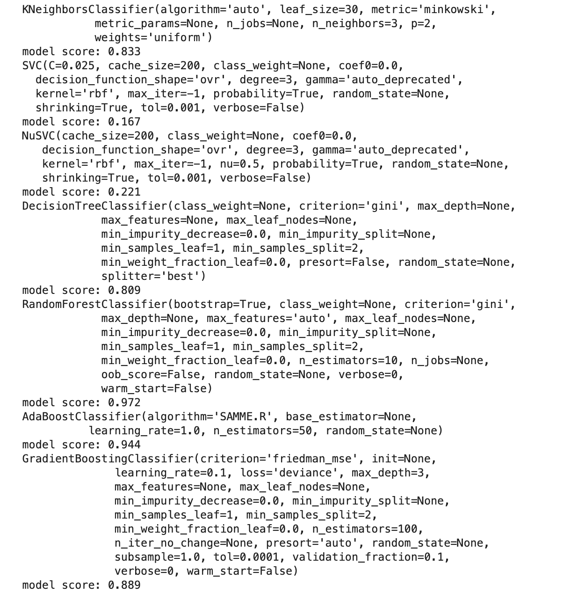

# 机器学习的三种类型入门指南

> 原文：[`www.kdnuggets.com/2019/11/beginners-guide-three-types-machine-learning.html`](https://www.kdnuggets.com/2019/11/beginners-guide-three-types-machine-learning.html)

评论

**作者：[Rebecca Vickery](https://www.linkedin.com/in/rebecca-vickery-20b94133/)，数据科学家**


使用[Yellowbrick](https://www.scikit-yb.org/en/latest/)可视化 KMeans 性能

机器学习问题通常可以分为三种类型。分类和回归被称为监督学习，无监督学习在机器学习应用的上下文中通常指的是聚类。

在接下来的文章中，我将简要介绍这三种问题，并将包括在流行的 Python 库[scikit-learn](https://scikit-learn.org/stable/index.html)中的演示。

在开始之前，我将简要解释监督学习和无监督学习的含义。

**监督学习：** *在监督学习中，你有一组已知的输入（特征）和一组已知的输出（标签）。传统上这些被称为 X 和 y。算法的目标是学习将输入映射到输出的映射函数。这样，当给出新的 X 示例时，机器可以正确预测相应的 y 标签。*

**无监督学习：** *在无监督学习中，你只有一组输入（X），没有对应的标签（y）。算法的目标是发现数据中之前未知的模式。这些算法通常用于发现相似样本 X 的有意义的簇，从而在数据中找到固有的类别。*

### 分类

在分类中，输出（y）是类别。这些类别可以是二元的，例如，如果我们将垃圾邮件与非垃圾邮件进行分类。它们也可以是多个类别，比如对[花卉](https://archive.ics.uci.edu/ml/datasets/iris)的分类，这被称为多类分类。

让我们通过一个使用 scikit-learn 的简单分类示例来演示。如果你还没有安装，可以通过 pip 或 conda 进行安装，安装方法详见[这里](https://scikit-learn.org/stable/install.html)。

Scikit-learn 有多个可以通过库直接访问的数据集。为了方便起见，在本文中我将使用这些示例数据集。为了说明分类，我将使用葡萄酒数据集，这是一个多类分类问题。在数据集中，输入（X）包括与每种葡萄酒类型相关的 13 个特征。已知的输出（y）是葡萄酒类型，在数据集中被赋予了数字 0、1 或 2。

我在本文中使用的所有代码的导入如下所示。

```py
import pandas as pd
import numpy as npfrom sklearn.datasets import load_wine
from sklearn.datasets import load_bostonfrom sklearn.model_selection import train_test_split
from sklearn import preprocessingfrom sklearn.metrics import f1_score
from sklearn.metrics import mean_squared_error
from math import sqrtfrom sklearn.neighbors import KNeighborsClassifier
from sklearn.svm import SVC, LinearSVC, NuSVC
from sklearn.tree import DecisionTreeClassifier
from sklearn.ensemble import RandomForestClassifier, AdaBoostClassifier, GradientBoostingClassifier
from sklearn.discriminant_analysis import LinearDiscriminantAnalysis
from sklearn.discriminant_analysis import QuadraticDiscriminantAnalysis
from sklearn import linear_model
from sklearn.linear_model import ElasticNetCV
from sklearn.svm import SVRfrom sklearn.cluster import KMeans
from yellowbrick.cluster import KElbowVisualizer
from yellowbrick.cluster import SilhouetteVisualizer
```

在下面的代码中，我正在下载数据并转换为 pandas 数据框。

```py
wine = load_wine()
wine_df = pd.DataFrame(wine.data, columns=wine.feature_names)
wine_df['TARGET'] = pd.Series(wine.target)
```

监督学习问题的下一阶段是将数据拆分为测试集和训练集。训练集可以被算法用来学习输入和输出之间的映射，然后保留的测试集可以用来评估模型学习这个映射的效果。在下面的代码中，我使用了 scikit-learn 的 model_selection 函数 `train_test_split` 来完成这一任务。

```py
X_w = wine_df.drop(['TARGET'], axis=1)
y_w = wine_df['TARGET']
X_train_w, X_test_w, y_train_w, y_test_w = train_test_split(X_w, y_w, test_size=0.2)
```

在下一步中，我们需要选择最适合学习你所选数据集映射的算法。在 scikit-learn 中，有许多不同的算法可以选择，这些算法使用不同的函数和方法来学习映射，你可以在 [这里](https://scikit-learn.org/stable/supervised_learning.html#supervised-learning) 查看完整列表。

为了确定最佳模型，我运行了以下代码。我使用一组选定的算法训练模型，并为每个算法获取 F1 分数。F1 分数是分类器总体准确性的良好指标。我已经详细描述了用于评估分类器的各种度量标准 [这里](https://towardsdatascience.com/understanding-the-confusion-matrix-and-its-business-applications-c4e8aaf37f42)。

```py
classifiers = [
    KNeighborsClassifier(3),
    SVC(kernel="rbf", C=0.025, probability=True),
    NuSVC(probability=True),
    DecisionTreeClassifier(),
    RandomForestClassifier(),
    AdaBoostClassifier(),
    GradientBoostingClassifier()
    ]
for classifier in classifiers:
    model = classifier
    model.fit(X_train_w, y_train_w)  
    y_pred_w = model.predict(X_test_w)
    print(classifier)
    print("model score: %.3f" % f1_score(y_test_w, y_pred_w, average='weighted'))
```



完美的 F1 分数是 1.0，因此，数值越接近 1.0，模型性能越好。以上结果表明，随机森林分类器是这个数据集的最佳模型。

### 回归

在回归中，输出（y）是连续值而不是类别。回归的一个例子是预测商店下个月的销售额，或预测你房子的未来价格。

为了说明回归，我将使用一个来自 scikit-learn 的数据集，即波士顿房价数据集。该数据集包含 13 个特征（X），这些特征是房子的各种属性，例如房间数量、房龄和位置的犯罪率。输出（y）是房价。

我正在使用下面的代码加载数据，并使用与我对葡萄酒数据集相同的方法将其拆分为测试集和训练集。

```py
boston = load_boston()
boston_df = pd.DataFrame(boston.data, columns=boston.feature_names)
boston_df['TARGET'] = pd.Series(boston.target)X_b = boston_df.drop(['TARGET'], axis=1)
y_b = boston_df['TARGET']
X_train_b, X_test_b, y_train_b, y_test_b = train_test_split(X_b, y_b, test_size=0.2)
```

我们可以使用这个 [备忘单](https://scikit-learn.org/stable/tutorial/machine_learning_map/index.html) 查看适用于回归问题的 scikit-learn 可用算法。我们将使用类似的代码来处理分类问题，遍历选择并打印出每个算法的得分。

有多种不同的度量标准用于评估回归模型。这些本质上都是误差度量，衡量模型预测值与实际值之间的差异。我使用了均方根误差（RMSE）。对于这个度量标准，数值越接近零，模型的性能越好。这个 [文章](https://www.dataquest.io/blog/understanding-regression-error-metrics/) 对回归问题的误差度量进行了很好的解释。

```py
regressors = [
    linear_model.Lasso(alpha=0.1),
    linear_model.LinearRegression(),
    ElasticNetCV(alphas=None, copy_X=True, cv=5, eps=0.001, fit_intercept=True,
       l1_ratio=0.5, max_iter=1000, n_alphas=100, n_jobs=None,
       normalize=False, positive=False, precompute='auto', random_state=0,
       selection='cyclic', tol=0.0001, verbose=0),
    SVR(C=1.0, cache_size=200, coef0=0.0, degree=3, epsilon=0.1,
    gamma='auto_deprecated', kernel='rbf', max_iter=-1, shrinking=True,
    tol=0.001, verbose=False),
    linear_model.Ridge(alpha=.5)                
    ]for regressor in regressors:
    model = regressor
    model.fit(X_train_b, y_train_b)  
    y_pred_b = model.predict(X_test_b)
    print(regressor)
    print("mean squared error: %.3f" % sqrt(mean_squared_error(y_test_b, y_pred_b)))
```


RMSE 分数表明线性回归和岭回归算法在这个数据集中表现最好。

### 无监督学习

无监督学习有许多不同类型，但为了简化，这里我将重点关注[聚类方法](https://en.wikipedia.org/wiki/Cluster_analysis)。有许多不同的聚类算法，它们使用略微不同的技术来寻找输入的簇。

可能最广泛使用的方法之一是 K 均值（Kmeans）。该算法执行一个迭代过程，其中启动了指定数量的随机生成的均值。计算每个数据点到质心的距离度量，[欧几里得](https://en.wikipedia.org/wiki/Euclidean_distance)距离，从而创建相似值的簇。每个簇的质心随后成为新的均值，这个过程会重复进行，直到达到最佳结果。

让我们使用我们在分类任务中使用的葡萄酒数据集，去掉 y 标签，看看 K 均值算法能多好地从输入中识别出葡萄酒类型。

由于我们仅使用输入来建立此模型，我将使用稍微不同的方法将数据拆分为测试集和训练集。

```py
np.random.seed(0)
msk = np.random.rand(len(X_w)) < 0.8
train_w = X_w[msk]
test_w = X_w[~msk]
```

由于 K 均值依赖于距离度量来确定簇，因此通常在训练模型之前需要进行特征缩放（确保所有特征具有相同的尺度）。在下面的代码中，我使用 MinMaxScaler 对特征进行缩放，使所有值落在 0 和 1 之间。

```py
x = train_w.values
min_max_scaler = preprocessing.MinMaxScaler()
x_scaled = min_max_scaler.fit_transform(x)
X_scaled = pd.DataFrame(x_scaled,columns=train_w.columns)
```

使用 K 均值时，你必须指定算法应使用的簇数量。因此，第一步之一是确定最佳簇数量。这是通过迭代不同的 k 值并将结果绘制在图表上来实现的。这被称为肘部法则，因为它通常生成一个看起来有点像肘部曲线的图。黄砖（yellowbrick）[库](https://www.scikit-yb.org/en/latest/quickstart.html)（这是一个非常适合可视化 scikit-learn 模型的库，可以通过 pip 安装）对此有一个非常好的图。下面的代码生成了这个可视化。

```py
model = KMeans()
visualizer = KElbowVisualizer(model, k=(1,8))
visualizer.fit(X_scaled)       
visualizer.show()
```


通常，我们不会知道数据集中使用聚类技术时有多少类别。然而，在这种情况下，我们知道数据中有三种葡萄酒类型——曲线正确地选择了三作为模型中使用的最佳簇数量。

下一步是初始化 K 均值算法，并将模型拟合到训练数据中，并评估算法对数据的聚类效果。

一种用于此的办法称为 [轮廓系数](https://en.wikipedia.org/wiki/Silhouette_(clustering))。它衡量集群内部值的一致性。换句话说，它测量每个集群内的值彼此有多相似，以及集群之间的分离程度。轮廓系数是对每个值进行计算的，范围从 -1 到 +1。这些值然后被绘制成轮廓图。再次，yellowbrick 提供了一种简单的方式来构建这种图。下面的代码为酒类数据集创建了这个可视化。

```py
model = KMeans(3, random_state=42)
visualizer = SilhouetteVisualizer(model, colors='yellowbrick')visualizer.fit(X_scaled)      
visualizer.show()
```


轮廓图可以按以下方式解读：

+   平均分数（上图中的红色虚线）越接近 +1，数据点在集群内的匹配度越好。

+   分数为 0 的数据点非常接近另一个集群的决策边界（因此分离度较低）。

+   负值表示数据点可能被分配到了错误的集群。

+   如果每个集群的宽度不均匀，那么可能使用了错误的 k 值。

上面的酒类数据集的图表显示，集群 0 可能不如其他集群一致，因为大多数数据点低于平均分，而且有少数数据点的分数低于 0。

轮廓系数在比较一个算法与另一个算法或不同的 k 值时特别有用。

在这篇文章中，我想简要介绍三种机器学习类型。所有这些过程都涉及许多其他步骤，包括特征工程、数据处理和超参数优化，以确定最佳的数据预处理技术和模型。

感谢阅读！

**简介：[Rebecca Vickery](https://www.linkedin.com/in/rebecca-vickery-20b94133/)** 通过自学数据科学。数据科学家 @ Holiday Extras。alGo 的联合创始人。

[原文](https://towardsdatascience.com/beginners-guide-to-the-three-types-of-machine-learning-3141730ef45d)。经授权转载。

**相关：**

+   机器学习分类：基于数据集的图解

+   可解释的机器学习的 Python 库

+   数据科学的五个命令行工具

* * *

## 我们的三大课程推荐

 1\. [谷歌网络安全证书](https://www.kdnuggets.com/google-cybersecurity) - 快速进入网络安全职业生涯。

 2\. [谷歌数据分析专业证书](https://www.kdnuggets.com/google-data-analytics) - 提升你的数据分析技能

 3\. [Google IT 支持专业证书](https://www.kdnuggets.com/google-itsupport) - 支持你的组织进行 IT

* * *

### 更多相关话题

+   [每个数据科学家都应该了解的三个 R 库（即使你使用 Python）](https://www.kdnuggets.com/2021/12/three-r-libraries-every-data-scientist-know-even-python.html)

+   [Python 基础：语法、数据类型和控制结构](https://www.kdnuggets.com/python-basics-syntax-data-types-and-control-structures)

+   [优化数据存储：探索 SQL 中的数据类型和规范化](https://www.kdnuggets.com/optimizing-data-storage-exploring-data-types-and-normalization-in-sql)

+   [可视化框架类型](https://www.kdnuggets.com/types-of-visualization-frameworks)

+   [KDnuggets 新闻，12 月 14 日：3 个免费的机器学习课程……](https://www.kdnuggets.com/2022/n48.html)

+   [OpenAI API 初学者指南：你的易于跟随的入门指南](https://www.kdnuggets.com/openai-api-for-beginners-your-easy-to-follow-starter-guide)
