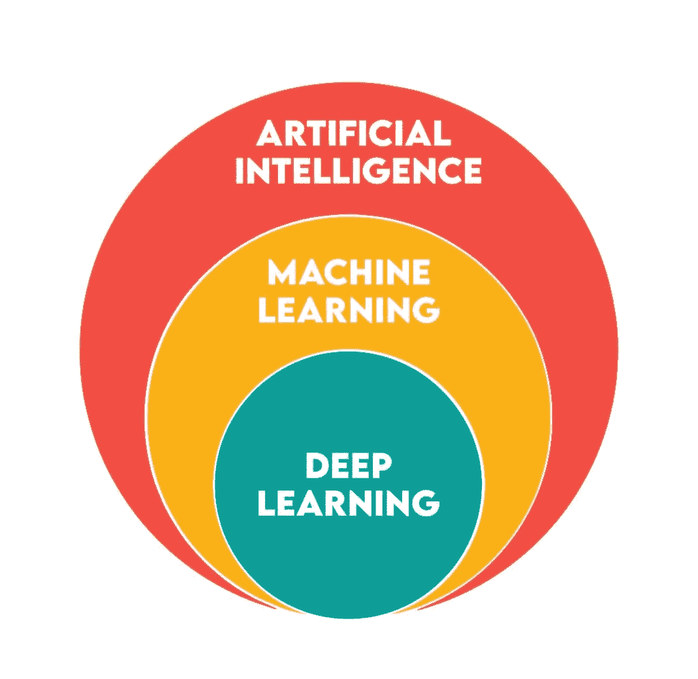
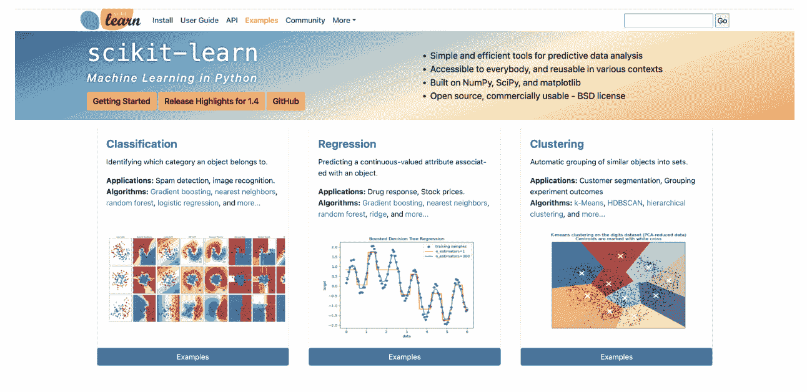
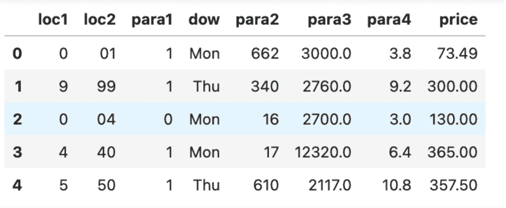
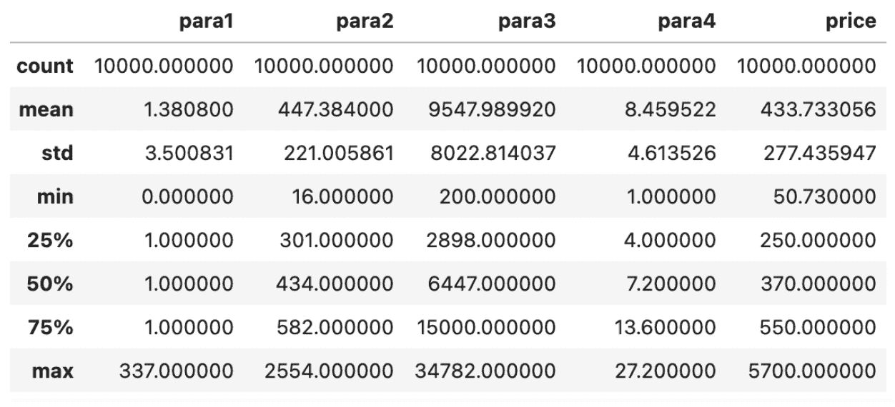

# 初学者的 Python 机器学习指南

> 原文：[`www.kdnuggets.com/beginners-guide-to-machine-learning-with-python`](https://www.kdnuggets.com/beginners-guide-to-machine-learning-with-python)


*作者提供的图片*

* * *

## 我们的前三个课程推荐

 1\. [谷歌网络安全证书](https://www.kdnuggets.com/google-cybersecurity) - 快速进入网络安全职业道路

 2\. [谷歌数据分析专业证书](https://www.kdnuggets.com/google-data-analytics) - 提升你的数据分析能力

 3\. [谷歌 IT 支持专业证书](https://www.kdnuggets.com/google-itsupport) - 支持你所在的组织进行 IT 工作

* * *

> 预测未来并不是魔法；它是人工智能。

当我们站在 AI 革命的边缘时，Python 让我们能够参与其中。

在这篇文章中，我们将探索如何利用 Python 和机器学习来进行预测。

我们将从基本原理开始，然后应用算法于数据进行预测。让我们开始吧！

## **什么是机器学习？**

机器学习是赋予计算机预测能力的一种方式。它现在非常流行；你可能在日常生活中不经意间使用了它。以下是一些受益于机器学习的技术：

+   自动驾驶汽车

+   人脸检测系统

+   Netflix 电影推荐系统

但有时，AI、机器学习和深度学习之间的区别并不明显。这里有一个宏大的方案，最好地代表了这些术语。



## **初学者如何分类机器学习**

机器学习算法可以通过两种不同的方法进行聚类。其中一种方法涉及确定数据点是否关联了“标签”。在这个上下文中，“标签”指的是你想要预测的数据点的特定属性或特征。

如果有标签，你的算法被归类为监督算法；否则，它是无监督算法。

另一种对机器学习算法进行分类的方法是对算法本身进行分类。如果这样做，机器学习算法可以被分类如下：

+   [回归](https://scikit-learn.org/stable/supervised_learning.html#supervised-learning)

+   [分类](https://scikit-learn.org/stable/supervised_learning.html#supervised-learning)

+   [聚类](https://scikit-learn.org/stable/modules/clustering.html#clustering)

就像 Sci-kit Learn 一样，[这里](https://scikit-learn.org/stable/)。



*图片来源：[scikit-learn.org](https://scikit-learn.org/stable/)*

## **什么是 Sci-kit Learn？**

Sci-kit learn 是 Python 中最著名的机器学习库；我们将在本文中使用它。使用 Sci-kit Learn，你将跳过从头定义算法的步骤，直接使用 Sci-kit Learn 的内置函数，这将简化你的机器学习构建过程。

在这篇文章中，我们将使用 Sci-kit Learn 中的不同回归算法构建一个机器学习模型。首先，让我们解释一下回归。

## **什么是回归？**


回归是一种机器学习算法，用于预测连续值。以下是一些回归的现实生活示例，

+   [天气预测](https://www.kaggle.com/datasets/smokingkrils/temperature-forecast-project-using-ml)

+   [特斯拉股票价格预测](https://www.kaggle.com/code/ysthehurricane/tesla-stock-price-prediction-using-gru-tutorial)

+   [房价预测](https://www.kaggle.com/code/shtrausslearning/bayesian-regression-house-price-prediction)

现在，在应用回归模型之前，让我们看一下三种不同的回归算法及其简单解释；

+   多元线性回归：通过多个预测变量的线性组合进行预测。

+   决策树回归器：创建一个树状模型，通过多个输入特征预测目标变量的值。

+   支持向量回归：找到最佳拟合线（或在高维度中的超平面），使得在某个距离内的点的数量最大。

在应用机器学习之前，你需要遵循特定的步骤。有时，这些步骤可能会有所不同；然而，大多数情况下，它们包括；

+   数据探索与分析

+   数据处理

+   训练-测试拆分

+   构建机器学习模型

+   数据可视化

在这里，让我们使用我们平台上的数据项目来预测价格 [这里](https://platform.stratascratch.com/data-projects/predicting-price?utm_source=blog&utm_medium=click&utm_campaign=kdn+ml+with+python)。


## **数据探索与分析**

在 Python 中，我们有几个函数。通过使用这些函数，你可以熟悉你所使用的数据。

但首先，你应该加载这些函数所需的库。

```py
import pandas as pd
import sklearn
from sklearn.linear_model import LinearRegression
from sklearn.ensemble import RandomForestRegressor
from sklearn import svm
from sklearn.model_selection import train_test_split
from sklearn.metrics import r2_score
from sklearn.metrics import mean_squared_error
```

很好，让我们加载数据并稍微探索一下。

```py
data = pd.read_csv('path')
```

输入你目录中文件的路径。Python 有三个函数可以帮助你探索数据。让我们逐个应用它们并查看结果。

这里是查看数据集中前五行的代码。

```py
data.head()
```

这里是输出结果。



现在，让我们检查第二个函数：查看有关数据集列的信息。

```py
data.info()
```

这里是输出结果。

```py
RangeIndex: 10000 entries, 0 to 9999
Data columns (total 8 columns):
  #     Column     Non-Null  Count   Dtype
- - -   - - - -    - - - - - - - -   - - - -
  0     loc1       10000 non-null     object
  1     loc2       10000 non-null     object
  2     para1      10000 non-null     int64
  3     dow        10000 non-null     object
  4     para2      10000 non-null     int64
  5     para3      10000 non-null     float64
  6     para4      10000 non-null     float64
  7     price      10000 non-null     float64
 dtypes:   float64(3),   int64(2),   object(3)
 memory  usage:  625.1+ KB 
```

这是最后一个函数，它将以统计方式总结我们的数据。这里是代码。

```py
data.describe()
```

这里是输出结果。



现在，你对我们的数据更熟悉了。在机器学习中，所有预测变量，也就是你打算用于预测的列，应该是数字型的。

在下一部分，我们将确认这一点。

## **数据** **操作**

现在，我们都知道应该将“dow”列转换为数字，但在此之前，让我们检查其他列是否仅包含数字，以便于我们的机器学习模型。

我们有两个可疑的列，loc1 和 loc2，因为从 info() 函数的输出中可以看出，我们只有两列是对象数据类型，这些列可能包含数值和字符串。

让我们使用这段代码来检查；

```py
data["loc1"].value_counts()
```

这是输出结果。

```py
loc1
2	1607
0	1486
1	1223
7	1081
3	945
5	846
4	773
8	727
9	690
6	620
S	  1
T	  1
Name:  count,  dtype:  int64 
```

现在，通过使用以下代码，你可以删除那些行。

```py
data = data[(data["loc1"] != "S") & (data["loc1"] != "T")]
```

但是，我们必须确保另一个列 loc2 不包含字符串值。让我们使用以下代码来确保所有值都是数字。

```py
data["loc2"] = pd.to_numeric(data["loc2"], errors='coerce')
data["loc1"] = pd.to_numeric(data["loc1"], errors='coerce')
data.dropna(inplace=True) 
```

在上面的代码末尾，我们使用了 dropna() 函数，因为 pandas 的转换函数会将“na”转换为非数值型值。

很好。我们可以解决这个问题；让我们将工作日列转换为数字。这里是执行此操作的代码；

```py
# Assuming data is already loaded and 'dow' column contains day names
# Map 'dow' to numeric codes
days_of_week = {'Mon': 1, 'Tue': 2, 'Wed': 3, 'Thu': 4, 'Fri': 5, 'Sat': 6, 'Sun': 7}
data['dow'] = data['dow'].map(days_of_week)

# Invert the days_of_week dictionary
week_days = {v: k for k, v in days_of_week.items()}

# Convert dummy variable columns to integer type
dow_dummies = pd.get_dummies(data['dow']).rename(columns=week_days).astype(int)

# Drop the original 'dow' column
data.drop('dow', axis=1, inplace=True)

# Concatenate the dummy variables
data = pd.concat([data, dow_dummies], axis=1)

data.head() 
```

在这段代码中，我们通过在字典中为每一天定义一个数字，然后简单地用这些数字替换日期名称来定义工作日。这里是输出结果。


现在，我们快完成了。

## **训练-测试划分**

在应用机器学习模型之前，你必须将数据分成训练集和测试集。这允许你通过在训练集上训练模型并在模型未见过的测试集上评估其性能，客观地评估模型的效率。

```py
X = data.drop('price', axis=1)  # Assuming 'price' is the target variable
y = data['price']
X_train, X_test, y_train, y_test = train_test_split(X, y, test_size=0.2, random_state=42)
```

## **构建机器学习模型**

现在一切准备好了。在这个阶段，我们将一次性应用以下算法。

+   多元线性回归

+   决策树回归

+   支持向量回归

如果你是初学者，这段代码可能看起来很复杂，但请放心，它并不复杂。在代码中，我们首先将模型名称及其相应的 scikit-learn 函数分配给模型的字典。

接下来，我们创建一个名为 results 的空字典来存储这些结果。在第一次循环中，我们同时应用所有机器学习模型，并使用 R² 和 MSE 等指标评估它们，这些指标评估算法的表现。

在最终的循环中，我们打印出我们保存的结果。这是代码

```py
# Initialize the models
models = {
    "Multiple Linear Regression": LinearRegression(),
    "Decision Tree Regression": DecisionTreeRegressor(random_state=42),
    "Support Vector Regression": SVR()
}

# Dictionary to store the results
results = {}

# Fit the models and evaluate
for name, model in models.items():
    model.fit(X_train, y_train)  # Train the model
    y_pred = model.predict(X_test)  # Predict on the test set

    # Calculate performance metrics
    mse = mean_squared_error(y_test, y_pred)
    r2 = r2_score(y_test, y_pred)

    # Store results
    results[name] = {'MSE': mse, 'R² Score': r2}

# Print the results
for model_name, metrics in results.items():
    print(f"{model_name} - MSE: {metrics['MSE']}, R² Score: {metrics['R² Score']}") 
```

这是输出结果。

```py
Multiple Linear Regression - MSE: 35143.23011545407, R² Score: 0.5825954700994046
Decision Tree Regression - MSE: 44552.00644904675, R² Score: 0.4708451884787034
Support Vector Regression - MSE: 73965.02477382126, R² Score: 0.12149975134965318 
```

## **数据可视化**

为了更好地查看结果，让我们可视化输出。

这是我们首先计算 RMSE（均方根误差）并可视化输出的代码。

```py
import matplotlib.pyplot as plt
from math import sqrt

# Calculate RMSE for each model from the stored MSE and prepare for plotting
rmse_values = [sqrt(metrics['MSE']) for metrics in results.values()]
model_names = list(results.keys())

# Create a horizontal bar graph for RMSE
plt.figure(figsize=(10, 5))
plt.barh(model_names, rmse_values, color='skyblue')
plt.xlabel('Root Mean Squared Error (RMSE)')
plt.title('Comparison of RMSE Across Regression Models')
plt.show() 
```

这是输出结果。


## **数据项目**

在结束之前，这里有一些数据项目可以开始。

+   [2024 年数据工程师薪资](https://www.kaggle.com/code/marcinkubowicz/data-science-eda) - 分析了 2024 年数据工程师薪资趋势

+   [2018-2019 英超联赛](https://www.kaggle.com/code/yusukefromjpn/2018-19-manchester-united-analysis)- 分析了曼联 2018-2019 赛季的统计数据

+   [交付时间预测](https://platform.stratascratch.com/data-projects/delivery-duration-prediction?utm_source=blog&utm_medium=click&utm_campaign=kdn+ml+with+python)- 分析了 Doordash 的交付时间

+   [客户流失预测](https://platform.stratascratch.com/data-projects/customer-churn-prediction?utm_source=blog&utm_medium=click&utm_campaign=kdn+ml+with+python)- 分析了索尼的客户流失情况

此外，如果你想做一些有趣的数据项目，这里有几个可能会引起你兴趣的数据集；

+   [心脏病](https://archive.ics.uci.edu/dataset/45/heart+disease) - 你可以根据给定的特征预测心脏病。

+   [使用智能手机进行人类活动识别](https://archive.ics.uci.edu/dataset/240/human+activity+recognition+using+smartphones) - 你可以预测步数。

+   [森林火灾](https://archive.ics.uci.edu/dataset/162/forest+fires) - 你可以预测火灾烧毁的面积。

## **结论**

我们的结果本可以更好，因为还有很多步骤可以提高模型的效率，但我们在这里已经取得了一个很好的开始。查看[Sci-kit Learn 的官方文档](https://scikit-learn.org/stable/)了解你还能做些什么。

当然，学习后，你需要反复做数据项目来提高你的能力，并学习更多内容。

[](https://twitter.com/StrataScratch)****[内特·罗西迪](https://twitter.com/StrataScratch)****是一位数据科学家，专注于产品战略。他还是一位兼职教授，教授分析学，并且是 StrataScratch 的创始人，这个平台帮助数据科学家准备面试，通过顶级公司的真实面试问题。内特撰写关于职业市场最新趋势的文章，提供面试建议，分享数据科学项目，并涵盖所有关于 SQL 的内容。

### 更多相关内容

+   [基础机器学习算法：初学者指南](https://www.kdnuggets.com/2021/05/essential-machine-learning-algorithms-beginners.html)

+   [初学者的前 10 个机器学习算法指南](https://www.kdnuggets.com/a-beginner-guide-to-the-top-10-machine-learning-algorithms)

+   [初学者的深度检查机器学习测试指南](https://www.kdnuggets.com/beginners-guide-to-machine-learning-testing-with-deepchecks)

+   [人工智能和机器学习职业的初学者指南](https://www.kdnuggets.com/beginners-guide-to-careers-in-ai-and-machine-learning)

+   [使用 Python 进行网页抓取的初学者指南](https://www.kdnuggets.com/2022/10/beginner-guide-web-scraping-python.html)

+   [预测指南：Python 中的线性回归初学者指南](https://www.kdnuggets.com/2023/06/making-predictions-beginner-guide-linear-regression-python.html)
