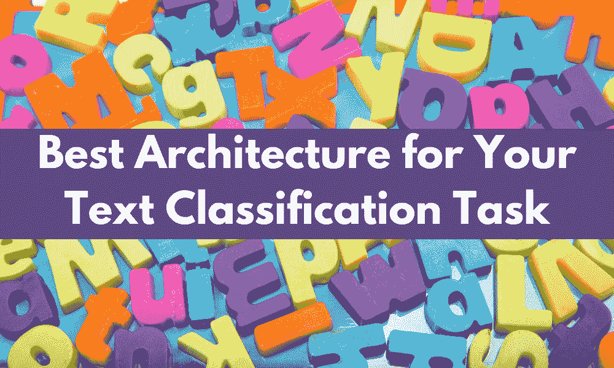
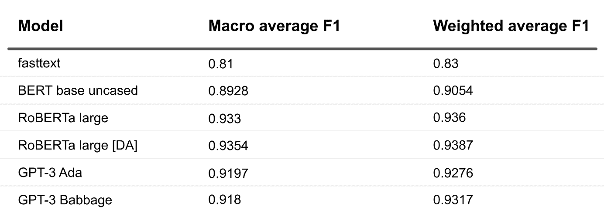
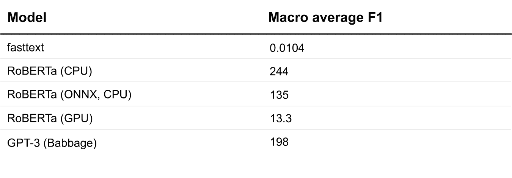

# 适合你文本分类任务的最佳架构：对比你的选择

> 原文：[`www.kdnuggets.com/2023/04/best-architecture-text-classification-task-benchmarking-options.html`](https://www.kdnuggets.com/2023/04/best-architecture-text-classification-task-benchmarking-options.html)

图片来源于编辑

在[我们之前的文章](https://medium.com/toloka/choosing-the-best-architecture-for-your-text-classification-task-aee30ecc7870)中，我们介绍了基于现代自然语言处理技术的文本分类模型的各种方法。

* * *

## 我们的前三个课程推荐

 1\. [Google 网络安全证书](https://www.kdnuggets.com/google-cybersecurity) - 快速进入网络安全职业生涯

 2\. [Google 数据分析专业证书](https://www.kdnuggets.com/google-data-analytics) - 提升你的数据分析技能

 3\. [Google IT 支持专业证书](https://www.kdnuggets.com/google-itsupport) - 支持你的组织 IT

* * *

在选择传统的 TF-IDF 方法、预训练嵌入模型和各种形状和大小的变换器时，我们希望根据自己的经验提供一些实用建议。哪些模型最适合不同的情况？你自己工作领域中可以找到哪些使用案例？

为了增加趣味性，我们想展示一个实际的基准测试示例，并使用我们为这篇快速跟进文章选择的数据集进行比较。

# 描述数据集和任务

为了说明我们的观点，我们选择了[Twitter 金融新闻](https://huggingface.co/datasets/zeroshot/twitter-financial-news-topic)，这是一个包含金融相关推文的英文数据集，并且附有注释。它通常用于构建金融相关内容分类模型，将推文分类到多个主题中。

这是一个中等规模的数据集，非常适合用来展示不同模型的表现。同时也相当多样化，这个规模让我们可以相对快速地训练和评估模型。

这个领域有趣的地方在于金融语言通常简练且简洁。存在大量描述品牌、术语和相关实体的专有名词，模型需要学会将它们与含义完全不同的普通名词区分开来。直观地，微调预训练的通用语言模型在这个领域应该能提升整体性能和准确性。

该数据集包含大约 21,000 条记录。既不太小也不太大，非常适合展示每种模型和方法的优缺点。等我们得到结果后再来回顾一下。

最终，数据集有 20 个类别。这不是一个常见的分类任务，你需要区分少数几个情感类别和情感色调。还有一个不平衡的问题。最频繁和最少见的类别之间有 60 倍以上的差异，一些方法可能表现不佳。

让我们看看不同模型在我们的基准测试中的表现如何。

# 描述方法

基于我们之前的文章，FastText、BERT、RoBERTa（经过二阶段调整）和 GPT-3 是我们用来评估其性能和效率的选择。数据集被拆分为训练集和测试集，分别包含 16,500 和 4,500 个项目。在对前者进行模型训练后，我们在后者上测量了模型的性能和效率（推理时间）。

为了训练一个 FastText 模型，我们使用了[fastText 库](https://fasttext.cc/)及相应的命令行工具。我们通过在文本中插入带有正确前缀的标签来准备数据集，运行 fasttext 监督命令以训练分类器，并在仅有 CPU 的机器上等待几分钟以生成模型。接下来的命令 fasttext predict 给出了测试集的预测结果和模型性能。

对于变换器模型，我们选择了三种稍有不同的模型进行比较：BERT（更正式，best-base-uncased）、RoBERTa-large，以及后者的一个改编版本，该版本针对几个金融相关数据集的情感分类进行了调整（在[HuggingFace 网站](https://huggingface.co/Jean-Baptiste/roberta-large-financial-news-sentiment-en)查看）。我们在实验中使用了变换器库，尽管这需要编写一些代码来实际运行训练和评估程序。一台配备 A100 GPU 的单机进行了训练，直到每个模型满足早期停止条件，这一过程耗时 20 到 28 分钟。训练好的模型被存储在 MLFlow 注册表中。

为了训练基于 GPT-3 模型的分类器，我们参考了[官方文档](https://platform.openai.com/docs/guides/fine-tuning/advanced-usage)并使用相应的命令行工具提交数据进行训练，跟踪其进展，并为测试集进行预测（更正式地说，生成模型的“补全”）。由于工作本身发生在 OpenAI 的服务器上，我们没有使用任何特定的硬件。只需一台普通的笔记本电脑即可创建基于云的模型。我们训练了两个 GPT-3 变体，Ada 和 Babbage，以查看它们是否表现不同。在我们的场景中，训练一个分类器需要 40 到 50 分钟。

训练完成后，我们在测试集上评估了所有模型以建立分类指标。我们选择了宏平均 F1 和加权平均 F1 来进行比较，因为这让我们可以估计精度和召回率，并查看数据集不平衡是否影响了指标。我们还比较了模型的推理速度，单位为每个项目的毫秒，批处理大小为一。在 RoBERTa 模型中，我们还包括了一个 ONNX 优化版本以及使用 A100 GPU 加速器的推理。从我们调优后的 Babbage 模型测得的平均响应时间给出了 GPT-3 的速度（注意，OpenAI 应用了一些速率限制器，因此实际速度可能会因使用条款而有所不同）。

# 结果

训练效果如何？我们将结果整理在几个表格中，以展示最终产品以及我们观察到的效果。

作者照片

首先引起我们注意的是 fasttext 的表现远远落后。尽管如此，它在计算、时间和训练方面所需的资源极少，为我们提供了一个低标准的基准。

变换器的表现如何？正如预期的那样，RoBERTa 的结果优于 BERT，这可以很容易归因于其规模优势。RoBERTa 在特定领域的分类任务中通常表现更好。公平起见，我们为这次比较特别选择了一个大型的 RoBERTa 架构，而基础的 RoBERTa 模型可能与 BERT 的表现相当，尽管在底层语料库和训练方法上有所不同。

BERT 和 RoBERTa 之间 F1 指标的明显差距可能也与我们处理的类别数量相当大有关。数据集存在的不平衡往往会被较大的模型更好地捕捉。但这只是我们的猜测，验证这一点需要更多的实验。你还可以看到，领域预训练的 RoBERTa 提供了一个微小的准确性提升，但这一提升并不显著。很难说预训练的领域调整模型是否对我们的实验真正有价值。

接下来是 GPT-3。我们选择了 Ada 和 Babbage 模型，以便与 BERT 和 RoBERTa-large 进行公平比较，因为它们具有出色的参数规模，这些参数规模逐步增长（从 BERT 的 1.65 亿参数和 RoBERTa-large 的 3.55 亿参数到 Ada 的 27 亿参数和 Babbage 的 67 亿参数），并可以展示模型大小是否确实带来了比例性能提升。令人惊讶的是，Ada 和 Babbage 提供的指标几乎相同，而且即使没有领域特定的预训练，它们实际上也不如 RoBERTa。然而，这其中有原因。请记住，GPT-3 API 可访问的模型实际上为用户提供了生成性推理接口，因此它们试图预测一个标记来对分类任务中的每个示例进行分类。另一方面，RoBERTa 和其他变换器模型的架构的最后一层已正确配置用于分类。想象一下，在最后的 Logit 或 Softmax 中，返回你传递给它的任何数据项的所有类别的可能性。虽然巨大的 GPT-3 足以通过生成正确的标记类别来处理 20 个类别中的一个，但在这里显得有些过剩。我们不要忘记，GPT-3 模型经过微调，并且只需三行代码即可访问，而 RoBERTa 则需要在你的架构上进行工作。

作者提供的照片

现在，让我们最终比较这些模型及其推理设置在请求执行速度方面的表现。由于我们不仅仅是在训练它们以提高性能和准确性，我们还需要考虑它们为新数据返回推理结果的速度。我们记录了对模型的在线同步请求，并尝试了解每个模型的最佳定位。

这里的赢家是 fasttext。然而，它的准确性迫使我们继续往下看。

在 RoBERTa 和 GPT-3 设置之间，我们可以看到，尽管 GPT-3 是最大的，但它的速度相对较快，特别是考虑到它的响应时间包括了到 API 端点的双向网络通信。这里的实际推理很小。这显然是好的，尤其是因为这是一个相对简单的解决方案，可以设置、微调并实现模型调用。虽然它可能很昂贵，特别是如果你计划频繁发送大量数据，但成本效益的决策还是取决于你自己。

GPU 托管版本在 RoBERTa 设置中是赢家。GPU 大大提升了推理计算的性能，但将模型服务器托管在 GPU 机器上可能会超出你的预算。推出基于 GPU 的模型服务器也可能很棘手，特别是如果你之前没有做过这种事情的话。

你还需要记住，尽管这些基准测试在返回模型请求结果方面都很快速，但你不应忘记进行一些规划，细化你计划如何在项目中使用这些模型。实时推理还是异步批量请求？通过互联网访问还是在本地网络内？你是否在模型响应之上还有业务逻辑操作的开销？所有这些都会在每次请求中增加比实际模型推理计算本身更多的时间开销。

# 结论与后续想法

我们学到了什么？我们尝试展示一个实际例子，平衡运行各种模型的难度、其准确性指标以及它们准备使用时的响应速度。显然，根据你的项目确定何时使用什么以及如何使用是一个挑战。但我们希望能给你一些指导？—— 在 GPT 模型方面没有万灵药。尤其是在机器学习中，我们都必须精打细算。 

在 Toloka，我们正在努力开发一个平台，使用户能够使用与 GPT-3 API 相同的三个 API 调用来训练、部署和使用像 RoBERTa 这样的转换器。

在我们的下一篇文章中，我们将进行更多的实验，研究如何缓解数据集不平衡的影响，并进行上采样或下采样以实现平衡。我们怀疑 GPT-3 生成模型的表现会优于 RoBERTa-large。我们还将讨论如果使用一个更小的数据集，这些结果可能会如何变化，并指出 GPT-3+模型在分类任务中何时何地会超越其他模型。敬请关注，并查看我们在 Toloka ML 团队博客上的更多工作。

**[亚历山大·马卡罗夫](https://www.linkedin.com/in/makaroval)** 是 Toloka.ai 的高级产品经理，负责 Toloka.ai ML 平台的产品开发，曾是健康科技创业者和 Droice Labs 的共同创始人。

### 更多相关内容

+   [什么是文本分类？](https://www.kdnuggets.com/2022/07/text-classification.html)

+   [机器学习不像你的大脑 第三部分：基本架构](https://www.kdnuggets.com/2022/06/machine-learning-like-brain-part-3-fundamental-architecture.html)

+   [数据网格及其分布式数据架构](https://www.kdnuggets.com/2022/02/data-mesh-distributed-data-architecture.html)

+   [KDnuggets™ 新闻 22:n07，2 月 16 日：如何为机器学习学习数学…](https://www.kdnuggets.com/2022/n07.html)

+   [数据网格架构：重新定义数据管理](https://www.kdnuggets.com/2022/05/data-mesh-architecture-reimagining-data-management.html)

+   [KDnuggets 新闻，5 月 18 日：5 个免费的机器学习托管平台…](https://www.kdnuggets.com/2022/n20.html)
