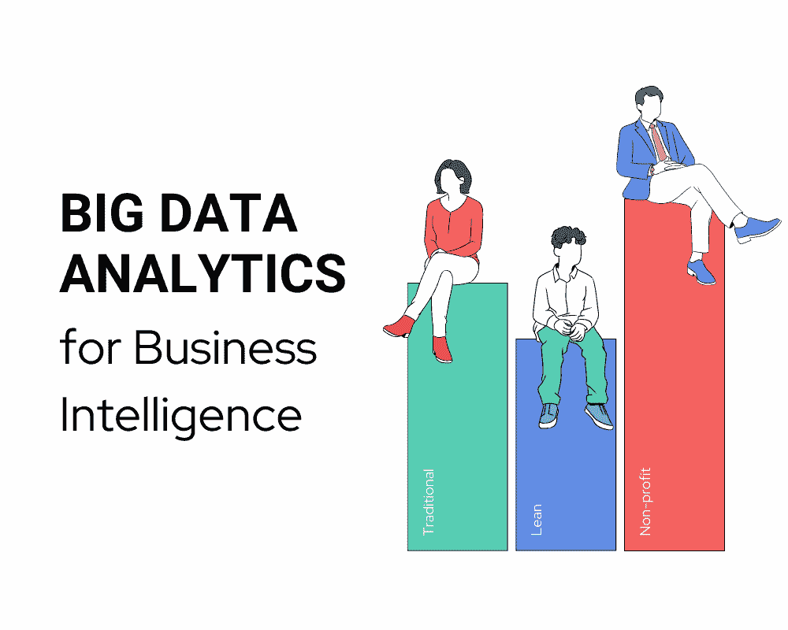

# 大数据分析：为什么它对商业智能如此关键？

> 原文：[`www.kdnuggets.com/2023/06/big-data-analytics-crucial-business-intelligence.html`](https://www.kdnuggets.com/2023/06/big-data-analytics-crucial-business-intelligence.html)

编辑图像

人们常常误解大数据与商业智能之间的关系。在大多数情况下，你的商业智能解决方案已经在某种程度上使用了大数据分析。如果没有，那么这是你必须解决的一个巨大盲点。

但为什么大数据分析对现代企业如此重要？为什么你应该将其作为你的商业智能流程或技术栈的一部分？本指南将回答这两个问题及更多问题。但首先，让我们了解这些术语的含义，以便你能更好地理解它们如何以及在哪里适用。

# 什么是大数据分析？

随着越来越多的公司和行业开始拥抱技术，数字化转型支出预计到 2026 年将达到[$3.4 万亿](https://www.statista.com/statistics/870924/worldwide-digital-transformation-market-size/)。我们已经看到对技术的依赖不断增加，没有哪个行业能够免于这种变化。例如，根据[GetWeave](https://www.getweave.com/industry/dentistry/)进行的一项最新研究，98%的医疗服务提供者一致认为技术在提供卓越客户体验方面发挥了至关重要的作用。

所有这些技术和数字化转型开辟了数据收集的新途径。截至 2023 年，全球每天生成的至少有[3.5 quintillion 字节的数据](https://earthweb.com/how-much-data-is-created-every-day/)。这种大量收集的原始数据被称为大数据。

这些数据并非所有对企业都有用，通常，数据量太大，无法由传统的数据处理软件处理。在大多数大数据可以以有意义的方式使用之前，它必须经过排序、过滤甚至标记。这些过程构成了大数据分析的重要部分。

一些最常用的大数据技术和工具包括：

+   数据存储和处理（Hadoop）

+   数据供应和分发（Cassandra）

+   流分析工具

+   预测分析软件

+   数据湖

+   知识发现

+   数据挖掘工具

+   内存数据布置解决方案

+   数据虚拟化

+   数据清洗

+   集群计算框架

正如你所见，许多这些工具也被用于商业智能中。

# 什么是商业智能？

商业智能（BI）描述了使用技术从商业数据中提取可操作见解的过程。这些见解随后被可视化并呈现给公司高管，使他们能够基于实证数据做出明智的决策。

商业智能（BI）常常与商业分析（business analytics）混淆，这也是大数据分析被误解为 BI 的原因之一。然而，商业智能旨在通过利用旧数据和新数据来获得当下的成功，而商业分析则关注于当前数据与过去数据之间的联系，以预测未来数据（即业务的未来）。

这两种方法都可以利用大数据分析来实现目标，但让我们重点关注商业智能。它涉及到一系列分析流程和解决方案，例如（但不限于）：

+   数据挖掘

+   预测分析

+   统计分析

+   大数据分析

+   数据可视化软件

+   关键绩效指标（KPI）

+   性能基准软件

+   查询软件

+   实时分析软件

通过实施[有效的 BI 战略](https://www.netsuite.com/portal/resource/articles/erp/business-intelligence-strategy.shtml)，公司可以提升访问和利用关键数据的能力。最终，BI 可以通过确保所有商业决策都以事实数据为基础，来提高公司整体盈利能力。它还可以帮助公司改善内部流程，从而使其运营更加优化。

你可以利用商业智能来揭示市场趋势，发现新的收入来源，识别被忽视的业务问题。大数据分析可以成为你组织 BI 战略的一个基本组成部分。

照片来源：[Pexels](https://www.pexels.com/photo/focused-professional-man-using-laptop-7567529/)

# 大数据分析在商业智能中的应用案例

大数据分析可以作为你商业智能战略的一部分，以下是几种应用方式：

## 产品开发和改进

新产品开发描述了一个产品的生命周期，从其创意到市场推广。你对产品开发的处理方式将取决于你使用的模型。例如，数据分析是 Roozenburg 和 Eekels 简单的 3 阶段新产品设计（NPD）模型中的第一步。

无论你选择哪种模型，基础步骤都需要进行严格的研究。这适用于产品改进或引入现有产品变体。

如今，大多数企业都有全球化的愿景，因为这为它们提供了更多的财务机会和激励。然而，这也需要更[深入的市场研究](https://blog.hubspot.com/marketing/market-research-buyers-journey-guide)，包括从调查、网站跟踪数据（cookies）、信用报告统计等获取的数据。

消费者的态度和需求不断演变，有些需求可能是季节性的。因此，你的数据池会不断增长和更新，实际上变成了大数据。你需要一个能够排序、处理和发现模式的大数据分析系统，其速度几乎与数据生成的速度相当。

商业智能软件可以以更可管理的方式呈现所有模式和统计数据。组织可以利用这些数据制定提案、蓝图和新产品设计和改进计划。他们还可以利用这些信息来确定运营和材料需求，并[做出更精确的](https://www.entrepreneur.com/business-news/are-there-fewer-chips-in-your-favorite-snack-bag-yes-and/422407)开发成本估算。

## 价格优化

如果公司能够在早期阶段计算开发成本，他们可以更准确地定价产品；这对于已建立的产品也是如此。

你的大数据应该包含指示当前全球经济气候与购物趋势之间联系的模式。例如，为了在 2022 年和 2023 年保持竞争力，公司们开始减少包装产品的总单位和质量。例如，一袋 500 克的薯片会被[减少到 450 克](https://www.entrepreneur.com/business-news/are-there-fewer-chips-in-your-favorite-snack-bag-yes-and/422407)但以相同的价格出售。这被称为缩水通货膨胀。

图片来源：[Brett Jordan](https://www.flickr.com/photos/x1brett/52021456034)

大数据分析与商业智能相结合，可以帮助公司判断是提高价格还是通过其他方式弥补增长的成本会更有利。此外，它还将帮助你确定现有的产品线是否值得继续保留。

流媒体和电视制作也可以从大数据分析中受益。通过结合当前的时代精神、流媒体行为和民意调查，这些公司可以在决定取消哪些节目和保留哪些节目时做出更有效的决策。

例如，我们看到整批 Netflix 订阅者因为某个节目被取消而离开了这个流媒体巨头。Parrot Analytics 进行的一项研究发现，《青少年正义联盟》是 2023 年[最受欢迎的系列之一](https://tv.parrotanalytics.com/US/young-justice-hbo-max)。然而，HBO Max 在 2022 年底取消了它。

这告诉我们许多决策并没有完全基于信息。大数据分析和商业智能可以防止你的公司犯同样的错误。

## 供应链管理

创建者：[fatmawatilauda70555](https://www.vecteezy.com/vector-art/3267087-global-logistics-network-with-world-map-and-transportation)

2021 年和 2022 年经历了巨大的供应链中断，这也是当前通货膨胀的许多因素之一。许多零售商使用即时库存管理解决方案，尽管它可能很高效，但对供应链中断几乎没有保护。

大数据分析和商业智能可以帮助公司部署更灵活的库存和供应链管理。它们可以提供实时数据，然后由机器学习驱动的 BI 解决方案进行解释，以提供预测分析。

这可以帮助公司保护自己免受供应链中断的影响，因为这些供应链数据不仅限于可用的原材料或制造能力。它还考虑了天气、自然灾害导致的运输延误、购物趋势、定价、经济气候等。

你还可以利用这些信息在需求减少时减少库存，避免浪费。因此，它可以使你的 JIT 库存管理系统更为优化。

## 渠道分析

我们已经涵盖了大数据分析和商业智能如何结合来自各种渠道的信息，帮助企业[改善其新产品设计和开发](https://www.techtarget.com/searchbusinessanalytics/feature/6-big-data-benefits-for-businesses)、价格优化和供应链管理。

但你如何确定每个渠道的质量和信息的完整性呢？渠道有很多种，而且不仅限于网络渠道。其他渠道可能包括客户支持电话、邮寄邮件、商店或分支机构位置等。

企业可以利用大数据分析和商业智能进行渠道发现。它们还可以揭示渠道的完整性、质量和效率，以及这些渠道如何与系统集成。最终，你可以把它看作是大元数据，因为它是关于你大数据的数据。通过确认你收集数据的渠道，你实际上是在确认你大数据的质量。

# 结论

大数据分析市场预计到 2029 年将达到[超过 6500 亿美元](https://www.globenewswire.com/en/news-release/2022/07/21/2483358/0/en/With-13-4-CAGR-Big-Data-Analytics-Market-Size-Worth-USD-655-53-Billion-by-2029.html)。这并不令人惊讶，因为本指南已经展示了大数据分析如何用于丰富商业智能的多种方式。更多公司应该志在成为数据优先型企业，凭借如 Datapine 等公司提供的大数据分析商业智能解决方案，这应该比以往任何时候都更容易。

**[Nahla Davies](http://nahlawrites.com/)** 是一名软件开发人员和技术作家。在全职从事技术写作之前，她曾担任 Inc. 5,000 经验品牌组织的首席程序员，该组织的客户包括三星、时代华纳、Netflix 和索尼。

### 相关阅读

+   [开发有效编码习惯的 5 个关键步骤](https://www.kdnuggets.com/2023/08/5-crucial-steps-develop-effective-coding-routine.html)

+   [对话式人工智能开发中的 3 个关键挑战及其规避方法](https://www.kdnuggets.com/3-crucial-challenges-in-conversational-ai-development-and-how-to-avoid-them)

+   [在不到 6 个月的时间内成为商业智能分析师](https://www.kdnuggets.com/become-a-business-intelligence-analyst-in-less-than-6-months)

+   [机器学习为何无法为我的业务带来价值？](https://www.kdnuggets.com/2021/12/machine-learning-produce-value-business.html)

+   [人工智能如何改变数据整合](https://www.kdnuggets.com/2022/04/artificial-intelligence-transform-data-integration.html)

+   [从人工智能到机器学习再到……的演变](https://www.kdnuggets.com/2022/08/evolution-artificial-intelligence-machine-learning-data-science.html)
