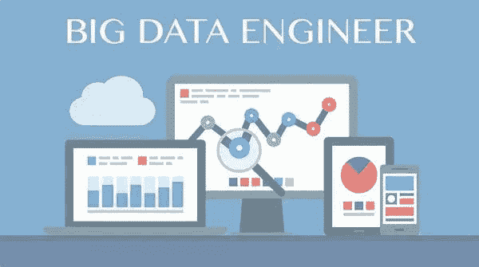

# 旅行时需要了解的大数据工程热潮中的事项

> 原文：[`www.kdnuggets.com/2018/10/big-data-engineering-hype-train.html`](https://www.kdnuggets.com/2018/10/big-data-engineering-hype-train.html)

 评论

**由[Wojciech Pituła](https://www.linkedin.com/in/krever/)，高级软件开发工程师**

### 为什么？

* * *

## 我们的三大课程推荐

 1\. [谷歌网络安全证书](https://www.kdnuggets.com/google-cybersecurity) - 快速进入网络安全职业生涯。

 2\. [谷歌数据分析专业证书](https://www.kdnuggets.com/google-data-analytics) - 提升你的数据分析水平

 3\. [谷歌 IT 支持专业证书](https://www.kdnuggets.com/google-itsupport) - 支持你所在组织的 IT

* * *

半年前，我在从事了三年的各种数据管道创建工作后离开了大数据领域。现在，我希望在这些知识变得完全过时之前分享我在这段时间积累的知识。本文尝试指出一些如果你要成为我的同事你需要了解的事情。这些也是我在前公司面试大数据工程师职位时询问候选人的问题。

我会尽量不仅指出相关问题，还简要回答其中一些问题。重要的是要记住，这些答案距离全面理解还有很大距离，要真正理解这个主题，你需要自己研究。

如果你对这些问题中的某些问题不了解，不要害怕。对这些主题的完全理解是高级开发人员的要求。对于中级或初级职位，掌握子集即可。

### 分析 vs 科学 vs 工程

这是一个非常热门的问题：数据科学、数据分析和数据工程之间有什么区别。这也是一个相当难以回答的问题。以下是我的理解：

+   数据分析师 - 指查看数据并尝试基于数据回答一些业务问题的人。他通常使用商业智能工具或只是 MS Excel。

+   数据科学家 - 指处理原始数据，结合各种数据源，进行基本数据处理，将数据输入机器学习模型，调整这些模型，并总体上尽可能从原始数据中获取最大价值的人。他通常使用 Python、R、Matlab、tensorflow 等工具。

+   数据工程师 - 一种专注于数据转换的软件开发人员。他的工作是获取数据并使其对业务有用，同时也要确保其长期可维护。这一广泛的描述涵盖了从各种来源（ELK、Splunk、Hadoop、Kafka、Rest APIs、对象存储等）提取数据、转换数据并提供以满足业务需求。他通常与数据科学家密切合作，以了解数据管道应如何构建、使用哪个 ML 模型等等。

有关更详细的比较以及“机器学习工程师”的介绍，你可以查看 [这篇精彩的文章](https://www.oreilly.com/ideas/data-engineers-vs-data-scientists)。

以下段落描述了数据工程师所需的知识，但这也与数据科学家相关，因为他们使用类似的工具集，但方式不同。

### 编程语言

为了高效地开发数据管道，你需要熟练掌握以下至少一种语言：**Scala**、**Java**、**Python**。

选择真的取决于你之前的经验和你的工作场所偏好。如果你现在在考虑学习哪一个，我会推荐**Scala**。它是 Spark 开发的主要语言，具有最多的示例，并且最具表现力。由于它具有函数式和强类型的特性，它也是最安全的。

无论你选择哪种语言，你都需要对 JVM 有基本的了解，因为它是最流行的数据处理平台。你需要能够诊断和调试 JVM 上发生的问题。这里有几个需要了解的事项：

+   你会如何处理抛出的 `OutOfMemoryException`？

+   什么是垃圾收集器？有哪些垃圾收集器可用，它们之间有什么区别？

+   如何使用性能分析器找出性能瓶颈？

+   如何将调试器连接到远程 JVM？

### Hadoop 生态系统

Apache Hadoop 是大数据工程师的最基本工具集。你不需要了解每个工具的所有细节，但了解它们的基本工作原理很重要，这样你才能有效沟通，并在需要时知道该学习什么。

+   什么是 Apache Hadoop？ - 它是一组不同的工具，而不是一个单一的工具。这个生态系统中最流行的部分是 HDFS、Yarn、Hive、HBase 和 Oozie。

+   什么是 HDFS？ - 它是一个分布式文件系统，用于在集群中存储数据。

    +   什么是 namenode 和 datanode？

    +   什么是复制因子？

    +   什么是块大小？它如何影响性能和应用开发？

    +   我们可以使用哪些安全机制来限制对集群上数据的访问？什么是 Kerberos？

+   什么是 Yarn？ - 它是一个资源管理器，负责为计算作业分配内存和核心。

    +   什么是调度程序，默认情况下有哪些调度程序？

    +   什么是队列？

+   什么是 Hive？ - 它是 HDFS 上的一层 SQL。

    +   Hive、hiveserver2、metastore 和 beeline 之间有什么联系？

    +   Hive、Pig 和 Impala 之间有什么区别？

    +   什么是 UDFs？

+   什么是 HBase？ - 它是一个构建在 HDFS 之上的 NoSQL 数据库。

    +   它与 Cassandra 的比较如何？

    +   它如何适应 CAP 定理？

+   什么是 Oozie？ - 它是一个工作流管理器，用于创建数据管道。

    +   有哪些替代方案？

+   你知道哪些序列化格式？ - 最流行的有 Avro、orc、parquet、json 以及 Hadoop 对象和文本文件。

    +   什么是基于列的格式？它与基于行的格式有何不同？

### Apache Spark

Apache Spark 已成为处理数据时的首选工具。拥有一些经验是好的，但并不是关键。对我来说，这只是另一个暴露了一些 API 的工具，你需要学习它。一个有经验的开发者已经学会了数百个 API，不应对学习另一个 API 感到困扰。不过，即便没有实际经验，有一些事情值得了解。

+   什么是操作和转换？

+   有哪些部署模式？

+   跨越 JVM 边界时如何处理序列化和反序列化？RDD、Dataframe 和 Dataset API 之间有何不同？

+   什么是洗牌？它们什么时候发生，以及它们如何影响性能？

+   你如何进行有状态处理？无论是批处理还是流处理。

+   什么是 Spark 的替代方案？ - 这是可能最重要的问题。你应该对 MapReduce、Flink、Kafka Streams、Cascading/Scalding 以及不集群的数据处理工具如 bash 或一些简单的库（例如 fs2 或 Akka Streams）有基本了解。

### 非 Hadoop 工具

有时，了解那些与大数据没有直接关联的工具更为重要。数据工程师的一个关键技能是知道何时不使用大数据，而选择更简单的工具。

+   什么是 Apache Kafka？

    +   Kafka 已成为首选的数据流解决方案。迟早你会接触到它。

    +   什么是主题？

    +   什么是偏移量？

+   什么是 Redis？

    +   至少要了解一种内存数据库。创建最终数据集后，你需要知道如何使用它，并且在许多情况下，你需要快速服务它。

+   什么是 ELK 堆栈？

    +   总迟早你会需要某种搜索引擎或仪表盘解决方案。Elasticsearch 和 Kibana 是一个很好的开始。

+   你有多少 bash 经验？

    +   在许多情况下，你需要一个可以以最灵活、最省时的方式处理数据集的工具。你应该熟练使用如 grep、cat、jq 或 awk 等工具，这些工具可以让你在没有任何开销的情况下过滤、修改和聚合数据。它们不适合生产环境，但非常适合实验和快速寻找答案。

    +   创建 bash 脚本时你知道哪些最佳实践？

    +   这些专业领域可以通过掌握其他脚本技术如 python、ruby 或 ammonite 来提升。

+   什么是概率数据结构？

    +   当数据量超过某些阈值时，使用精确计算变得不再可行。在这种情况下，你应该了解一些基本的概率数据结构，例如布隆过滤器或 HyperLogLog，这些结构可以以受控的误差率计算诸如基数或集合成员资格等内容。

+   你知道哪些 SQL 数据库？它们有哪些限制？

    +   熟悉至少一个成熟的 SQL 数据库是有好处的。我敢打赌，至少 30%的大数据项目可以仅使用 Postgres，并抛弃所有的 Spark/Hadoop 代码。

### 摘要

这个列表并不全面，但可能不可能创建一个全面的列表。你潜在雇主的具体要求可能与此列表有很大不同，但能够回答这些问题将为你未来的发展奠定良好的基础。

如果有人希望通过回答这些问题或添加更多主题（内联或通过链接）来完善本文，请随时通过[GitHub repo](https://github.com/Krever/krever.github.io)提交 PR。

**简介： [Wojciech Pituła](https://www.linkedin.com/in/krever/)** 是索尼的高级软件开发工程师。

[原文](https://w.pitula.me/2018/data-engineer-must-know/)。已获授权转载。

**相关：**

+   构建数据科学团队的成功计划

+   你应该了解的 10 大大数据趋势

+   机器学习会超越大数据吗？

### 更多相关话题

+   [扩展你的网络数据驱动产品时需要知道的事项](https://www.kdnuggets.com/2023/08/things-know-scaling-web-datadriven-product.html)

+   [你不知道的低代码工具的 7 种用途](https://www.kdnuggets.com/2022/09/7-things-didnt-know-could-low-code-tool.html)

+   [KDnuggets 新闻，4 月 13 日：数据科学家应该了解的 Python 库…](https://www.kdnuggets.com/2022/n15.html)

+   [你需要了解的 6 件关于数据管理的事及其重要性…](https://www.kdnuggets.com/2022/05/6-things-need-know-data-management-matters-computer-vision.html)

+   [你不知道的 SAS 数据科学学院的 3 件事](https://www.kdnuggets.com/2022/07/sas-3-things-didnt-know-sas-academy-data-science.html)

+   [构建 LLM 应用时需要了解的 5 件事](https://www.kdnuggets.com/2023/08/5-things-need-know-building-llm-applications.html)
