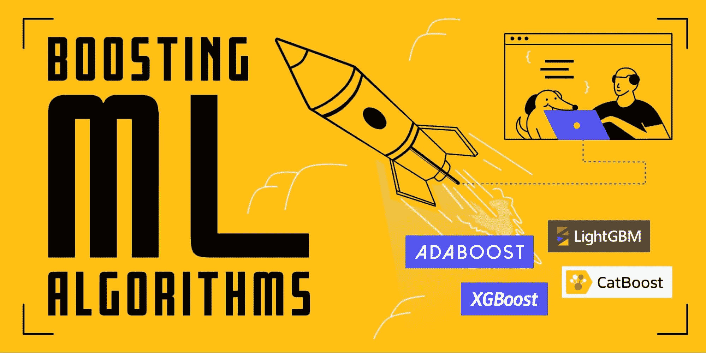
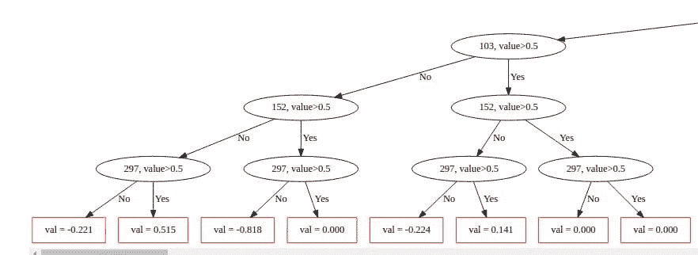

# 提升机器学习算法：概述

> 原文：[`www.kdnuggets.com/2022/07/boosting-machine-learning-algorithms-overview.html`](https://www.kdnuggets.com/2022/07/boosting-machine-learning-algorithms-overview.html)



在解决问题时，结合各种机器学习算法通常会得到更好的结果。这些单独的算法被称为弱学习器。它们的组合形成了一个强学习器。弱学习器是指在分类问题中比随机预测或回归问题中的均值更有效的模型。

* * *

## 我们的前三个课程推荐

 1\. [谷歌网络安全证书](https://www.kdnuggets.com/google-cybersecurity) - 快速进入网络安全职业生涯。

 2\. [谷歌数据分析专业证书](https://www.kdnuggets.com/google-data-analytics) - 提升你的数据分析技能

 3\. [谷歌 IT 支持专业证书](https://www.kdnuggets.com/google-itsupport) - 支持你的组织的 IT 需求

* * *

这些算法的最终结果通过在训练数据上拟合它们并结合它们的预测来获得。在分类中，结合是通过投票完成的，而在回归中则是通过平均来完成的。

几个机器学习算法的组合被称为**集成学习**。集成学习有多种技术。在本文中，我们将重点介绍提升。

*让我们开始学习——玩笑话！*

# 什么是提升？

提升是一种集成学习技术，它依次将较弱的学习器拟合到数据集中。每个后续的弱学习器都旨在减少前一个学习器产生的错误。

### 提升（Boosting）是如何工作的？

一般来说，提升的工作原理如下：

+   创建初始的弱学习器。

+   使用弱学习器对整个数据集进行预测。

+   计算预测误差。

+   错误预测会被赋予更多的权重。

+   构建另一个弱学习器，旨在修正前一个学习器的错误。

+   使用新的学习器对整个数据集进行预测。

+   重复这个过程直到获得最佳结果。

+   最终模型通过加权所有弱学习器的均值来获得。

# 提升算法

让我们来看看一些基于刚才讨论的提升框架的算法。

## AdaBoost

AdaBoost 通过逐个拟合弱学习器来工作。在随后的拟合中，它对错误预测给予更多权重，对正确预测给予较少权重。通过这种方式，模型学会了对难分类的样本进行预测。最终的预测是通过对多数类进行加权或求和得到的。学习率控制每个弱学习器对最终预测的贡献。AdaBoost 可以用于 [分类](https://scikit-learn.org/stable/modules/generated/sklearn.ensemble.AdaBoostClassifier.html) 和 [回归](https://scikit-learn.org/stable/modules/generated/sklearn.ensemble.AdaBoostRegressor.html#sklearn.ensemble.AdaBoostRegressor) 问题。

Scikit-learn 提供了一个 [AdaBoost 实现](https://scikit-learn.org/stable/modules/generated/sklearn.ensemble.AdaBoostClassifier.html)，你可以立即开始使用。默认情况下，算法使用 [决策树](https://scikit-learn.org/stable/modules/generated/sklearn.tree.DecisionTreeClassifier.html) 作为基础估计器。在这种情况下，将首先在整个数据集上拟合一个 `DecisionTreeClassifier`。在随后的迭代中，将对错误预测的实例给予更多权重进行拟合。

```py
from sklearn.ensemble import DecisionTreeClassifier, AdaBoostClassifier

model = AdaBoostClassifier(

DecisionTreeClassifier(),

n_estimators=100,

learning_rate=1.0)

model.fit(X_train, y_train)

predictions = rad.predict(X_test)
```

为了提高模型的性能，应调整估计器的数量、基础估计器的参数以及学习率。例如，可以调整决策树分类器的最大深度。

一旦训练完成，通过 `feature_importances_` 属性可以获得基于不纯度的特征重要性。

## 梯度树提升

梯度树提升是一种加法集成学习方法，它使用决策树作为弱学习器。加法意味着树一个接一个地添加。之前的树保持不变。在添加后续树时，使用 [梯度下降](https://scikit-learn.org/stable/modules/sgd.html) 来最小化损失。

构建梯度提升模型的最快方法是使用 [Scikit-learn](https://scikit-learn.org/stable/modules/ensemble.html#gradient-boosting)。

```py
from sklearn.ensemble import GradientBoostingClassifier

model = GradientBoostingClassifier(n_estimators=100, learning_rate=1.0, max_depth=1, random_state=0)

model.fit(X_train, y_train)

model.score(X_test,y_test)
```

该算法可以用于 [回归](https://scikit-learn.org/stable/modules/generated/sklearn.ensemble.GradientBoostingRegressor.html#sklearn.ensemble.GradientBoostingRegressor) 和 [分类](https://scikit-learn.org/stable/modules/generated/sklearn.ensemble.GradientBoostingClassifier.html) 问题。

## 极端梯度提升 - XGBoost

[XGBoost](https://xgboost.readthedocs.io/en/latest/) 是一种流行的梯度提升算法。它使用弱回归树作为弱学习器。该算法还进行交叉验证并计算特征重要性。此外，它接受稀疏输入数据。

XGBoost 提供了[ DMatrix](https://xgboost.readthedocs.io/en/latest/search.html?q=DMatrix&check_keywords=yes&area=default)数据结构，提高了其性能和效率。XGBoost 可用于[R](https://www.r-project.org/)、[Java](https://www.java.com/)、[C++](https://www.cplusplus.com/)和[Julia](https://julialang.org/)。

```py
xg_reg = xgb.XGBRegressor(objective ='reg:linear', colsample_bytree = 0.3, learning_rate = 0.1, max_depth = 5, alpha = 10, n_estimators = 10)

xg_reg.fit(X_train,y_train)

preds = xg_reg.predict(X_test)<
```

XGBoost 通过`plot_importance()`函数提供特征重要性。

```py
import matplotlib.pyplot as plt

xgb.plot_importance(xg_reg)

plt.rcParams['figure.figsize'] = [5, 5]

plt.show()
```

## LightGBM

LightGBM 是基于树的梯度提升算法，采用叶子-wise 树生长，而非深度-wise 生长。


[叶子-wise 树生长。](https://lightgbm.readthedocs.io/en/latest/Features.html?highlight=dart#leaf-wise-best-first-tree-growth)

该算法可用于分类和回归问题。LightGBM 通过`categorical_feature`参数支持分类特征。指定分类列后，无需进行独热编码。

LightGBM 算法也能处理空值。通过设置`use_missing=false`可以禁用此功能。它使用 NA 表示空值。要使用零值，请设置`zero_as_missing=true`。

目标参数用于决定问题的类型。例如，`binary`用于二分类问题，`regression`用于回归问题，`multiclass`用于多分类问题。

使用 LightGBM 时，你通常会先将数据转换为[LightGBM Dataset](https://lightgbm.readthedocs.io/en/latest/pythonapi/lightgbm.Dataset.html?highlight=lgb.Dataset)格式。

```py
import lightgbm as lgb

lgb_train = lgb.Dataset(X_train, y_train)

lgb_eval = lgb.Dataset(X_test, y_test, reference=lgb_train)
```

LightGBM 还允许你指定提升类型。可用选项包括随机森林和传统的梯度提升决策树。

```py
params = {'boosting_type': 'gbdt',

'objective': 'binary',

'num_leaves': 40,

'learning_rate': 0.1,

'feature_fraction': 0.9

}

gbm = lgb.train(params,

lgb_train,

num_boost_round=200,

valid_sets=[lgb_train, lgb_eval],

valid_names=['train','valid'],

)
```

## CatBoost

[CatBoost](https://catboost.ai/)是由[ Yandex](https://yandex.com/)开发的深度梯度提升库。在 CatBoost 中，使用不可知树生长平衡树。在这些类型的树中，进行左右分裂时使用相同的特征。



[使用相同特征进行左右分裂。](https://medium.com/p/38779b0d5d9a)

与 LightGBM 类似，CatBoost 支持分类特征、GPU 训练和处理空值。CatBoost 可用于[回归](https://catboost.ai/en/docs/concepts/python-reference_catboostregressor)和[分类](https://catboost.ai/en/docs/concepts/python-reference_catboostclassifier)问题。

在训练时设置`plot=true`可以可视化训练过程。

```py
from catboost import CatBoostRegressor

cat = CatBoostRegressor()

cat.fit(X_train,y_train,verbose=False, plot=True)
```

# 最终思考

在这篇文章中，我们涵盖了提升算法以及如何在机器学习中应用它们。具体来说，我们讨论了：

+   什么是提升？

+   提升是如何工作的。

+   不同的提升算法。

+   不同的提升算法是如何工作的。

祝你提升愉快！

## 资源

+   [集成学习指南](https://scikit-learn.org/stable/modules/ensemble.html)

+   [Kaggle 集成指南](https://web.archive.org/web/20150613065532/https://mlwave.com/kaggle-ensembling-guide/)

**[Derrick Mwiti](https://www.linkedin.com/in/mwitiderrick/)** 在数据科学、机器学习和深度学习方面经验丰富，并且对构建机器学习社区有着敏锐的洞察力。

### 更多相关主题

+   [线性机器学习算法：概述](https://www.kdnuggets.com/2022/07/linear-machine-learning-algorithms-overview.html)

+   [理解机器学习算法：深入概述](https://www.kdnuggets.com/understanding-machine-learning-algorithms-an-indepth-overview)

+   [终极指南：掌握季节性并提升业务成果](https://www.kdnuggets.com/2023/08/media-mix-modeling-ultimate-guide-mastering-seasonality-boosting-business-results.html)

+   [机器学习数据标注：市场概述、方法和工具](https://www.kdnuggets.com/2021/12/data-labeling-ml-overview-and-tools.html)

+   [机器学习评估指标：理论与概述](https://www.kdnuggets.com/machine-learning-evaluation-metrics-theory-and-overview)

+   [机器学习中使用的主要监督学习算法](https://www.kdnuggets.com/2022/06/primary-supervised-learning-algorithms-used-machine-learning.html)
