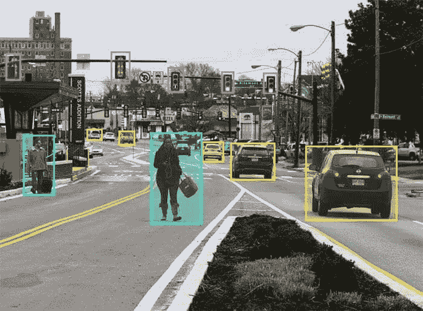

# 边界框深度学习：视频注释的未来

> 原文：[`www.kdnuggets.com/2022/07/bounding-box-deep-learning-future-video-annotation.html`](https://www.kdnuggets.com/2022/07/bounding-box-deep-learning-future-video-annotation.html)

边界框是一种计算机视觉中的注释类型，指的是在图像或视频中的对象周围绘制的框。边界框的坐标可以用来表示对象的位置、大小和方向。

* * *

## 我们的三大课程推荐

 1\. [谷歌网络安全证书](https://www.kdnuggets.com/google-cybersecurity) - 快速入门网络安全职业

 2\. [谷歌数据分析专业证书](https://www.kdnuggets.com/google-data-analytics) - 提升您的数据分析能力

 3\. [谷歌 IT 支持专业证书](https://www.kdnuggets.com/google-itsupport) - 支持您组织中的 IT

* * *

计算边界框的方法有多种，但最常见的方法是使用滑动窗口，即在图像上覆盖一个网格，并将每个网格单元分类为包含对象或不包含对象。如果分类器预测在给定的单元格中存在物体，则在该单元格周围绘制一个框。

边界框通常用于目标检测算法中，其目标是识别图像中的所有对象并为每个对象绘制一个框。它们还可以用于在视频数据中跟踪对象的变化。

# 如何使用边界框深度学习？

要理解边界框深度学习如何工作，首先需要了解深度学习的基础。深度学习是一种机器学习方法，利用人工神经网络从数据中学习。

神经网络类似于大脑，由一系列层组成，每层包含一组节点（或神经元）。网络的第一层节点接收来自数据的输入，后续层的节点接收来自前一层节点的信息。最终层的输出用于对数据进行预测。

为了训练深度学习模型，我们需要指定网络的结构（即层数和每层的节点数），然后在数据集上训练模型。训练过程会调整节点之间连接的权重，以使最终层的输出尽可能接近数据的实际标签。

一旦深度学习模型经过训练，就可以用来对新数据进行预测。为此，我们将新数据通过网络，并使用最终层的输出进行预测。

现在我们了解了深度学习的工作原理，让我们看看它如何用于边界框检测。

边界框深度学习模型通常由一个物体检测器和一个回归器组成。物体检测器负责识别图像中哪些像素属于物体，而回归器则负责预测围绕该物体的边界框坐标。

训练这些模型的最常见方法是先在包含许多不同物体的大型图像数据集上对物体检测器进行预训练。这可以通过使用深度学习模型，如卷积神经网络（CNN）来完成。一旦物体检测器经过训练，就可以用来识别新图像中的物体。

物体检测器的输出通常是一组围绕检测到的物体的边界框，以及每个边界框的置信度分数。

然后，回归器会在这些边界框上进行训练，以学习如何预测围绕物体的最紧密边界框的坐标。在物体检测器和回归器都经过训练后，它们可以结合成一个单一的模型，用于在新图像中检测和定位物体。

到目前为止，我们已经了解了边界框深度学习模型如何用于检测图像中的物体。然而，这些模型也可以检测视频序列中的物体。在这种情况下，模型将被训练以预测视频序列中每一帧的边界框坐标。

如你所见，边界框深度学习是检测和定位图像及视频中物体的强大工具。然而，像其他类型的深度学习一样，它也有其局限性。例如，这些模型通常受限于可用的训练数据，并且在大型数据集上训练它们可能需要很长时间。

此外，它们只能用于包含以前标记过的物体的图像或视频。这意味着如果你想使用这些模型来检测图像中的物体，你需要首先标记图像中的所有物体。

# 边界框深度学习的好处

实时物体检测：边界框深度学习的一个重要好处是它可以用于实时检测物体。这是因为物体检测器可以作为 CNN 实现，CNN 可以在 GPU 上运行以实现高效推理。但是，这种推理过程不足以实现实时物体检测。

**提高准确性：** 边界框深度学习模型可以比传统物体检测方法实现更高的准确性。这是因为回归器可以从许多边界框中学习，并产生更准确的预测。

**更快的训练：** 边界框深度学习模型的训练速度比传统的物体检测模型更快。这是因为 CNN 可以在许多图像上并行训练，从而加快训练过程。

这可以用比传统物体检测模型少得多的计算能力来完成。

**数据较少：** 边界框深度学习模型比传统物体检测模型需要更少的训练数据。这是因为卷积神经网络可以从许多图像中学习，从而减少了训练模型所需的数据量。

# 边界框深度学习的缺点

需要标注数据：边界框深度学习的一个重大缺点是它需要大量标注数据来训练模型。这可能非常昂贵且耗时，特别是如果目标是识别具有各种形状、大小和颜色的真实世界物体。

限于矩形形状：边界框深度学习的另一个缺点是局限于矩形形状。这意味着它可能无法准确检测到非矩形的物体。

**可能遗漏小物体：** 边界框深度学习的另一个潜在缺点是它可能会遗漏小物体。这是因为模型在固定大小和纵横比的图像上进行训练，因此可能无法准确检测到离相机较近或超出画框的小物体。

**可能难以处理遮挡：** 边界框深度学习也可能在处理遮挡或被其他物体部分遮挡的物体时遇到困难。这是因为模型在所有物体可见且未遮挡的图像上进行训练，因此可能无法准确检测到被其他物体覆盖的物体。

# 结论

**边界框深度学习是视频标注的未来吗？**

边界框深度学习具有多个优点，使其非常适合视频标注。特别是它在实时检测物体和用更少的数据提高准确性方面的能力，使其成为许多视频标注任务的有吸引力的选项。

然而，在使用这种方法之前应考虑一些缺点。

**Gaurav Sharma** 在人工智能和机器学习领域工作了六年以上。Gaurav 是一名自由技术作家，为 [Cogito Tech LLC](https://www.cogitotech.com/)、[Anolytics.ai](https://www.anolytics.ai/) 和其他提供训练数据的知名数据标注公司工作。

### 进一步了解此主题

+   [关于语义分割标注的误解](https://www.kdnuggets.com/2022/01/misconceptions-semantic-segmentation-annotation.html)

+   [快速指南：如何找到合适的标注人才](https://www.kdnuggets.com/2022/04/quick-guide-find-right-minds-annotation.html)

+   [封闭源与开源图像标注](https://www.kdnuggets.com/closed-source-vs-open-source-image-annotation)

+   [模型信心的探索：你能信任黑箱吗？](https://www.kdnuggets.com/the-quest-for-model-confidence-can-you-trust-a-black-box)

+   [文本到视频生成：逐步指南](https://www.kdnuggets.com/2023/08/text2video-generation-stepbystep-guide.html)

+   [聊天机器人转型：从失败到未来](https://www.kdnuggets.com/2021/12/chatbot-transformation-failure-future.html)
