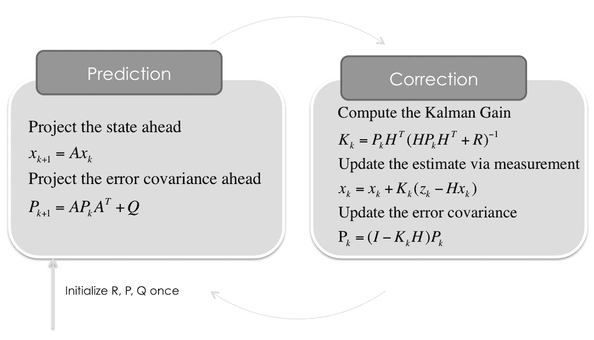
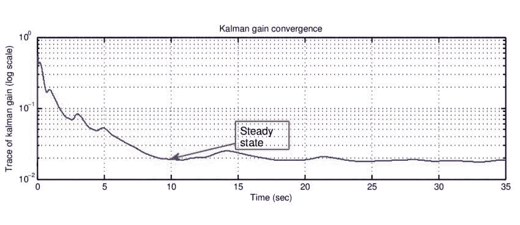
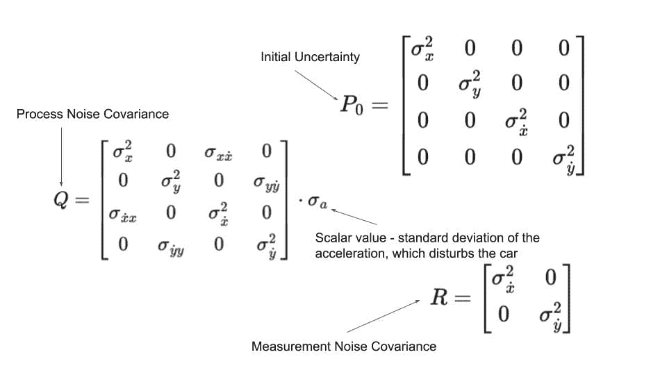
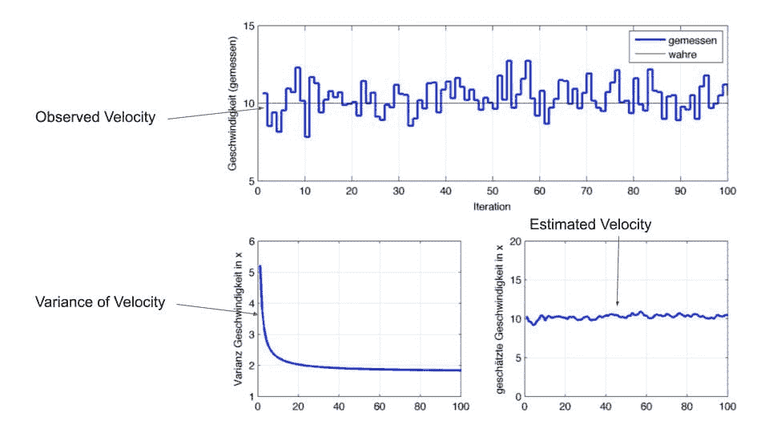

# 卡尔曼滤波器简要介绍

> 原文：[`www.kdnuggets.com/2022/12/brief-introduction-kalman-filters.html`](https://www.kdnuggets.com/2022/12/brief-introduction-kalman-filters.html)

# 介绍

* * *

## 我们的三大课程推荐

 1\. [Google 网络安全证书](https://www.kdnuggets.com/google-cybersecurity) - 快速进入网络安全职业

 2\. [Google 数据分析专业证书](https://www.kdnuggets.com/google-data-analytics) - 提升你的数据分析技能

 3\. [Google IT 支持专业证书](https://www.kdnuggets.com/google-itsupport) - 支持你的组织的 IT

* * *

你能测量核反应堆核心内部的温度以确保核反应受控吗？这肯定对任何目前制造的温度计来说都过于炎热。那么我们最好的选择是什么？最接近的是测量靠近核心的表面温度，并估算内部温度。

[图片由 snowing 提供，来自 Freepik](https://www.freepik.com/free-photo/business-finance-man-calculating-budget-numbers-invoices-financial-adviser-working_1202400.htm#query=estimation&position=22&from_view=search&track=sph)

让我们考虑另一个例子来内化这一概念：如果无法直接测量一个现象——例如，使用雷达技术测量飞行物体的确切位置时，考虑到空气密度、风向和风速的变化，你能做到吗？如果风向发生变化呢？与雷达设备相关的经验误差是否被考虑在内？

环境影响这些测量的准确性——如果环境没有控制，你会得到噪声较大的读数。因此，你需要一种能够滤除这些测量噪声并提供接近准确估计的方法，答案就在于卡尔曼滤波器。

# 为什么需要卡尔曼滤波器？

你可能在想，你的工作与上述示例和应用并不直接相关。那么，为什么你需要理解和学习卡尔曼滤波器呢？

好吧，也许你不直接处理核反应堆或雷达，但如果你想测量你车在一条长直路上向东移动的位置呢？当然，人们使用 GPS 技术来测量地球上任何物体的位置。然而，GPS 信号会受到卫星位置微小变化、热噪声、云层、尘土等影响。

里程表怎么样？它可以代替 GPS 吗？将里程表读数添加到最后已知的位置是一种简单的方法来了解当前位置。但事实证明，里程表读数受到车轮大小、轮胎气压等因素的影响。因此，里程表的读数对找到确切位置帮助不大。

你也可以使用 IMU（惯性测量单元）测量汽车的加速度，并通过双重积分得到距离，但这伴随有设备和数学误差。

因此，需要使用来自所有这些来源的读数来获得近乎完美的位置估计的卡尔曼滤波器。

# 理解卡尔曼滤波器算法

理解卡尔曼滤波器算法的内部需要对状态和观测等概念有深入了解。所以，让我们首先定义什么是状态。

[系统状态](https://en.wikipedia.org/wiki/State_variable) “描述了足够的信息来确定系统在没有任何外部力量影响系统的情况下的未来行为”。例如，汽车的实际位置是一个状态，它始终是隐藏的。因此，观测值，即里程表读数，用于估计这个状态。

考虑到这一点，让我们通过一个在直线中以恒定速度移动的汽车的例子来直观理解卡尔曼滤波器。注意，我们只能通过速度计观察到速度，而速度计可能会有噪声。假设速度是 10x+10y，这意味着在 x 方向上 10m/s，在 y 方向上 10m/s。假设有高斯噪声添加到其中，卡尔曼滤波器不知道这一点。

## 两步过程

卡尔曼滤波器的估计通常涉及两个步骤：

+   **预测：** 它涉及预测下一步的数量（汽车的位置）和误差协方差。

+   **修正：** 修正步骤涉及使用先前的预测计算卡尔曼增益，并结合预测和观测之间的误差来更新估计值和误差协方差。

上述过程的概述在此图示中以数学方式描述：

两步过程由 [balzer82 / Kalman](https://github.com/balzer82/Kalman)

这两个步骤对所有测量进行重复，直到卡尔曼增益稳定，如下所示：

图片来源于 [ResearchGate](https://www.researchgate.net/publication/267424725_Human_Motion_Tracking_and_Orientation_Estimation_using_inertial_sensors_and_RSSI_measurements)

## 估计

解决估计问题的第一步是对问题进行建模，即定义卡尔曼滤波器将要估计的状态向量。请注意，我们需要估计位置和速度，因此状态向量（xk）将包括这两个部分。由于行进距离等于方向上的速度和经过的时间，因此时间 k+1（xk+1）的状态定义如下。

状态转移矩阵 A（在卡尔曼术语中称为动态矩阵）将对象的当前状态转换为下一个状态，即它定义了状态如何转移。第二个组成部分是观察，由一个称为观察矩阵的矩阵 H 定义。因为你只观察恒定速度而不是位置，所以矩阵中只有 (1,3) 和 (2,4) 单元格的值为非零。

## 降低噪声

卡尔曼试图最小化噪声项，这些项在两步过程中由 P0、Q 和 R 表示。矩阵 P0 捕获与位置和速度相关的初始不确定性。矩阵 Q 捕获与环境因素如风或颠簸道路等相关的系统噪声。矩阵 R 吸收测量噪声或测量误差。

基于预测和校正过程的迭代更新，卡尔曼滤波器从恒定速度模型中去除噪声（上图），并呈现出右下图所示的效果。值得注意的是，输出速度估计的方差随时间减少。

来源：[卡尔曼滤波器简单解释 [第二部分]](https://www.cbcity.de/das-kalman-filter-einfach-erklaert-teil-2)

这描绘了卡尔曼滤波器如何从只有一个观察源，即速度的恒定速度模型中去除噪声。如果有多个噪声观察源，它的效果会更好。例如，如果你有噪声的里程计读数和速度读数，结果会更好。

# 总结

卡尔曼滤波器突出了估计的必要性，并用于一些噪声通过各种来源引入的应用中。文章通过一个二维运动的例子解释了卡尔曼滤波器的内部工作原理，以过滤这些噪声。

**[Vidhi Chugh](https://vidhi-chugh.medium.com/)** 是一位人工智能战略家和数字化转型领导者，致力于在产品、科学和工程的交汇点上构建可扩展的机器学习系统。她是一位屡获殊荣的创新领导者、作者和国际演讲者。她的使命是使机器学习民主化，并打破术语，使每个人都能参与这一变革。

### 相关主题

+   [关于 Papers With Code 的简要介绍](https://www.kdnuggets.com/2022/04/brief-introduction-papers-code.html)

+   [KDnuggets 新闻，4 月 27 日：关于 Papers With Code 的简要介绍；…](https://www.kdnuggets.com/2022/n17.html)

+   [神经网络的简要历史](https://www.kdnuggets.com/a-brief-history-of-the-neural-networks)

+   [关于 MLOps 的一切你需要知道的：KDnuggets 技术简报](https://www.kdnuggets.com/tech-brief-everything-you-need-to-know-about-mlops)

+   [使用 PyCaret 的二分类介绍](https://www.kdnuggets.com/2021/12/introduction-binary-classification-pycaret.html)

+   [使用 PyCaret 进行 Python 聚类的介绍](https://www.kdnuggets.com/2021/12/introduction-clustering-python-pycaret.html)
