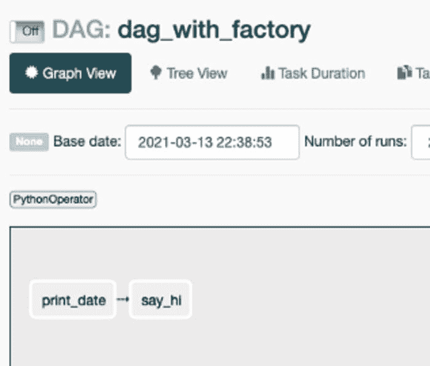
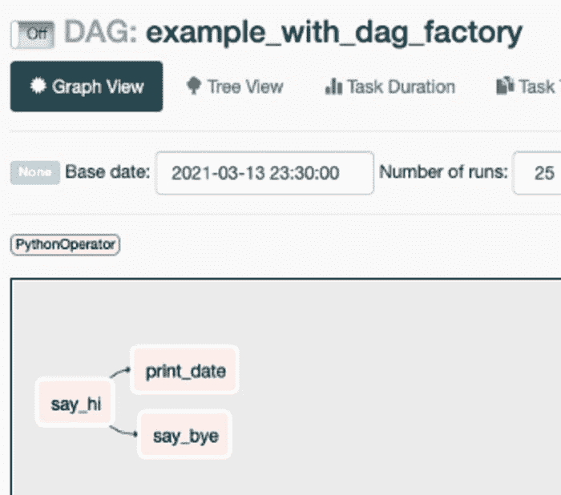

# 如何在 Airflow 上构建 DAG 工厂

> 原文：[`www.kdnuggets.com/2021/03/build-dag-factory-airflow.html`](https://www.kdnuggets.com/2021/03/build-dag-factory-airflow.html)

评论

**由[Axel Furlan](https://www.linkedin.com/in/axelfurlan/)，数据工程师**


图片由[Chris Ried](https://unsplash.com/@cdr6934?utm_source=medium&utm_medium=referral)提供，来自[Unsplash](https://unsplash.com/?utm_source=medium&utm_medium=referral)

* * *

## 我们的前三大课程推荐

 1\. [谷歌网络安全证书](https://www.kdnuggets.com/google-cybersecurity) - 快速进入网络安全职业生涯

 2\. [谷歌数据分析专业证书](https://www.kdnuggets.com/google-data-analytics) - 提升你的数据分析能力

 3\. [谷歌 IT 支持专业证书](https://www.kdnuggets.com/google-itsupport) - 在 IT 领域支持你的组织

* * *

### 为什么选择 DAG 工厂？

让我们看一个有 2 个任务的简单 DAG……

在 Airflow 中执行 2 个简单的 Python 脚本需要这么多的样板代码，难道不奇怪吗？无论你编写多少 DAG，你几乎都会发现自己在不同的 DAG 中编写几乎相同的变量，只是有细微的变化。

请记住，在编码中，通常**编写一段可以后续调用的代码，而不是每次需要该过程时都编写相同的代码**是更好的。这被称为[**DRY**](https://en.wikipedia.org/wiki/Don%27t_repeat_yourself)。

如果你许多 DAG 共享相似的值，例如*电子邮件地址*、*开始日期*、*调度间隔*、*重试次数*等，那么拥有一段代码来完成这些值可能更好。这就是我们尝试通过工厂类实现的目标。

使用 Airflow 上的 DAG 工厂，我们可以**将创建 DAG 所需的行数减少一半**。

### 让我们看一下以下示例

在这里，我们需要一个简单的 DAG，它会先打印今天的日期，然后打印“hi”。

这就是它在 Airflow 上的样子：



注意我们减少了多少冗余。我们没有指定使用了什么操作符、任务的 ID、调度间隔、DAG 的创建者或创建时间。

我们还可以看到，我们使用字典指定了任务和依赖关系，这最终转化为正确的任务依赖关系 ????

让我们看一个稍微复杂的示例：

在这个 DAG 中，我指定了 2 个我希望覆盖默认值的参数。它们是 DAG 的所有者及其重试次数。我还在`get_airflow_dag()`方法中指定了希望调度为每日执行。

这个 DAG 有 3 个任务。`say_bye()` 和 `print_date()` 都依赖于 `say_hi()`。让我们看看在 Airflow 中是如何表现的。



现在，让我们来看看如何构建 DAG 工厂 ????

### 如何编码？

说实话，这很简单。我们首先创建一个类，该类将包含我们创建 DAG 及其任务所需的所有方法。

以下是 DAG 工厂的完整代码。

我们将要调用的主要方法以获取一个完全可用的 DAG 是 `get_airflow_dag()`。

该方法将接收 2 个必填参数：DAG 的名称和它应该运行的任务。其余参数是可选的，因为我们可以在函数的实现中设置默认值。在实现时，可以根据你的用例将任何这些可选参数设置为必填参数，例如，可能会有用将 *cron* (`schedule_interval`) 设置为必填参数，或者甚至是 DAG 的所有者。

`default_args` 参数将是一个字典，用于保存任何你可能想要覆盖的键值对。如果未指定，将使用默认的 default_args。

在我们的例子中，默认值为：

```py
DEFAULT_ARGS = {
'owner': 'Data Engineer',
'depends_on_past': False,
'start_date': datetime(2021, 1, 1),
'email': ['data_engineers@company.com'],
'email_on_failure': True,
'email_on_retry': False,
'retries': 1,
'retry_delay': timedelta(minutes=5),
}
```

另外 3 个参数是用于描述 DAG 的主要参数。还有更多选项，可以自由指定更多。

`get_airflow_dag()` 将运行 `create_dag()` 以创建 DAG 对象并返回它。`add_tasks_to_dag()` 稍微复杂一些，因为我们希望让用户容易指定创建任务依赖关系的方式，而无需编写 *Operators*。

在我们的例子中，我们总是为任务使用 *PythonOperator*，因此我们认为将其作为规范是合理的。

这个实现旨在简化数据工程师的工作，因此我们避免设置额外的内容，比如任务的名称，我们仅假设它与函数名称相同——因此我们使用了一点 *反射* 来搞清楚。

```py
for func in tasks:
    task_id = func.__name__
    task = PythonOperator(
        task_id=task_id,
        python_callable=func,
        dag=dag
    )
    aux_dict[task_id] = taskfor func, dependencies in tasks.items():
    task_id = func.__name__
    for dep in dependencies:
        aux_dict[dep.__name__] >> aux_dict[task_id]
```

该函数首先创建一个辅助字典，以保存任务名称:任务对象的键值对。这是为了只拥有一组任务对象，并在以后用于设置依赖关系。然后，对于原始提供的任务字典中的每个键，使用辅助字典设置依赖关系。

在此操作完成后，DAG 对象准备好被返回并供团队使用 ????。

### 懂了！

文件中有一个小技巧，以便 Airflow 能够识别我们返回的是一个有效的 DAG。

当 Airflow 启动时，所谓的 DagBag 过程会解析所有文件以寻找 DAG。当前实现的工作方式大致如下：

+   DagBag 生成不同的进程，这些进程会检查 dag 文件夹中的文件。

+   名为 `process_file` 的函数 [这里](https://airflow.apache.org/docs/apache-airflow/stable/_modules/airflow/models/dagbag.html) 会为每个文件运行，以确定是否存在 DAG。

+   代码运行 `might_contain_dag`，根据文件中是否同时包含 “dag” 和 “airflow” 来返回 True。实现 [见这里](https://github.com/apache/airflow/blob/c61f3d45b4a1799e92ead1532d36f232ebc4686e/airflow/utils/file.py#L198)。

这就是为什么 `get_airflow_dag` 函数是这样命名的，以便在文件中包含两个关键字，从而确保文件被正确解析。

这是一件很难找到的事情，我花了很多小时试图弄清楚为什么我的 DAG 工厂不工作。关于如何以非传统方式创建 DAG 的文档不多，因此这是你在做类似事情时必须考虑的一个大坑。

### 结论

这篇简单的文章旨在解释如何通过在 Airflow 上利用 [工厂模式](https://www.tutorialspoint.com/design_pattern/factory_pattern.htm) 来简化数据工程师的工作。

希望你喜欢！可以点击我的个人资料，查看其他有用的 Airflow 和数据工程文章！

**简历： [Axel Furlan](https://www.linkedin.com/in/axelfurlan/)** 是来自阿根廷的**数据工程师**和软件工程专业的学生。Axel 起初是数据科学家，然后将软件工程与数据结合起来，爱上了这个角色的多样性。他写作的目的是为了让其他数据工程师的生活更轻松。

[原文](https://towardsdatascience.com/how-to-build-a-dag-factory-on-airflow-9a19ab84084c)。经允许转载。

**相关：**

+   2021 年数据科学学习路线图

+   成为数据工程师所需的 9 项技能

+   使用 NumPy 和 Pandas 在更大的图上加速机器学习

### 更多相关话题

+   [5 个 Airflow 替代方案用于数据编排](https://www.kdnuggets.com/5-airflow-alternatives-for-data-orchestration)

+   [5 分钟内构建机器学习 Web 应用](https://www.kdnuggets.com/2022/03/build-machine-learning-web-app-5-minutes.html)

+   [如何作为初学者建立强大的数据科学作品集](https://www.kdnuggets.com/2021/10/strong-data-science-portfolio-as-beginner.html)

+   [构建供应链管道所需的 6 种数据科学技术](https://www.kdnuggets.com/2022/01/6-data-science-technologies-need-build-supply-chain-pipeline.html)

+   [5 分钟内用 Python 构建一个网页爬虫](https://www.kdnuggets.com/2022/02/build-web-scraper-python-5-minutes.html)

+   [天高地厚：了解 JetBlue 如何使用 Monte Carlo 和 Snowflake…](https://www.kdnuggets.com/2022/12/monte-carlo-jetblue-snowflake-build-trust-improve-model-accuracy.html)
