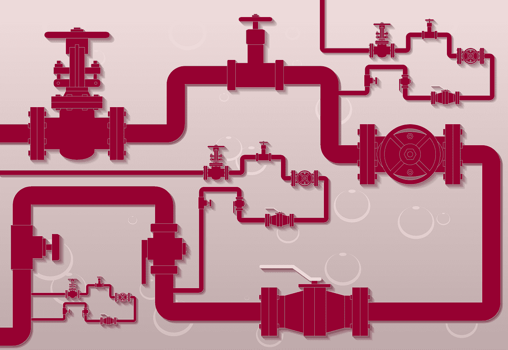
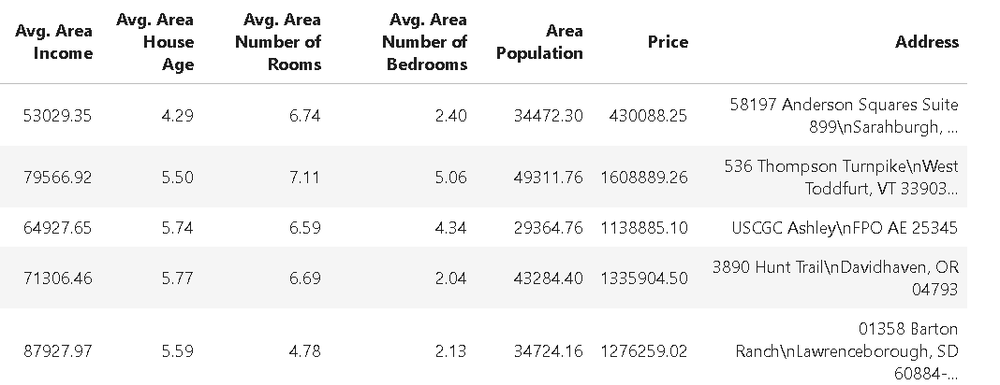
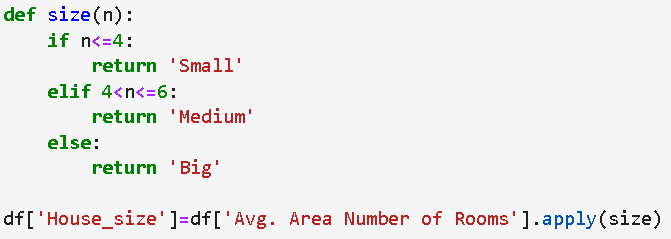
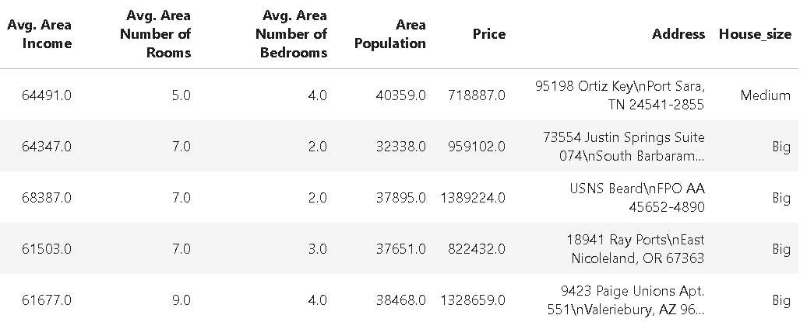
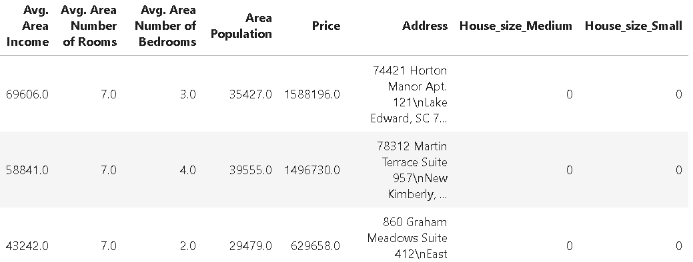
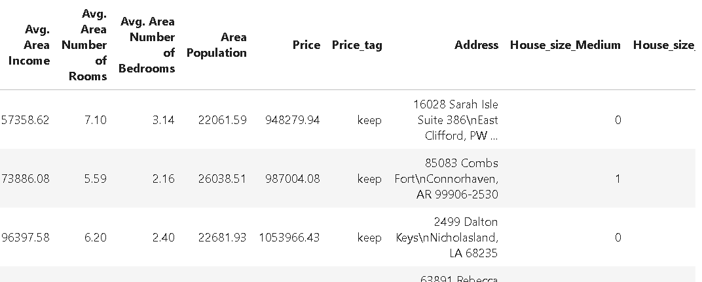
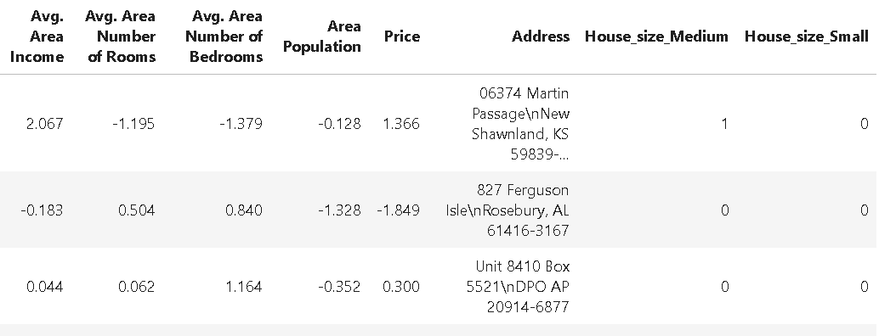
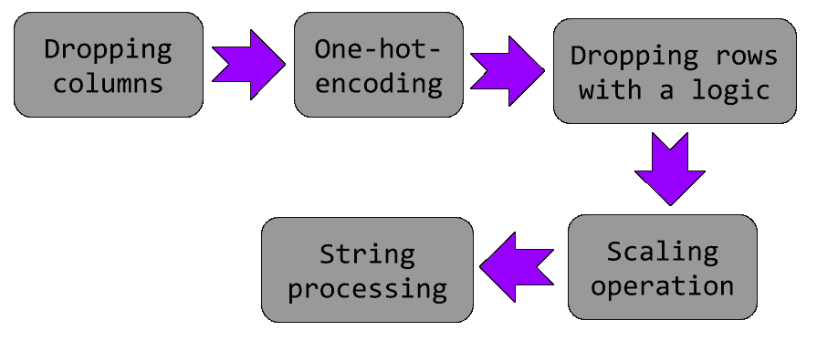

# 使用 pdpipe 构建 Pandas 管道

> 原文：[`www.kdnuggets.com/2019/12/build-pipelines-pandas-pdpipe.html`](https://www.kdnuggets.com/2019/12/build-pipelines-pandas-pdpipe.html)

评论



### 引言

Pandas 是 Python 生态系统中一个了不起的数据分析和机器学习库。它们在数据世界（如 Excel/CSV 文件和 SQL 表）与建模世界（如 Scikit-learn 或 TensorFlow 的魔力）之间架起了完美的桥梁。

数据科学流程通常是一系列步骤——数据集必须经过清洗、缩放和验证，然后才能被强大的机器学习算法使用。

这些任务当然可以通过 Pandas 等包提供的许多单步函数/方法完成，但更优雅的方式是使用管道。在几乎所有情况下，管道通过自动化重复任务来减少错误的机会并节省时间。

在数据科学领域，具有管道功能的优秀包示例包括——[R 语言中的 dplyr](https://dplyr.tidyverse.org/)，以及[Python 生态系统中的 Scikit-learn](https://scikit-learn.org/stable/modules/compose.html)。

> 数据科学流程通常是一系列步骤——数据集必须经过清洗、缩放和验证，然后才能准备好使用。

以下是一篇关于在机器学习工作流程中使用管道的精彩文章。

[**使用 Scikit-learn Pipelines 管理机器学习工作流程 第一部分：温和入门**](https://www.kdnuggets.com/2017/12/managing-machine-learning-workflows-scikit-learn-pipelines-part-1.html?source=post_page-----cade6128cd31----------------------)

你对 Scikit-learn Pipelines 熟悉吗？它们是管理机器学习的极简而非常有用的工具...

Pandas 还提供了一个`**.pipe**`方法，可以用于类似的目的与用户定义的函数。然而，在本文中，我们将讨论一个叫做[**pdpipe**](https://github.com/shaypal5/pdpipe)的绝妙小库，它专门解决了 Pandas DataFrame 的管道化问题。

> 在几乎所有情况下，管道通过自动化重复任务来减少错误的机会并节省时间。

### 使用 Pandas 进行管道化

示例[Jupyter notebook 可以在我的 GitHub 仓库中找到](https://github.com/tirthajyoti/Machine-Learning-with-Python/blob/master/Pandas%20and%20Numpy/pdpipe-example.ipynb)。让我们看看如何利用这个库构建有用的管道。

### 数据集

为了演示，我们将使用一个[美国住房价格数据集](https://www.kaggle.com/vedavyasv/usa-housing)（从 Kaggle 下载）。我们可以在 Pandas 中加载数据集，并显示其摘要统计信息如下，


然而，数据集中也有一个包含文本数据的“Address”字段。



### 添加大小限定符列

为了演示，我们向数据集添加了一列来标示房子的大小，代码如下，



数据集在处理后如下所示，


### 最简单的管道 — 一个操作

我们从最简单的管道开始，仅包含一个操作（别担心，我们很快会增加复杂性）。

假设机器学习团队和领域专家认为我们可以安全地忽略 `Avg. Area House Age` 数据用于建模。因此，我们将从数据集中删除此列。

对于此任务，我们创建了一个管道对象 `drop_age`，使用来自 [**pdpipe**](https://github.com/shaypal5/pdpipe) 的 `ColDrop` 方法，并将 DataFrame 传递给该管道。

```py

import pdpipe as pdp
drop_age = pdp.ColDrop(‘Avg. Area House Age’)
df2 = drop_age(df)
```

结果 DataFrame，如预期的那样，如下所示，



### 通过添加来链式链接管道的各个阶段

管道只有在我们能够进行多个阶段时才有用和实用。你可以使用多种方法在 [**pdpipe**](https://github.com/shaypal5/pdpipe) 中实现这一点。然而，最简单且直观的方法是使用 + 运算符。这就像是手动连接管道！

假设，除了删除年龄列，我们还希望对 `House_size` 列进行一热编码，以便可以轻松地在数据集上运行分类或回归算法。

```py
pipeline = pdp.ColDrop(‘Avg. Area House Age’)
pipeline+= pdp.OneHotEncode(‘House_size’)
df3 = pipeline(df)
```

所以，我们首先创建了一个管道对象，使用 `ColDrop` 方法删除 `Avg. Area House Age` 列。然后，我们简单地将 `OneHotEncode` 方法添加到该管道对象中，使用通常的 Python `+=` 语法。

结果 DataFrame 如下所示。注意由一热编码过程创建的附加指示器列 `House_size_Medium` 和 `House_size_Small`。



### 根据其值删除某些行

接下来，我们可能希望根据其值删除数据行。具体来说，我们可能希望删除所有房价低于 250,000 的数据。我们有 `ApplybyCol` 方法可以将任何用户定义的函数应用到 DataFrame，还有一个方法 `ValDrop` 用于根据特定值删除行。我们可以轻松地将这些方法链接到我们的管道中，以选择性地删除行（我们仍在向现有的 `pipeline` 对象添加内容，该对象已经完成了列删除和一热编码的其他工作）。

```py

def price_tag(x):
    if x>250000:
        return 'keep'
    else:
        return 'drop'
pipeline+=pdp.ApplyByCols('Price',price_tag,'Price_tag',drop=False)
pipeline+=pdp.ValDrop(['drop'],'Price_tag')
pipeline+= pdp.ColDrop('Price_tag')
```

第一种方法通过应用用户定义的函数 `price_tag()`，根据 `Price` 列中的值标记行，



第二种方法查找 `Price_tag` 列中的字符串 `drop`，并删除匹配的行。最后，第三种方法删除 `Price_tag` 列，清理 DataFrame。毕竟，这个 `Price_tag` 列只是暂时需要的，用于标记特定的行，并在完成其用途后应被删除。

所有这些都是通过简单地链接同一管道上的操作阶段完成的！

此时，我们可以回顾一下我们的管道从一开始对数据框做了什么，

+   删除特定列

+   对类别数据列进行独热编码以进行建模

+   基于用户定义的函数标记数据

+   基于标签删除行

+   删除临时标记列

所有这些 — 使用以下五行代码，

```py
pipeline = pdp.ColDrop('Avg. Area House Age')
pipeline+= pdp.OneHotEncode('House_size')
pipeline+= pdp.ApplyByCols('Price',price_tag,'Price_tag',drop=False)
pipeline+= pdp.ValDrop(['drop'],'Price_tag')
pipeline+= pdp.ColDrop('Price_tag')
df5 = pipeline(df)
```

### Scikit-learn 和 NLTK 阶段

还有许多更多有用且直观的数据框操作方法可供使用。然而，我们只是想展示即使是来自 Scikit-learn 和 NLTK 包的一些操作也被包含在 [**pdpipe**](https://github.com/shaypal5/pdpipe) 中，以便创建出色的管道。

### Scikit-learn 的缩放估算器

构建机器学习模型的最常见任务之一是数据缩放。Scikit-learn 提供了几种不同类型的缩放，例如 Min-Max 缩放或基于标准化的缩放（其中从数据集中减去均值，然后除以标准差）。

我们可以直接在管道中链接这样的缩放操作。以下代码演示了这种用法，

```py
pipeline_scale = pdp.Scale('StandardScaler',exclude_columns=['House_size_Medium','House_size_Small'])
df6 = pipeline_scale(df5)
```

在这里，我们应用了来自 Scikit-learn 包的 `[`[StandardScaler](https://scikit-learn.org/stable/modules/generated/sklearn.preprocessing.StandardScaler.html)`]`[ 估算器](https://scikit-learn.org/stable/modules/generated/sklearn.preprocessing.StandardScaler.html) 来转换数据以进行聚类或神经网络拟合。我们可以选择性地排除不需要此类缩放的列，如我们在这里对指标列 `House_size_Medium` 和 `House_size_Small` 所做的那样。

哇！我们得到了缩放后的数据框，



### NLTK 的分词器

我们注意到，目前我们数据框中的地址字段几乎没有用处。然而，如果我们能够从这些字符串中提取邮政编码或州名，它们可能对某种可视化或机器学习任务有用。

我们可以使用一个 [词汇分词器](https://www.guru99.com/tokenize-words-sentences-nltk.html) 来实现这个目的。NLTK 是一个流行且强大的 Python 库，用于文本挖掘和自然语言处理（NLP），并提供了一系列分词器方法。在这里，我们可以使用其中一个分词器来拆分地址字段中的文本，并从中提取州名。我们认识到，州名是地址字符串中的倒数第二个单词。因此，以下链式管道将为我们完成这项工作，

```py

def extract_state(token):
    return str(token[-2])
pipeline_tokenize=pdp.TokenizeWords('Address')
pipeline_state = pdp.ApplyByCols('Address',extract_state,result_columns='State')
pipeline_state_extract = pipeline_tokenize + pipeline_state
df7 = pipeline_state_extract(df6)
```

结果数据框如下所示，


### 总结

如果我们总结一下演示中展示的所有操作，它看起来像以下内容，



所有这些操作可能会在类似类型的数据集上频繁使用，拥有一组简单的顺序代码块来执行数据集预处理操作将会非常棒，以便在数据集准备好进行下一阶段建模之前进行处理。

管道化是实现那一组统一的顺序代码块的关键。Pandas 是机器学习/数据科学团队中用于数据预处理任务的最广泛使用的 Python 库，[**pdpipe**](https://github.com/shaypal5/pdpipe)提供了一种简单而强大的方式来构建管道，使用类似 Pandas 的操作，这些操作可以直接应用于 Pandas DataFrame 对象。

[自行探索此库](https://github.com/shaypal5/pdpipe)并为你的特定数据科学任务构建更强大的管道。

如果你有任何问题或想法分享，请通过[**tirthajyoti[AT]gmail.com**](mailto:tirthajyoti@gmail.com)联系作者。此外，你还可以查看作者的[**GitHub**](https://github.com/tirthajyoti?tab=repositories)** 代码库**，了解有关机器学习和数据科学的代码、想法和资源。如果你像我一样，对 AI/机器学习/数据科学充满热情，请随时[在 LinkedIn 上添加我](https://www.linkedin.com/in/tirthajyoti-sarkar-2127aa7/)或[在 Twitter 上关注我](https://twitter.com/tirthajyotiS)。

[原文](https://towardsdatascience.com/https-medium-com-tirthajyoti-build-pipelines-with-pandas-using-pdpipe-cade6128cd31)。已获得许可转载。

**相关：**

+   如何用一行代码将 Pandas 加速 4 倍

+   最新 Scikit-learn 版本中的 5 个重要新特性

+   数据管道、Luigi、Airflow：你需要了解的一切

* * *

## 我们的前三个课程推荐

 1\. [谷歌网络安全证书](https://www.kdnuggets.com/google-cybersecurity) - 快速进入网络安全职业生涯。

 2\. [谷歌数据分析专业证书](https://www.kdnuggets.com/google-data-analytics) - 提升你的数据分析能力

 3\. [谷歌 IT 支持专业证书](https://www.kdnuggets.com/google-itsupport) - 支持你的组织进行 IT 管理

* * *

### 更多相关话题

+   [成为一名优秀数据科学家所需的 5 项关键技能](https://www.kdnuggets.com/2021/12/5-key-skills-needed-become-great-data-scientist.html)

+   [每个初学者数据科学家应掌握的 6 种预测模型](https://www.kdnuggets.com/2021/12/6-predictive-models-every-beginner-data-scientist-master.html)

+   [2021 年最佳 ETL 工具](https://www.kdnuggets.com/2021/12/mozart-best-etl-tools-2021.html)

+   [使用管道编写清晰的 Python 代码](https://www.kdnuggets.com/2021/12/write-clean-python-code-pipes.html)

+   [停止学习数据科学以寻找目标，并寻找目标以……](https://www.kdnuggets.com/2021/12/stop-learning-data-science-find-purpose.html)

+   [一项 $9B 的 AI 失败，解析](https://www.kdnuggets.com/2021/12/9b-ai-failure-examined.html)
