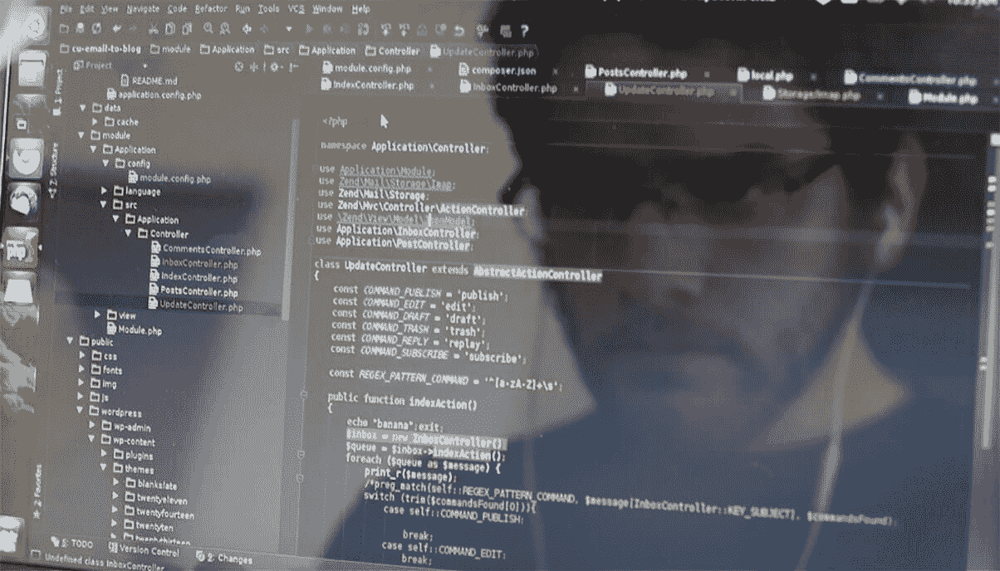

# 创建你的第一个语音助手

> 原文：[`www.kdnuggets.com/2019/09/build-your-first-voice-assistant.html`](https://www.kdnuggets.com/2019/09/build-your-first-voice-assistant.html)

评论

来源：[giphy](https://media.giphy.com/media/3oz8xTfD5SrkAwNNUQ/giphy.gif)

> 现在，听到有人跟不存在的人说话已不再令人惊讶。我们问 Alexa 天气情况和调低恒温器的温度。然后，我们询问 Siri 我们今天的日程安排并拨打电话。现在我们通过声音和语音界面技术连接得比以往任何时候都更多。我无法再想象手动完成任务的情景！这真是未来的科技。
> 
> — [福布斯](https://www.forbes.com/sites/danielnewman/2018/08/22/voice-interface-technology-the-future-of-business/#5f12070e316a)

### 介绍

谁不想拥有一个总是听到你呼唤、预见你每个需求并在必要时采取行动的助手呢？得益于基于人工智能的语音助手，这种奢侈现在已经可以实现。

语音助手体积较小，能够在听到你的命令后执行各种操作。它们可以开灯、回答问题、播放音乐、下在线订单，并做各种基于 AI 的事情。

语音助手不应与虚拟助手混淆，后者是远程工作的人，因此可以处理各种任务。语音助手则是基于技术的。随着语音助手变得越来越强大，它们在个人和商业领域的实用性也会增加。


[来源](https://ugetfix.com/how-useful-is-cortana-try-it-to-find-out/)

### 什么是语音助手？

一个**语音助手**或**智能个人助手**是一个可以根据口头命令执行任务或服务的软件代理，即通过解读人类语言并通过合成声音回应。用户可以通过语音提问、控制家庭自动化设备和媒体播放，以及通过口头命令管理其他基本任务，如电子邮件、待办事项列表、打开或关闭应用程序等。

让我给你一个例子，[Braina (Brain Artificial)](https://en.wikipedia.org/wiki/Braina) 是一个智能个人助手、人类语言界面、自动化和**语音识别软件**，用于 Windows PC。Braina 是一个多功能的 AI 软件，它允许你使用**语音命令**与计算机互动，支持世界上大多数语言。Braina 还允许你在世界上 100 多种不同语言中准确地将语音转换为文本。

### 语音助手的历史


[现代语音助手的历史](https://www.theoneoff.com/journal/the-rise-of-vui/)

近年来，语音助手在苹果公司整合了令人惊叹的虚拟助手 Siri 后获得了主要平台。真正的演变时间线开始于 1962 年的西雅图世博会，IBM 展示了一种名为 Shoebox 的独特装置。它的实际大小是一个鞋盒，可以执行科学功能，能够识别 16 个单词，并用人类可识别的声音发音，包含 0 到 9 的数字。

在 1970 年代，匹兹堡的卡内基梅隆大学的研究人员——在美国国防部及其国防高级研究计划局 (DARPA) 的巨大帮助下——制作了 Harpy。它能够理解大约 1,000 个单词，相当于三岁小孩的词汇量。

像苹果和 IBM 这样的大组织在 90 年代初开始制作利用语音识别的产品。1993 年，Macintosh 开始在其 Macintosh 电脑上通过 PlainTalk 构建语音识别技术。

1997 年 4 月，Dragon NaturallySpeaking 是第一个能够理解约 100 个单词并将其转换为可读内容的持续听写产品。


[来源](https://triggermovement.com/tag/tech/)

话虽如此，构建一个简单的基于语音的桌面/笔记本助手，具备以下功能会有多酷呢：

1.  在浏览器中打开子版块。

1.  在浏览器中打开任何网站。

1.  给你的联系人发送一封电子邮件。

1.  启动任何系统应用程序。

1.  告诉你几乎任何城市的当前天气和温度

1.  告诉你当前的时间。

1.  问候

1.  在 VLC 媒体播放器上播放一首歌曲（当然，你需要在你的笔记本/台式机上安装 [VLC 媒体播放器](https://www.videolan.org/vlc/index.html)）

1.  更改桌面壁纸。

1.  告诉你最新的新闻动态。

1.  告诉你几乎任何你问的问题。

所以在这篇文章中，我们将构建一个基于语音的应用程序，它可以完成上述所有任务。但首先，查看下面我在与桌面语音助手互动时录制的视频，我称她为 Sofia。

**[Nagesh Chauhan 的新视频](https://photos.app.goo.gl/1a96nySXBQqjBQCX9?source=post_page-----85a5a49f6cc1----------------------)**

与 Sofia 的互动

我希望你们喜欢我与 Sofia 互动的上面的视频。现在让我们开始构建这个酷炫的东西……

**依赖关系和要求：**

系统要求：Python 2.7，Spyder IDE，MacOS Mojave（版本 10.14）

安装所有这些 Python 库：

```py
pip install SpeechRecognition
pip install beautifulsoup4
pip install vlc
pip install youtube-dl
pip install pyowm
pip install wikipedia
```

### 让我们开始使用 Python 构建我们的桌面语音助手



[来源](https://www.hackerearth.com/blog/talent-assessment/hire-programmer-using-online-coding-tests/)

首先导入所有所需的库：

```py` ``` import speech_recognition as sr  import os  import sys  import re  import webbrowser  import smtplib  import requests  import subprocess  from pyowm import OWM  import youtube_dl  import vlc  import urllib  import urllib2  import json  from bs4 import BeautifulSoup as soup  from urllib2 import urlopen  import wikipedia  import random  from time import strftime ```py ````

为了让我们的语音助手执行上述所有功能，我们必须在一个方法中编写每个功能的逻辑。

所以我们的第一步是创建一个方法来解释用户的语音响应。

```py` ``` def myCommand():      r = sr.Recognizer()      with sr.Microphone() as source:          print('说点什么...')          r.pause_threshold = 1          r.adjust_for_ambient_noise(source, duration=1)          audio = r.listen(source)      try:          command = r.recognize_google(audio).lower()          print('你说了: ' + command + '\n')      # 如果收到无法识别的语音则循环继续监听命令      except sr.UnknownValueError:          print('....')          command = myCommand();      return command ```py ````

接下来，创建一个方法，将文本转换为语音。

```py` ``` def sofiaResponse(audio):      print(audio)      for line in audio.splitlines():          os.system("say " + audio) ```py ````

现在创建一个循环以继续执行多个命令。在方法 assistant() 中传递用户命令(myCommand()) 作为参数。

```py` ``` while True:      assistant(myCommand()) ```py ````

我们的下一步是为每个功能创建多个 if 语句。因此，让我们看看如何在 if 语句中为每个命令创建这些小模块。

### **1\. 在浏览器中打开 Reddit 子版块**。

用户将给出任何命令以打开 Reddit 的子版块，命令应为 “Hey Sofia! Can you please ***open Reddit subreddit_name***”。 只有斜体粗体短语需要按原样使用。你可以使用任何前缀，只要注意斜体粗体短语。

> **工作原理 :** 如果你在命令中说了短语**open reddit**，那么它将使用 re.search() 在用户命令中搜索子版块名称。子版块将通过[www.reddit.com](https://www.reddit.com/')进行搜索，并使用 Python 的 Webbrowser 模块在浏览器中打开。[**Webbrowser**](https://docs.python.org/2/library/webbrowser.html)模块提供了一个高级接口，允许用户显示基于 Web 的文档。

```py` ``` if 'open reddit' in command:          reg_ex = re.search('open reddit (.*)', command)          url = 'https://www.reddit.com/'          if reg_ex:              subreddit = reg_ex.group(1)              url = url + 'r/' + subreddit          webbrowser.open(url)          sofiaResponse('Reddit 内容已经为您打开。') ```py ````

所以，上面的代码将在默认浏览器中打开你所期望的 Reddit。

### **2\. 在浏览器中打开任意网站**。

你可以通过说“打开 website.com”或“打开 website.org”来打开任何网站。

例如：“请打开 facebook.com”或“嘿，你能打开 linkedin.com 吗”，你可以像这样让苏菲亚为你打开任何网站。

> **如何运作：**如果你在指令中说了**打开**这个词，它将使用 re.search() 在用户的指令中搜索网站名称。接着，它将把网站名称附加到 [`www.`](https://www./) 上，并通过**webbrowser**模块在浏览器中打开完整的 URL。

```py` ``` elif 'open' in command:          reg_ex = re.search('open (.+)', command)          if reg_ex:              domain = reg_ex.group(1)              print(domain)              url = 'https://www.' + domain              webbrowser.open(url)              sofiaResponse('您请求的网站已为您打开。')          else:              pass ```py ````

### **3\. 发送邮件。**

你也可以让桌面助手发送邮件。

> **如何运作：**如果你在指令中说了**邮件**这个词，那么机器人会询问收件人。如果我的回复是 rajat，机器人将使用 Python 的 smtplib 库。 [**smtplib 模块**](https://docs.python.org/3/library/smtplib.html)定义了一个 SMTP 客户端会话对象，可以用来向任何具有 SMTP 或 ESMTP 监听守护进程的互联网机器发送邮件。发送邮件使用 Python 的 smtplib 和 SMTP 服务器。首先，它会使用**smtplib.SMTP()** 初始化 Gmail SMTP，然后使用**ehlo()** 函数识别服务器，然后加密会话**starttls()**，接着使用**login()** 登录到你的邮箱，然后使用**sendmail()** 发送消息。

```py` ``` elif 'email' in command:          sofiaResponse('收件人是谁？')          recipient = myCommand()if 'rajat' in recipient:              sofiaResponse('我应该对他说什么？')              content = myCommand()              mail = smtplib.SMTP('smtp.gmail.com', 587)              mail.ehlo()              mail.starttls()              mail.login('your_email_address', 'your_password')              mail.sendmail('sender_email', 'receiver_email', content)              mail.close()              sofiaResponse('邮件已成功发送。你可以查看你的收件箱。')else:              sofiaResponse('我不知道你说的是什么意思！') ```py ````

### **4\. 启动任何系统应用程序。**

说“启动日历”或“你能启动 Skype 吗”或“苏菲亚启动查找器”等，苏菲亚将为你启动该系统应用程序。

> **它是如何工作的：**如果你在命令中提到**launch**这个词，它将使用 re.search() 搜索应用程序名称（如果它存在于你的系统中）。然后，它会将后缀“.app”附加到应用程序名称上。例如，你的应用程序名称可能是 calender.app（在 macOS 中，执行文件以 .app 结尾，而在 Windows 中则以 .exe 结尾）。所以执行应用程序名称将通过 python subprocess 的 Popen() 函数启动。[subprocess](https://docs.python.org/3/library/subprocess.html) 模块使你能够从 Python 程序中启动新应用程序。

```py` ``` elif 'launch' in command:          reg_ex = re.search('launch (.*)', command)          if reg_ex:              appname = reg_ex.group(1)              appname1 = appname+".app"              subprocess.Popen(["open", "-n", "/Applications/" + appname1], stdout=subprocess.PIPE)sofiaResponse('我已经启动了所需的应用程序') ```py ````

### **5. 告诉你几乎任何城市的当前天气和温度。**

Sofia 还可以告诉你世界上任何城市的天气、最高温度和最低温度。用户只需说类似“伦敦当前的天气如何”或“告诉我德里的当前天气”这样的句子。

> **它是如何工作的：**如果你在命令中提到**current weather**这个短语，它将使用 re.search() 搜索城市名称。我使用了 Python 的 [pyowm](https://pyowm.readthedocs.io/en/latest/) 库来获取任何城市的天气。get_status() 会告诉你天气状况，如雾霾、阴天、雨天等，而 get_temperature() 会告诉你城市的最高和最低温度。

```py` ``` elif 'current weather' in command:       reg_ex = re.search('current weather in (.*)', command)       if reg_ex:           city = reg_ex.group(1)           owm = OWM(API_key='ab0d5e80e8dafb2cb81fa9e82431c1fa')           obs = owm.weather_at_place(city)           w = obs.get_weather()           k = w.get_status()           x = w.get_temperature(unit='celsius')           sofiaResponse('%s 的当前天气是 %s。最高温度是 %0.2f 度，最低温度是 %0.2f 度' % (city, k, x['temp_max'], x['temp_min'])) ```py ````

### **6. 告诉你当前时间。**

“Sofia，你能告诉我当前时间吗？”或者“现在几点了？”Sofia 将告诉你你所在时区的当前时间。

> **它是如何工作的：非常简单**

```py` ``` elif 'time' in command:       import datetime       now = datetime.datetime.now()       sofiaResponse('当前时间是 %d 小时 %d 分钟' % (now.hour, now.minute)) ```py ````

### **7. 问候/离开**

说“hello Sofia”来打招呼，或者当你想让程序终止时，可以说类似“shutdown Sofia”或“Sofia 请关闭”等。

> **工作原理：**如果你在指令中提到了**hello**这个词，那么根据一天中的时间，机器人会向用户打招呼。如果时间超过中午 12 点，机器人会回应“Hello Sir. Good afternoon”，同样，如果时间超过下午 6 点，机器人会回应“Hello Sir. Good evening”。当你给出关闭命令时，**sys.exit()** 将被调用以终止程序。

```py` ``` #问候索非亚 elif 'hello' in command: day_time = int(strftime('%H')) if day_time < 12: sofiaResponse('Hello Sir. Good morning') elif 12 <= day_time < 18: sofiaResponse('Hello Sir. Good afternoon') else: sofiaResponse('Hello Sir. Good evening')#终止程序 elif 'shutdown' in command: sofiaResponse('Bye bye Sir. Have a nice day') sys.exit() ```py ````

### **8\. 在 VLC 媒体播放器中播放歌曲**

该功能允许你的语音机器人在 VLC 媒体播放器中播放你想要的歌曲。用户会说“索非亚，给我放一首歌”，机器人会问“Sir，我该播放什么歌？”只需说出歌曲的名称，索非亚会从 YouTube 下载这首歌到你的本地驱动器中，在 VLC 媒体播放器中播放该歌曲，如果你再次要求播放歌曲，之前下载的歌曲将会自动删除。

> **工作原理：**如果你在指令中提到了**play me a song**这个短语，那么它会询问你要播放什么视频歌曲。你要求的歌曲将在 youtube.com 上进行搜索，如果找到，歌曲将使用 Python 的 youtube_dl 库下载到你的本地目录中。 [youtube-dl](https://ytdl-org.github.io/youtube-dl/index.html) 是一个用于从 YouTube.com 及其他一些网站下载视频的命令行程序。下载完成后，歌曲会使用 Python 的 [VLC 库](https://pypi.org/project/python-vlc/) 播放，play(path_to__videosong) 模块会实际播放这首歌。

如果下次你要求播放任何其他歌曲，本地目录将被清空，并且在该目录中会下载一首新的歌曲。

```py` ``` elif 'play me a song' in command:          path = '/Users/nageshsinghchauhan/Documents/videos/'          folder = path          for the_file in os.listdir(folder):              file_path = os.path.join(folder, the_file)              try:                  if os.path.isfile(file_path):                      os.unlink(file_path)              except Exception as e:                  print(e)sofiaResponse('我该播放什么歌曲，先生？')mysong = myCommand()          if mysong:              flag = 0              url = "https://www.youtube.com/results?search_query=" + mysong.replace(' ', '+')              response = urllib2.urlopen(url)              html = response.read()              soup1 = soup(html,"lxml")              url_list = []              for vid in soup1.findAll(attrs={'class':'yt-uix-tile-link'}):                  if ('https://www.youtube.com' + vid['href']).startswith("https://www.youtube.com/watch?v="):                      flag = 1                      final_url = 'https://www.youtube.com' + vid['href']                      url_list.append(final_url)url = url_list[0]              ydl_opts = {}os.chdir(path)              with youtube_dl.YoutubeDL(ydl_opts) as ydl:                  ydl.download([url])              vlc.play(path)if flag == 0:                  sofiaResponse('我在 Youtube 上没有找到任何东西 ') ```py ```

### **9\. 更换桌面壁纸。**

你们也可以使用此功能更换桌面壁纸。当你说“更换壁纸”或“索非亚，请更换壁纸”时，机器人会从[unsplash.com](https://unsplash.com/)下载随机壁纸，并将其设置为你的桌面背景。

> **工作原理：** 如果你在命令中说了**更换壁纸**这句话，程序将从 unsplash.com 下载一张随机壁纸，将其存储在本地目录中，并通过 subprocess.call()将其设置为桌面壁纸。我使用了 unsplash API 来访问其内容。

如果下次你要求再次更换壁纸，本地目录将被清空，并且会在该目录下下载新的壁纸。

```py` ``` elif '更改壁纸' 在命令中:          folder = '/Users/nageshsinghchauhan/Documents/wallpaper/'          对于文件夹中的每个文件:              file_path = os.path.join(folder, the_file)              尝试:                  如果 os.path.isfile(file_path):                      os.unlink(file_path)              except Exception as e:                  print(e)          api_key = 'fd66364c0ad9e0f8aabe54ec3cfbed0a947f3f4014ce3b841bf2ff6e20948795'          url = 'https://api.unsplash.com/photos/random?client_id=' + api_key # 来自 unspalsh.com 的图片          f = urllib2.urlopen(url)          json_string = f.read()          f.close()          parsed_json = json.loads(json_string)          photo = parsed_json['urls']['full']          urllib.urlretrieve(photo, "/Users/nageshsinghchauhan/Documents/wallpaper/a") # 我们下载图片的位置          subprocess.call(["killall Dock"], shell=True)          sofiaResponse('壁纸更改成功') ```py ````

### **10.** 告诉你最新的新闻动态。

Sofia 还可以告诉你最新的新闻更新。用户只需说 “Sofia，今天的头条新闻是什么？” 或 “告诉我今天的新闻”。

> **工作原理：** 如果你在命令中说了 **今天的新闻**，那么它会使用 [Beautiful Soup](https://www.crummy.com/software/BeautifulSoup/bs4/doc/) 从 Google News RSS() 中抓取数据并为你朗读。为了方便起见，我已将新闻数量限制设置为 15 条。

```py` ``` elif '今天的新闻' 在命令中:          尝试:              news_url="https://news.google.com/news/rss"              Client=urlopen(news_url)              xml_page=Client.read()              Client.close()              soup_page=soup(xml_page,"xml")              news_list=soup_page.findAll("item")              对于前 15 条新闻:                  sofiaResponse(news.title.text.encode('utf-8'))          except Exception as e:                  print(e) ```py ````

### **11.** 告诉你几乎任何你询问的内容。

你的机器人可以获取几乎任何你询问的详细信息。例如 “Sofia，告诉我关于 Google 的事” 或 “请告诉我关于超级计算机的事” 或 “请告诉我关于互联网的事”。所以你可以看到，你几乎可以询问任何内容。

> **工作原理：** 如果你在命令中说了 **告诉我关于**，那么它会使用 re.search() 在用户命令中搜索关键字。使用 Python 的 Wikipedia 库，它会搜索该主题并提取前 500 个字符（如果你不指定限制，机器人将为你读取整个页面）。 [Wikipedia](https://pypi.org/project/python-vlc/) 是一个 Python 库，使得访问和解析 Wikipedia 数据变得简单。

```py` ``` elif 'tell me about' in command:          reg_ex = re.search('tell me about (.*)', command)          try:              if reg_ex:                  topic = reg_ex.group(1)                  ny = wikipedia.page(topic)                  sofiaResponse(ny.content[:500].encode('utf-8'))          except Exception as e:                  sofiaResponse(e) ```py ````

让我们把一切放在一起

```py` ``` 导入 `speech_recognition` 作为 sr 导入 os 导入 sys 导入 re 导入 webbrowser 导入 smtplib 导入 requests 导入 subprocess 从 pyowm 导入 OWM 导入 youtube_dl 导入 vlc 导入 urllib 导入 urllib2 导入 json 从 bs4 导入 BeautifulSoup 作为 soup 从 urllib2 导入 urlopen 导入 wikipedia 导入 random 从 time 导入 strftime def sofiaResponse(audio): "说出传递的音频" print(audio) for line in audio.splitlines(): os.system("say " + audio) def myCommand(): "监听命令" r = sr.Recognizer() with sr.Microphone() as source: print('说点什么...') r.pause_threshold = 1 r.adjust_for_ambient_noise(source, duration=1) audio = r.listen(source) try: command = r.recognize_google(audio).lower() print('你说: ' + command + '\n') #loop back to continue to listen for commands if unrecognizable speech is received except sr.UnknownValueError: print('....') command = myCommand(); return command def assistant(command): "执行命令的 if 语句" #打开 subreddit Reddit if 'open reddit' in command: reg_ex = re.search('open reddit (.*)', command) url = 'https://www.reddit.com/' if reg_ex: subreddit = reg_ex.group(1) url = url + 'r/' + subreddit webbrowser.open(url) sofiaResponse('Reddit 内容已为您打开。') elif 'shutdown' in command: sofiaResponse('再见。祝您有美好的一天') sys.exit() #打开网站 elif 'open' in command: reg_ex = re.search('open (.+)', command) if reg_ex: domain = reg_ex.group(1) print(domain) url = 'https://www.' + domain webbrowser.open(url) sofiaResponse('您请求的网站已为您打开。') else: pass #问候 elif 'hello' in command: day_time = int(strftime('%H')) if day_time < 12: sofiaResponse('您好。早上好') elif 12 <= day_time < 18: sofiaResponse('您好。下午好') else: sofiaResponse('您好。晚上好') elif 'help me' in command: sofiaResponse(""" 您可以使用这些命令，我会帮助您: 1\. 打开 reddit subreddit : 在默认浏览器中打开 subreddit。 2\. 打开 xyz.com : 将 xyz 替换为任何网站名称 3\. 发送电子邮件/email : 会依次询问收件人姓名、内容等问题。 4\. {cityname} 当前天气 : 告诉您当前的天气情况和温度 5\. 你好 6\. 播放视频 : 在 VLC 媒体播放器中播放歌曲 7\. 更改壁纸 : 更改桌面壁纸 8\. 今日新闻 : 阅读今日的头条新闻 9\. 时间 : 当前系统时间 10\. Google 新闻的头条故事 (RSS feeds) 11\. 告诉我关于 xyz 的信息 : 告诉您关于 xyz 的信息 """) #笑话 elif 'joke' in command: res = requests.get( 'https://icanhazdadjoke.com/', headers={"Accept":"application/json"}) if res.status_code == requests.codes.ok: sofiaResponse(str(res.json()['joke'])) else: sofiaResponse('哎呀！笑话讲完了') #Google 新闻的头条故事 elif 'news for today' in command: try: news_url="https://news.google.com/news/rss" Client=urlopen(news_url) xml_page=Client.read() Client.close() soup_page=soup(xml_page,"xml") news_list=soup_page.findAll("item") for news in news_list[:15]: sofiaResponse(news.title.text.encode('utf-8')) except Exception as e: print(e) #当前天气 elif 'current weather' in command: reg_ex = re.search('current weather in (.*)', command) if reg_ex: city = reg_ex.group(1) owm = OWM(API_key='ab0d5e80e8dafb2cb81fa9e82431c1fa') obs = owm.weather_at_place(city) w = obs.get_weather() k = w.get_status() x = w.get_temperature(unit='celsius') sofiaResponse('当前 %s 的天气是 %s。最高温度是 %0.2f 度，最低温度是 %0.2f 度' % (city, k, x['temp_max'], x['temp_min'])) #时间 elif 'time' in command: import datetime now = datetime.datetime.now() sofiaResponse('当前时间是 %d 小时 %d 分钟' % (now.hour, now.minute)) elif 'email' in command: sofiaResponse('收件人是谁？') recipient = myCommand() if 'rajat' in recipient: sofiaResponse('我应该对他说些什么？') content = myCommand() mail = smtplib.SMTP('smtp.gmail.com', 587) mail.ehlo() mail.starttls() mail.login('your_email_address', 'your_password') mail.sendmail('sender_email', 'receiver_email', content) mail.close() sofiaResponse('电子邮件已成功发送。您可以查看收件箱。') else: sofiaResponse('我不明白您的意思！') #启动任何应用程序 elif 'launch' in command: reg_ex = re.search('launch (.*)', command) if reg_ex: appname = reg_ex.group(1) appname1 = appname+".app" subprocess.Popen(["open", "-n", "/Applications/" + appname1], stdout=subprocess.PIPE) sofiaResponse('我已启动所需的应用程序') #播放 YouTube 歌曲 elif 'play me a song' in command: path = '/Users/nageshsinghchauhan/Documents/videos/' folder = path for the_file in os.listdir(folder): file_path = os.path.join(folder, the_file) try: if os.path.isfile(file_path): os.unlink(file_path) except Exception as e: print(e) sofiaResponse('我应该播放什么歌曲？') mysong = myCommand() if mysong: flag = 0 url = "https://www.youtube.com/results?search_query=" + mysong.replace(' ', '+') response = urllib2.urlopen(url) html = response.read() soup1 = soup(html,"lxml") url_list = [] for vid in soup1.findAll(attrs={'class':'yt-uix-tile-link'}): if ('https://www.youtube.com' + vid['href']).startswith("https://www.youtube.com/watch?v="): flag = 1 final_url = 'https://www.youtube.com' + vid['href'] url_list.append(final_url) url = url_list[0] ydl_opts = {} os.chdir(path) with youtube_dl.YoutubeDL(ydl_opts) as ydl: ydl.download([url]) vlc.play(path) if flag == 0: sofiaResponse('我在 YouTube 上没有找到任何内容') #更改壁纸 elif 'change wallpaper' in command: folder = '/Users/nageshsinghchauhan/Documents/wallpaper/' for the_file in os.listdir(folder): file_path = os.path.join(folder, the_file) try: if os.path.isfile(file_path): os.unlink(file_path) except Exception as e: print(e) api_key = 'fd66364c0ad9e0f8aabe54ec3cfbed0a947f3f4014ce3b841bf2ff6e20948795' url = 'https://api.unsplash.com/photos/random?client_id=' + api_key #从 unspalsh.com 获取图片 f = urllib2.urlopen(url) json_string = f.read() f.close() parsed_json = json.loads(json_string) photo = parsed_json['urls']['full'] urllib.urlretrieve(photo, "/Users/nageshsinghchauhan/Documents/wallpaper/a") # 下载图片的位置 subprocess.call(["killall Dock"], shell=True) sofiaResponse('壁纸已成功更换') #问我任何事 elif 'tell me about' in command: reg_ex = re.search('tell me about (.*)', command) try: if reg_ex: topic = reg_ex.group(1) ny = wikipedia.page(topic) sofiaResponse(ny.content[:500].encode('utf-8')) except Exception as e: print(e) sofiaResponse(e) sofiaResponse('您好用户，我是 Sofia，您的个人语音助手，请给出命令或说 "help me" 我将告诉您我能做什么。') #循环以继续执行多个命令 while True: assistant(myCommand()) ```py ```

所以你已经看到，仅通过编写简单的 Python 代码，我们就可以创建一个非常酷的语音助手。除了这些功能，你还可以在你的语音助手中添加许多不同的功能。

> 请注意，一旦你开始执行程序时，在与语音助手互动时要大声清晰，因为如果你的声音不清晰，语音助手可能无法正确解读你。

### 结论：未来会带来什么

在计算机历史中，用户界面变得越来越自然。屏幕和键盘是这方面的一步。鼠标和图形用户界面是另一种。触摸屏是最新的发展。下一步很可能会是增强现实、手势和语音命令的结合。毕竟，提问或对话往往比输入内容或在在线表单中填写多个详细信息更容易。

人们与语音激活设备的互动越多，系统基于收到的信息识别的趋势和模式就越多。然后，这些数据可以用来确定用户的偏好和口味，这对使家居智能化是一个长期卖点。谷歌和亚马逊正致力于整合能够分析和回应人类情感的语音启用人工智能。

我希望你们喜欢阅读这篇文章。在评论区分享你的想法/评论/疑虑。你可以通过 [LinkedIn](https://www.linkedin.com/in/nagesh-singh-chauhan-6936bb13b/) 联系我。

**简历: [Nagesh Singh Chauhan](https://www.linkedin.com/in/nagesh-singh-chauhan-6936bb13b/)** 是 CirrusLabs 的大数据开发工程师。他在电信、分析、销售、数据科学等多个领域拥有超过 4 年的工作经验，专注于各种大数据组件。

[原文](https://towardsdatascience.com/build-your-first-voice-assistant-85a5a49f6cc1)。经许可转载。

**相关：**

+   实用的 Python 语音识别基础

+   顶级语音处理 API 比较

+   TensorFlow 与 PyTorch 与 Keras 的 NLP 比较

* * *

## 我们的前 3 名课程推荐

 1\. [Google 网络安全证书](https://www.kdnuggets.com/google-cybersecurity) - 快速进入网络安全职业生涯。

 2\. [Google 数据分析专业证书](https://www.kdnuggets.com/google-data-analytics) - 提升你的数据分析技能

 3\. [Google IT 支持专业证书](https://www.kdnuggets.com/google-itsupport) - 支持你的组织的 IT

* * *

### 更多相关主题

+   [克服多语言语音技术中的障碍：前 5 大挑战及创新解决方案](https://www.kdnuggets.com/2023/08/overcoming-barriers-multilingual-voice-technology-top-5-challenges-innovative-solutions.html)

+   [它活过来了！用 Python 和一些便宜的基础组件构建你的第一个机器人](https://www.kdnuggets.com/2023/06/manning-build-first-robots-python-cheap-basic-components.html)

+   [GPT-工程师：你的新 AI 编码助手](https://www.kdnuggets.com/2023/07/gpt-engineer-ai-coding-assistant.html)

+   [如何在没有任何工作经验的情况下获得你的第一份数据科学工作](https://www.kdnuggets.com/2021/02/first-job-data-science-without-work-experience.html)

+   [用 TensorFlow 和 Keras 构建并训练你的第一个神经网络](https://www.kdnuggets.com/2023/05/building-training-first-neural-network-tensorflow-keras.html)

+   [从零到英雄：使用 PyTorch 创建你的第一个机器学习模型](https://www.kdnuggets.com/from-zero-to-hero-create-your-first-ml-model-with-pytorch)
